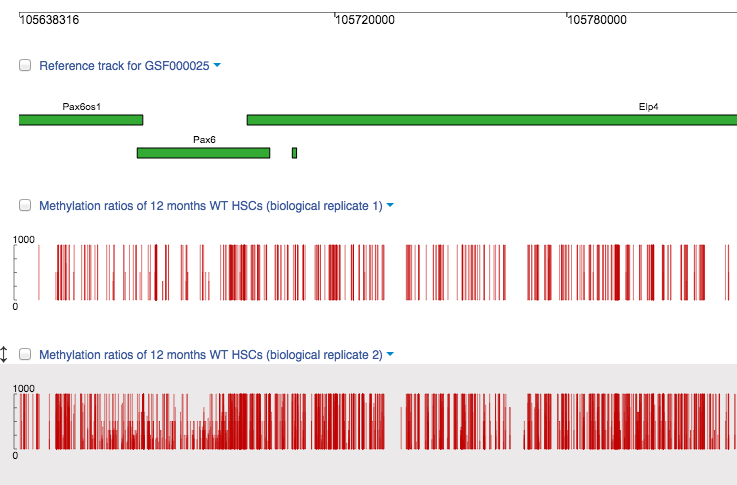
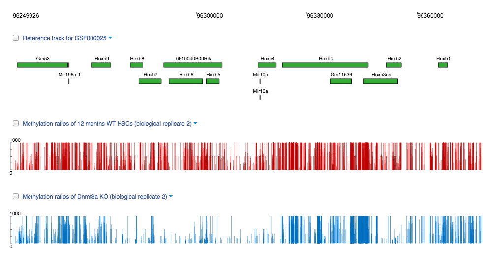
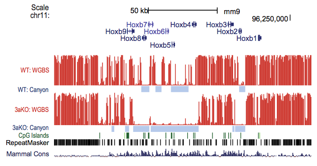

Exploring the genome methylation levels in Genome Browser
*********************************************************

We can explore the distribution of genome methylation levels counted for
both murine phenotypes in  `Genome Browser`_.

.. youtube:: https://www.youtube.com/watch?v=juojLSCcrFU

As it was mentioned before, "Canyons" are the large unmethylated DNA regions inside of a highly
methylated locus that often harbour genes, such as *Hoxa9* and *Meis1*, playing a role in hematopoiesis and being deregulated in
human leukemia.

Some Canyons can be exceptionally large, for example one associated with
the  *Pax6* homeobox gene encoding a homeobox-containing protein
regulating  transcription is extended over 25 kb:

|Genome Browser (Pax6; only WTs)|

Let’s compare our methylation ratios distribution in these
region with author’s results:

|Pax6-paper|

To further examine the impact of Dnmt3a loss on the Canyon size, authors compared low-methylated
DNA regions in HSCs with conditional inactivation of *Dnmt3a* gene to those in the WT cells:

|Genome Browser (WT vs KO)|

This investigation revealed that methylation loss in
*Dnmt3a* KO HSCs leads to the formation of new Canyons. Lack of Dnmt3a
does not affect regions inside Canyons but it results in changes of
Canyon edges. Boundaries of canyons became hotspots of differential
methylation: Canyon size can be decreased due to hypermethylation
or increased due to hypomethylation.

Moreover, at DNA regions containing cluster of Canyons in WT HSCs,  larger Canyons (“Grand
Canyons”)  can be formed. We can see it on the example of  *HoxB*
regions in which Canyons are interrupted by short stretches of higher
methylation.

All these findings suggest that Dnmt3a can be crucial for
maintaining methylation in the Canyon boundaries.

Now, let's take a look at the original track for the same Canyon cluster to compare the
results:

|Hox-paper2|

This experiment is a part of the large research
of changes in DNA methylation profile including different methodologies
such as, for example, whole genome bisulfite sequencing and CMS-seq to
reveal genome-wide distribution of mCs and hmCs, RNA-Seq to analyse
expression of Canyon-associated genes. This incredible work was turned
into a research `paper`_, and the data sets can be found in our `Public Experiments`_!

That's it for the tutorial, we hope you will enjoy working on your data
with Genestack! Later you can return back to the tutorial if necessary.
If you have any questions or suggestions, please leave them in
comments below or `contact us <feedback@genestack.com>`_.

References
==========

- Challen G.A. et al. Dnmt3a is essential for hematopoietic stem cell differentiation. *Nat Genet.* 44:23–31 (2012)
- De Carvalho D.D. et al. DNA Methylation Screening Identifies Driver Epigenetic Events of Cancer Cell Survival. *Cancer Cell* 21(5):655-667 (2012)
- Ehrlich M. DNA methylation in cancer: too much, but also too little. *Oncogene* 21:5400-5413 (2002)
- Jeong N. et al. Large conserved domains of low DNA methylation maintained by Dnmt3a. *Nat Genet* 46(1):17–23 (2014)
- Jeong M. & Goodell M.A. New answers to old questions from genome-wide maps of DNA methylation in hematopoietic cells. *Exp Hematol* 42(8):609-617
- Kulis M., Esteller M. DNA methylation and cancer. *Adv Genet* 70:27-56 (2010)
- Ley T.J. et al. DNMT3A mutations in acute myeloid leukemia. *N Engl J Med.* 363:2424–2433 (2010)

.. _Genome Browser: https://platform.genestack.org/endpoint/application/run/genestack/genomeBrowser?a=GSF969175&action=viewFile
.. _paper: http://www.ncbi.nlm.nih.gov/pmc/articles/PMC3920905/
.. _Public Experiments: https://platform.genestack.org/endpoint/application/run/genestack/filebrowser?a=GSF070886&action=viewFile&page=1
.. _contact us: feedback@genestack.com
