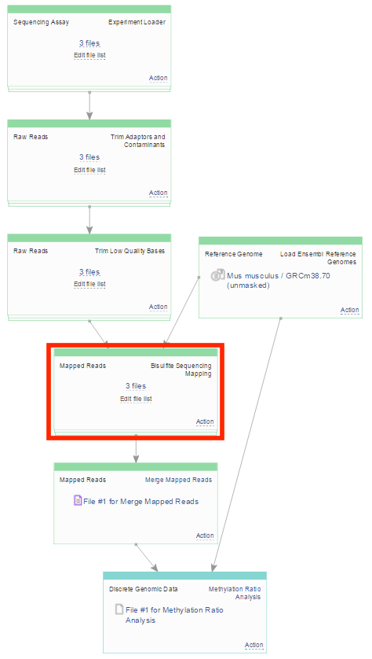
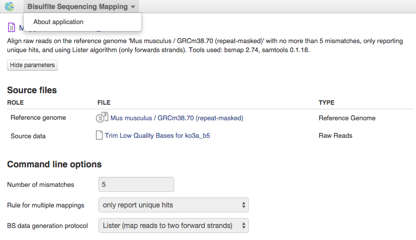
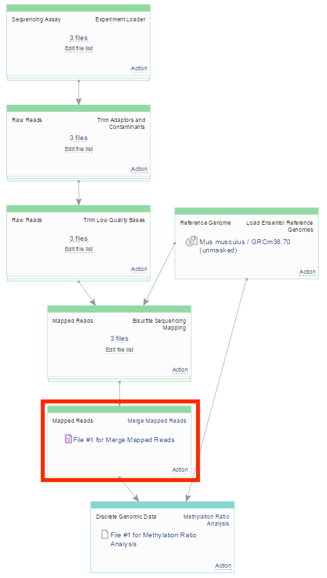

Bisulfite Sequencing Mapping of the preprocessed reads onto a reference genome
******************************************************************************

**Following the preprocessing, our data is of improved quality and we
can move on to the next step — ** alignment ** of trimmed reads onto
the reference genome.**

|df bisulfte seq mapping|

 We run Bisulfite
Sequencing Mapping with default parameters. Click on the app name to
move to its page where you can change the parameters of alignment and
learn more about the app clicking on the "about". |BSMAP| In
the  `Mapped reads for Rodriguez et al.,
2014 <https://platform.genestack.org/endpoint/application/run/genestack/filebrowser?a=GSF968739&action=viewFile>`__ folder
you can find all the Mapped Reads.

**5. Merging**  **of the mapped reads** obtained from technical replicates
~~~~~~~~~~~~~~~~~~~~~~~~~~~~~~~~~~~~~~~~~~~~~~~~~~~~~~~~~~~~~~~~~~~~~~~~~~~

It is essential for any experiment to create a good and adequate
control. Using replicates can improve quality and precision of your
experiment especially when comparing several experimental conditions.
There are two types of replicates: technical and biological. When the
same biological sample is prepared and sequenced separately, this gives
us technical replicates. But if different biological samples are treated
the same way but prepared separately, we are talking about biological
replicates. If there are no changes in sample preparation, technical
replicates could be considered as controls for the samples under the
same experimental conditions. As we remember, our experiment contains
both biological and technical replicates for 12-month-old wild-type HSCs
and  *Dnmt3a*-KO HSCs. As authors do not mention using different
experimental conditions for technical replicates, we can merge them
before the calculation of methylation ratios. We will not merge
biological replicates, because significant biological variability may be
present between two sample growing separately. Here is the data flow to
merge three technical replicates for the second biological replicate of
WT * * HSCs:

|df merge mapped reads|

Use the same data flow to merge
mapped reads for technical replicates of remaining samples. As a result
you will get 4 merged mapped reads for both analysed murine
phenotypes. You can also use prepared Merged Mapped Reads files by
opening the `Merged mapped reads for Rodriguez et al.,
2014 <https://platform.genestack.org/endpoint/application/run/genestack/filebrowser?a=GSF968758&action=viewFile>`__ folder.
 

