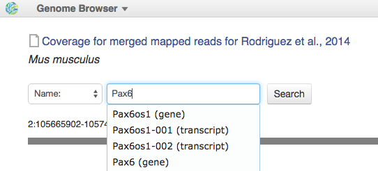
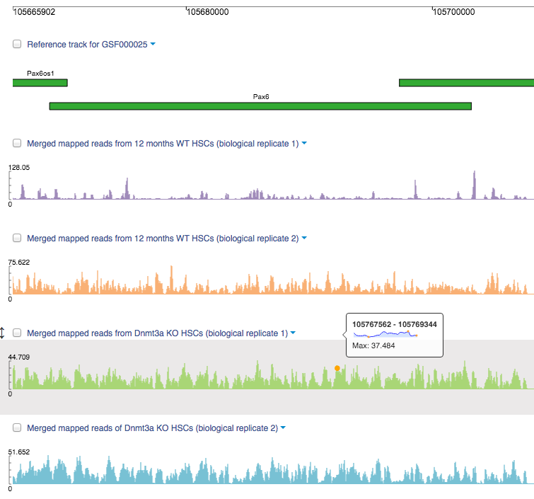
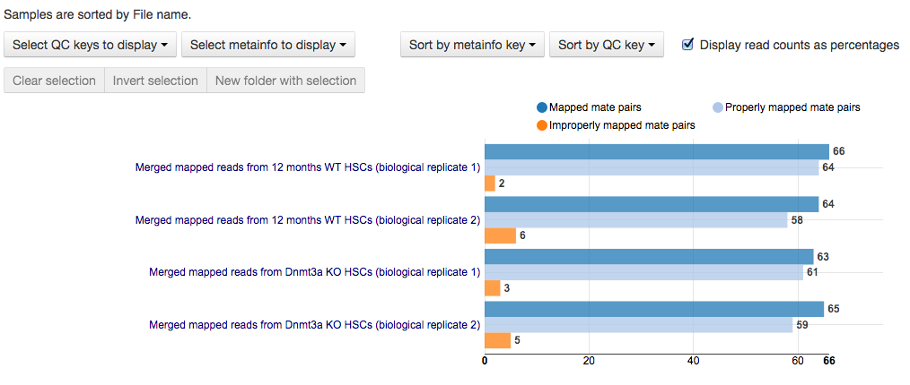

Quality control of mapped reads
*******************************

Before proceeding to the next analysis step we would recommend you to
check the quality of mapped reads because the reads might look alright
in raw reads quality control check but some issues, such as low
coverage, homopolymer biases, experimental artifacts, only appears after
alignment.

.. youtube:: https://www.youtube.com/watch?v=ZGXOxN5Ue0o

Sequencing coverage is an important quality metric, as biases in
sample preparation, sequencing and read mapping can result in genome
regions that lack coverage or in regions with much higher coverage than
theoretically expected. You could explore the coverage for merged mapped
reads in our Genome Browser. Go to the folder created, find merged
mapped reads file we have created and click on the name of the merged
mapped reads files, go to **explore** option and select the Genome
Browser. Also go to our tutorial folder, find there `Coverage for
merged mapped reads for Rodriguez et al., 2014`_ file and open it in Genome browser app to explore results for
initialized mapped reads.
In Genome Browser you have the option of viewing the region according to its coordinates or alternatively, you
can search for a given gene or transcript name. Let's check the coverage
in the location of the large methylation-depleted region associated with
Pax6 gene.

|GB_search by gene|

High-quality reads should have uniform and high enough coverage. Our last three samples are very good for the
further processing. At the same time, the coverage for the first
sample— biological replicate 2 of 12 HSCs — is uneven — with gaps and
regions with coverage up to x133. That is why, such results may generate
biases during methylation ratios calculation.

|GB coverage (v2) Sequencing coverage|

You can explore mapping quality for each
individual file: right click merged reads file name, go to **explore** and
select **Mapped reads QC report**. On the opened app page you should
click **generate reports** to start calculation of quality control
statistics. To check the quality of all mapped reads or merged mapped
reads simultaneously use the `Mapped Reads Quality Control`_ public data flow as we done previously for Raw Reads Quality Control. Mapped
reads QC report describes results of alignment of preprocessed reads
onto the reference genome, and for example for paired-end reads it
contains some mapping and insert size statistics, coverage  by
chromosome plot and insert size distribution.
When the computation is finished, you can open Mapped reads QC report for each individual file
or explore the mapping statistics for all of them using Multiple QC
Plotter. In order to do that find all of the merged find the
generated mapped reads QC-reports, select all the four, and with context
menu open all of them in Multiple QC plotter. Below you can
see  `QC-report`_
for merged mapped reads generated by our team:

|Merged mapped reads QC|

As we can see,  at most 6 % of the reads are improperly mapped out of
around 65 % of mapped reads among all the samples. Remember that you can
explore QC reports not only for merged mapped reads but also for mapped
reads. All the prepared QC reports are located in the folders `Mapped
reads QC for Rodriguez et al., 2014`_ and `Merged Mapped Reads QC for Rodriguez et al., 2014`_.

.. _Coverage for merged mapped reads for Rodriguez et al., 2014: https://platform.genestack.org/endpoint/application/run/genestack/genomeBrowser?a=GSF969004&action=viewFile#
.. _Mapped Reads Quality Control: https://platform.genestack.org/endpoint/application/run/genestack/dataflowrunner?a=GSF968216&action=createFromSources
.. _QC-report: https://platform.genestack.org/endpoint/application/run/genestack/multiple-qc-plotter?a=GSF970069&action=viewFile
.. _Mapped reads QC for Rodriguez et al., 2014: https://platform.genestack.org/endpoint/application/run/genestack/filebrowser?a=GSF968916&action=viewFile
.. _Merged Mapped Reads QC for Rodriguez et al., 2014: https://platform.genestack.org/endpoint/application/run/genestack/filebrowser?a=GSF969220&action=viewFile&page=1