Quality control of bisulfite sequencing reads
*********************************************

Quality control of raw reads is an essential step in our pipeline to
ensure that the data is of high quality and is suitable for further
analysis. The raw data may be contaminated with PCR primers and adapter
dimers or it can contain bases of poor quality. Moreover, the bisulfite
sequencing protocol utilizes sodium bisulfite conversion of unmethylated
cytosines to thymidines and that reduces the sequence
complexity resulting in errors during alignment.

.. youtube:: https://www.youtube.com/watch?v=yqnzcVBLUYE

With our platform you can quickly and easily obtain an interactive FastQC Report
that covers different quality aspects of raw
data such as general sequence quality, total number of reads, GC content
distribution, read quality distribution and much more. To start the
analysis we can use public `Raw Reads Quality Control`_ data
flow. There is no need to repeat the same steps for each sample —
the pipelines for all 16 assays from our experiment can easily be
built simultaneously using this public data flow. In order to run the
raw reads QC data flow, select all of the files from the experiment,
right click on them, select “Run data flow on selection” and choose “Raw
Reads Quality Control”.

|choose DF|

In the Data Flow Runner page you can see 16 raw reads samples from the experiment.

|DF_FastQC|

To start computation click on the button "Run Data Flow" and create
resulting files. You will be suggested to initialize the created files
at once or delay it till later.

|Start initialization|

The computation will take a while. You can track the progress of the report generation
using our Task Manager that can be found at the top of the page. All
created QC reports are located in the folder “Created files”. You can
explore each report in FastQC Report app or compare QC-statistics for
several samples using Multiple QC Report app.

|View Resuts|

If you decide to delay initialization, you can generate statistical reports for
all the chosen samples directly on Multiple QC Report app page or from
the Data Flow Runner page by clicking on "16 files" and selecting "Start
initialization". Thereby, with just one click, the process will begin
for all the samples we have selected.

|FastQC_3|

We will demonstrate the examples of QC-reports using files previously prepared by our team.
Go to the folder with processed files for our tutorial and click on the
complete  `Multiple QC Report for Raw Reads`_ we
have created for all 16 raw read files in order to compare the quality
of our raw reads.

|Multiple QC plot for RawReads|

Looking at the plot we can see the number of nucleotides counted for each individual sample
obtained from Dnmt3a-KO (blue) or WT HSCs (red) samples.
Additionally, on the app page you could specify the statistics and
metainfo which will be displayed on the plot and sort the samples by
specific QC statistics or metainfo keys of choice. Now let's look
at the  `FastQC report`_ for one of the assays, for example, “ko3a_b2l4 Bisulfite-Seq”.  All
prepared FastQC reports for all the samples are stored in the `FastQC reports for Rodriguez et al., 2014`_ folder.
Per sequence GC content graph shows the GC content across the
whole length of each read. Ideally, we will see the normal distribution
of GC content. Our results reflect some deviation from from normal
distribution: unusual sharp shape of the central peak may indicate the
presence of contaminants in our library, for example adaptor
dimers.

|Per sequence GC content|

On the **Per base sequence quality** plots we can see that all bases in our sequence have
the quality score equal or more than 30, which corresponds to 99.9% base
calling accuracy. The quality is degraded in the last bases, but it is
an expected behaviour corresponding to the sequencing chemistry.

|per base sequence quality|

**Per sequence quality score**  graph shows an average quality distribution over the set of sequences. It will
help us see if there are any problems with sequencing run, for example a
significant proportion of low quality sequences can be a signal of a
systematic problem. In our case the overwhelming majority of reads are
of a high quality (more than 30).

|fastqc per sequence quality scores|

Let's move on to the **Per base sequence content** graphs. The fact that our data failed this metric indicates
that the base distribution is not uniform, namely the difference between
A and T, or G and C is greater than 20%. Indeed, we can see fluctuations
in base compositions over the entire read length. This should not alarm
us, because bisulfite treatment converts the most of the cytosines to
thymines and that obviously affects the base composition. Looking at the
plot we can see that the number of thymines is approximately 50%, while
cytosines are almost absent.

|fastqc per base seq content|

**Sequence duplication levels** metric allows us to assess
the duplication level as well as the number of sequences that are not
unique in the raw data. According to the plot, we have more than 30% of
non-unique sequences of the total in the assay. Such a high duplication
level can be linked to PCR artefacts, contaminants or sequencing of the
same area several times.

|fastqc sequence duplication levels|

The application also detects **Overrepresented sequences**  that may
correspond to primer or adapter contamination. Indeed, in our case
two over-represented sequences were found in our assay. Here they
are:

|FastQC (overrepresented sequences)|

These contaminants can strongly influence the results of analysis and should be trimmed.

Preprocessing of raw reads
**************************

After checking the quality of our data,  we can proceed with
appropriate steps for improving the original raw data in order to get
reliable results in the downstream analysis.

.. youtube:: https://www.youtube.com/watch?v=8Id2RQekYfs

The authors analysed two biological replicates for two murine
phenotypes: wild type (WT) HSCs and conditionally *Dnmt3a* knocked out
(KO) HSCs. Moreover, each biological replicate of WT or  *Dnmt3a* KO
HSCs condition has several technical replicates. Let's select the raw
reads "m12_b4l1 Bisulfite-Seq", "m12_b4l2 Bisulfite-Seq" and "m12_b3
Bisulfite-Seq" that are three technical replicates for the second
biological replicate of WT HSCs from our experiment and right
click on them. Click on "Run data flow on selection" and choose from the
list of suggested variants “Data Flow for WGBS data analysis (for
Rodriguez et al., 2014)”. After that you will find yourself on the Data
flow Runner page, where all the steps of our pipeline are
schematically represented. 

|DF_WGBS|

In the first block you will see the source files we have just selected. Also you need to specify
reference genome onto which our reads will be mapped. So "Choose
sources", find appropriate murine reference genome and "Select".

|File chooser (ref-genome)|

Let's run data flow by click on the corresponding
button and take a closer look at all the steps of our pipeline. As we
will describe below, we will run this data flow several times to obtain
methylation ratios for biological replicates of the two tested
phenotypes separately. The first part of our pipeline is preprocessing
of raw sequencing data. Based on the QC statistics we highly recommend
you to  **remove adapters and contaminants**, **trim low quality bases** and **remove duplicates**. And we also remove duplicates
during Methylation Ratio Analysis, but you can also use a separate
preprocess application  **Remove Duplicated Reads**. Firstly,
we can easily remove the found overrepresented sequences from WGBS data
using  **Trim adapters and contaminants** app:

|DF trim adaptors and contaminants|

Later, to avoid mismatches in read mapping, we
should remove low quality bases from the sequencing
reads. **Trim low quality bases** application allows you to get rid
of nucleotide bases with a low phred33 quality which corresponds to an
error threshold equal to 1%.

|df trim low quality bases|

All preprocessed files are freely accessible in the folders `Trim adaptors
for Rodriguez et al., 2014`_ and `Trim low quality bases for Rodriguez et al., 2014`_.

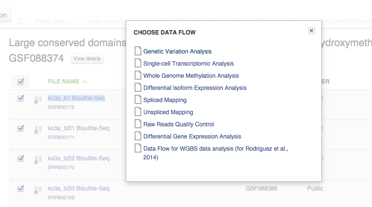
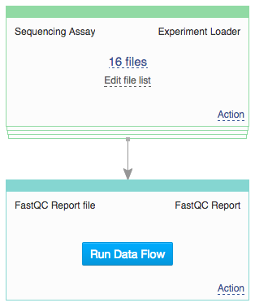
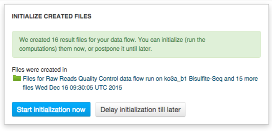
.. |View Resuts| image:: images/View-Resuts.png
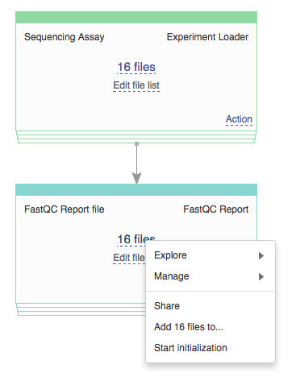
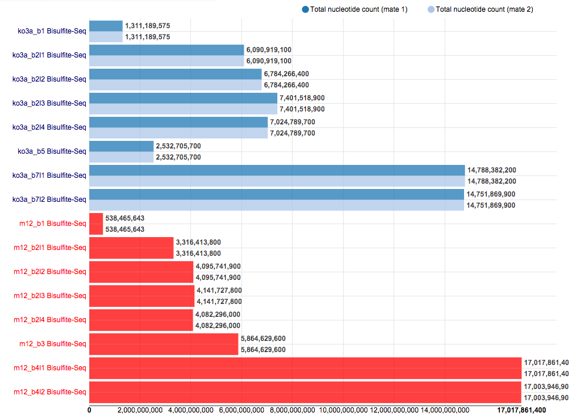
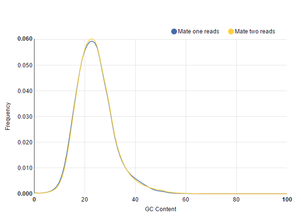
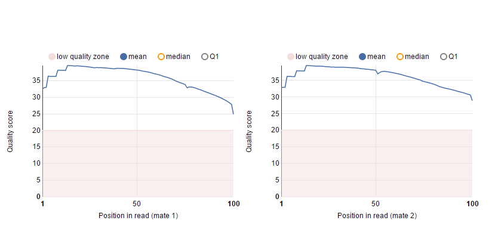
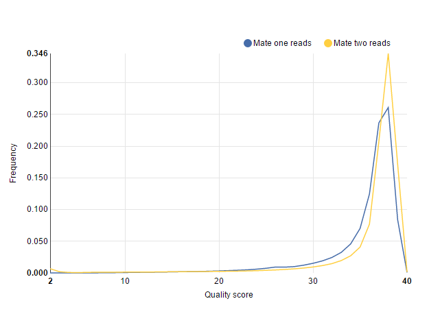
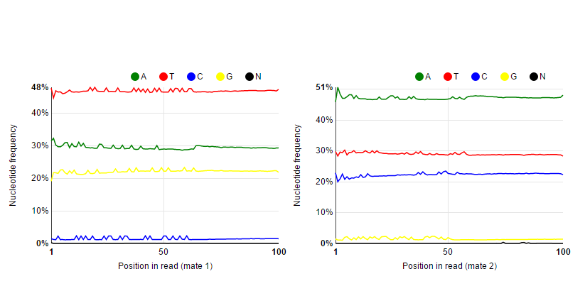
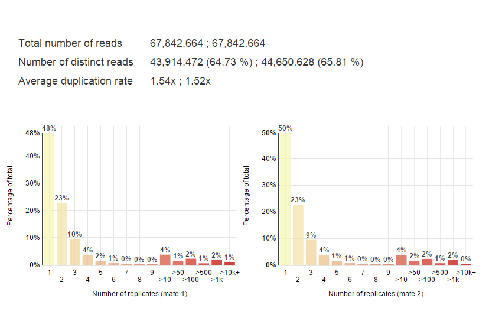
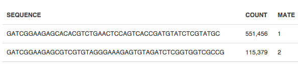
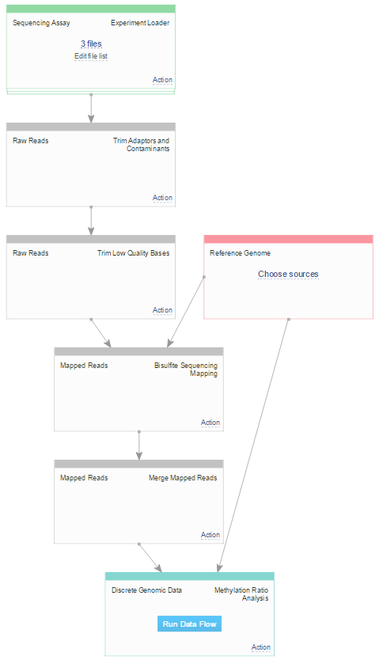
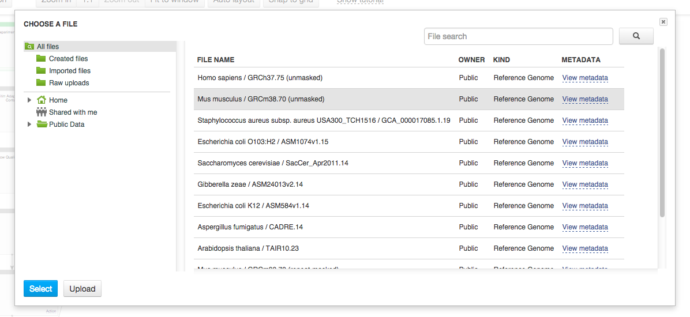
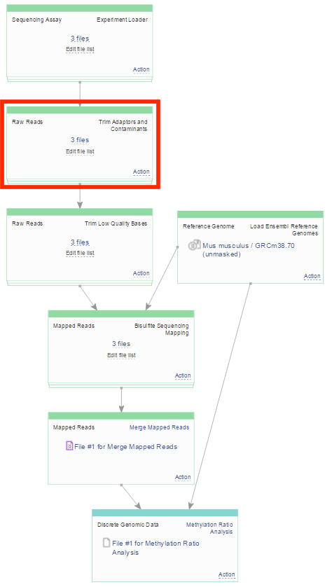
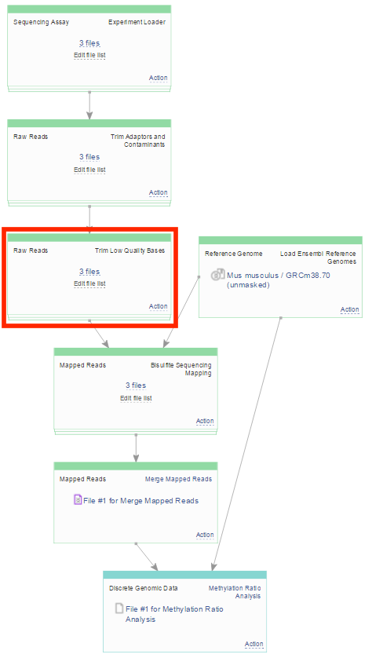
.. _Raw Reads Quality Control: https://platform.genestack.org/endpoint/application/run/genestack/dataflowrunner?a=GSF972554&action=viewFile
.. _Multiple QC Report for Raw Reads: https://platform.genestack.org/endpoint/application/run/genestack/multiple-qc-plotter?a=GSF970040&action=viewFile
.. _FastQC report: https://platform.genestack.org/endpoint/application/run/genestack/fastqc-report?a=GSF969042&action=viewFile
.. _FastQC reports for Rodriguez et al., 2014: https://platform.genestack.org/endpoint/application/run/genestack/filebrowser?a=GSF969029&action=viewFile&page=1
.. _Trim adaptors for Rodriguez et al., 2014: https://platform.genestack.org/endpoint/application/run/genestack/filebrowser?a=GSF968745&action=viewFile 
.. _Trim low quality bases for Rodriguez et al., 2014: https://platform.genestack.org/endpoint/application/run/genestack/filebrowser?a=GSF968751&action=viewFile.