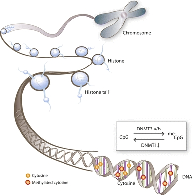
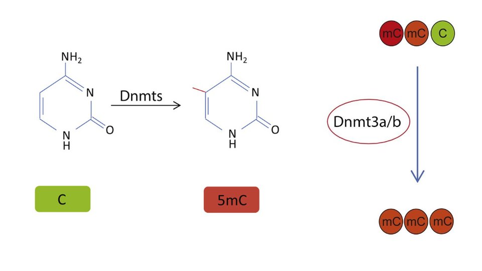
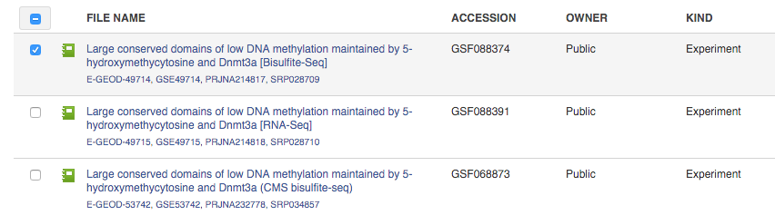
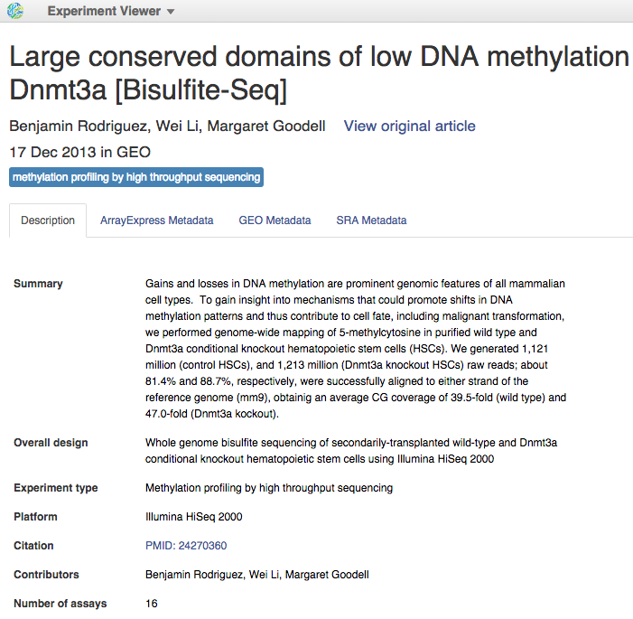

   Adapted from Lorenzen J.M., Martino F., Thum T. Epigenetic modifications in cardiovascular disease.
   *Basic Res Cardiol* 107:245 (2012)

Investigating the DNA methylation pattern is extremely valuable because this epigenetic system
regulates gene expression. It is involved in embryonic development, genomic imprinting, X chromosome
inactivation and cell differentiation. Since methylation takes part in many normal cellular
functions, aberrant methylation of DNA may be associated with a wide spectrum of human diseases,
including cancer. A strong interplay between methylation patterns and other
epigenetic systems provides a unique  picture of active and supressed genes.
Indeed, methylomes of a malignant cell and a healthy one are different.
Moreover, both hyper- and hypomethylation events are associated with cancer.

As methylation patterns of DNA are reversible and can be modified under the
influence of the environment, epigenetics opens new possibilities in diagnosis
and therapy of cancers and other severe diseases.

Bisulfite sequencing approaches are currently considered a “gold standard” allowing comprehensive
understanding of the methylome landscape. Whole-genome bisulfite sequencing (WGBS), provides single-
base resolution of methylated cytosines accross the entire genome.

In this tutorial step-by-step we will show you how to analyse and interprete bisulfite sequencing
data with Genestack Platform.

The overall pipeline includes the following steps:

#. Setting up a WGBS experiment
#. Quality control of bisulfite sequencing reads
#. Preprocessing of the raw reads: trimming adaptors, contaminants and
   low quality bases
#. Bisulfite sequencing mapping of the preprocessed reads onto a reference genome
#. Merging the mapped reads
#. Quality control of the mapped reads
#. Methylation ratio analysis
#. Exploring the genome methylation levels in Genome Browser

The details will be further elaborated in the sections below.
To follow along go to `Tutorials`_ folder in the Public data. Then select the
`Whole-Genome Bisulfite Sequencing Data Analysis on Genestack Platform`_
folder, containing all the tutorial files we talk about here for your convenience. Find there
processed files, explore results, and repeat the analysis steps on data of your interest with a
`WGBS data analysis (for Rodriguez et al., 2014) dataflow`_.

.. youtube:: https://www.youtube.com/watch?v=o7RkUrCRl4s

Setting up a WGBS experiment
****************************

For this tutorial we picked the data set by `Rodriguez et al., 2014`_ from the Genestack collection
of `Public Experiments`_.

|public experiments|

Feel free to reproduce the workflow on any other relevant data set with
`Experiment Browser`_.
If you do not find there needed experiment or you intend to analyse your own data use our
`Import Data`_ application allowing to upload files from your computer or from URL.

In this experiment authors applied WGBS of genomic DNA to investigate the mechanisms that could
promote changes in DNA methylation and contribute to cell differentiation and malignant
transformation. They investigated the cytosine methylation profile in normal precursors of leukemia
cells, hematopoietic stem cells (HSCs).

The team discovered novel genomic features, they called them DNA methylation canyons, that are uncommonly
large DNA regions of low methylation. Canyons are distinct from CpG islands and associated with
genes involved in development.

In mammals, a methyl group is added to cytosine residues by DNA methyltransferase (DNMT) enzymes.
As the *de novo* DNA methyltransferase Dnmt3a is shown to be crucial for normal HSCs
differentiation, and *Dnmt3a* gene is often mutated in human leukemias, the authors further explore
how loss of Dnmt3a influences canyons.

   Adapted from Jeong M. & Goodell M.A. New answers to old questions from genome-wide maps of DNA methylation in hematopoietic cells. *Exp Hematol* 42(8):609-617

They compared DNA methylation patterns in wild type and *Dnmt3a* knockout mouse HSCs. It turned out
that the loss of Dnmt3a results in methylation changes at the edge of canyons and can influence
canyon size.

Now let's start reproducing these results with data flows pre-prepared by Genestack.

To learn more just open the experiment in `Experiment Viewer`_:

|Experiment_Viewer|

.. _Tutorials: https://platform.genestack.org/endpoint/application/run/genestack/filebrowser?a=GSF000810&action=viewFile&page=1
.. _Whole-Genome Bisulfite Sequencing Data Analysis on Genestack Platform: https://platform.genestack.org/endpoint/application/run/genestack/filebrowser?a=GSF970554&action=viewFile&page=1
.. _WGBS data analysis (for Rodriguez et al., 2014) dataflow: https://platform.genestack.org/endpoint/application/run/genestack/filebrowser?a=GSF969172&action=viewFile&page=1
.. _Rodriguez et al., 2014: https://platform.genestack.org/endpoint/application/run/genestack/filebrowser?a=GSF088374&action=viewFile&page=1
.. _Public Experiments: https://platform.genestack.org/endpoint/application/run/genestack/filebrowser?a=GSF070886&action=viewFile&page=1
.. _Experiment Browser: https://platform.genestack.org/endpoint/application/run/genestack/databrowser?action=openInBrowser
.. _Import Data: https://platform.genestack.org/endpoint/application/run/genestack/uploader
.. _Experiment Viewer: https://platform.genestack.org/endpoint/application/run/genestack/experiment-viewer?a=GSF088374&action=viewFile
