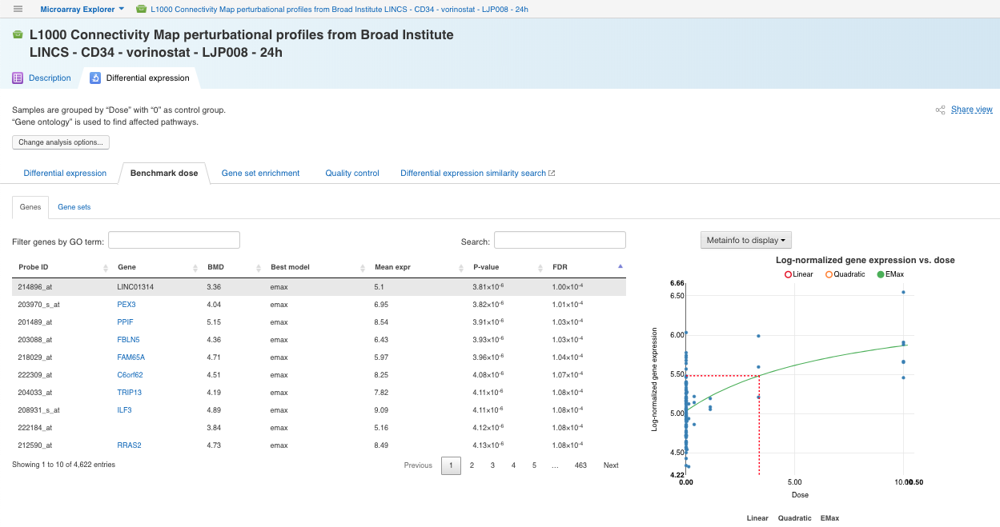

Expression microarray data analysis with Microarray Explorer
************************************************************

This tutorial will show you how to use our Microarray Explorer applied to expression microarray data analysis.

Microarray Explorer performs the process of collaboratively producing and exploring
complete Microarray reports: from quality control check, dose response analysis, to differential
expression analysis.

The pipeline includes the following steps:

- normalisation;
- QC;
- differential gene expression analysis;
- (optional) dose response analysis;
- gene set enrichment analysis.

Setting up a microarray dataset
-------------------------------

As an inputs for the app you can use either you own data or one of the pre-imported public
experiments. Use Data Browser app to explore already existing datasets.

The experiment we will use further is coming from Library of Integrated Network-Based Cellular
Signatures (LINCS) `Project`_ :
"L1000 Connectivity Map perturbational profiles from Broad Institute LINCS - CD34 - vorinostat - LJP008 - 24h"

Click the name of the experiment and open it in Metainfo Editor to learn more:

.. image:: me.png

.. _Project: http://www.lincsproject.org/

Data analysis
-------------

To start the analysis open the chosen experiment in Microarray Explorer by right-clicking its name and selecting
Microarray Explorer under Explore, or go to Microarray Explorer directly by left-clicking
the experiment name.

There are two tabs on the opening app page:

1) **Description tab**, where you can find necessary metadata associated with the data set of your choice.

2) In the **Differential expression** tab you can run the pipeline and, if it is necessary,
change default parameters:

.. image:: images/dif-exp-tab.png

#. **Group samples by** - to group the samples by experimental factor specified in metadata;
for example if you want to group samples by different dosages of Vorinostat,
select "Dose" in the list of suggested metainfo fields.

#. **Control group** option - to specify the control group if needed, e.g. select 0 to compare each group of
samples with Vorinostat against the group of samples without Vorinostat.
If you don’t set a control group ("No control group" option), each group will be compared against
the average of the other groups.

#. **Optional report** option - if you group the samples by compound dosages, the app suggests you
to produce a dose response analysis report.

#. **Microarray annotation** - to select microarray annotation to use. It will only show annotations
relevant to the platform (Affymetrix, Agilent, or L1000), for this example, you will see
the only "LINCS L1000 Annotation".

#. **Gene set database** - to choose Gene set database for the gene set enrichment analysis,
 In this tutorial, we will choose the Gene Ontology database.

To start the analysis click the **Analyze button**:

.. image:: images/start-analysis.png

In the earlier stage in the microarray data analysis Microarray Explorer performs **normalisation**
to eliminate some sources of variation which affect the measured gene expression levels.

As the reports are ready, the generated reports will appear on the app page. You can explore
the results and apply filters to show particular genes and pathways. Change parameters and re-run
the analysis if necessary.

.. image:: images/re-run.png

Besides, you can save the results with set filters as an immutable view by clicking the
**Save current view**. Click the **Share** link to share the view. The shared view
will appear in your colleague’s **Saved view list**.

Explore results
---------------

The following reports can be generated by the Microarray Explorer app:

#. **Differential Expression** - showing the list of top differentially expressed genes which can
be filtered and sorted by Log FC, Log Expr and FDR parameters.

#. **Benchmark dose** - an out of Dose Response Analysis that represents the compound
dosages at which genes start to show significant expression changes, i.e. the Benchmark Doses (BMDs).

#. **Gene set enrichment** - a report provides results of Fisher’s hypergeometric test between significant
differentially expressed genes and gene sets corresponding to pathways or/and biological functions,
which to allows to determine whether differentially expression genes were affected.

#. **Quality control** - includes results of quality assessment of microarrays and allows to detect
apparent outlier arrays. To remove outliers select the probes that should be excluded
(some will already be automatically tagged and selected as possible outliers) and
click the **Remove outliers** button to subset the dataset and re-run the analysis.

.. image:: images/qc.png

#. **Differential expression similarity search** - the link opens "Differential expression
similarity search" application that helps you to find experiments that produce similar differential
expression signatures.

Explore existing reports
------------------------

If you open an experiment in the Microarray Explorer app and go
to the Differential Expression tab, the latest reports you produced or viewed
will be shown on the app page, but you can manually switch to other reports
(if any have been already created) with the **Saved view** link.
Click the **Saved views** link shows the list of available Microarray Explorer
files reports, either generated by you or shared with you by a colleague.

