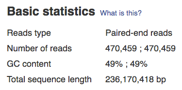
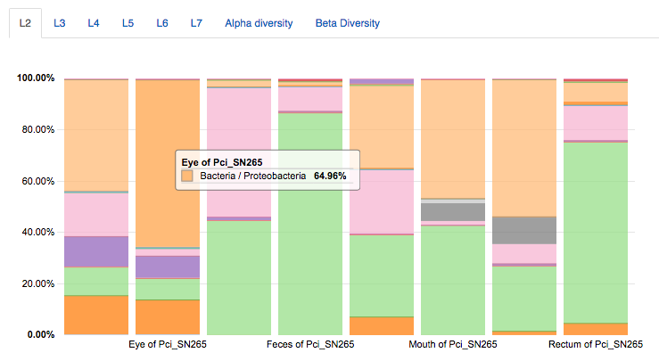
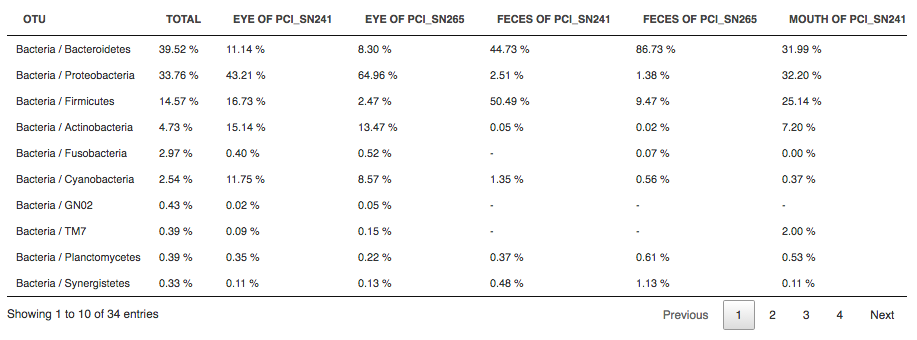
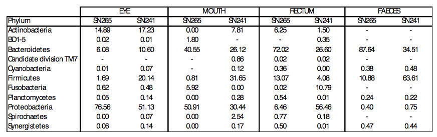
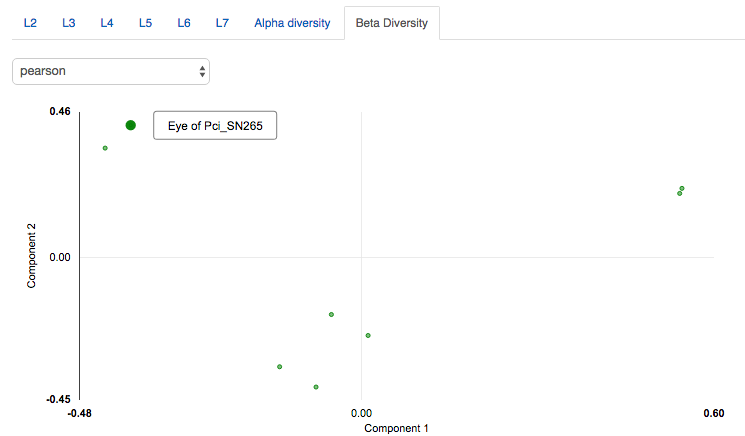
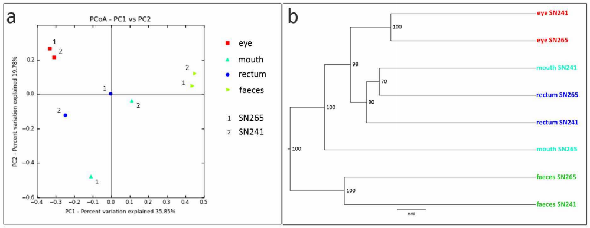

Microbiome analysis
*******************

The last step in the microbiome analysis pipeline is identification of microbial species and their
abundances in the microbiome samples examined.
To analyse the taxonomic composition of the microbial
communities the Microbiome analysis app requires a reference database containing previously classified sequences,
such as Greengenes_ (16S rRNA gene) and UNITE_ (fungal rDNA ITS region sequences) databases.
The application compares identified OTUs (operational taxonomic units) to the OTUs in
a reference database.

.. _Greengenes: http://greengenes.lbl.gov
.. _UNITE: http://www2.dpes.gu.se/project/unite/UNITE_intro.htm

.. .. Video - Microbiome Analysis step
.. .. raw:: html

..    <iframe width="640" height="360" src="" frameborder="0" allowfullscreen="1">&nbsp;</iframe>↵

Microbiome analysis results in two reports: *Research report* and *Clinical report*.
In this tutorial we will focus on the research microbiome analysis report generated for
all the tested samples (`Microbiome report for 8 files`_). To explore the clinical microbiome
report you should open a research report for an individual sample and click the **View Clinical Report** button.

.. _Microbiome report for 8 files: https://platform.genestack.org/endpoint/application/run/genestack/qiime-report?a=GSF3813067&action=viewFile

The research report provides abundance plots representing microbiota composition and microbiological
diversity metrics.

The app calculates some basic statistics describing the tested samples, such as
*sample count*, number of *reads per sample* and number of *clustered reads per sample*.

You can group samples by relevant metadata keys with **Group samples by** option.
Besides, you can apply some filters to *display absolute OTU counts*,
*hide unidentified OTUs* or *hide partially identified OTUs*.

The **plot** displays the relative abundance of OTUs at a highest taxonomic
resolution: genus (L6 tab) and species (L7 tab). You can change the resolution to
the L2 level to see what phyla are the most abundant across the samples.
For example, our results show that, at low taxonomic resolution (L2 tab), the
composition of microbial communities is similar between samples.
Bacteroidetes (8,30–86,73%), Firmicutes (1,46–50,49%) and Proteobacteria
(1,38–64,96%) are the most abundant phyla across most of the samples, followed
by Actinobacteria (0,02-15,14%) and Fusobacteria (0-10,33%).

You can see these results in the **table** as well. Click on the **Total** header in the
table to get the most abundant phyla across the samples:

Our findings are consistent with the paper results:

At a higher taxonomic resolution (L7 tab), more than 820 microorganisms were
identified. The koala eye and the koala gastrointestinal tract are characterized
by distinct microbial communities. To measure the similarity between the bacterial
communities we used principal component analysis (PCA) based on Pearson
correlation coefficients:

You may change the PCA type in the upper-left corner of the plot and try other
statistics to quantify the compositional dissimilarity between samples:
*bray_curtis*, *abund_jaccard*, *euclidean*, *binary_pearson*, *binary_jaccard*.

However, in comparison to the paper, authors used principal coordinate analysis
(PCoA) to show the similarity between the koala microbial communities:

Both PCA and PCoA are used to visualize the data, but different mathematical
approaches are applied to the data.

.. note:: **What is the difference between the PCA and PCoA?**

          The purpose of PCA is to represent as much of the variation as
          possible in the first few axes. For this, first, the variables are
          centred to have a mean of zero and then the axes are rotated (and
          re-scaled). In the end, we have two axes: the first one contains as
          much variation as possible, the second one contains as much of the
          remaining variation as possible, etc.

          The PCoA takes uses a different approach, the one based on the
          distance between data points. First, the PCoA projects the distances
          into Euclidean space in a larger number of dimensions (we need n-1
          dimensions for n data points). PCoA puts the first point at the
          origin, the second one along the first axis, then adds the third one
          so that the distance to the first two is correct (it means adding the
          second axis) and so on, until all the points are added. To get back
          to two dimensions, we apply a PCA on the newly constructed points and
          capture the largest amount of variation from the n-1 dimensional
          space.

Congratulations! You've just gone through the entire tutorial!
