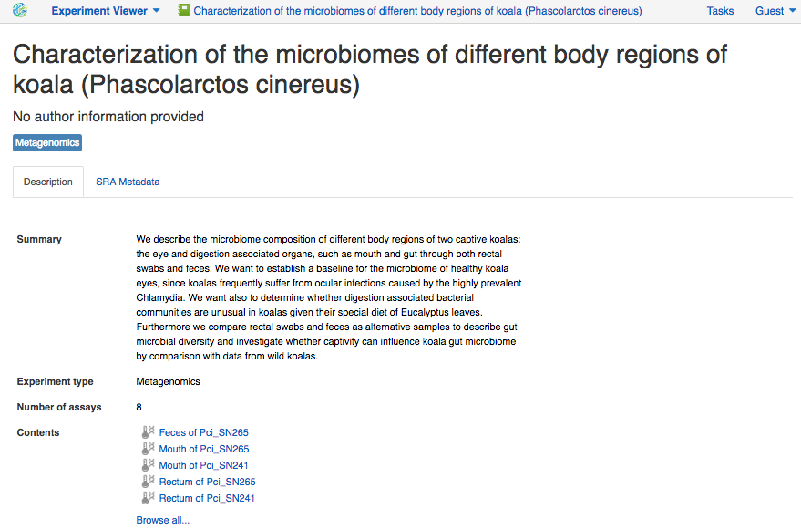

Previously, to study microbes - bacteria, archaea, protists, algae, fungi and
even micro-animals - it was necessary to grow them in a laboratory. But many
of the microorganisms that live in complex environments (e.g. gut or saliva),
have proven difficult or impossible to grow in culture. However, recently
developed culture-independent methods based on high-throughput sequencing of
16S ribosomal RNA gene variable regions enable researchers to identify all
the microbs in their complex habitats, or in other words, to analyse a microbiome.

.. raw:: html

    <iframe width="640" height="360" src="" frameborder="0" allowfullscreen="1">&nbsp;</iframe>

The purpose of this tutorial is to describe you the steps required to perform
microbiome data analysis, explain how to build your own data flow, and finally,
discuss the results obtained in such analysis.

Setting up a microbiome experiment
**********************************

First, we need a good example of microbiome data. You can `upload your own data`_
using 'Import' button or search through all the available experiments using 
`Experiment Browser`_ application. Our analysis will be based on data coming
from `Alfano et al. 2015`_. Let's look up this experiment in the platform and
open it in `Experiment Viewer`_:

.. __: https://platform.genestack.org/endpoint/application/run/genestack/experiment-viewer?a=GSF2062097&action=viewFile

|Microbiome_experiment_viewer|

The researches examined the microbiome composition of different body regions
of two captive koalas: the eye, the mouth and the gut (through both rectal
swabs and feces). First, since koalas frequently suffer from ocular diseases
caused by *Chlamydia* infection, scientists examined the eye microbiome and
found out that it is very diverse, similar to other mammalian ocular
micromiomes but has a high representation of bacteria from the Phyllobacteriaceae
family. Second, authors determined that, despite a highly specialized
diet consisting almost exclusively of *Eucalyptus* leaves, koala oral and gut
microbial communities are similar in composition to the microbiomes from the
same body regions of other mammals. Also, it was found that the rectal samples
contain all of the microbial diversity present in the faecal ones. And finally,
the researches showed that the faecal communities of the captive koalas are
similar to the ones for wild koalas, suggesting that captivity may not
influence koala microbial health.

Microbiome data analysis pipeline
*********************************

A typical data flow for Microbiome analysis consists of the following steps:

#. Quality control of raw reads
#. Preprocessing of raw reads
#. Microbiome analysis

Let’s go through each step to get a better idea of what it really means.

.. _upload your own data: https://platform.genestack.org/endpoint/application/run/genestack/uploader
.. _Experiment Browser: https://platform.genestack.org/endpoint/application/run/genestack/databrowser?action=openInBrowser
.. _Alfano et al. 2015: https://trace.ncbi.nlm.nih.gov/Traces/sra/?study=SRP049712
.. _Experiment Viewer: https://platform.genestack.org/endpoint/application/run/genestack/experiment-viewer?a=GSF2062097&action=viewFile
