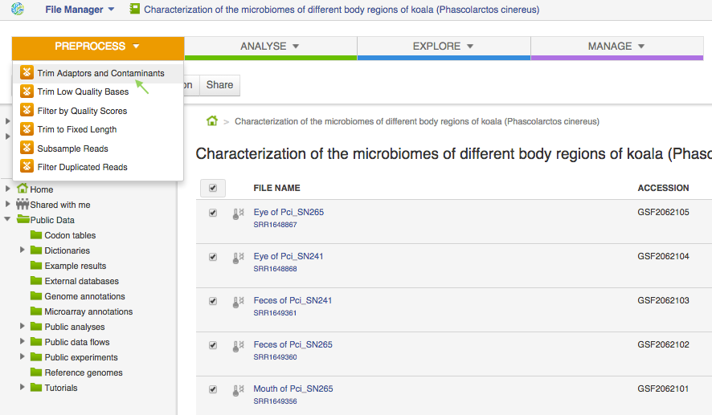
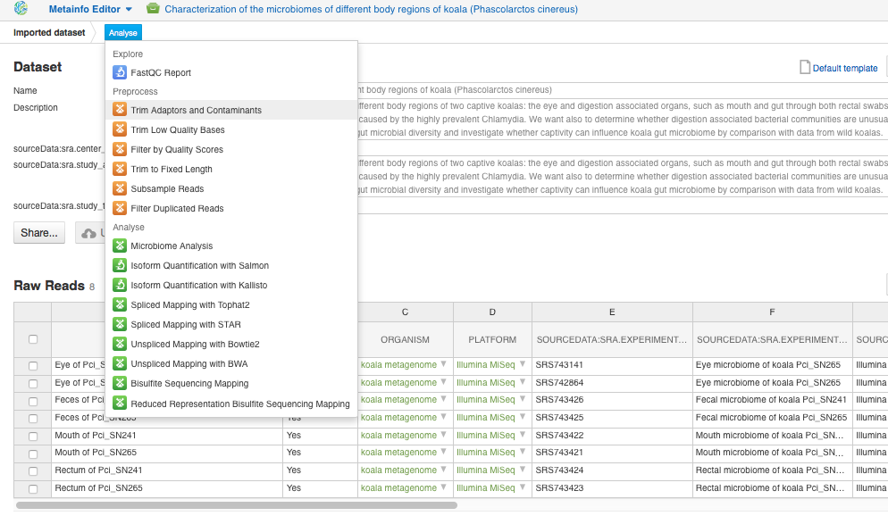
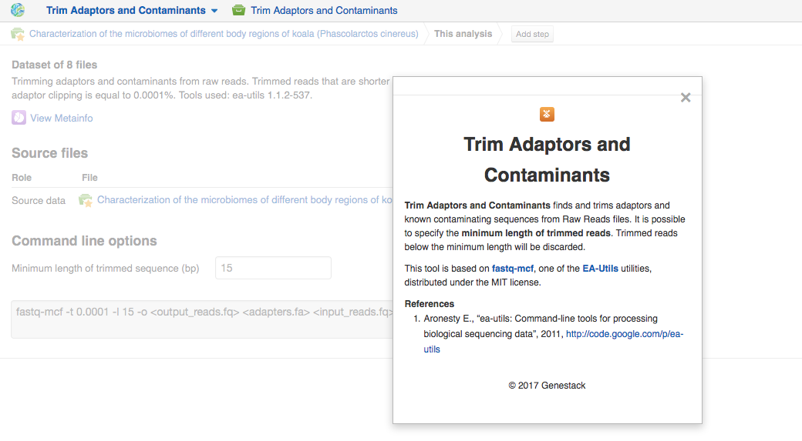
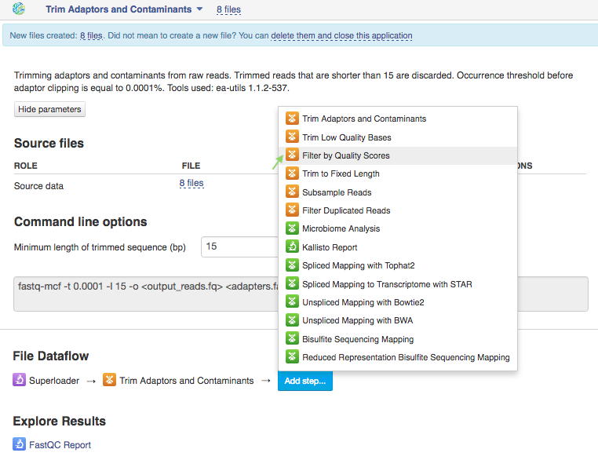
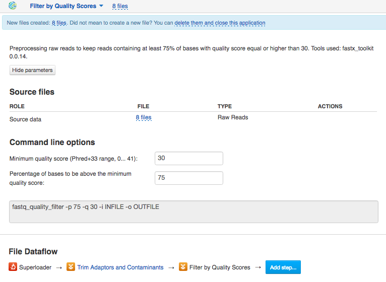

Preprocessing of raw reads
**************************

FastQC reports help you understand whether it is necessary to improve the
quality of your data by applying trimming, filtering, adaptor clipping and
other preprocessing steps. Here is the list of Genestack preprocess
applications available for raw reads:

Once we have checked the quality of the raw reads, let's start building the
Microbiome Data Analysis pipeline:

.. Video - Preprocessing pipeline
.. raw:: html

    <iframe width="640" height="360" src="" frameborder="0" allowfullscreen="1">&nbsp;</iframe>

Our preprocessing procedure will include two steps - adaptor trimming and
filtering out low quality reads.

1. **Trim adaptors and contaminants**

For this, choose all 8 samples in the experiment and select "Trim Adaptors and
Contaminants" in Preprocess section:

This brings you to the application page. On this step, the application will
scan the reads for adaptors, primers, N bases or any poor quality nucleotides
at the ends of reads, and, based on a log-scaled threshold, will perform
clipping.

.. image:: images/Microbiome_trim_adaptors_and_contaminants_page.png

By default, the application uses an `internal list`_ of widely used PCR
primers and adaptors that can be considered as possible contaminants. The
occurrence threshold before adapter clipping is set to 0.0001. It refers to
the minimum number of times an adapter needs to be found before clipping is
considered necessary.

.. _internal list: https://s3.amazonaws.com/bio-test-data/Genestack_adapters.txt

After trimming, the reads are getting shorter. In order to discard trimmed
reads of length below specific value, indicate this value in the box for
"Minimum length of the trimmed sequence (bp)" option. We will used the default
length of 15 nucleotides.

To get more information about the application and its parameters, you can click
the application name at the top of the page and choose "About application".

Trimmed reads for our 8 samples are stored in `Trimmed raw reads for Alfano et
al (2015)`_ folder.

.. _Trimmed raw reads for Alfano et al (2015): https://platform.genestack.org/endpoint/application/run/genestack/filebrowser?a=GSF3773384&action=viewFile&page=1

2. **Filter by quality scores**

Let's continue our preprocessing procedure and add our next step - "Filter
by Quality Scores":

This application will filter out the reads based on their quality scores. For
this purpose, we need to specify "Minimum quality score" and "Percentage of
bases to be above the minimum quality score".

According to the paper_, only reads with at least 75% of read length with
quality score above 30 were kept for the future analysis. Let's use the same
settings: 30 for minimum quality score and 75% for percentage threshold.

.. _paper: https://www.ncbi.nlm.nih.gov/pmc/articles/PMC4426690/

Learn more about the application work in "About application" section.

All 8 samples after this filtering are collected in `Filtered trimmed raw reads
for Alfano et al (2015)`_ folder.

.. _Filtered trimmed raw reads for Alfano et al (2015): https://platform.genestack.org/endpoint/application/run/genestack/filebrowser?a=GSF3773385&action=viewFile&page=1
