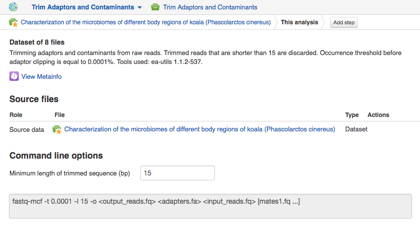

Preprocessing of raw reads
**************************

FastQC reports help you understand whether it is necessary to improve the
quality of your data by applying trimming, filtering, adaptor clipping and
other preprocessing steps. Here is the list of Genestack preprocess
applications available for raw reads: 

|Microbiome_preprocess_apps|

Once we have checked the quality of the raw reads, let's start building the
Microbiome Data Analysis pipeline:

.. Video - Building Microbiome Analysis pipeline
.. raw:: html

    <iframe width="640" height="360" src="" frameborder="0" allowfullscreen="1">&nbsp;</iframe>

Our preprocessing procedure will include two steps - adaptor trimming and
filtering out low quality reads. For this, choose all 8 samples in the
experiment and select "Trim Adaptors and Contaminants" in Preprocess section:

|Microbiome_trim_adaptors_and_contaminants|

This brings you to the application page. On this step, we will scan the reads
for adaptors, and, based on a log-scaled threshold, perform clipping. By
default, the application 

|Microbiome_trim_adaptors_and_contaminants_page|

|Microbiome_trim_adaptors_and_contaminants_about|

|Microbiome_trim_adaptors_and_contaminants_next|

Trimmed reads are stored in `Trimmed raw reads for Alfano et al (2015)`_
folder.

.. |Microbiome_preprocess_apps| image:: images/Microbiome_preprocess_apps.png
.. |Microbiome_trim_adaptors_and_contaminants| image:: images/Microbiome_trim_adaptors_and_contaminants.png

.. |Microbiome_trim_adaptors_and_contaminants_about| image:: images/Microbiome_trim_adaptors_and_contaminants_about.png
.. |Microbiome_trim_adaptors_and_contaminants_next| image:: images/Microbiome_trim_adaptors_and_contaminants_next.png

.. _Filtered mapped reads for Clark et al (2011): https://platform.genestack.org/endpoint/application/run/genestack/filebrowser?a=GSF999208&action=viewFile&page=1
.. _variants in Genome Browser: https://platform.genestack.org/endpoint/application/run/genestack/genomeBrowser?a=GSF999281&action=viewFile
.. _Variants for Clark et al (2011): https://platform.genestack.org/endpoint/application/run/genestack/filebrowser?a=GSF999229&action=viewFile&page=1.. _
