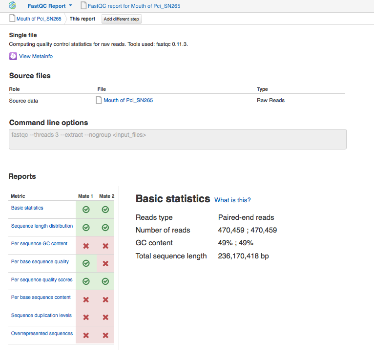
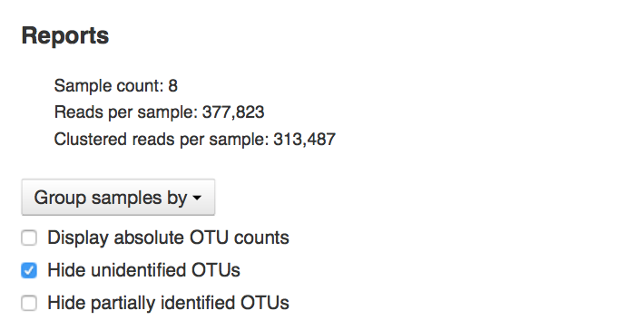
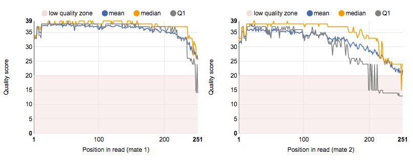
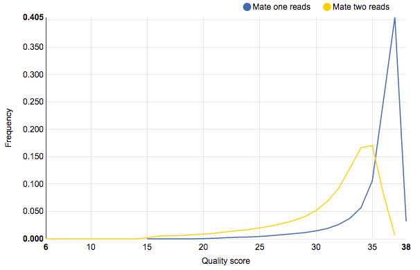
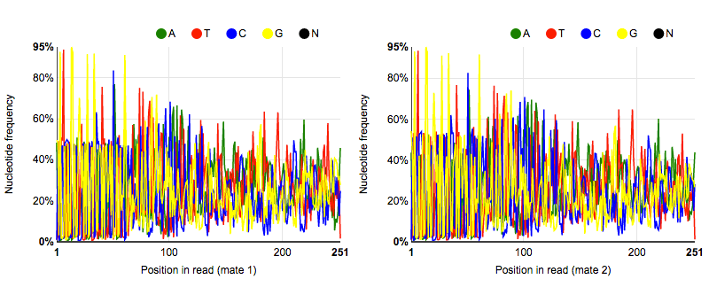
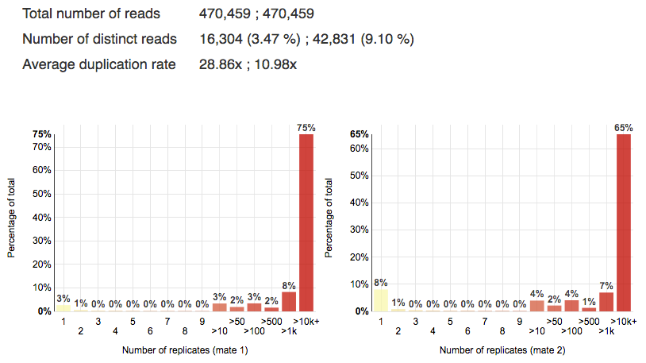
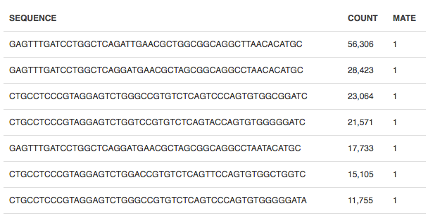

Quality control of raw reads
============================

Garbage in - garbage out. It means that your analysis is only as good as your data.
Therefore, the first and very important step in any kind of analysis is quality
control (QC). It allows to look at some relevant properties of the raw reads,
such as quality scores, GC content, base distribution, etc, and check
whether any low-quality reads, PCR primers, adaptors, duplicates and other
contaminants are present in the samples. In order to assess the quality of
the data we'll run the `Raw Reads QC`_ data flow:

.. Video - QC step
.. raw:: html

    <iframe width="640" height="360" src="" frameborder="0" allowfullscreen="1">&nbsp;</iframe>

.. _Raw Reads QC: https://platform.genestack.org/endpoint/application/run/genestack/dataflowrunner?a=GSF3772318&action=viewFile

Genestack FastQC application generates basic statistics and many useful data
diagnosis plots. Here is some of them for `Mouth of Pci_SN265`_ sample:

.. _Mouth of Pci_SN265: https://platform.genestack.org/endpoint/application/run/genestack/fastqc-report?a=GSF3772052&action=viewFile

**Basic statistics** reports some sample composition metrics such as reads
type, number of reads, GC content and total sequence length.

.. :scale: 70 %

Our sample contains 470,459 paired-end reads, which all together give us a
sequence of 236,170,418 bp in length. The GC content is about 49%.

**Sequence length distribution** module gives us information about read length
in a sample. In our example, all the reads have the same length equal to 251
bp.

**Per sequence GC content** graph shows GC distribution over all reads. A
roughly normal distribution indicates a normal random library.

However, as in our case, there are sharp peaks which may usually indicate the
presence of adapter, primer or rRNA contamination. To remove possible
contaminants, we'll run "Trim Adaptors and Contaminants" application.

**Per base sequence quality** plots show the quality scores across all bases
at each position in the reads. By default, only low quality zone and mean
quality lines are displayed. If the median (or the middle quartile Q2) is less
than 20 or the lower quartile (Q1) is less than 5, you'll get failures (you see
the red cross near the metric).

In our sample, the second mates in paired-end reads have bases of bad quality
at the end of the sequences. To get rid of these bases and improve the reads
quality we'll run "Trim Adaptors and Contaminants" and "Filter by Quality
Scores" applications.

**Per sequence quality scores** report allows you to see frequencies of
quality values in a sample. The reads are of good quality if the peak on the
plot is shifted to the right, to the maximum quality score.

In our example, first and second mate reads differ by quality score, but still
almost all of them are of good quality (>30). We will improve the reads quality
by running "Filter by Quality Scores" application.

**Per base sequence content** plots show nucleotide frequencies for each base
position in the reads. In a random library, there could be only a little
difference between A, T, C, G nucleotides, and the lines representing them
should be almost parallel with each other. The black N line indicates the
content of unknown N bases which shouldn't be presented in the library.

Since we analyse 16S microbiome data, all the reads should begin with the same
forward primer, and that's why we may observe the peaks of 100 % base content
in the first positions. The nucleotide frequency pattern in the rest of the
sequence can be explained by the 16S sequence variation of the analysed
bacterial community.

**Sequence duplication levels** plots help us evaluate library enrichment. In
other words, the percentage of the library made up of sequences with different
duplication levels.

The application also picks up the **overrepresented sequences** which may
represent primer or adaptor contamination as well as indicate highly expressed
genes.

The last two QC metrics - Sequence duplication levels and Overrepresented
sequences - should not be used to evaluate 16S microbiome samples. Since we are
looking at sequencing data for only a single gene, we are expecting to see an
excess of highly similar sequences, and in turn, to get failures for these
modules.

We have run QC on all the data in the experiment and put the reports in `Raw
reads QC reports for Alfano et al (2015)`_ folder, so that you can open all of
them in `Multiple QC Report application`_ to analyse results:

.. image:: images/Microbiome_multiple_raw.png

.. _Raw reads QC reports for Alfano et al (2015): https://platform.genestack.org/endpoint/application/run/genestack/filebrowser?a=GSF3772057&action=viewFile&page=1
.. _Multiple QC Report application: https://platform.genestack.org/endpoint/application/run/genestack/multiple-qc-plotter?a=GSF3772056&action=viewFile

You see that total number of sequencing reads for each sample is quite small
and vary in the range of 190,000 to 471,000 reads. Overall, more than 2,5
million paired-end sequencing reads were generated.
