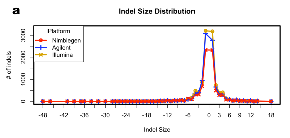

Effect-annotation
*****************

After variants are detected, use Effect Annotation application based on
SnpEff_ tool. The app annotates variants and predicts the effects they
produce on genes such as amino acid changes, impact, functional class, etc.
To review this information, open variants with predicted effects in `View
report`_ application:

.. youtube:: https://www.youtube.com/watch?v=0fm7ZsFeRq0

Let's analyse annotated variants for sample enriched by Nimblegen. Output
report contains **summary** about tool version, number of variants, number of
effects, change rate, and other information.

**Change rate details** table shows length, changes and change rate for each
chromosome and patch (if they are presented). Here is the change rate details
for the first 10 chromosomes:

|WES_change_rate_by_cromosome_|

The app calculates total number of variants as well as number of homo/hetero
single nucleotide polymorphisms (SNPs), multiple nucleotide polymorphisms
(MNPs), insertions (INS), deletions (DEL), combination of SNPs and indels at a
single position (MIXED) and records it in **Number of changes by type** table:

|WES_number_changes by_type_1|

SNVs represent the most numerous sequence variations in the human exome.
TruSeq detected the highest number of SNVs followed by Agilent and Nimblegen.
Most of them are SNPs. For example, in the Nimblegen sample, there are
~555,000 of SNPs and ~40,000 of both insertions and deletions. No significant
difference in the ratio of heterozygous to homozygous variants between
platforms was observed. However, regarding WGS sample, much more variants
were detected (3,8 million of SNPs and about 600,000 indels).

**Number of effects by impact** table shows count and percentage of variants
that have high, low, moderate impact or tagged as modifiers:

|WES_number_of_effects_by_impact_1|

As a rule, the mutation has high impact if it causes significant changes such
as frame shift, stop codon formation, deletion of a large part (over 1%) of
chromosome or even the whole exon, etc. Variants with low impact do not change
function of the protein they encoded. Usually this is synonymous mutations.
Moderate variants do not affect protein structure significantly but change
effectiveness of the protein function. They mostly include missense mutations,
codon deletions or insertions, etc. So called modifiers are mutations in
introns, intergenic, intragenic and other non-coding regions.

For sample enriched by Nimblegen, just about 0.04% of all annotated variants
has high impact. However more than 97% mutation are modifiers. We see the
same percentage of modifiers in WES and WGS samples.

Also, the output report contains information about the count and percentage of
missense, nonsense and silent mutations. Find out this in **Number of effects
by functional class** table:

|WES_number_of_affects_by_functional_class_1|

For Nimblegen sample, the app detected ~50% point mutations in which a single
nucleotide change results in a codon that codes for a different amino acid
(missense mutations). There are more then 50% of silent mutations which do
not significantly alter the protein. And only ~0.3% are nonsense mutations.
They change codon in a way resulting in a stop (or nonsense) codon formation,
and subsequently a truncated, incomplete, and usually nonfunctional protein
is produced. Almost the same percentage of missense, nonsense and silent
mutations we notice for other WES and WGS samples. 

Next **Number of effects by type and region** table outputs how many variants
for each type (codon deletion, codon insertion, etc) and for each region
(e.g. exon, intron) exist:

|WES_Number_of_variants_by_effect_1|

**Variations** histogram additionally illustrates what regions of genome are
mostly affected:

|WES_variations|

Most of variants are detected in the introns. That can be explained by the
fact that platform baits sometimes extend farther outside the exon targets.

**Quality** histogram, like this one below, shows you the distribution of
quality scores for detected variants:

|WES_quality|

This one is asymmetrical, there are more then 160,000 variants with quality
of 10 and a lot of small peaks of lower and greater qualities.

Also, the application reports a histogram of **Coverage** for detected
variants:

|WES_coverage|

All variants have coverage 2 and more.

Next **Insertions and deletions length** histogram shows size distribution of
detected indels:

|WES_insertions_and_deletions_length|

For Nimblegen sample, we identified more than 40,000 indels, of which ~24,000
were deletions of up to 12 bases and the rest were insertions of up to 12
bases. There are more indels were identified after Illumina TruSeq enrichment
(~80,000) followed by Agilent (~57,000) and Nimblegen platforms. These
findings agree with paper results:

|WES_Indel_size_distribution|

Moreover, most insertions and deletions were 1 base in size. Notably, there
is a slight enrichment at indel sizes of 4 and 8 bases in the total captured
DNA data, and that is also consistent with paper results (*Clark M.J. et al,
2011; Mills R.E. et al, 2006*).

In **Base change (SNPs)** table, the app records how many and what single
nucleotide polymorphisms were detected:

|WES_base_changes|

There is a slight increase in G→A/C→T transitions and slight decrease in
G→C/C→G transversions in both whole exome and whole genome samples.

**Transition vs transversions (Ts/Tv)** section is about the number of
transitions, number of transversions and their ratio in SNPs and all variants.

Transitions are mutations within the same type of nucleotide —
pyrimidine-pyrimidine mutations (C <> T) and purine-purine mutations (A <> G).
Transversions are mutations from a pyrimidine to a purine or vice versa. The
table represents these values taking into account only SNP variants.

|WES_Ts_Tv|

But below the table, you can find the information for all variants. For WES
data, the Ts/Tv ratio of total variants ranged from 1.6 to 1.8 and was lower
than the estimated ~2.6. It can be explained by the fact that the platforms
target sequences outside coding exons (only 60% of variants were found in
introns, for Nimblegen sample). However, for WGS data, the ratio is equal to
2 as it's expected (*Ebersberger I. et al, 2002*).

Looking at **Frequency of alleles** histogram, you can evaluate how many
times an allele appears once (singleton), twice (doubleton), etc:

|WES_alleles_frequencies|

In all samples, most of the variants are represented as singletons. Some
variants (less than 400,000 for WES, and about 1,5 million for WGS) have two
alternate alleles.

**Codon changes** table outputs what and how many reference codons have been
replaced. Here is just a fragment of this table:

|WES_codon_changes|

Reference codons are shown in rows, changed codons - in columns. The most of
changes happened are indicated in red color. For example, 811 'ACG' reference
codons have been replaced by 'ACA' triplet. If we compare this information
between our samples, you'll find the same type and almost the same number of
codon changes across WES samples.

In **Amino acid changes** table, you can see type and number of amino acid
changes. Row indicates a reference amino acid, column - changed amino acid.

|WES_amino_acid_changes|

For example, 957 Alanines (A, Ala) have been replaced by Tryptophan (T, Trp)
in Nimblegen sample. Number and type of amino acid changes look pretty
similar across WGS and different WES samples.

**Changes by chromosome** plots show the number of variants per 10000Kb
throughout the whole chromosome length. Such histogram is generated for each
chromosome and patch presented in the reference genome. Here is the example
plot for chromosome 1:

|WES_Changes_by_chromosome_1|

Besides above mentioned plots and tables, you can see  **Details by gene** as
well.

We annotated the variants calculating the effects they produced on known
genes and put them in `Variants with predicted effects for Clark et al (2011)`_
folder.

Variant prioritisation in Variant Explorer
******************************************

The variants can be also interactively analysed in Genestack Variant Explorer
application:

.. youtube:: https://www.youtube.com/watch?v=5hawJA77Kk4

Let's select Illumina sample and open it in Variant Explorer to look at
`the detected variants`_:

|WES_VE_1|

There are 1,350,608 mutations were identified. Imagine that we are interested
only in high-quality nonsense variants: click 'QUALITY' header to apply
sorting and set 'NONSENSE' in 'FUNCTIONAL CLASS'. You see that the number of
mutations is decreased significantly. We have only 104 nonsense variants:

|WES_VE_2|

You can use other filters and sorting criteria and look through the 'Filters
history' to check how many variants were detected after applying specific
filter in comparison to the number of mutations we had on the previous
filtering step:

|WES_filters_history|

When the variants are sorted and filtered, you can share them with your
colleagues, export them as tsv file clicking on 'Download table' and attach
it to your papers and other reports.

So, what can we conclude from our findings? Are the results for WES samples
really comparable to a WGS one? If there are any key differences in
performance between the three enrichment platforms? And what target capture
technology is better to select when planning the exome experiment?

Answering these questions we found that neither of whole exome and whole
genome technologies managed to cover all sequencing variants. First, WGS can
not and will not replace exome sequencing as due to genome characteristics
there will always be regions that are not covered sufficiently for variant
calling. Regarding WES, it shows high coverage but only towards the target
regions. Second, WGS has its value in identifying variants in regions that
are not covered by exome enrichment technologies. These can be regions where
enrichment fails, non-coding regions as well as regions that are not present
on the current exome designs. That's why, for covering really all variants,
it might be worth to think about doing both WGS and WES experiments in
parallel. Both technologies complement each other.

In general, all technologies performed well. Our results demonstrated that
they give a very high level of targeting efficiency, with the Nimblegen
technology demonstrating the highest one, and able to adequately cover the
largest proportion of its target bases. Therefore, the Nimblegen is superior
to the Agilent and Illumina TruSeq platforms for research restricted to the
regions that it covers. The technologies target different exomic features but
all of them cover a large portion of the overall exome with Illumina able to
achieve the best exome coverage (~60%). Moreover, the results showed that
Agilent and Illumina platforms appeared to detect a higher total number of
variants in comparison to Nimblegen one. That's why the question of which
enrichment platform is best must be answered with respect to all these
specific parameters.

Congratulations! We've worked through the entire tutorial! Try to repeat all
the steps with your own data or using other Genestack `public experiments`_.
As well as create your own data flows by adding new steps, changing sources
and default parameters. If you have any questions or suggestions, please
leave them below or `email us <feedback@genestack.com>`_.

References
----------

- Clark M.J., et al. Performance comparison of exome DNA sequencing technologies. *Nature biotechnology* 2011; 29(10):908-914
- Ebersberger I., et al. Genomewide comparison of DNA sequences between humans and chimpanzees. *The American Journal of Human Genetics* 2002; 70:1490–1497
- Mills R.E., et al. An initial map of insertion and deletion (INDEL) variation in the human genome. *Genome Research* 2006; 16:1182–1190
- van Dijk E.L., et al. Ten years of next-generation sequencing technology. *Trends in Genetics* 2014; 30:418-426

.. |WES_change_rate_by_cromosome_| image:: images/WES_change_rate_by_cromosome_.png

.. _SnpEff: http://snpeff.sourceforge.net/
.. _View report: https://platform.genestack.org/endpoint/application/run/genestack/report-viewer?a=GSF999233&action=viewFile
.. _Variants with predicted effects for Clark et al (2011): https://platform.genestack.org/endpoint/application/run/genestack/filebrowser?a=GSF999234&action=viewFile&page=1 
.. _the detected variants: https://platform.genestack.org/endpoint/application/run/genestack/vcfviewer?a=GSF1001169&action=viewFile#
.. _public experiments: https://platform.genestack.org/endpoint/application/run/genestack/filebrowser?a=GSF070886&action=viewFile
.. _email us: feedback@genestack.com
