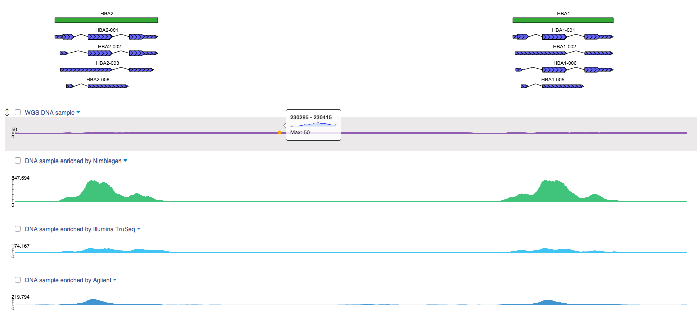
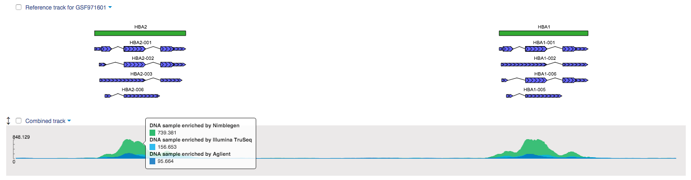
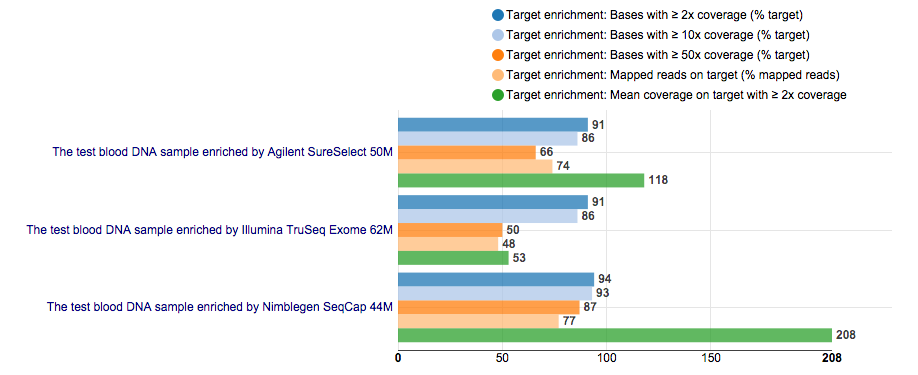
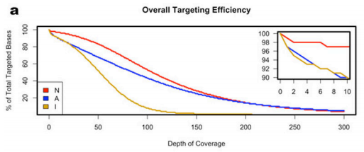
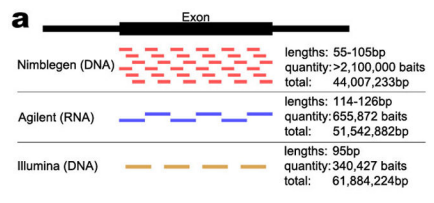
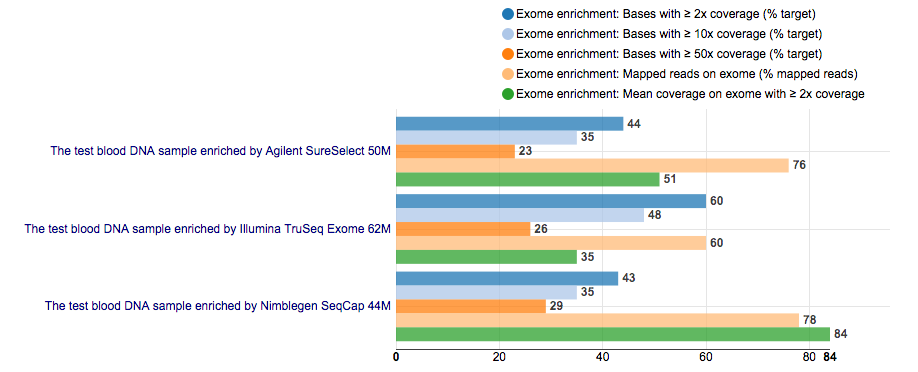
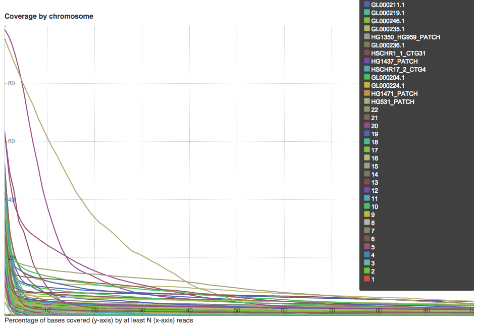
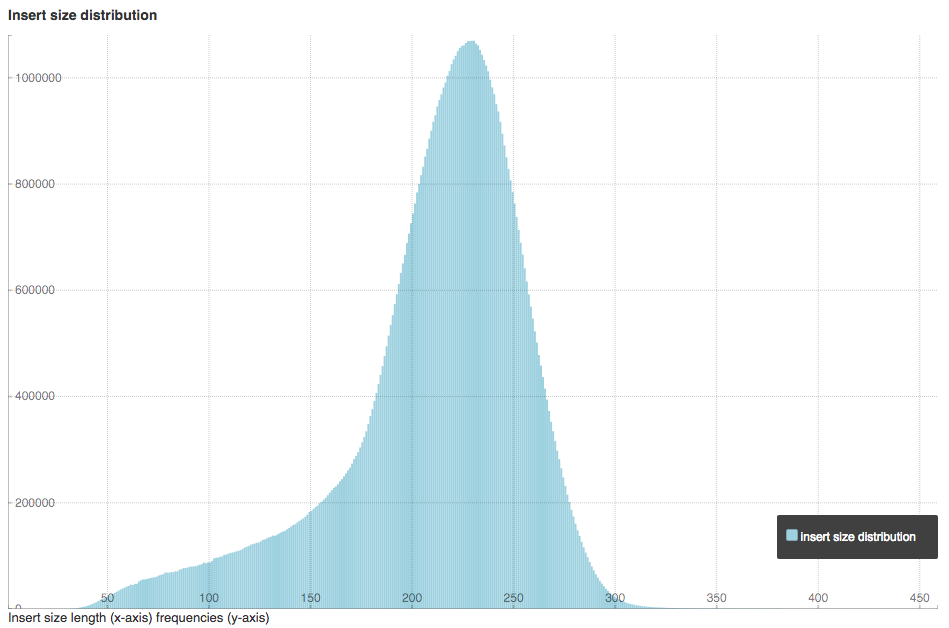
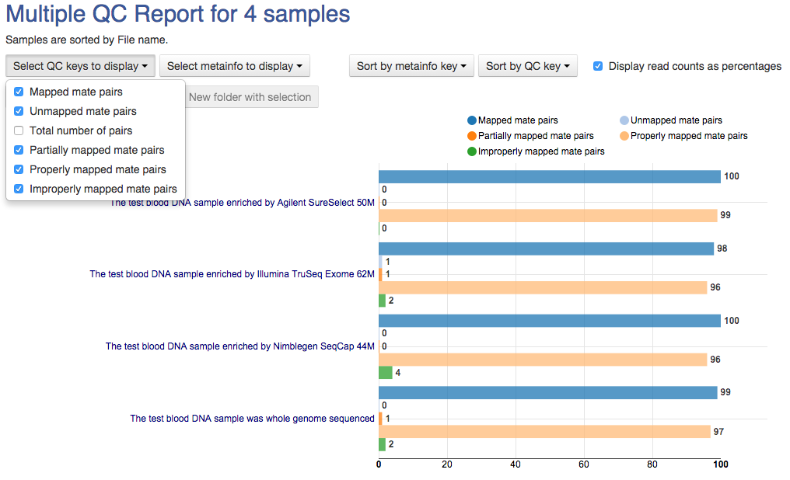

Mapping reads onto a reference genome
*************************************

After raw data QC and preprocessing, the next step is to map exome sequencing
data to the reference genome with high efficiency and accuracy. Genestack
supports two Unspliced mappers: one is based on Bowtie2_, another uses BWA_ alignment package.
We'll use the last one since it is fast and allows gapped alignments which
are essential for accurate SNP and indels (insertion/deletions)
identification. The following video illustrates how to start computation
on this step and analyse mapping results in Genome Browser:

.. youtube:: https://www.youtube.com/watch?v=hCGkOYQfH5g

When mappings are complete, open all 4 files in Genome browser to compare
their `read coverage`_. Let's look for specific gene or region, for example,
HBA1 and HBA2 genes encoding alpha-globin chains of hemoglobin. With WGS
technology, you can see coverage in both protein-coding and non-coding
sequences:

|WES_GB|

As for WES technology, you are interested only in exome. That's why, you see
coverage for HBA1 and HBA2 coding regions and do not see it in non-coding
ones. To compare read coverage between different enrichment platforms, you
can build a coverage track:

|WES_coverage_1|

In most cases you'll see a significant coverage for sample enriched by
Nimblegen. Moreover, each platform targets particular exomic segments based
on combinations of the RefSeq_, UCSC_, Ensembl_ and other databases. That's
why, you may expect difference in coverage for specific gene-coding regions.
To further use mapped reads, go to the `Mapped reads for Clark et al (2011)`_
folder.

Targeted sequencing quality control
***********************************

Besides quality control of the raw sequencing reads, it is also crucial to
assess whether the target capture has been successful, i.e. if most of the
reads actually fell on the target, if the targeted bases reached sufficient
coverage, etc. However, by default the application allows you to compute
enrichment statistics for reads mapped only on exome. If you go to the app
page, change the value to 'Both exome and target file' and select the
appropriate target annotation file, you get both exome and/or target
enrichment statistics. To do this step, you can 'generate reports' for each
mapping separately or run our `Targeted Sequencing Quality Control`_ public
data flow (with default values) for several samples at once and analyse the
output reports in `Multiple QC Report app`_:

.. youtube:: https://www.youtube.com/watch?v=_jHrtq_3ya8

In this tutorial, we are looking at three exome enrichment platforms from
Agilent, Nimblegen and Illumina and assessing their overall targeting
efficiency by measuring base coverage over all targeted bases and on-target
coverage for each platform:

|WES_target|

A typical target-enrichment WES experiment results in ~90 % of target-bases
covered at coverage ≥ 1x. This value tends to decrease as the coverage
threshold increases. How fast this percentage decreases with the coverage
increment depends on the specific experimental design.

Not surprisingly, all the technologies give high coverage of their respective
target regions, with the Nimblegen platform giving the highest coverage: about
94 % of the targeted bases were covered at least twice, 93 % at ≥ 10x and 87 %
at ≥ 50x. With Agilent, 91 % of bases were covered at ≥ 2x, 86 % at ≥ 10x and
66 % at ≥ 50x. With Illumina TruSeq enrichment, 91 % of bases were covered
at ≥ 2x, 86 % at ≥ 10x and only 50 % at ≥ 50x. These results are very similar
to the paper results (*Clark M.J. et al, 2011*):

|WES_paper_target_enrichment|

Regarding the overall percentage of reads mapped on the target, in a typical
experiment one may expect ~70 %. Looking at the plot, you see the highest 77 %
and 74 % values for samples enriched by Nimblegen and Agilent platforms,
respectively. For Illumina TruSeq, on the other hand, only 48 % reads are mapped on the target region. Also, it's not surprising
that we notice the biggest mean coverage on target with ≥ 2x coverage for
Nimblegen samples, since this platform contains overlapping oligonucleotide
probes that cover the bases it targets multiple times, making it the highest
density platform of the three. Agilent baits reside immediately adjacent to
one another across the target exon intervals. Illumina relies on paired-end
reads to extend outside the bait sequences and fill in the gaps (*Clark M.J.
et al, 2011*):

|WES_diff_annotations|

Target annotations used in this tutorial can be found in Public Data,
`Genome annotations`_ folder or in `Target Annotations for Clark et al (2011)`_
tutorial folder, where we put them for your convenience.

Besides the target enrichment statistics, you can assess the percentage of
exome bases with coverage started from ≥ 2x and the overall proportion of
reads mapped on exome:

|WES_exome|

All targeted sequencing QC reports are collected in `Mapped reads enrichment
reports for Clark et al (2011)`_ folder.

Quality control of mapped reads
*******************************

The reads may look OK on the Raw Reads quality control step but some biases
only show up during mapping process: low coverage, experimental artifacts,
etc. The detection of such aberrations is an important step because it allows
you to drive an appropriate downstream analysis.

You can 'generate reports' for each mapping separately or just run `Mapped
Reads Quality Control`_ data flow for multiple samples and analyse the output
reports in Multiple QC Report app:

.. youtube:: https://www.youtube.com/watch?v=x_axLlRFznI

Output report includes mapping statistics such as:

#. **Mapped reads**: total reads which mapped to the reference genome;
#. **Unmapped reads**: total reads which failed to map to the reference
   genome;
#. **Mapped reads with mapped mate**: total paired reads where both
   mates were mapped;
#. **Mapped reads with partially mapped mate**: total paired reads where
   only one mate was mapped;
#. **Mapped reads with “properly” mapped mate**: total paired reads
   where both mates were mapped with the expected orientation;
#. **Mapped reads with “improperly” mapped mate**: total paired reads
   where one of the mates was mapped with unexpected orientation.

The **Coverage by chromosome** plot shows a read coverage at each base on
each chromosome and patch (if it is presented) defined by lines in different
colours:

|WES_chr_coverage|

If your reads are paired, the application additionally calculates insert size
statistics, such as median and mean insert sizes, median absolute deviation
and standard deviation of insert size. The **Insert size distribution** plot
shows the insert size length frequencies:

|WES_ins_dist|

All complete QC reports for mapped reads are stored in `Mapped reads QC
reports for Clark et al (2011)`_ folder. You can open all of them at once in
`Multiple QC Report`_ app to interactively analyse and compare mapping
statistics between samples:

|WES_mult_mapped_reads_1|

Speaking of mapping results, for each sample, almost all of the reads is
mapped properly and there is a small percentage of partially or improperly
mapped reads.

.. _Bowtie2: http://bowtie-bio.sourceforge.net/bowtie2/manual.shtml
.. _BWA: http://bio-bwa.sourceforge.net/bwa.shtml
.. _read coverage: https://platform.genestack.org/endpoint/application/run/genestack/genomeBrowser?a=GSF999244&action=viewFile
.. _RefSeq: http://www.ncbi.nlm.nih.gov/refseq/
.. _UCSC: https://genome.ucsc.edu/
.. _Ensembl: http://www.ensembl.org/index.html
.. _Mapped reads for Clark et al (2011): https://platform.genestack.org/endpoint/application/run/genestack/filebrowser?a=GSF999176&action=viewFile&page=1
.. _Targeted Sequencing Quality Control: https://platform.genestack.org/endpoint/application/run/genestack/dataflowrunner?a=GSF998561&action=createFromSources
.. _Multiple QC Report app: https://platform.genestack.org/endpoint/application/run/genestack/multiple-qc-plotter?a=GSF999241&action=viewFile
.. _Genome annotations: https://platform.genestack.org/endpoint/application/run/genestack/filebrowser?a=GSF000048&action=viewFile
.. _Target Annotations for Clark et al (2011): https://platform.genestack.org/endpoint/application/run/genestack/filebrowser?a=GSF972510&action=viewFile
.. _Mapped reads enrichment reports for Clark et al (2011): https://platform.genestack.org/endpoint/application/run/genestack/filebrowser?a=GSF999224&action=viewFile&page=1
.. _Mapped Reads Quality Control: https://platform.genestack.org/endpoint/application/run/genestack/dataflowrunner?a=GSF968216&action=createFromSources
.. _Mapped reads QC reports for Clark et al (2011): https://platform.genestack.org/endpoint/application/run/genestack/filebrowser?a=GSF999191&action=viewFile&page=1
.. _Multiple QC Report: https://platform.genestack.org/endpoint/application/run/genestack/multiple-qc-plotter?a=GSF999242&action=viewFile
