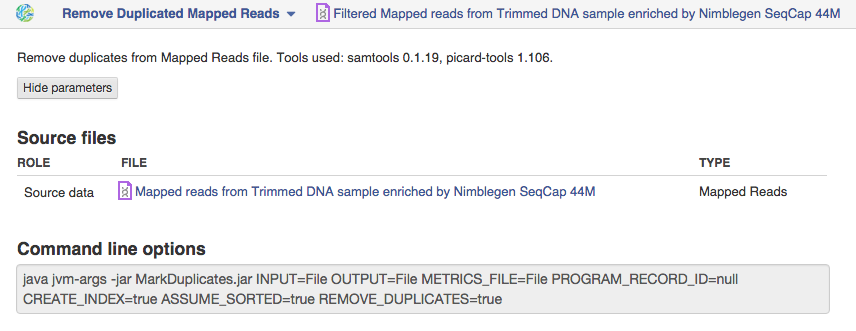
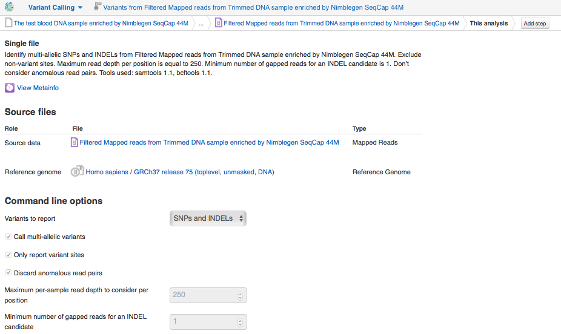
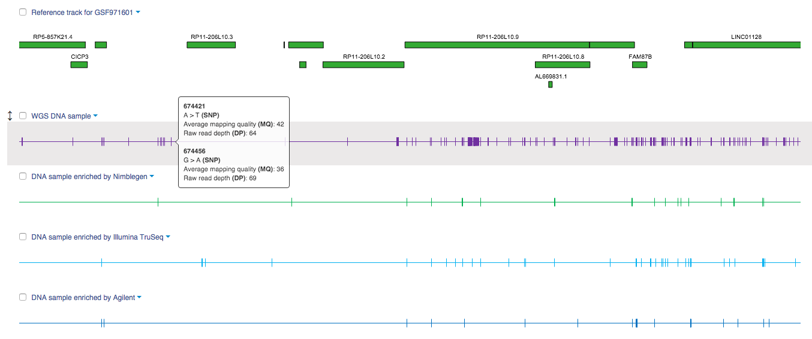

Post-alignment processing
*************************

After mapping reads to the reference genome, it's recommended to remove
duplicates before variant calling, with the purpose of eliminating
PCR-introduced bias due to uneven amplification of DNA fragments. That's
why we run "Remove Duplicated Mapped Reads" app:

|WES_remove_duplicates|

Preprocessed mapped reads are stored
in `Filtered mapped reads for Clark et al (2011)`_ folder.

Variant calling
***************

After duplicate removal, the next step is to identify different
genomic variants including SNVs, indels, MNVs, etc. For this, we'll use
Variant Calling application based on samtools mpileup:

The app automatically scans every position along the genome, computes
all the possible genotypes from the aligned reads, and calculates the
probability that each of these genotypes is truly present in your
sample. Then genotype likelihoods are used to call the SNVs and indels.

|WES_variant_calling|

We run Variant Calling with default
parameters, identifying multi-allelic SNPs and indels, excluding
non-variant sites and not considering anomalous read pairs. Maximum read
depth per position was set as 250 and minimum number of gapped reads for
an indel candidate is 1. Base alignment quality (BAQ) recalculation is
turned on by default. It helps to rule out false positive SNP calls due
to alignment artefacts near small indels. For more information about the
app and its options, click on the app name and then on “About
application”. When files will be complete, you can analyse  `variants
in Genome Browser`_:

|WES_variants_GB|

Genome Browser application allows you investigate
the variants interactively: how many mutations are in this particular
gene or region, review some information about detected variants such
as average mapping quality and raw read depth and compare variants
enrichment between samples. Analysing variants in Genome Browser, you
can notice a large amount of both exome WES–specific and WGS-specific
SNVs. We identified variants for each sample separately and put
them in `Variants for Clark et al (2011)`_ folder.

.. _Filtered mapped reads for Clark et al (2011): https://platform.genestack.org/endpoint/application/run/genestack/filebrowser?a=GSF999208&action=viewFile&page=1
.. _variants in Genome Browser: https://platform.genestack.org/endpoint/application/run/genestack/genomeBrowser?a=GSF999281&action=viewFile
.. _Variants for Clark et al (2011): https://platform.genestack.org/endpoint/application/run/genestack/filebrowser?a=GSF999229&action=viewFile&page=1
.. _