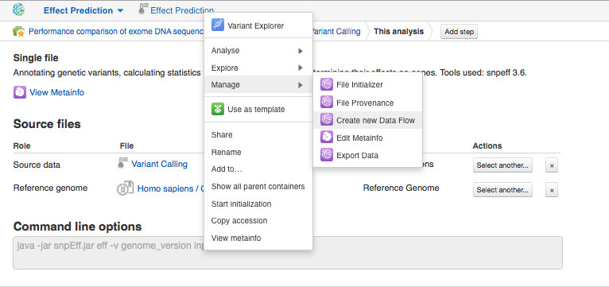

Preprocessing of raw reads
**************************

With the comprehensive raw reads QC reports generated by FastQC app, you're
able to determine whether any preprocessing steps such as trimming, filtering,
or adaptor clipping are necessary prior to alignment. Here is the list of all
preprocess apps that Genestack suggests you to improve the quality of your
raw reads:

.. image:: images/WES_preprocess_apps.png

Our preprocessing procedure will include 'Trim Adaptors and Contaminants'
step. Once the quality of raw data has been checked, let's start planning and
building our `Whole Exome Sequencing Analysis`_ data flow:

.. raw:: html

    <iframe width="640" height="360" src="https://www.youtube.com/embed/5hOGxZWwiWU" frameborder="0" allowfullscreen="1">&nbsp;</iframe>

To build any data flow in Genestack, choose one of the samples and start to
preprocess or analyse it. Each app suggests you to add next analytical step
or use relevant viewers:

Note that you can create as many files as you want and run the computation
process later. Now let's create a data flow from the pipeline we built. For
the last created file choose **Create New Data Flow** in **Manage** section:

This takes us to the Data Flow Editor app page where you can rename, describe
your pipeline and change sources. Let's 'clear files' and click 'Run dataflow'.

Now we're on the **Data Flow Runner** application page. Just choose sources —
experiment assays and human reference genome — and click **Run Data Flow**. Note
that if you choose several raw reads files, the multi-sample variant calling
will be performed. However, in order to compare our results, we need to run
this data flow for each sample separately. After that, the app suggests you
to choose the explore app where you can start initialization now for whole
your analysis or delay it till later:

.. image:: images/WES_start_initialization-copy.png

Let's delay it. After that the app suggests you to choose the app where you
can also start computation:

.. image:: images/WES_view_apps.png

In order to start computation for each data flow step separately, click on
file name and choose **Start initialization**.

All the data are preprocessed and stored in `Trimmed raw reads for Clark et
al (2011)`_ folder.

.. _Whole Exome Sequencing Analysis: https://platform.genestack.org/endpoint/application/run/genestack/dataflowrunner?a=GSF999236&action=createFromSources
.. _Trimmed raw reads for Clark et al (2011): https://platform.genestack.org/endpoint/application/run/genestack/filebrowser?a=GSF971384&action=viewFile&page=1
