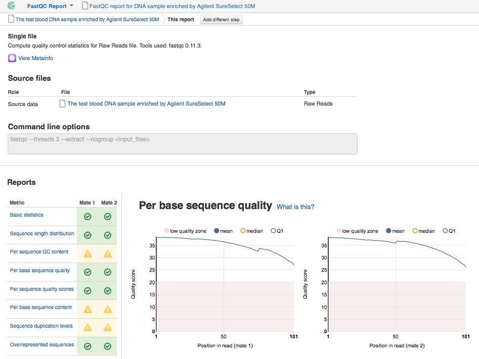
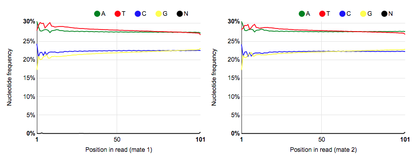
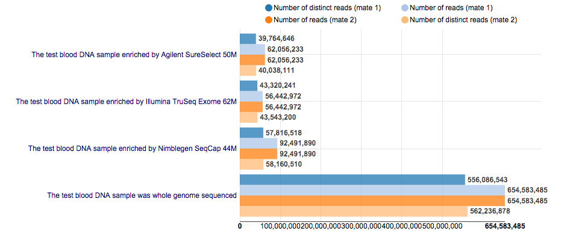

Quality control of raw reads
****************************

Low-quality reads, PCR primers, adaptors, duplicates and other contaminants,
that can be found in raw sequencing data, may compromise downstream analysis.
Therefore, quality control (QC) is essential step in your analysis to
understand some relevant properties of raw data, such as quality scores, GC
content and base distribution, etc. In order to assess the quality of the
data we'll run the `Raw Reads QC`_ data flow:

.. .. raw:: html

..    <iframe width="640" height="360" src="https://www.youtube.com/embed/pBoCPytRf68" frameborder="0" allowfullscreen="1">&nbsp;</iframe>

Genestack **FastQC** application generates basic statistics and many useful data
diagnosis plots. Here is some of them for `sample enriched by Aligned SureSelect 50M`_:

**Basic statistics** tells you about basis data metrics such as reads type,
number of reads, GC content and total sequence length.

**Sequence length distribution** module reports if all sequences have the
same length or not.

**Per sequence GC content** graph shows GC distribution over all sequences. A
roughly normal distribution indicates a normal random library. However, as in
our case, if the data is contaminated or there are some systematic bias,
you'll see an unusually shaped or shifted GC distribution:

.. image:: images/WES_per_sequnce_GC_content.png

**Per base sequence quality** plots show the quality scores across all bases
at each position in the reads. By default you see low quality zone and mean
quality line. If the median is less than 25 or the lower quartile is less
than 10, you'll get warnings.

.. image:: images/WES_per_base_sequence_quality.png

**Per sequence quality scores** report allows you to see frequencies of
quality values in a sample. The reads are of good quality if the peak on the
plot is shifted to the right, to the max quality score. In our case, almost
all of the reads are of good quality (>30):

.. image:: images/WES_per_sequence_quality_scores.png

**Per base sequence content** plots show nucleotide frequencies for each base
position in the reads. In a random library, there could be only a little
difference between A, T, C, G nucleotides, and the lines representing them
should be parallel with each other. The black N line indicates the content of
unknown N bases which shouldn't be presented in the library. In our case, you
can notice the absence of unknown nucleotides and a slight difference in A-T
and G-C frequencies:

**Sequence duplication levels** plots represent the percentage of the library
made up of sequences with different duplication levels. In simple words, 44 %
of reads are unique, 26 % of reads are repeated twice, 13 % - three times, 4 % -
more than 10 times, etc. All these duplicates are grouped to give the overall
duplication level. You can use Filter Duplicated Reads application to remove
duplicates in raw reads data, however we'll get rid of them after mapping step.

.. image:: images/WES_sequence_duplication_levels.png

Application also detects **overrepresented sequences** that may be an
indication of primer or adaptor contamination. We have run QC on all the data
in the experiment and put the reports in `Raw reads QC reports for Clark et al
(2011)`_ folder, so that you can open all of them in `Multiple QC Report
application`_ to analyse results:

You see that total number of exome sequencing reads is 124,112,466 for
Agilent SureSelect, 184,983,780 for Nimblegen SeqCap and 112,885,944 for
Illumina TruSeq platform. The whole genome library yielded more than one
billion total raw reads.

.. _Raw Reads QC: https://platform.genestack.org/endpoint/application/run/genestack/dataflowrunner?a=GSF969011&action=createFromSources
.. _sample enriched by Aligned SureSelect 50M: https://platform.genestack.org/endpoint/application/run/genestack/fastqc-report?a=GSF970289&action=viewFile
.. _Raw reads QC reports for Clark et al (2011): https://platform.genestack.org/endpoint/application/run/genestack/filebrowser?a=GSF970288&action=viewFile
.. _Multiple QC Report application: https://platform.genestack.org/endpoint/application/run/genestack/multiple-qc-plotter?a=GSF999102&action=viewFile
