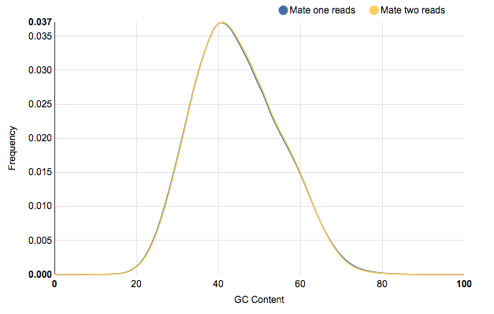
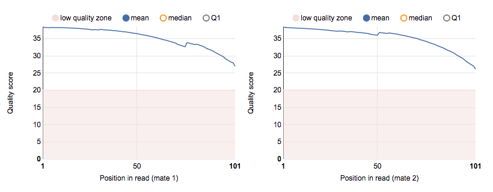
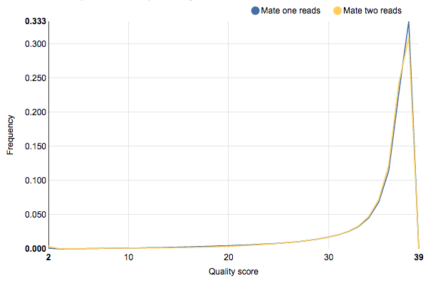
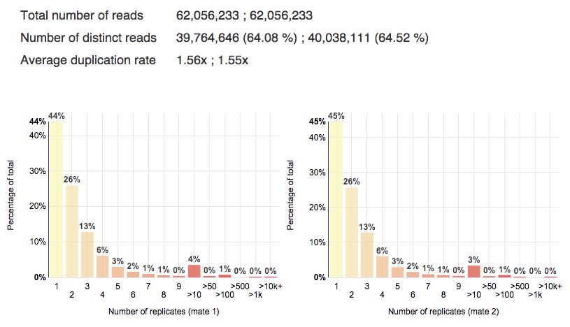
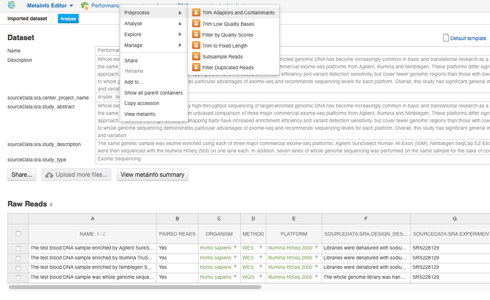
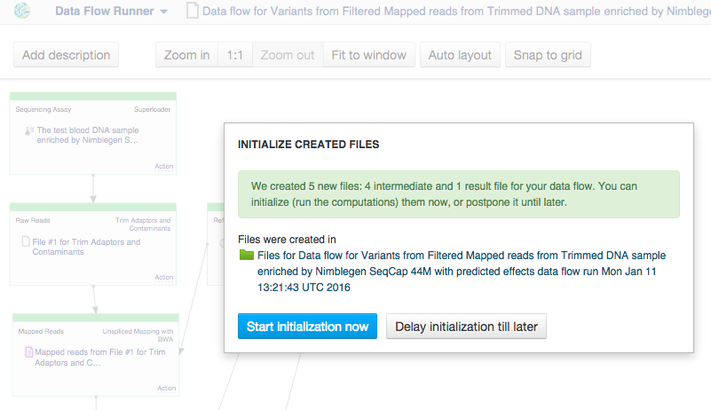
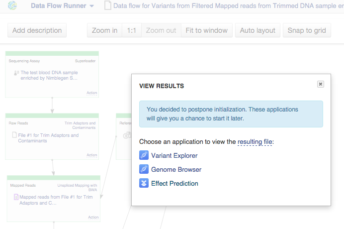

Quality control of raw reads
****************************

Low-quality reads, PCR primers, adaptors, duplicates and other
contaminants, that can be found in raw sequencing data, may compromise
downstream analysis. Therefore, quality control (QC) is essential step
in your analysis to understand some relevant properties of raw data,
such as quality scores, GC content and base distribution, etc. In order
to assess the quality of the data we'll run  `the Raw Reads QC data
flow`_:

Genestack FastQC application generates basic statistics and many useful
data diagnosis plots. Here is some of them for `sample enriched by
Aligned SureSelect 50M`_ :

|WES_FastQC_report|

**Basic statistics** tells you about basis data
metrics such as reads type, number of reads, GC content and total
sequence length. **Sequence length distribution** module reports if all
sequences have the same length or not. **Per sequence GC content** graph
shows GC distribution over all sequences. A roughly normal distribution
indicates a normal random library. However, as in our case, if the data
is contaminated or there are some systematic bias, you'll see an
unusually shaped or shifted GC distribution:

|WES_per_sequnce_GC_content|

**Per base sequence quality** plots
show the quality scores across all bases at each position in the reads.
By default you see low quality zone and mean quality line. If the median
is less than 25 or the lower quartile is less than 10, you'll get
warnings.

|WES_per_base_sequence_quality|

**Per sequence quality
scores** report allows you to see frequencies of quality values in a
sample. The reads are of good quality if the peak on the plot is shifted
to the right, to the max quality score. In our case, almost all of the
reads are of good quality (>30):

|WES_per_sequence_quality_scores|

**Per base sequence content** plots show nucleotide frequencies for each
base position in the reads. In a random library, there could be only a
little difference between A, T, C, G nucleotides, and the lines
representing them should be parallel with each other. The black N line
indicates the content of unknown N bases which shouldn't be presented in
the library. In our case, you can notice the absence of
unknown nucleotides and a slight difference in A-T and G-C frequencies:

|WES_per_base_sequence_content|

**Sequence duplication levels**
plots represent the percentage of the library made up of sequences with
different duplication levels. In simple words, 44% of reads are unique,
26% of reads are repeated twice, 13% - three times, 4% - more than 10
times, etc. All these duplicates are grouped to give the overall
duplication level. You can use “Filter Duplicated Reads” application to
remove duplicates in raw reads data, however we'll get rid of them after
mapping step.

|WES_sequence_duplication_levels|

Application also
detects **overrepresented sequences** that may be an indication of
primer or adaptor contamination. We have run QC on all the data in the
experiment and put the reports in `Raw reads QC reports for Clark et al
(2011)`_ folder, so that you can open all of them in `Multiple QC Report application`_ to analyse results:

|WES_Multiple_Raw|

You see that total number of
exome sequencing reads is 124,112,466 for Agilent SureSelect,
184,983,780 for Nimblegen SeqCap and 112,885,944 for Illumina TruSeq
platform. The whole genome library yielded more than one billion total
raw reads.

Preprocessing of raw reads
**************************

With the comprehensive raw reads QC reports generated by FastQC app,
you're able to determine whether any preprocessing steps such as
trimming, filtering, or adaptor clipping are necessary prior to
alignment. Here is the list of all preprocess apps that Genestack
suggests you to improve the quality of your raw reads:

|WES_preprocess_apps|

Our preprocessing procedure will include "Trim
Adaptors and Contaminants" step. Once the quality of raw data has
been checked, let's start planning and building
our `Whole Exome Sequencing Analysis`_
data flow:

To build any data flow in Genestack, choose one of the samples and start
to preprocess or analyse it. Each app suggests you to add next
analytical step or use relevant viewers:

|WES_data_flow_|

Note that
you can create as many files as you want and run the computation process
later. Now let's create a data flow from the pipeline we built. For the
last created file choose "Create new Data Flow" in Manage section:

|WES_create_df|

This takes us to the "Data Flow Editor" app page where
you can rename, describe your pipeline and change sources. Let's 'clear
files' and click "Run dataflow".

|WES_run_dataflow|

Now we're on
the "Data Flow Runner" application page. Just choose sources -
experiment assays and human reference genome - and click "Run Data
Flow". Note that if you choose several raw reads files, the multi-sample
variant calling will be performed. However, in order to compare our
results, we need to run this data flow for each sample separately. After
that, the app suggests you to choose the explore app where you can start
initialization now for whole your analysis or delay it till later:

|WES_start_initialization copy|

Let's delay it. After that the app
suggests you to choose the app where you can also start computation:

|WES_view_apps|

In order to start computation for each data flow step
separately, click on file name and choose 'start initialization'.
Let's run "Trim Adaptors and Contaminants" step:

|WES_start_preprocess|

All the data are preprocessed and
stored in `Trimmed raw reads for Clark et al (2011)`_  folder.

.. |WES_FastQC_report| image:: images/WES_FastQC_report1.png

.. |WES_per_base_sequence_content| image:: images/WES_per_base_sequence_content.png

.. |WES_Multiple_Raw| image:: images/WES_Multiple_Raw.png

.. |WES_data_flow_| image:: images/WES_data_flow_.png
.. |WES_create_df| image:: images/WES_create_df.png
.. |WES_run_dataflow| image:: images/WES_run_dataflow.png

.. |WES_start_preprocess| image:: images/WES_start_preprocess.png
.. _the Raw Reads QC data flow: https://platform.genestack.org/endpoint/application/run/genestack/dataflowrunner?a=GSF969011&action=createFromSources
.. _sample enriched by Aligned SureSelect 50M: https://platform.genestack.org/endpoint/application/run/genestack/fastqc-report?a=GSF970289&action=viewFile
.. _Raw reads QC reports for Clark et al 2011): https://platform.genestack.org/endpoint/application/run/genestack/filebrowser?a=GSF970288&action=viewFile
.. _Multiple QC Report application: https://platform.genestack.org/endpoint/application/run/genestack/multiple-qc-plotter?a=GSF999102&action=viewFile
.. _Whole Exome Sequencing Analysis: https://platform.genestack.org/endpoint/application/run/genestack/dataflowrunner?a=GSF999236&action=createFromSources
.. _Trimmed raw reads for Clark et al (2011): https://platform.genestack.org/endpoint/application/run/genestack/filebrowser?a=GSF971384&action=viewFile&page=1