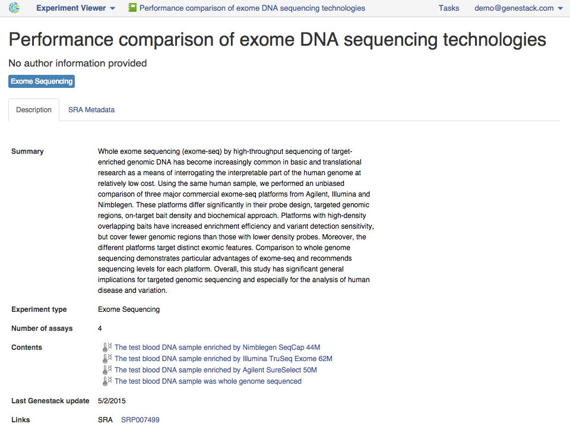

As one of the widely used targeted sequencing method, whole exome
sequencing (WES) has become more and more popular in clinical and basic
research. Albeit, the exome (protein-coding regions of the genome) makes
up ~1% of the genome, it contains about 85% of known disease-related variants
(*van Dijk E.L. et al, 2014*), making whole-exome sequencing a fast and
cost-effective alternative to whole genome sequencing (WGS).

.. youtube:: https://www.youtube.com/watch?v=Yf5YsWMy3TA

In this tutorial we'll provide a comprehensive description of the various
steps required for WES analysis, explain how to build your own data flow, and
finally, discuss the results obtained in such analysis.

Setting up an exome sequencing experiment
*****************************************

First off, let's choose exome sequencing data. You can `upload your own data`_
using 'Import' button or search through all `public experiments`__ we have on
the platform. Our analysis will be based on data coming from `Clark et al.
2011`_. Let's find this experiment in the platform and open it in `Experiment
Viewer`_:

.. __: https://platform.genestack.org/endpoint/application/run/genestack/filebrowser?a=GSF070886&action=viewFile

|WES_experiment_viewer copy|

The authors compared the performance of three major commercial exome
sequencing platforms: Agilent’s SureSelect Human All Exon 50Mb,
Roche/Nimblegen’s SeqCap EZ Exome Library v2.0 and Illumina’s TruSeq Exome
Enrichment; all applied to the same human blood sample. They found that, the
Nimblegen platform provides increased enrichment efficiency for detecting
variants but covers fewer genomic regions than the other platforms. However,
Agilent and Illumina are able to detect a greater total number of variants
than Nimblegen platform. Exome sequencing and whole genome sequencing were
also compared, demonstrating that WES allows for the detection of additional
variants missed by WGS. And vice versa, there is a number of WGS-specific
variants not identified by exome sequencing. This study serves to assist the
community in selecting the optimal exome-seq platform for their experiments,
as well as proving that whole genome experiments benefit from being
supplemented with WES experiments.

Whole Exome Sequencing data analysis pipeline
*********************************************

A typical data flow of WES analysis consists of the following steps:

#. Quality control of raw reads
#. Preprocessing of raw reads
#. Mapping reads onto a reference genome
#. Targeted sequencing quality control
#. Quality control of mapped reads
#. Post-alignment processing
#. Variant calling
#. Effect annotation of the found variants
#. Variant prioritisation in Variant Explorer

Let’s look at each step separately to get a better idea of what it
really means.

.. _upload your own data: https://platform.genestack.org/endpoint/application/run/genestack/uploader
.. _Clark et al. 2011: http://trace.ncbi.nlm.nih.gov/Traces/sra/?study=SRP00
.. _Experiment Viewer: https://platform.genestack.org/endpoint/application/run/genestack/experiment-viewer?a=GSF341288&action=viewFile
