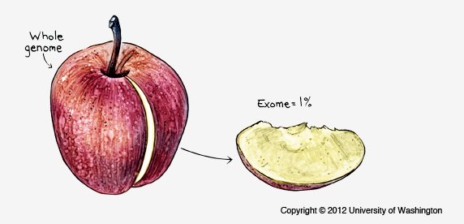

WGS analysis on Genestack
*************************

|Screenshot 2016-01-09 16.03.58|

Understanding genetic variations, such
as single nucleotide polymorphisms (SNPs), small insertion-deletions
(InDels), multi-nucleotide polymorphism (MNPs), and copy number variants
(CNVs) helps to reveal the relationships between genotype and phenotype.
Currently, high-throughput whole-genome sequencing (WGS) and
whole-exome sequencing (WES) are widely used approaches to investigate
the impact of DNA sequence variations on human diversity, identify
genetic variants associated with human complex or Mendelian diseases and
reveal the variations across diverse human populations. There are
significant advantages and limitations of both of these techniques, but
balancing cost- and time-effectiveness against the desired results helps
choosing the optimal sequencing approach. WES may cost less than WGS
because it covers only protein-coding regions and generates less raw
data, but WGS provides more comprehensive picture of the genome
considering both non-coding and coding genomic regions. It also allows
to identify SV and CNV that may be missed by WES. Moreover, WGS allows
to obtain more uniform and reliable coverage. All in all, WGS is a more
universal method than WES.

This tutorial will guide you through the genetic variants discovery
workflow on Genestack. We will analyse a dataset by Dogan *et
al.* including high coverage (x35) WGS data from a Turkish
individual. The experiment can be found in `Public Experiments`_ —
regularly updated collection of freely accessible experiments imported
from SRA, ENA, GEO, ArrayExpress. Genestack enables you to work on
public and private data seamlessly. Import your own sequencing data,
mapped reads or genetic variants data with our `data importer`_ .

The genetic variants analysis pipeline includes the following steps:

#. Quality control of raw reads
#. Preprocessing of the raw reads
#. Unspliced mapping of the preprocessed reads onto a reference genome
#. Post-alignment processing
#. Quality control of the mapped reads
#. Variant calling
#. Variant annotation
#. Variant filtering and prioritisation

Raw sequencing assays from the Dogan *et al.* experiment, all processed
data and reports are located in the `WGS Data Analysis on Genestack
Platform`_.

.. _Public Experiments: https://platform.genestack.org/endpoint/application/run/genestack/filebrowser?a=GSF070886&action=viewFile&page=1
.. _data importer: https://platform.genestack.org/endpoint/application/run/genestack/uploader
.. _WGS Data Analysis on Genestack Platform: https://platform.genestack.org/endpoint/application/run/genestack/filebrowser?a=GSF970302&action=viewFile&page=1
.. _Quality control of raw reads: https://genestack.com/tutorial/wgs-qc-raw-reads/
.. _Preprocessing of the raw reads: https://genestack.com/tutorial/wgs-reads-processing-mapping-qc/
.. _Unspliced mapping of the preprocessed reads onto a reference genome: https://genestack.com/tutorial/wgs-reads-processing-mapping-qc/
.. _Post-alignment processing: https://genestack.com/tutorial/wgs-reads-processing-mapping-qc/
.. _Quality control of the mapped reads: https://genestack.com/tutorial/wgs-reads-processing-mapping-qc/
.. _Variant calling: https://genestack.com/tutorial/wgs-exploring-variants/
.. _Variant annotation: https://genestack.com/tutorial/wgs-exploring-variants/
.. _Variant filtering and prioritisation: https://genestack.com/tutorial/wgs-exploring-variants/