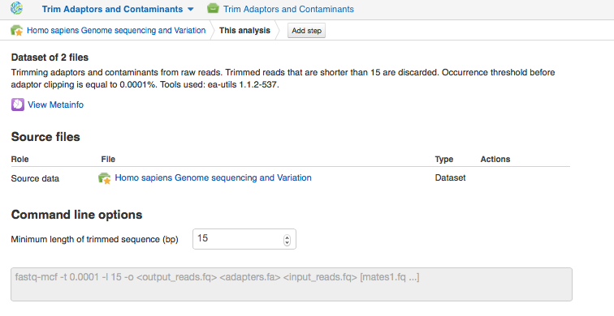
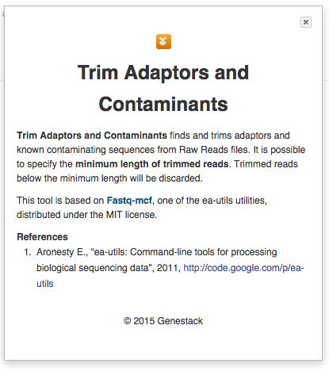
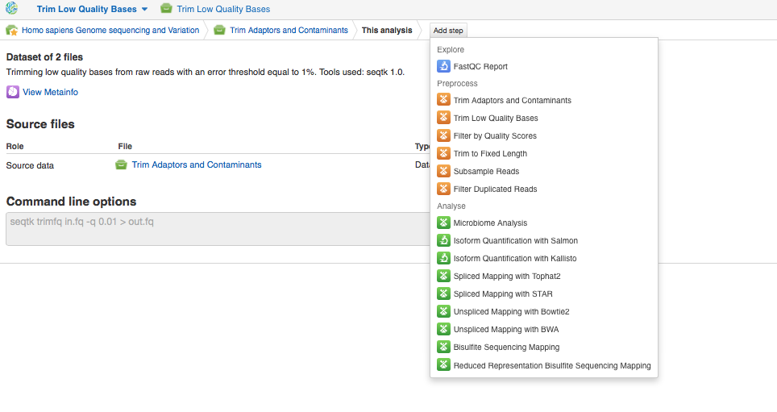
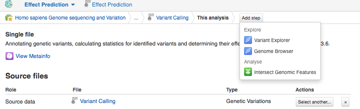
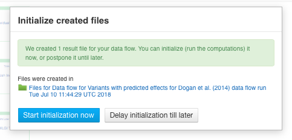
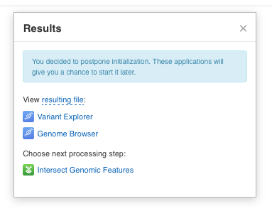

Building the genetic variants analysis pipeline
***********************************************

.. raw:: html

    <iframe width="640" height="360" src="https://www.youtube.com/embed/N0AVWFwfASg" frameborder="0" allowfullscreen="1">&nbsp;</iframe>

To start the pipeline, open the "Homo sapiens
Genome sequencing and variation" dataset in the Metainfo Editor, click **Analyse**, and
select the first preprocessing app — **Trim Adaptors and Contaminants**.

.. image:: images/trim-adaptors-and-contaminants.png

On the Trim Adaptors and Contaminants app page you can explore the list of
created and source files, edit parameters and continue building the pipeline.

You can also choose
the app to explore results, for example discover how this step affects
the initial quality of raw reads with FastQC Report app.
If you want to learn more about the application, click on its name
and go to  **About application**.

You can use the created trimmed files as inputs for other applications. Let's
click on **Add step** button and select the next preprocessing app — **Trim
Low Quality Bases**. This will take you to the Trim Low Quality
Bases app page. Proceed in the same way and add all the desired steps to
the pipeline until you reach the final one — Effect Prediction.

Don't forget to **set the parameters** for each app in the pipeline and select
appropriate reference genome, in this case *H. sapiens* reference
genome (GRCh37.75), that will be used by Unspliced Mapping with BWA,
Variant Calling and Effect Prediction apps. You can return to any
added app by clicking on the name of app we are interested in. The very final output file containing genetic variants and their possible
effects on annotated genes can be opened with **Variant Explorer** and
**Genome Browser** apps. 

To be able to re-use manually built pipeline you
could create a data flow. Click on the resulting file name on the final
Effect Prediction app page and go to **Manage** and **Create new Data Flow**.

.. image:: images/create-new-data-flow.png

The created data flow will be opened in the Data Flow Editor, where the pipeline for genetic variants
investigation using WGS is graphically represented. Click on the **Run data flow** button
to create all files for the pipeline.

.. image:: images/Screenshot-2016-01-11-12.34.09.png

This will take you to the Data Flow Runner page. To run the pipeline click on the **Run Data Flow**
button at the bottom of the data flow.

.. image:: images/Screenshot-2016-01-11-12.55.56-e1452507717712.png

After that you will be suggested to either start the computation now or delay it till later:

We will postpone the analysis and focus on each step of the WGS data
analysis pipeline. Later we can start initialization directly from one
of the suggested apps, such as Variant Explorer, Genome Browser or
Effect Prediction.

You can verify
processing parameters on each individual app pages before running the
pipeline. To do this, click on **Edit file list** and open the file using
the app that created this file:

.. image:: images/Edit-File-List-BWA.png

Data Flow Runner allows you to start initialization up to any step of the pipeline. We
recommend  you check the mapping quality after removing the duplicates
from mapped reads to assure that they could be further used in variant
calling and effect prediction. In order to do this,  click on **2 files**
in Remove Duplicated Mapped Reads section and start initialization with
right-click context menu. Follow the process in the Task Manager.
Regardless of the status of the analysis all the created data flow files
will be located in the corresponding folder in the **Created files** folder.

.. image:: images/Start-initial.png

Note that there is a data flow file including
all the mentioned preprocess and analysis steps previously prepared by
Genestack team. This data flow is called `WGS data analysis for Dogan et al. (2014)`_ and you
can find in our tutorial folder. Now let's talk about each of the
analysis steps we included in the pipeline in greater detail.

.. _WGS data analysis for Dogan et al. (2014): https://platform.genestack.org/endpoint/application/run/genestack/datafloweditor?a=GSF1980101&action=viewFile
