WGS building pipeline
*********************

To start the pipeline,  select the sequencing assays from "Homo sapiens
Genome sequencing and variation" experiment, right click on them and
select the first preprocessing app — Trim Adaptors and Contaminants.

|Trim adaptors and contaminants|

On the Trim Adaptors and Contaminants
app page you can explore the list of created and source files,
edit parameters and continue building the pipeline. You can also choose
the app to explore results, for example discover how this step affects
the initial quality of raw reads with FastQC Report app.

|Trim A & C (2)|

If you want to learn more about the application, click on its name
and go to  "About application".

|Screenshot 2016-01-10 22.33.45|

You can
use the created trimmed files as inputs for other applications. Let's
click on "Add step" button and select the next preprocessing app — Trim
Low Quality Bases.

|Add step|

 This will take you to the Trim Low Quality
Bases app page. Proceed in the same way and add all the desired steps to
the pipeline until you reach the final one — Effect Prediction. Don't
forget to set the parameters for each app in the pipeline and select
appropriate reference genome, in this case  *H. sapiens* reference
genome (GRCh37.75), that will be used by Unspliced Mapping with BWA,
Variant Calling and Effect Prediction apps. You can return to any
added app by clicking on its name in File Dataflow.

|Data Flow on the CLA page|

Keep in mind that after each analysis step, you can explore
the results using the apps suggested in "Explore results" section. The
very final output file containing genetic variants and their possible
effects on annotated genes can be opened with Variant Explorer and
Genome Browser apps. To be able to re-use manually built pipeline you
could create a data flow. Click on the resulting file name on the final
Effect Prediction app page and go to "Manage" and "Create new Data
Flow".

|Create new data flow|

 The created data flow will be opened in the Data Flow Editor.

|Screenshot 2016-01-11 12.34.09|

Click on the "Run dataflow " button to run the pipeline. This will take you to the
Data Flow Runner page where the pipeline for genetic variants
investigation using WGS is graphically represented. Click on "Action"
in the Variant Calling step to change the data flow and, for example
merge parents:

|Screenshot 2016-01-11 12.49.07|

Merge parents option allows to focus on the main steps of the pipeline by merging of files
from each step into one group:

|Screenshot 2016-01-11 12.55.56|

To run
the pipeline click on the "Run Data Flow" button at the bottom of the
data flow. After that you will be suggested to either start the
computation now or delay it till later:

|Screenshot 2015-12-23 18.32.32|

We will postpone the analysis and focus on each step of the WGS data
analysis pipeline. Later we can start initialization directly from one
of the suggested apps, such as Variant Explorer, Genome Browser or
Effect Prediction.

|Screenshot 2015-12-24 15.28.14|

 You can verify
processing parameters on each individual app pages before running the
pipeline. To do this, click on "Edit file list" and open the file using
the app that created this file:

|Edit File List BWA|

Data Flow Runner allows you to start initialization up to any step of the pipeline. We
recommend  you check the mapping quality after removing the duplicates
from mapped reads to assure that they could be further used in variant
calling and effect prediction. In order to do this,  click on "2 files"
in Remove Duplicated Mapped Reads section and start initialization with
right-click context menu. Follow the process in the Task Manager.
Regardless of the status of the analysis all the created data flow files
will be located in the corresponding folder in the "Created Files"
folder.

|Start initial|

Note that there is a data flow file including
all the mentioned preprocess and analysis steps previously prepared by
Genestack team. This data flow is called `WGS data analysis`_ and you can find in our tutorial folder. Now let's talk about each of the
analysis steps we included in the pipeline in greater detail.

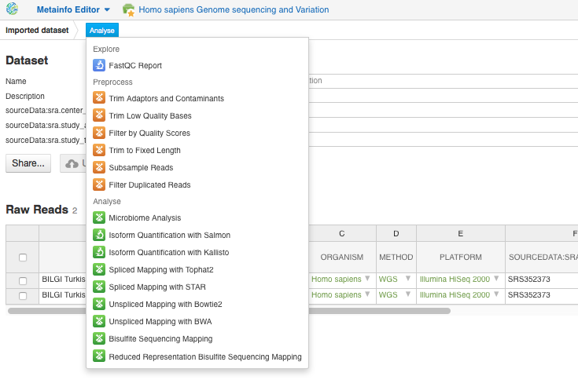
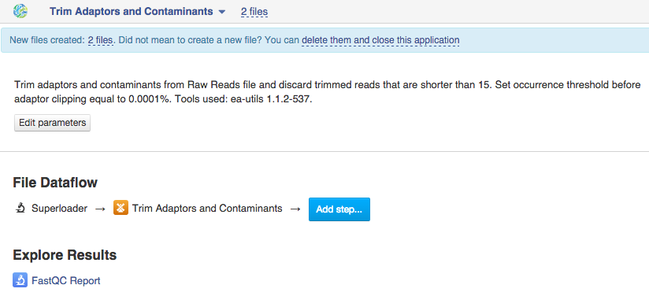
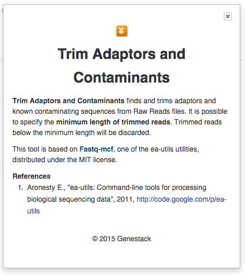
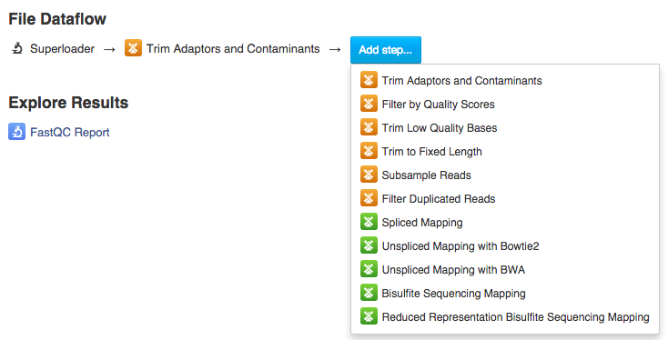
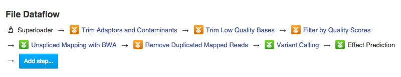
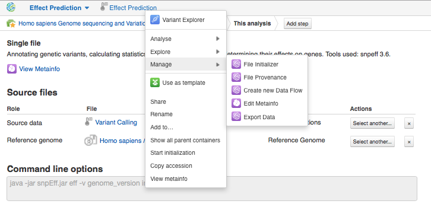
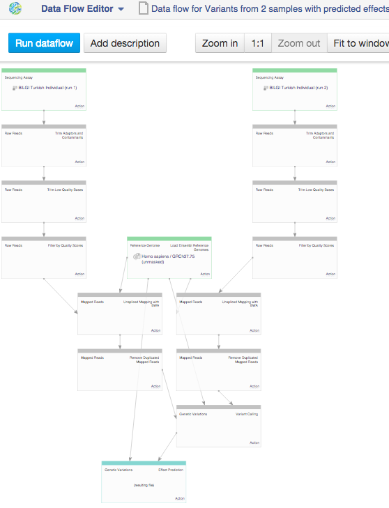
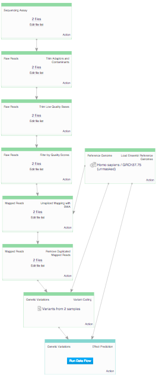

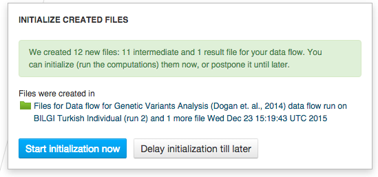
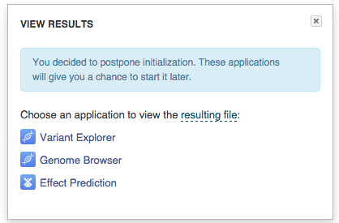
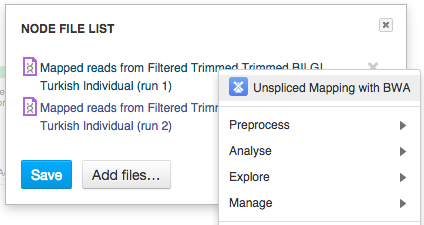
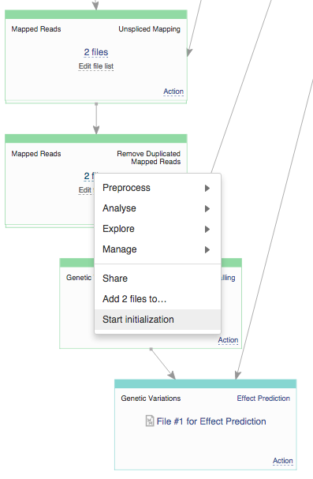
.. _WGS data analysis: https://platform.genestack.org/endpoint/application/run/genestack/datafloweditor?a=GSF1018398&action=viewFile
