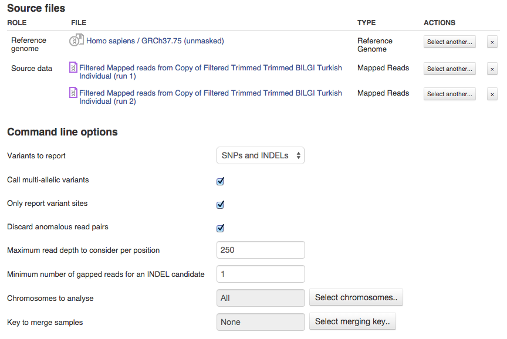

Variant calling
***************

Experimental biases could lead to errors in variant calling mimicking
true genetic variants. Variant calling on multiple samples helps
increase the accuracy of the analysis by taking the reads from
several samples into consideration and reducing the probability of
calling sequencing errors.   We run Variant Calling app on
analysis-ready mapped reads for both technical replicates with default
parameters that always could be changed on the Variant Calling app page.
  In the picture below you can see source files (reference genome and
both filtered mapped reads files) and default command line options.
|VarCalling_options| Track the progress of your tasks in Task Manager
and as soon as the computation is finished, explore the results of
variant identification using the interactive applications such
as Variant Explorer or Genome Browser. Let's click on the genetic
variants file name in Task Manager and open it in Genome Browser using
the context menu.   In case some files are not initialized yet, Genome
Browser page is empty. You can initialize the files by clicking on "Go!"
to start the process. Tracks representing found mutations will appear on
the page as the task is finished.   Here we will show you the `results
of variant
calling <https://platform.genestack.org/endpoint/application/run/genestack/genomeBrowser?a=GSF1976635&action=viewFile>`__
performed for our tutorial. On the Genome Browser page you will see the
reference track displaying annotated genes with their coordinates and
variation track representing  genetic variants, their genomic position,
average mapping quality and raw read depth. |GB_variants| Zoom in to
explore genetic variants in single-base resolution. For example, looking
at the region 1:725878-725972 (95 bp) we can see several SNPs (red) and
one deletion 5bp long (blue). |Screenshot 2016-01-14 13.50.17|

Effect prediction
*****************

After variants have been identified, we could annotate them and identify
the effects they produce on known genes. Let's return to the Data Flow
Runner page with "WGS Data Analysis" data flow.    Effect Prediction app
is based on SnpEff  tool that annotates variants based on their genomic
location: intronic, untranslated regions (5′ UTR or 3′UTR), upstream,
downstream, splice site, or intergenic regions. It also determines
effects genetic variants have on genes, such as amino acid replacement
or frame shifts. The app page will give you more information about it.
Remember, if you have some files uninitialized, you can run the
analysis on the Effect Prediction page or Data Flow Runner page.

|start init|

Explore annotated variants in Genome Browser and Variant Explorer
apps. Let's open generated ` report
file <https://platform.genestack.org/endpoint/application/run/genestack/report-viewer?a=GSF973651&action=viewFile>`__ containing
some information about identified variants from our tutorial
folder. Right click on the genetic variants file name and go to "View
Report".

|Screenshot 2015-11-23 11.14.46|

First of all, the report
summary contains some basic information about the analysed file.
|Summary| In general 4,389,254 mutations were found in our assay with
one change every 7,014 bases. The most common variants are SNPs that
make up 3,835,537 from the total. The second most abundant genetic
variation type after SNPs are Indels. Insertions and deletions were
found in 252,548 and 301,169 change cases, respectively. According to
the paper, the authors identified 3,642,449 and 4,301,769 SNPs using
Casava and GATK workflows, respectively. However in the downstream
analysis they used 3,537,794 variants identified by both methods.
|Screenshot 2016-03-14 12.24.19| *Insertion deletion length
histogram * graphically demonstrates the distribution of length of all
insertions and deletions. The discovered Indels ranged from -43 to 28 bp
in length with the standard deviation of 5.256. Authors detected 713,640
InDels (341,382 insertions and 372,258 deletions) ranging from −52 bp to
34 bp in length.  

|Indel length dostributions|

Additionally, we
performed filtering by effect to find out InDel distribution throughout
different genomic locations.  From identified InDels 258680 and 263835
were in an intergenic and intronic region, respectively. We also found
69426 InDels in the upstream and 74162 InDels in the downstream gene
regions. Only 69 and 78 mutations were detected in the splice site donor
and in splice site acceptor, respectively. Finally, we detected 6241
insertions and deletions in exons.   Besides the statistics on the
change type of the found mutations, report also contains quality and
coverage information.   *Quality histogram* shows quality distribution
with minimum value of 3 and maximum value of 486 for the analysed data:
|Quality|

  The following histogram shows *coverage.* For our data the mean
coverage is 28.882 while the maximum coverage is 8,026. |coverage| For
all the identified genetic variants the app also calculates associated
effects and prioritises them by putative biological impact. |Effects by
impact| For example, if a found mutation leads to a protein truncation,
then it could have a high and disruptive effect on the gene function.
However, variants that influence only the protein effectiveness will
most likely have only a moderate effect, and synonymous variants that
will unlikely change the protein behaviour will probably have low
effect. Variants affecting non-coding genes are considered as modifiers.
It is important to remember that grouping doesn't guarantee that it is
the high-impact effect variants that are responsible for the analysed
phenotype.   Genetic variants could have various effects on the genome
for instance they could result in codon changes, insertions or
deletions, frame shift mutations etc. Genetic variants can affect
different genomic regions such as exons, intergenic regions, introns,
untranslated regions, splice sites, upstream and downstream regions. As
we can see from the report most changes in the Turkish individual genome
are located in intronic regions  (63,351% of the total). |Effects by
type and region (table)| As we can see the vast majority of identified
variations are associated with introns (climbed above 60%) and there is
no mutations in splice sites. The changes in intergenic regions
represent ~17% of the total, while changes in exons occur in
approximately 2% of events. |Effects by region| The most frequent base
changes is G to A with 651,754, followed by C to T (650,016), T to C
(621,506) and A to G (620,959) base changes. |Base changes| The quality
of SNP data could be characterised with transition/transvertion (Ts/Tv)
ratio that for whole human genome is typically about 2. Note that this
ratio is not universal and could vary with regions, for example it is
higher for exons. |Ts:Tv| Our results are in line with the original
paper by Dogan et. al where they have identified 2,383,204 transitions,
1,154,590 transversions resulting in Ts/Tv ratio of 2.06   Next entry of
the report is the codon replacements table (we have posted a fragment of
it below). Rows represent reference codons and columns represent changed
codons. The most common codon change for our data is from GAC to GAT
(876 events) resulting in a synonymous change. |Codon changes| The
report also contains the amino acid changes table where reference amino
acids are represented by rows and changed amino acids are represented by
columns. For example, row 'A' and column 'E' show how many Ala have been
replaced by Glu. The most common amino acid changes are Ala to Thr, 722
times, followed by 693 changes from Ile to Val events, and 780 Val to
Ile events. |AA chages| Apart from the mentioned statistics and plots,
 report also contains allele frequency plots and information on the
change rate per chromosome.

Genetic Variants Filtering
~~~~~~~~~~~~~~~~~~~~~~~~~~

Resulting genetic variants files, annotated or not, can be opened in the
`Variant
Explorer <https://platform.genestack.org/endpoint/application/run/genestack/vcfviewer?a=GSF1976637&action=viewFile>`__
app. In the Variant Explorer you can interactively explore the
information about found mutations, as well as sort and filter them by
specific factors such as: locus, type of variants (SNP, INS, DEL, MNP),
reference or alternative allele, Phred-scaled probability that the
alternative allele is called incorrectly, and for annotated variants by
their predicted effect, impact and functional class.   Besides that, the
app computes genotype frequencies for homozygous samples with reference
and alternative alleles (GF HOM REF and GF HOM ALT columns,
respectively), reads depth for homozygous samples with alternative
allele (DP HOM ALT) and reads depth for heterozygous samples (DP HET).  
To prioritise found mutations open an annotated genetic variants file in
the Variant Explorer: right-click on the resulting file name in the Data
Flow Runner, Task Manager or File Browser and select Variant Explorer in
the context menu. In total 4,361,389 variants were found. |Table
Viewer| Let’s now use the filters to see how many of these are high
impact variants. Set the filter "Impact" to "high". As we can see out of
all the identified variants 1007 have a high impact. |Screenshot
2016-04-24 14.05.22| Let’s now see how many of these are nonsense
mutations by applying "Functional class" filter. And now out of all the
high impact variants, 154 are nonsense mutations. |Screenshot 2016-04-24
14.10.20| Let’s see how many of those are found on chromosome 10 by
specifying the chromosome in the "Locus".   Turns out on chromosome 10
there only one variant change that is high impact nonsense mutation.
This base change is located in CTBP2 gene, and result in a premature
stop codon. |Screenshot 2016-03-14 18.25.42| These are all of the steps
of WGS data analysis pipeline. You can use files from our tutorial
folder to reproduce the results. Feel free to perform further
prioritisation, play with filters in Variant Explorer to get more
information. For example, you may want to find out, how many InDels
results in frame-shift, codon deletion or explore variant distribution
on any region of interest etc.   In summary, our analysis allowed to
identify 3,835,537 SNPs. We also identified 252,548 insertions and
301,169 deletions ranging from -43 to 28 bp. Although our results are in
concordance with original paper, there are also some differences in
number of identified mutations or InDel length distribution we mentioned
above. Such variation could be explained by the use of different tools.
For example, authors identified variants with the vendor-supplied
Eland-Casava pipeline and The Genome Analysis Toolkit (GATK v2.2), while
we used Variant Calling tool based on SAMtools and BCFtools.   Need to
perform analysis of
`WGBS <https://genestack.com/tutorial/whole-genome-bisulfite-sequencing-analysis/>`__,
`WES <https://genestack.com/tutorial/whole-exome-sequencing-data-analysis-on-genestack-platform/>`__ or
`RNA-Seq
data <https://genestack.com/tutorial/testing-differential-gene-expression-on-genestack-platform/>`__?
Visit our website to check out more
`tutorials <https://genestack.com/tutorials/>`__!   If you have any
questions or suggestions, please leave them below or `email
us <mailto:contact@genestack.com>`__.  

.. |Table Viewer| image:: images/Table-Viewer.png
.. |Screenshot 2016-04-24 14.05.22| image:: images/Screenshot-2016-04-24-14.05.22.png

