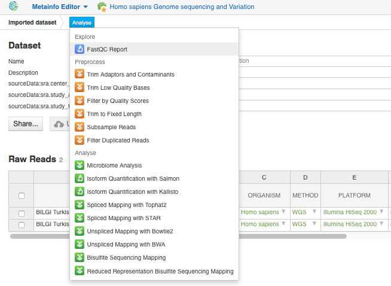
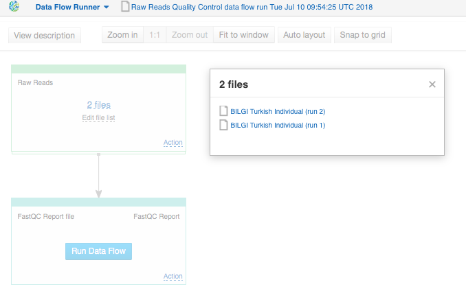
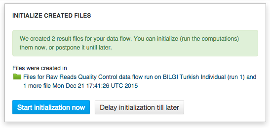
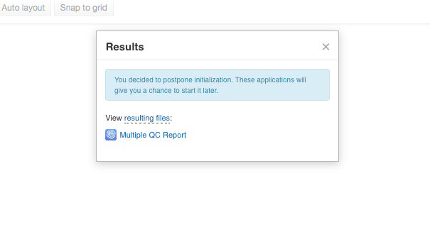
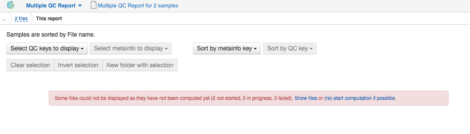
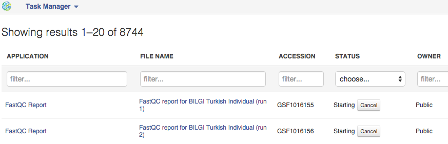
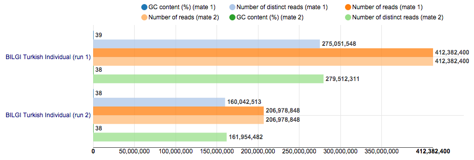
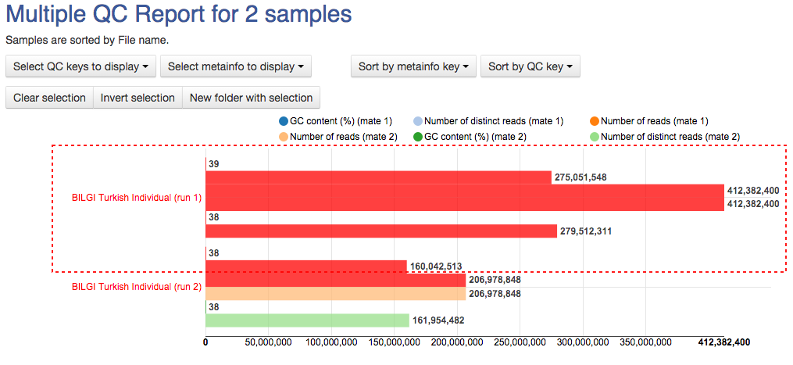
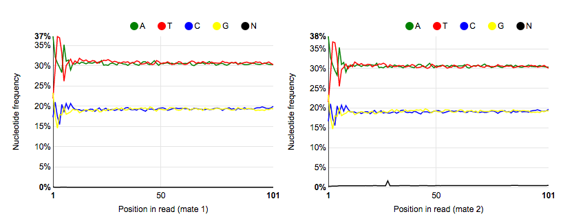
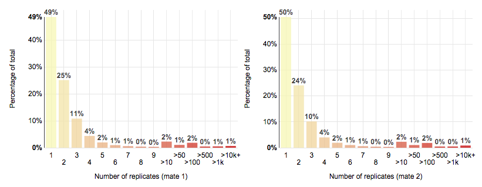

Quality control of raw sequencing reads
***************************************

.. raw:: html

    <iframe width="640" height="360" src="https://www.youtube.com/embed/YarLnqSE1DE" frameborder="0" allowfullscreen="1">&nbsp;</iframe>

Poorly identified bases, low-quality sequences and contaminants (such as
adaptors) in the raw sequencing data can affect downstream analysis
leading to erroneous results and conclusions. Before starting the WGS
analysis, we will check the initial data quality and decide how to
improve the downstream analysis by a variety of preprocessing options.
FastQC Report app is based on FastQC tool and produces
several statistics characterising the raw data quality: Phred score
distribution per base and per sequence, GC content distribution, per
base sequence content, read length distribution, and sequence
duplication level. We will compute quality control statistics with
FastQC Report app for both assays from the dataset. In order to do so, open the dataset in
the Metainfo Editor, click on the **Analyse** button and select from the list of
suggested options the "FastQC Report" app.

Besides, feel free to run the "Raw
Reads Quality Control" public data flow which you can find on the Dashboard.
The app page presents the quality control part of the pipeline in a graphical form.
To generate QC-reports click on the **Run Data Flow** button and, then, on
**Start initialization now**.

If you don't want to generate QC-reports now, click **Delay initialization
till later** button.

In this case you can start initialization, for example, from
**Multiple QC Report** apps allowing to explore obtained results for both samples at the same time.

The calculations can
be started directly from the Multiple QC Report app page by clicking
"(re)-start computation if possible".

Follow the progress of your tasks in Task Manager.

When the computations are finished, QC reports for both sequencing runs will appear on the
Multiple QC app page. Explore reports for each individual assay in
FastQC Report app by clicking on the app or file name in the **Task Manager**. 
Alternatively, go to **Created files** folder and look
for a folder containing the files created for "Raw Reads Quality
Control" data flow.   To describe raw reads quality control statistics
we will use the reports from our tutorial folder previously prepared by
our team.   To start with, we will open both of them in  `Multiple QC Report`_ app
that interactively represents QC statistics for several raw assays at
once.

.. _Multiple QC Report: https://platform.genestack.org/endpoint/application/run/genestack/multiple-qc-plotter?a=GSF1001533&action=viewFile

You can select samples of
interest, for example ones that are suitable for further analysis, and
put them in the separate folder by click on the **New folder with
selection** button.

For paired reads
the quality control report contains statistics such as total nucleotide
count, GC content, number of reads, and number of distinct reads. Using
the Multiple QC Report app you can sort assays using QC-keys mentioned
above and metainfo-keys, such as "method" or "organism". Now when we
have the general impression of quality of raw reads we can go deeper and
get a more detailed statistics using  `FastQC report`_
for each individual sequencing run.

.. _FastQC report: https://platform.genestack.org/endpoint/application/run/genestack/fastqc-report?a=GSF971377&action=viewFile

FastQC report contains several
quality control metrics outlined below:

-  *Basic statistics* of raw data, for example the total number of
   reads processed, and GC content;

-  *Sequence length distribution* describing * * the distribution of
   fragment sizes in the analysed sequencing assay;

-  *Per sequence GC content* plot displaying the GC content across the
   whole length of each individual read;

-  *Per base sequence quality* plots depicting the range of quality
   scores for each base at each position in the analysed  sequencing
   assay;

-  *Per sequence quality scores* plot allowing the detection of poor
   quality sequences in the total sequences;

-  *Per base sequence content* plots representing the relative number of
   A, C, T, and G for each position in the tested sample;

-  *Sequence duplication level* plots representing the proportion of
   non-unique sequences which could be present in the library;

-  *Overrepresented sequences* providing the information on sequences
   that make up more than 0.1 % of the total, and may either have a high
   biological significance or indicate contamination of the library.

Table located on the left side of the page informs us which reports
raise concerns or report failures. In this case it is the  *Per base
sequence content*,  *Sequence duplication
levels * and  *Overrepresented sequences* metrics.   Raw data for both
sequencing runs failed the  *per base sequence content* metric.
Ideally, in a random library we would see four parallel lines
representing the relative base composition. Fluctuations at the
beginning of reads in the tested sample may be caused by adapter
sequences or other contaminations of the library.

The warning reported for the  *sequence
duplication * metric for the first sequencing run indicates that the
number of non-unique sequences in the assay has reached more than 20 % of
the total. The average duplication levels for read mates are 1.50x and
1.48x. *Sequence duplication* plot represents the relative number of
sequences having different duplication levels, and for  WGS
experiments, generally characterised by even coverage, this graph should
quickly drop to zero. Duplicates could correspond to PCR amplification
bias generated during library preparation or reading the same
sequence several times.

Lastly, according to
the reports, the first sequencing run compared to the second one
contains some over-represented sequences — sequences that are highly
duplicated in a sample. In total, the app identified 1,052,139
sequences consisting of 'N'-bases.

The mentioned issues could be fixed
by performing appropriate preprocessing of the raw data. In this case,
we will trim low quality bases at the read ends and remove adaptors and
contaminants. Moreover, we will filter reads by quality score, so that
in further analysis we will only consider reads with high quality
(average Q≥20) score. Despite differences in the raw data quality, we
will apply the same preprocessing steps to both samples. It should be
stressed that after any applied preprocessing step you can check its
influence on the quality of raw reads using the FastQC app.  

Now that we have checked the quality of sequencing assays and decided on
the appropriate preprocessing steps, it is time to create the pipeline
for genetic variants analysis of WGS data from the raw data
preprocessing to the genetic variants annotation and filtering.

