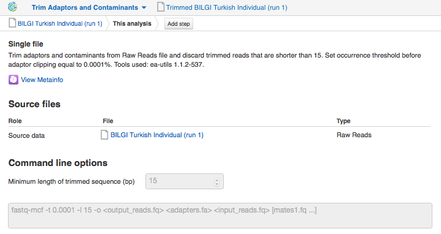
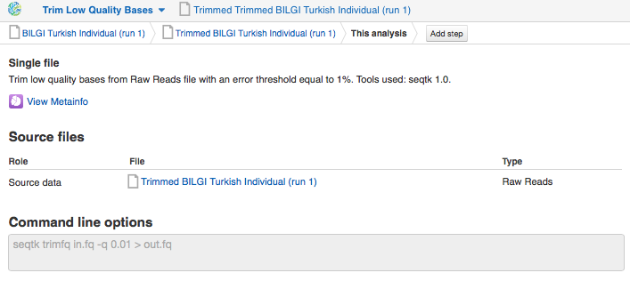
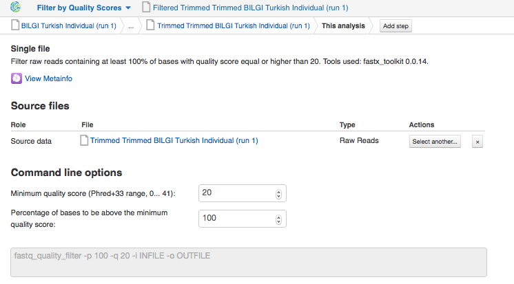
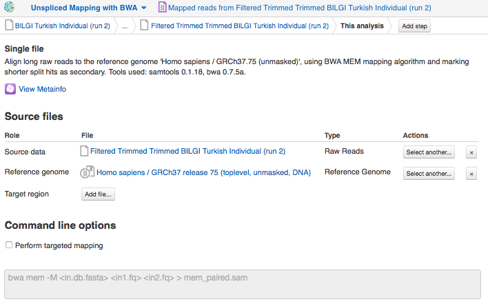

Preprocessing of the raw reads
******************************

Often overlooked, preprocessing of raw data is essential due to the fact
that it improves the original data quality, and consequently, the
results of the downstream analysis. To prepare raw reads for variant
calling and annotation we will run several preprocessing apps: Trim
Adaptors and Contaminants, Trim Low Quality Bases and Filter by Quality
Score. Firstly let's explore the parameters of the **Trim Adaptors
and Contaminants** app.

Trim Adaptors and Contaminants app finds and
clips adapters and contaminating sequences from raw reads. The authors
of the experiment trimmed and filtered reads with
Trimmomatic_ so that reads with a high quality score and a minimum length of 36 bp after
trimming were kept. We will apply default parameters ejecting reads
below a length of 15 bp. You can change the minimum length of trimmed
sequence on the app page

.. _Trimmomatic: http://www.usadellab.org/cms/?page=trimmomatic

The next read
preprocessing procedure we plan to do is removing bases of low quality
with **Trim Low Quality Bases** app based on seqtk 1.0 tool. It removes
nucleotides of a low quality from the raw data according to phred33
score that encodes the probability that the base is called
incorrectly. Currently, this app does not support any changeable command
line options.

We will finalize the data preprocessing by 
**filtering of trimmed reads by quality score**. The app filters out reads from input
file according to the set value of Phred33 quality score. As usual, you
can change the default parameters on the app page. We will eliminate all
reads with quality score below 20, considering only the bases called
with 99 % accuracy. By default "Minimum quality score" is already equal
to "20", so we only need to set the command line option "Percentage of
bases to be above the minimum quality score" to "100".

Check the quality of the preprocessed reads with FastQC Report
app to assure that it is satisfactory or make decisions about additional
preprocessing steps prior further analysis. After we have completed all
the preprocessing steps, our raw reads are of better quality, and now it
is time to begin the mapping of analysis-ready reads onto the human
reference genome.

Unspliced mapping reads onto a reference genome
***********************************************

.. raw:: html

    <iframe width="640" height="360" src="https://www.youtube.com/embed/X6aBx7ZrER0" frameborder="0" allowfullscreen="1">&nbsp;</iframe>

To map preprocessed reads to the reference genome we will use the
Unspliced Mapping with BWA app which with high efficiency and accuracy
alines sequencing reads against a whole reference genome without
allowing large gaps, such as splice junctions. The BWA-based aligner
currently has a hardcoded command line.

Prior to the variant discovery we would recommend you to check the
quality of mapped reads because some issues, such as low coverage,
homopolymer biases or experimental artifacts, only appear after the
alignment. One of such quality metric is sequencing coverage depth that
could determine the confidence of variant calling. The deeper the
coverage, the more reads are mapped on each base and the higher the
reliability and the accuracy of base calling. The assays from the
Turkish individual were obtained with high coverage (35x)
WGS. Let's explore read coverage for generated mapped reads for both
runs interactively in `Genome Browser`_,
which allows navigation between regions of the genome. To learn more
about navigating in Genome Browser look at our `blog post`_.

.. _Genome Browser: https://platform.genestack.org/endpoint/application/run/genestack/genomeBrowser?a=GSF1016806&action=viewFile

.. _blog post: https://genestack.com/blog/2015/05/28/navigation-in-genestack-genome-browser/

Remove duplicated mapped reads
******************************

Sometimes due to errors in the sample or library preparation, reads may
come from the exact same input DNA template and accumulate at the same
start position on the reference genome. Any sequencing error will be
multiplied and could lead to artefacts in the downstream variant
calling. Although read duplicates could represent true DNA materials, it
is impossible to distinguish them from PCR artifacts, which are results
of uneven amplification of DNA fragments. To reduce this harmful
effect of duplicates prior to variant discovery we will run Remove
Duplicated Mapped Reads app based on Picard MarkDuplicates tool.
To determine duplicates Picard MarkDuplicates uses the start coordinates
and orientations of both reads of a read pair. Based on the identical
5'mapping coordinates it discards all duplicates with the exception of
the "best" copy.

Quality control of mapped reads
*******************************

.. raw:: html

    <iframe width="640" height="360" src="https://www.youtube.com/embed/WjFTazaaamQ" frameborder="0" allowfullscreen="1">&nbsp;</iframe>

As you remember, we run just a part of the pipeline including
preprocessing, alignment and removing of duplicates to check if the
mapping quality is good enough and we can move on to variant calling and
annotation.

Post-mapping quality control is not necessary, but is a very important
step. The mapped Reads QC Report app produces various QC-metrics such as
base qualities, insert sizes, mapping qualities, coverage, GC bias and
more. It helps to identify and fix various mapping issues and make
downstream processing easier and more accurate. Find the created
filtered mapped reads (the outputs of Remove Duplicated Mapped Reads
app) in the **Created files** folder.

As in the case of raw reads quality control, you may explore results not only
in Mapped Reads QC Report app itself, but also compare the mapping
quality of both tested assays with **Multiple QC Report** app. Report
appears on the page as the computation is finished.

Let's look at the example report for the two sequencing runs from our experiment.
Go to the tutorial folder and open `QC reports`_
for both mapped reads files in Multiple QC Report app. Use the drop-down
menu "Select QC keys to display" and "Select metainfo to display" to
specify which QC-metrics and sample associated information you wish to
see on the plot.

.. _QC reports: https://platform.genestack.org/endpoint/application/run/genestack/filebrowser?a=GSF971382&action=viewFile&page=1

According to the QC check, both
technical replicates from our experiment are concordant with all reads
being mapped and 95 % of the reads are mapped properly. To obtain more
detailed statistics explore individual QC report in Mapped Reads QC
Report app. Let's explore the mapping quality for the first sequencing
run of Turkish individual sample. On the app page you will find mapping
statistics such as, for example, numbers of mapped, partially mapped,
unmapped mate pairs. Besides general mapping statistics individual QC
report contains coverage by chromosome plot, and, for paired-end
reads, some statistics on insert size and and insert size distribution
plot. As we can see, the median insert size is 364 with standard
deviation equal to 66.99.

*Insert size distribution* plot displays the range lengths and frequencies of inserts
(x- and y-axis, respectively) in the analysed assay.

After ensuring that our mapped reads are of high
enough quality, we can move on to the final stages of our analysis
pipeline — variant identification and effect prediction. Now then,
let's finalize the computations of the pipeline. Make sure to check the
parameters of Variant Calling and Effect Prediction apps and start initialization of
the rest of the files.
