.. _pipelines-and-applications-label:

Applications review
===================

Applications available on Genestack are grouped into four categories:

- **Preprocess** applications cover tasks such as data prefiltering, subsampling
  or normalisation, which typically should be performed before getting into the
  "heavy-lifting" part of data analysis.

- **Analyse** applications include key analysis steps like sequence alignment,
  variant calling, expression quantification, etc.

- **Explore** contains all interactive graphical interface applications
  allowing users to view the results of their computations, such as
  applications for visualizing QC reports, Genome Browser, Variant Explorer etc. 

- **Manage** contains applications used to manage your data: applications dealing
  with data flows, file provenance, export, metadata editing and so on.

An extended version of each application's description can be found in the
"About application" text for that application.

To view this text for a specific application, click on the application's name at the
top-left corner of the page, and in the drop-down menu select "About application".

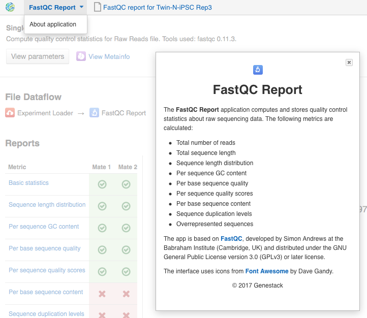

Sequencing data
---------------

Raw reads quality control and preprocessing
~~~~~~~~~~~~~~~~~~~~~~~~~~~~~~~~~~~~~~~~~~~

Once you have got raw sequencing data in Genestack the next steps are to
check the quality of the reads and improve it if it is necessary. Let's go
through the applications developed to assess the quality of the data and do
preprocessing.

FastQC report
+++++++++++++

.. TODO tips: depending on the technology (WGS, WES, Microbiome, etc. data) and Organism, you can expect warnings and faiures as well

**Action**: to perform quality control (QC) of raw sequencing reads. According to
the "garbage in, garbage out" rule, if we begin our analysis with poor quality
reads, we should not expect great results at the end. This is why QC is the essential
first step of any analysis.

The **FastQC Report** application is based on the `FastQC tool`_ developed by
Simon Andrews at the Babraham Institute.

.. _FastQC tool: http://www.bioinformatics.babraham.ac.uk/projects/fastqc/

The application generates a separate FastQC Report for each sample from a tested dataset;
you can find them in the folder "Created files". You can also explore all of them simultaneously
with Multiple QC Report app. To do so, go to "My datasets" folder, select the created
"FastQC Report" dataset and open it with
Multiple QC Report using the context menu.

Fast QC Report contains various graphs that visualize the quality of your data. We will go through all
of them one by one and tell you:

1. How they should look for good-quality data; 
2. How they may look if there is something wrong with your data;
3. What you can do if the quality is unsatisfactory.

The metrics table gives you quick indicators as to the status of each of
the quality metrics calculated.

1. Basic statistics
*******************

.. image:: images/fastqc_basic_statistics.png

Information on type and number of reads, GC content, and total sequence length.

2. Sequence length distribution
*******************************

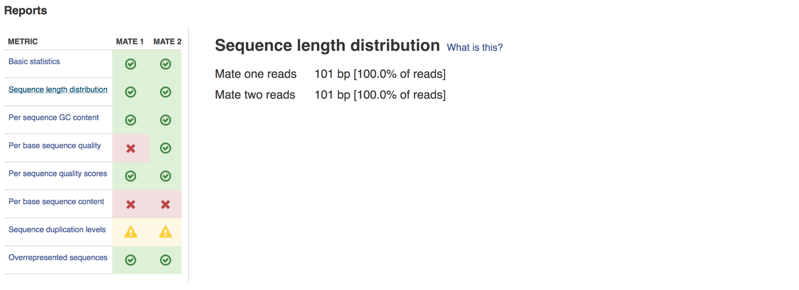

Reports lengths of all sequences.

*Warning*: this report will get warnings if the lengths are not identical, but
this can usually be ignored, as it is expected for some sequencing platforms.

3. Per sequence GC content
**************************

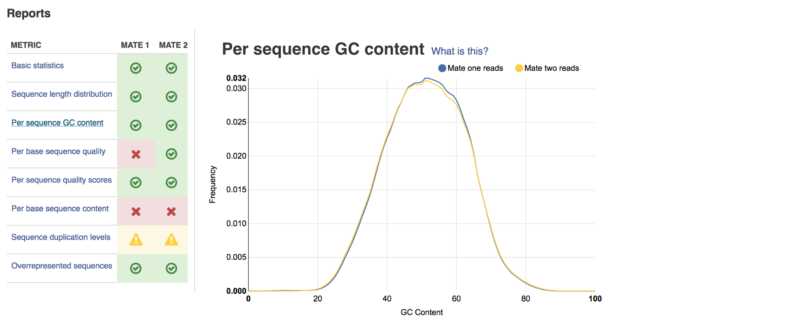

For data of good quality, the graph will show a normal, bell-shaped
distribution.

*Warning*: when the sum of the deviations from the normal distribution
represents more than 15% of the reads, the report will raise a warning.

Warnings are usually caused by a presence of contaminants. Sharp peaks may
represent a presence of a very specific contaminant (e.g. an adaptor). Broader
peaks may indicate contamination with a range of contaminants.

*Improving data quality*: run **Trim Adaptors and Contaminants** preprocessing
application.

4. Per base sequence quality
****************************

.. image:: images/fastqc_per_base_sequence_quality.png

For data of good quality, the median quality score per base (Phred) should not
drop below 20.

*Failure*: the report will get failures if the lower quartile for quality at
any base position is less than 5 or if the median for any base is less than 20.

*Improving data quality*: if the quality of the library falls to a low level over the
course of a read, the blueprint solution is to perform quality trimming of low
quality bases or omitting low quality reads. This can be performed using **Trim
Low Quality Bases** or **Filter by Quality Scores** applications respectively.

5. Per sequence quality scores
******************************

.. image:: images/fastqc_per_sequence_quality_scores.png

Ideally, we expect to see a sharp peak at the very end of the graph (meaning
most frequently observed mean quality scores are above 27).

*Warning*: the report will get warnings when the peak is shifted to the left,
which means the most frequently observed mean quality is below 27. This equals
to a 0.2% error rate.

*Improving data quality*: perform quality-based trimming or selection using
**Trim Low Quality Bases** or **Filter by Quality Scores** applications respectively.

6. Per base sequence content
****************************

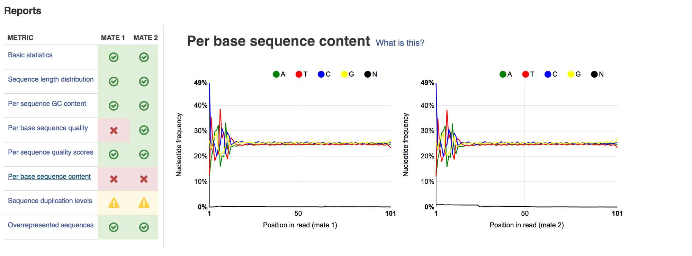

Ideally, in a random library we would see four parallel lines representing the
relative base composition. Fluctuations at the beginning of reads in the tested
sample may be caused by adapter sequences or other contaminations of the
library.

A bias at the beginning of the reads is common for RNA-seq data. This occurs
during RNA-seq library preparation when "random" primers are annealed to the
start of sequences. These primers are not truly random, and it leads to a
variation at the  beginning of the reads.

*Warning*: a warning will be raised if the difference between A and T, or G
and C is greater than 10% at any position.

*Improving data quality*: if there is instability at the start of the read the
consensus is that no QC is necessary. If variation appears over the course of
a read **Trim to Fixed Length** application may be used. If there is persistent
variation throughout the read it may be best to discard it. Some datasets may
trigger a warning due to the nature of the sequence. For example, bisulfite
sequencing data will have almost no Cytosines. Some species may be unusually
GC rich or poor and therefore also trigger a warning.

7. Sequence duplication levels
******************************

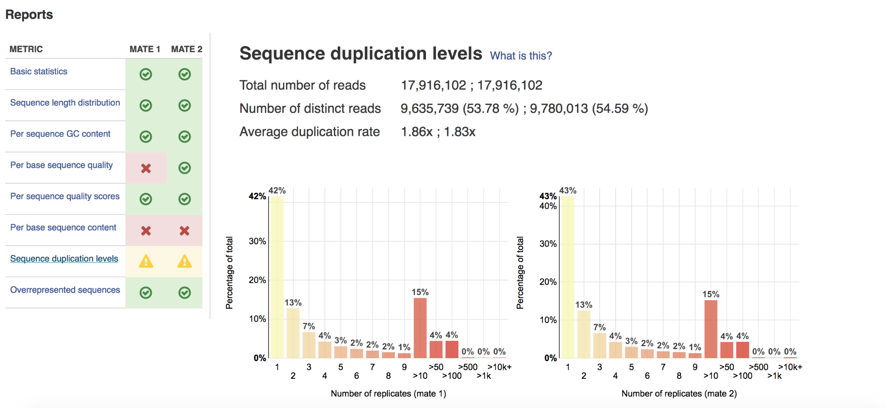

Reports total number of reads, number of distinct reads and mean duplication
rates.

*Warning*: this module will issue a warning if non-unique sequences make up
more than 20% of the total.

There are two potential types of duplicates in a library: technical duplicates
arising from PCR artifacts or biological duplicates which are natural
collisions where different copies of exactly the same sequence are randomly
selected. From a sequence level, there is no way to distinguish between these
two types and both will be reported as duplicates here.

*Improving data quality*: if the observed duplications are due to primer/adaptor
contamination, they can be removed using the **Trim Adaptors and Contaminants**
application. **Filter Duplicated Reads** application can also be used for DNA
sequencing data but will distort expression data.

8. Overrepresented sequences
****************************

.. image:: images/fastqc_overrepresented_sequences.png

Shows the highly overrepresented sequences (more than 0.1% of total sequence)
in the sample.

*Warning*: if any sequence is found to represent more than 0.1% of the total, a
warning will be raised.

There are several possible sources of overrepresented sequences:

- technical biases (one region was sequenced several times; PCR amplification
  biases);
- a feature of library preparation (e.g. for targeted sequencing);
- natural reasons (RNA-seq libraries can naturally present high duplication
  rates).

Overrepresented sequences should only worry you if you think they are present
due to technical biases.

*Improving data quality*: procedures and caveats for improving data quality
are the same as for sequence duplication level.

.. move Multiple QC before exploring a single QC report

You can explore all the generated FastQC reports at the same time and on one page
with **Multiple QC report** application. All the FastQC reports are kept together in
a "FastQC Report" dataset in the "My Datasets" folder.

Multiple QC report
++++++++++++++++++

**Action**: to display metrics from multiple reports at once. It accepts as
input a dataset of QC reports.

Select from a range of QC keys to display on the plot, e.g. Total nucleotide
count (mate 1 and 2), Number of reads (mate 1 and 2):
count (mate 1 and 2), Number of reads (mate 1 and 2):

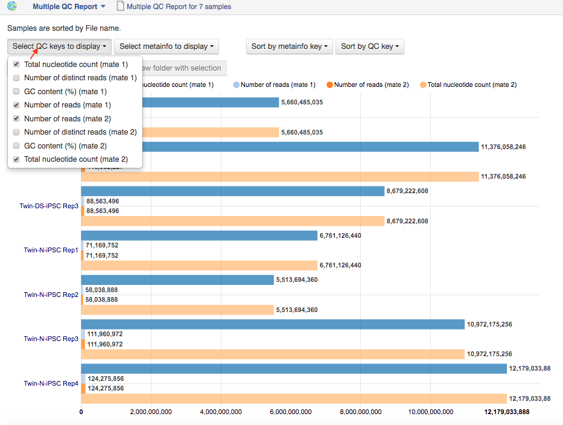

You can select which metainfo to display in the plot labels:

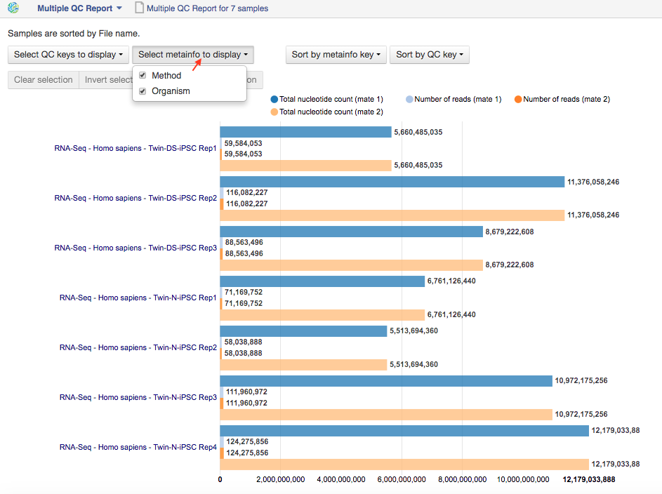

Also, samples in the Multiple QC Report can be sorted by metainfo key or
specified QC metric.

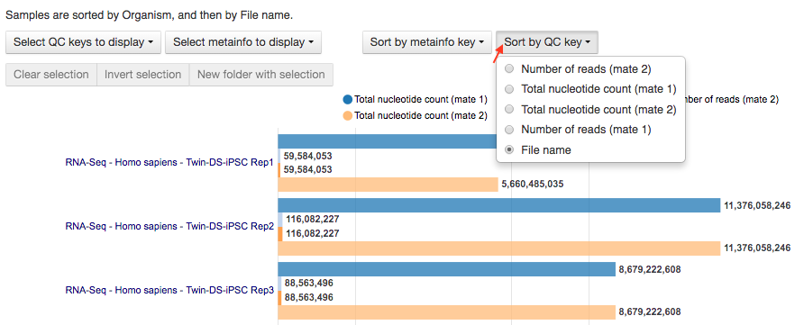

Finally, you can highlight the interesting reports and put them in a separate
folder (**New folder with selection** button).

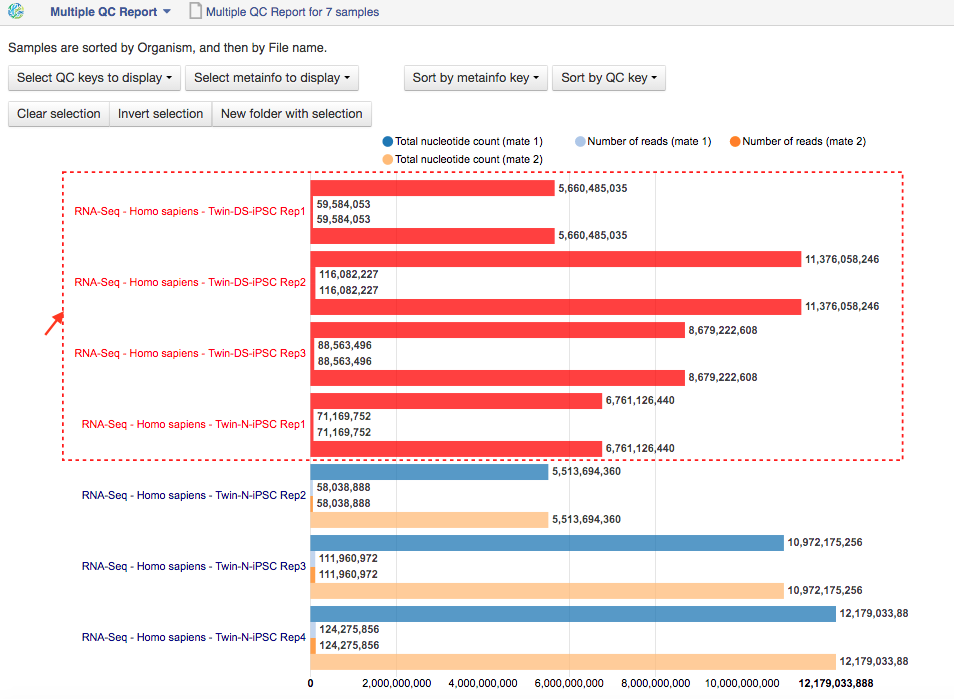

When the quality of the raw reads is unsatisfactory, several preprocessing
applications are available on the platform that can increase the quality of
your raw reads. Here we will walk you through each one and give you a
checklist to use when deciding which to select. After each of the
preprocessing steps, you can use the FastQC Report application again to compare the
quality pre- and post-processing (remember that in order to do this, you need
to run a different computation, this time inputting processed data source
files into the data flow).

Subsample reads
+++++++++++++++

**Action**: to create a random subset of raw reads.

**Command line options**:

1. The **Random  seed** value will let you create different subsets with the same
   number of reads. (default: 100)
2. The **Number of reads in subset** option tells the application how many
   reads you expect the output subsample will contain. (default: 50,000)

Using the same seed and the same number of reads will result in identical
subsets.

This application is based on the Seqtk_.

.. _Seqtk: https://github.com/lh3/seqtk

Filter duplicated reads
+++++++++++++++++++++++

**Action**: to discard duplicated sequenced fragments from raw reads data. If
a sequence of two paired reads or a single read occurs multiple times in a
library, the output will include only one copy of that sequence.

The Phred quality scores are created by keeping the highest score across all
identical reads for each position.

If you suspect contamination with primers or some other repetitive sequence.
This should be evident from the "Sequence duplication levels" and the "Overrepresented
Sequences" modules of the FastQC report. Keep in mind this application should not be used with
RNA-seq data as it will remove observed differences in expression level.

This tool is based on Tally_.

.. _Tally: http://www.ebi.ac.uk/~stijn/reaper/tally.html

Filter by quality scores
++++++++++++++++++++++++

**Action**: to discard reads from a Raw reads file based on Phred33 quality
scores. The application classifies the sequence as pass or fail calculating
quality score distribution for each read.

**Command line options**:

1. **Minimum quality score (Phred+33 range, 0... 41)** is a quality cutoff
   value. A score of 20 means that there is a 1% chance that the corresponding
   base was called incorrectly by the sequencer. A score of 30 means a 0.1%
   chance of an incorrect base call. (default: 20)
2. **Percentage of bases to be above the minimum quality score** is number of
   nucleotides in the reads having quality equal to or higher than the chosen
   minimum quality score. 100% requires all bases in the reads to be equal to
   or higher than the quality cut-off value. 50% means requires the median of
   the bases to be at least the quality cut-off value. (default: 80)

Let's take an example to understand how the application works. So, here is our
read:

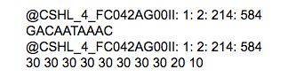

The second line represents the nucleotide sequence (10 bases in this case). The fourth
line contains quality scores for each nucleotide in the read.

- If the "Minimum quality score" is equal to 30 and the "Percentage of bases" is equal
  to 50, this read will not be discarded, because the median quality of the
  read is higher than 30.
- If the "Minimum quality score" is equal to 20 and the "Percentage of bases" is equal
  to 100, the read will be discarded, because not all bases have quality equal
  to or higher than 20.

This tool is based on **fastq_quality_filter**, which is part of the
FASTX-Toolkit_.

.. _FASTX-Toolkit: http://hannonlab.cshl.edu/fastx_toolkit/

This application is best used if you have some low quality reads, but others are of
high quality. You should be able to tell if this is the case from the shape of
the "Per sequence quality scores" plot from the FastQC application. It may also
be worth trying this application if the per base sequence quality is low.

Trim adaptors and contaminants
++++++++++++++++++++++++++++++

**Action**: to find and trim adaptors and known contaminating sequences from
raw reads data.

The application uses an internal list of sequences that can be considered as
contaminants. This list is based on the possible primers and adaptors which the
most popular sequencing technologies and platforms use. For instance, it
contains widely used PCR primers and adaptors for Illumina, ABI etc. (see the
`list of primers and adaptors`_ we remove).

.. _list of primers and adaptors: https://s3.amazonaws.com/bio-test-data/Genestack_adapters.txt

The occurrence threshold before adapter clipping is set to 0.0001. It refers to
the minimum number of times an adapter needs to be found before clipping is
considered necessary.

**Command line options**:

**Minimum length of the trimmed sequence (bp)**. The application will discard
trimmed reads of length below this number. (default: 15)

This application is based on the fastq-mcf_, one of the EA-Utils_ utilities.

.. _fastq-mcf: https://github.com/ExpressionAnalysis/ea-utils/blob/wiki/FastqMcf.md
.. _EA-Utils: https://expressionanalysis.github.io/ea-utils/

The application is best used when you have irregularities in GC content, in
base content at the start of reads, duplicated reads. Since this QC application relies
on sequence matching it should be run first if used in conjunction with other
QC applications.

Trim low quality bases
++++++++++++++++++++++

**Action**: to isolate high-quality regions from raw reads.

Trim Low Quality Bases application is based on the `Phred algorithm`_. It finds
the longest subsequence in read where the estimated error rate is below the
error threshold (which is equal to 0.01 by default).

.. _Phred algorithm: http://www.phrap.org/phredphrap/phred.html

To understand how the application works let's take an example. So, imagine we
have a sequence:

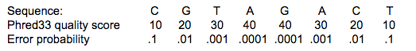

The application will find the fragment of the read where the sum of all
probability errors will not be more than 0.01 (in our case). In this case, the
best sequence will be "TAGA" (.001*2 + .0001*2 = .0022) and it will be the
output read. Other fragments will have the sum of error probabilities more
than the cutoff 0.01, so they will be ignored.

This tool is based on the `Seqtk`_ tool and uses the Phred algorithm to pick out
the regions of the highest quality.

.. _Seqtk: https://github.com/lh3/seqtk

Trim reads to fixed length
++++++++++++++++++++++++++

**Action**: to trim a specific amount of bases from the extremities of all
reads in a sample.

**Command line options**:

1. The **Keep bases from position** option asks you to specify the first base that
   should be kept. (default: 1)
2. **Keep bases to position (set to zero for entire read)**. Indicate the
   position of the last nucleotide that should be kept in the read. (default: 0)

For example, if you set 5 as the first base to keep and 30 as the last base to
keep, it means that the application trims all nucleotides before the 5th
position, and all nucleotides after the 30th base.

This tool is based on the **fastx_trimmer**, which is part of the `FASTX-Toolkit`_.

.. _FASTX-Toolkit: http://hannonlab.cshl.edu/fastx_toolkit/

Trim Reads to Fixed Length application is helpful when you want to obtain
reads of a specific length (regardless of the quality).

.. TODO: Add info about Merge Raw Reads application (the one without UI)

.. include:: apps-mappedQC-preprocessing_include.rst
.. include:: apps-variants_preprocessing_include.rst
.. include:: apps-rnaseq_include.rst
.. include:: apps-wgs-and-wes_include.rst
.. include:: apps-bisseq_include.rst
.. include:: apps-microbiome_include.rst
.. include:: apps-additional_apps_include.rst
.. include:: apps-ref-genomes_include.rst
.. include:: apps-expression_arrays_include.rst
.. include:: apps-methyl_arrays_include.rst