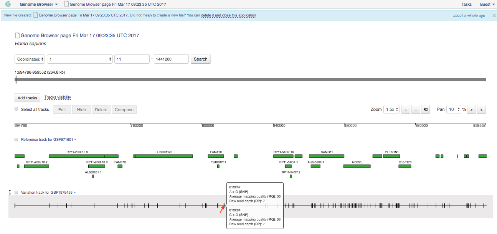
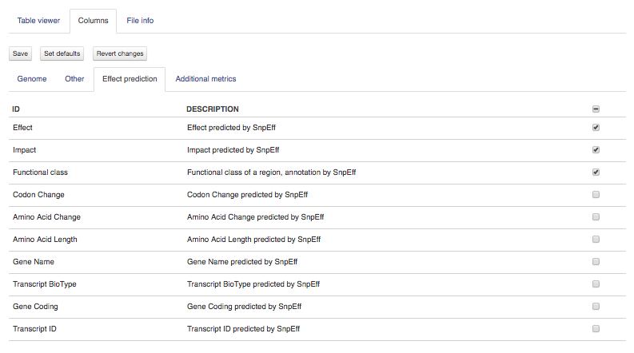
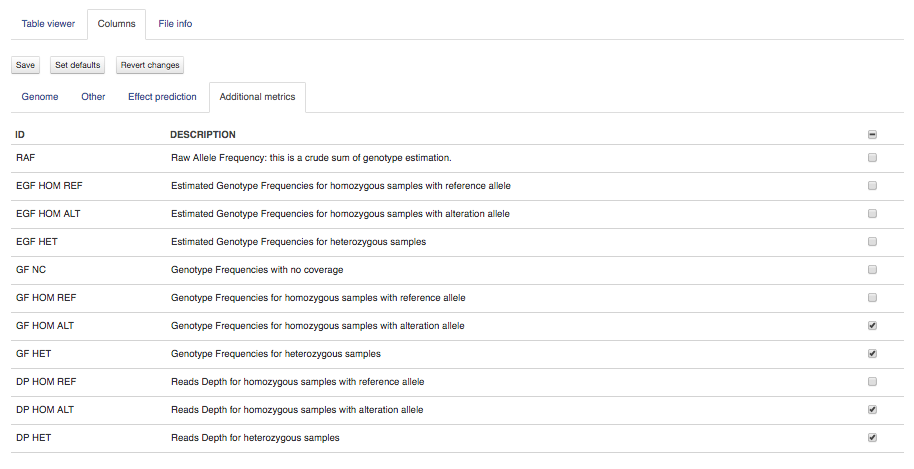

Genome/exome sequencing data analysis
~~~~~~~~~~~~~~~~~~~~~~~~~~~~~~~~~~~~~

Mapping (also called alignment) refers to the process of aligning sequencing
reads to a reference sequence, whether the reference is a complete genome,
transcriptome, or de novo assembly.

There are at least two types of mapping strategies — Spliced Mapping and
Unspliced Mapping. In contrast to spliced aligners, unspliced read aligners map
reads to a reference without allowing large gaps such as those arising from
reads spanning exon boundaries, or splice junctions. When analysing whole
genome sequencing (WGS) or whole exome sequencing (WES) data, there is no need
to look for spliced these sites precisely. That is why we recommend use unspliced
mapping applications in such cases.

On Genestack, you will find two unspliced aligners — Unspliced Mapping with BWA
and Unspliced Mapping with Bowtie2.

Unspliced mapping with BWA
++++++++++++++++++++++++++

**Action**: to map WES or WGS data to a reference genome without allowing
splice junctions. The application generates Mapped Reads which can be used
further with our Variant Calling application which is based on samtools mpileup.

BWA’s MEM algorithm will be used to map paired or single-ends reads from 70 bp
up to 1Mbp ("mem" option in command line). For reads up to 70 bp the algorithm
called BWA-backtrack will be applied. This algorithm is implemented with the
"aln" command, which produces the suffix array (SA) coordinates of the input
reads. Then the application converts these SA coordinates to chromosome
coordinates using the "samse" command (if your reads are single-end) or
"sampe" (for paired-end reads).

Command line options:

1. **Perform targeted mapping** option. If this parameter is selected, a BED
   file ("Target region" source file) is used to restrict mapping of the reads to specific locations in the
   genome, that the reads should be mapped to. The reference genome is altered
   to only contain those locations, using the bedtools "getfasta" command and
   the reads are then mapped to the altered genome. The resulting sam file
   contains local genome co-ordinates, which are converted back to the global
   coordinates of the reference genome. (default: unchecked)

The application is based on the BWA_ aligner and BEDtools_. The application is
used in `Whole Exome Sequencing Data Analysis`_ and `Whole Genome Sequencing Data Analysis`_
tutorials.

.. _BWA: http://bio-bwa.sourceforge.net/
.. _BEDtools: http://bedtools.readthedocs.io/en/latest/
.. _Whole Exome Sequencing Data Analysis: http://genestack-user-tutorials.readthedocs.io/tutorials/WES_data_analysis/index.html
.. _Whole Genome Sequencing Data Analysis: http://genestack-user-tutorials.readthedocs.io/tutorials/WGS_data_analysis/index.html

Unspliced mapping with Bowtie2
++++++++++++++++++++++++++++++

**Action**: to map WES or WGS data to a reference genome without allowing
splice junctions. The application generates Mapped Reads which can be used
further with our Variant Calling application which is based on samtools
mpileup.

Let's look at the parameters we can use to do mapping:

1. **Report the best mapping** option. The application will consider only the
   best mapping for one mappable read. (default: checked)
2. **Limit the number of mappings to search** option. If you are interested in
   reads mapping to multiple positions, switch off "Report the best mapping"
   option and set N mappable positions for one read in the text box for "Limit
   the number of mappings to search". (default: 1)
3. **Rule for filtering mappings**. You can apply a rule for filtering mappings
   to choose whether to keep reads mapping uniquely or to multiple positions.
   (default: None)
4. **Number of allowed mismatches** option. If you want to be stricter, you
   can change the maximum number of allowed mismatches, e.g. if you set it to
   1, any mapping with 2 or more mismatches will not be reported (default: 0)

For paired-end reads two more option appears:

5. The **Disallow unique mappings of one mate** option allows you to discard pairs
   of reads where one mate maps uniquely and the other to multiple positions.
   (default: unchecked)
6. The **Disallow discordant mappings** parameter will discard all mappings where
   the two mates map uniquely but with unexpected orientation or where the
   distance between two mapped mates differs from and internally estimated
   fragment length, including mates mapping to different chromosomes. (default:
   unchecked)

The application is based on the Bowtie2_ aligner.

.. _Bowtie2: http://bowtie-bio.sourceforge.net/bowtie2/index.shtml

Variant calling with SAMtools and BCFtools
++++++++++++++++++++++++++++++++++++++++++

**Action**: to identify genomic variants. The application accepts Mapped Reads
files to call variants. You will be able to perform variant calling for each
single Mapped Reads file separately or run Variant Calling application on
multiple mapped reads samples. The last option maybe helpful because you
increase the accuracy of the analysis by taking the reads from several samples
into consideration and reducing the probability of calling sequencing errors.
After the variants are detected you can annotate them running Effect Prediction
application or/and use Genome Browser and Variant Explorer for exploring the
results.

The application uses samtools mpileup which automatically scans every position
supported by an aligned read, computes all the possible genotypes supported by
these reads, and then calculates the probability that each of these genotypes
is truly present in your sample.

As an example, let’s consider the first 1000 bases in a Reference Genome file.
Suppose the position 35 (in reference G) will have 27 reads with a G base and
two reads with a T nucleotide. Total read depth will be 29. In this case, the
application concludes with high probability that the sample has a genotype of
G, and the T reads are likely due to sequencing errors. In contrast, if the
position 400 in reference genome is T, but it is covered by 2 reads with a C
base and 66 reads with a G (total read depth equal to 68), it means that the
sample more likely will have G genotype.

Then the application executes bcftools call which uses the genotype likelihoods
generated from the previous step to call and filter genetic variants and
outputs the all identified variants in the Genetic Variations file.

Let's now look at the command line options more closely:

1. **Variants to report** option. The application can call both "SNPs and
   INDELs" variants, "SNPs only" or "INDELs only". (default: "SNPs and INDELs")
2. **Call only multi-allelic variants** option. The multiallelic calling is
   recommended for most tasks. (default: checked)

.. note:: **What is a multiallelic variant?**

          A multiallelic variant is a genomic variant with two or more
          observed alleles in the variant locus. In contrast to multiallelic
          variant, consensus (or biallelic) variant is determined as a single
          non-reference allele (there are only two possible alleles at the
          variant site - the reference allele and the consensus one).

3. **Only report variant sites** option. In some cases, it’ll be interested to
   report only potential variant sites and exclude monomorphic ones (sites
   without alternate alleles). For this purpose, switch the option “Only report
   variant sites”. (default: checked)
4. The **Discard anomalous read pairs** option is used to skip anomalous read
   pairs in variant calling. (default: checked)
5. The **Maximum per-sample read depth to consider per position** option sets the
   maximum number of reads at the position to consider. (default: 250)
6. **Minimum number of gapped reads for an INDEL candidate** option. Typically,
   gapped alignments (like the ones from Unspliced with Bowtie2) can be used to
   identify indels (about 1-10 bases in length). The greatest indel sensitivity
   can be achieved by generating indel candidate from mapped reads. (default:
   1)
7. **Minimum per-sample depth to call non-variant block** option. A non-variant
   block is all variants, describing a segment of nonvariant calls. Specify,
   what minimum read depth value you expect to observe among all sites
   encompassed by the non-variant block. (default: 1)
8. **Minimum variant quality** option. The application will ignore the variant
   with quality score below this value. (default: 20)
9. The **Minimum average mapping quality for a variant** parameter is used to
   discard all variants with average mapping quality value less than specified.
   (default: 20)
10. The **Minimum all-samples read depth for a variant** is a minimum number of
    reads covering position. (default: 1)
11. The **Chromosome to analyse** option allows you to choose specific chromosomes
    to analyse. (default: All)
12. **Key to merge samples** is a metainfo key you need to specify in order
    you would like to merge the samples. This option can be useful for merging
    technical replicates.

Moreover, base alignment quality (BAQ) recalculation is turned on by default.
It helps to rule out false positive SNP calls due to alignment artefacts near
small indels.

Also, the application will always write DP (number of reads covering position),
DV (number of high-quality variant reads), DP4 (number of forward reference,
reverse reference, forward non-reference and reverse non-reference alleles
used in variant calling) and SP (phred-scaled strand bias p-value) tags in
the output file.

The result Genetic Variations can be explored in **Genome Browser** as a
separate  variation track, further annotated using **Effect Prediction**
application, or viewed immediately using **Variant Explorer** application.

This application is based on the `SAMtools`_ and `BCFtools`_ utilities and
best used when performing `Whole Exome Sequencing Analysis`_ or `Whole Genome
Sequencing Analysis`_.

.. _SAMtools: http://samtools.sourceforge.net/
.. _BCFtools: http://samtools.github.io/bcftools/bcftools.html
.. _Whole Exome Sequencing Analysis: http://genestack-user-tutorials.readthedocs.io/tutorials/WES_data_analysis/index.html
.. _Whole Genome Sequencing Analysis: http://genestack-user-tutorials.readthedocs.io/tutorials/WGS_data_analysis/index.html

Effect prediction with SnpEff
+++++++++++++++++++++++++++++

**Action**: to annotate variants based on their genomic locations and
calculate the effects they produce on known genes. The application accepts
Genetic Variations and adds annotations for them.

The annotated variants can be further explored in Genome Browser, Variant
Explorer or View Report applications.

In **Genome Browser**, the *Variation track* shows the genetic variants (SNPs,
insertions etc.), their exact position on genome, average mapping quality and
raw read depth.

If you would like to see the whole list of effects and annotations for variants
as well as to get some general statistics (for example, to know number of
variants by chromosome, find out how many variants are corresponding to SNP or
insertions, to know number of effects by type and region and some other
information), just open the annotated Genetic Variations file in **View
Report** application. Read about the variant annotations and report statistics in
Whole Exome Sequencing tutorial, in `Effect annotation`_ section.

.. _Effect annotation: http://genestack-user-tutorials.readthedocs.io/tutorials/WES_data_analysis/index.html#effect-annotation

Use **Variant Explorer** application to know what effect is generated by each
separate variant as well as to sort and filter the variants by various fields,
such as mutation type, quality, locus, etc.

.. image:: images/variant_explorer_annotated_variants.png

This application is based on the open-source SnpEff_ tool and best used in
`Whole Exome Sequencing`_ and `Whole Genome Sequencing`_ analyses.

.. _SnpEff: http://snpeff.sourceforge.net/
.. _Whole Exome Sequencing: http://genestack-user-tutorials.readthedocs.io/tutorials/WES_data_analysis/index.html
.. _Whole Genome Sequencing: http://genestack-user-tutorials.readthedocs.io/tutorials/WGS_data_analysis/index.html

Variant explorer
++++++++++++++++

.. TODO add description for "File info" tab, "Filters summary" and "Filters history"

**Action**: to interactively explore genetic variations such as SNPs, MNPs,
and indels at specific genomic positions. The application not only displays the
information about variants but also allows you to sort and filter by various
fields, such as mutation type, quality, locus, etc.

.. image:: images/variant_explorer_app_page.png

Variant Explorer takes as input a  Genetic Variations file which can be
imported or generated with the Variant Calling application. If you open it in
the application, you will see default DP (Raw read depth) and MQ (Average
mapping quality) columns ("Other" tab in "Columns" section).

.. image:: images/variant_explorer_other.png

Variants can be annotated with the Effect Prediction application that analyses genomic
position of the variants and reveals the effects they produce on known genes
(such as amino acid changes, synonymous and nonsynonymous mutations, etc.).
For such variants the following information will be shown (find it in "Effect
prediction" tab).

-  *Effect* — effect predicted by SnpEff tool;
-  *Impact* — impact predicted by SnpEff tool;
-  *Functional class* — functional class of a region, annotated by SnpEff
   tool.

Moreover, the application calculates "Additional metrics" such as genotype
frequencies for homozygous samples with reference and alteration alleles
(GF HOM REF and GF HOM ALT columns correspondingly), reads depth for
homozygous samples with alteration allele (DP HOM ALT) and reads depth
for heterozygous samples (DP HET).

.. note:: **How many raw reads match to the reference and alternative alleles?**

          DP and DP4 fields may help.

          **DP** is about raw read depth.
          **DP4** refers to the reads covering the reference forward, reference
          reverse, alternate forward, alternate reverse bases. For example,
          DP4=0,0,1,2 means 1 read is the alternate base forward strand, 2
          alternate base reverse strand, and no covering reads have a reference
          at that position. The sum of DP4 will not always equal to the DP
          value due to some reads being of too low quality.

.. note:: **How can I find out an allele frequiency for a variant?**

          Have a look at allele frequency (**RAF** column) which is a
          fraction of reads supporting alternate allele (that information
          is provided in DP4 field). Our Variant Calling application is
          forced to fit the model of categorical allele frequencies, e.g.
          0 (homozygous reference), ~0.5 (heterozygote, carrying 1 copy
          of each of the reference and alternate alleles) or 1 (homozygous
          alternate).

.. How to annotate found human variants to dbNSFP (1000 genomes data)

To change the default columns or add more columns, choose them in the
corresponding tabs in "Columns" section and "Save" your changes. After
that all selected columns will be displayed in Table viewer.

You can "download filtered data as .tsv" or create a new file with filtered
variants.

Read more about this application in our tutorials on `Whole Exome Sequencing`_ and
`Whole Genome Sequencing`_ analyses.

.. _Whole Exome Sequencing: http://genestack-user-tutorials.readthedocs.io/tutorials/WES_data_analysis/index.html
.. _Whole Genome Sequencing: http://genestack-user-tutorials.readthedocs.io/tutorials/WGS_data_analysis/index.html

Intersect genomic features
++++++++++++++++++++++++++

**Action**: to perform an intersection between several feature files such as
Mapped Reads files or Genetic Variations files. Depending on the input files,
the applications generates different outputs, either Mapped Reads or Genetic
Variations files.

Let's look at the command line options:

1. **Rule for filtering** option. The application can "Report overlapping
   features". For example, you could isolate single nucleotide polymorphisms
   (SNPs) that overlap with SNPs from another file. For this, intersect two
   Genetic Variations files. But there are cases when you would like to know
   which features do not overlap with other ones (use "Report non-overlapping
   features" filter). (default: Report overlapping features)
2. The **Minimum overlapping fraction** option allows you check whether a feature
   of interest has a specified fraction of its length overlapping another
   feature. (default: 10)
3. The **Rule for overlap strandedness** option allows you to ignore overlaps on
   the same strand ("Discard overlaps on the same strand"), on the other
   strand ("Discard overlaps on the other strand") or expect overlapping
   without respect to the strandedness ("None"). (default: None)

This application is based on the `BEDtools`_.

.. _BEDtools: http://bedtools.readthedocs.io/en/latest/