Browsing data
-------------

Efficient data search and browsing are at the core of Genestack. The
platform provides rapid access to private, shared, and public data
and analysis results.

Data browser
~~~~~~~~~~~~

Our platform provides you with a rich collection of freely accessible datasets that we
imported from various well-known repositories, such as GEO NCBI, ENA, SRA and Array Express.
Data is synchronized regularly from these databases, keeping things up-to-date. There are
currently more than 3 million sequencing and microarray assays from over
100,000 public datasets indexed in Genestack.
All the public datasets and assays are accompanied by original metainformation
describing biological data. Generally, this information is not standardized that makes operations
with biological data, like browsing data and combining assays from several datasets or reproducing some
analysis, difficult or even impossible without human participation.
To harmonize raw metadata we apply **automated curation** where we map raw entries to
controlled terms that we store and maintain in special files called **Dictionaries**.
To prepare these Dictionaries we adopted terms from external ontologies or created them manually.
You can also use our standardized and unified terminology to describe your own data
or analysis results.

The Data Browser allows to browse these public datasets, as well as your private
data and the data shared with you on Genestack. You can access the Data
Browser either from the **Dashboard** or the **Shortcuts menu** on the left-hand side.

You can search relevant data with **a free-text query**, and you can further
filter down datasets by **metadata attributes** using the checkboxes
on the left. These attributes are generated based on the metadata associated with datasets.
For instance, you can set the filters "Access", "Method"
and "Organism" to "Public", "Whole Exome Sequencing", "Mus musculus", respectively,
to filter out publicly accessible data on mice obtained from mouse WES data.

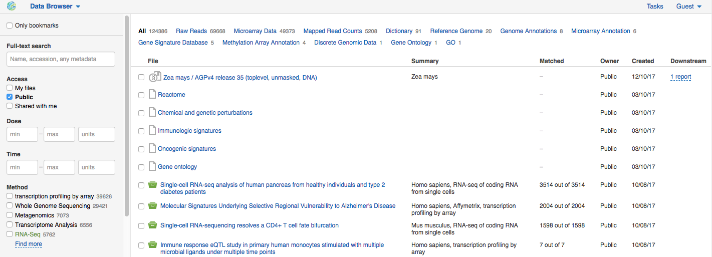

Data Browser allows you to find bioinformatics analyses results
associated with raw data. If there are analysis performed on a given dataset,
and you have access to these results (i.e. they are yours, or they are shared with you),
then you will find both intermediate results and reports in the column **Downstream**.

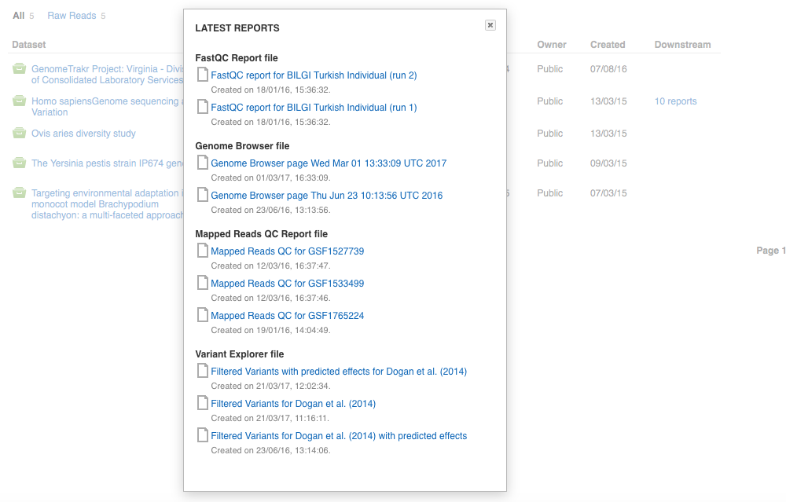

Then, you can merge data from several datasets into a single **combined dataset** or share several
datasets with your collaborator together. To do so you should select several datasets and choose on
a "Briefcase bar" that appears at the bottom of the screen **Merge…** button or
**Share...** button, respectively.

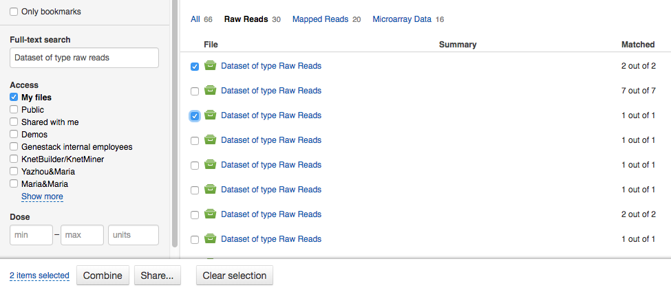

If not all the samples meet your searching criteria, feel free to create a subset of a dataset
with matching samples and process them separately. To do so, click a link showing the number
of matching files in the Data Browser column *Matched*, then, click
**Make a subset with matching files** button to save files matching to the set filters.
You can also make a subset on the Metainfo Editor page.

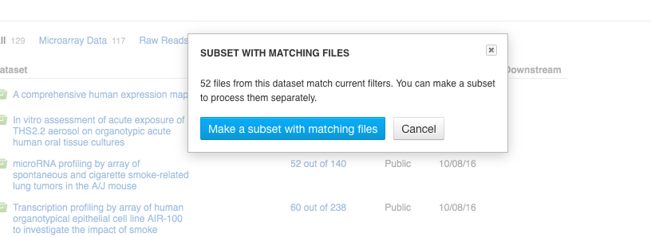

Clicking on the name of any of the datasets will take you to
the **Metainfo Editor**, where you can view (and possibly edit) the metadata of this
dataset and its assays.

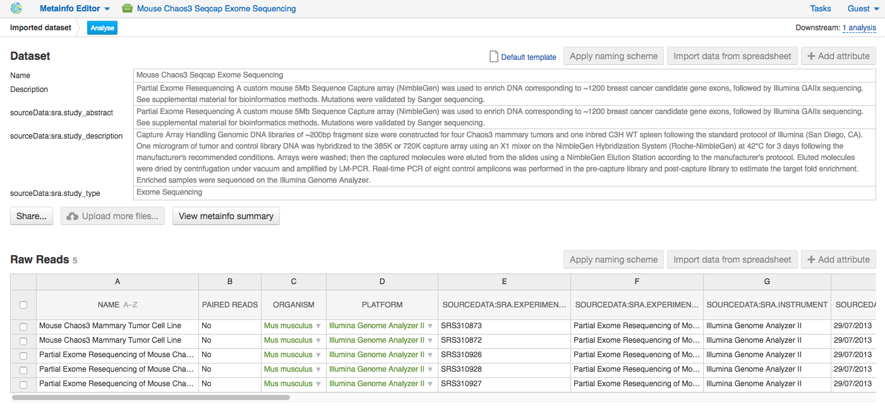

Besides,directly from the Metainfo Editor page you can start building pipeline step by step via the button
**Analyse**.

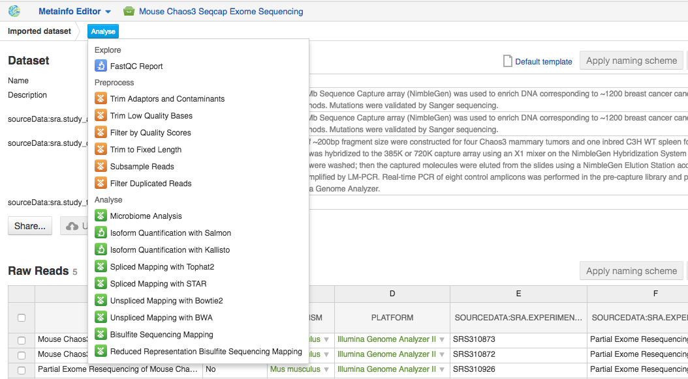

If you want to analyse some part of your dataset, select samples and click the **Make a subset**
button (by default all subsets are created in the folder **My datasets**).

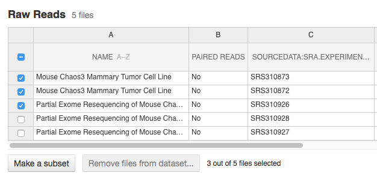

Click a subset name to open it with Metainfo Editor application and edit its
metainformation if it is needed.

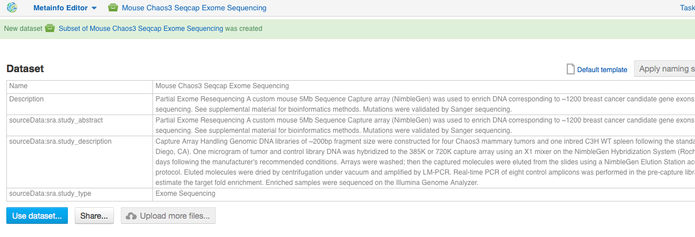

If you are an owner of a given dataset, you can add more samples to your dataset by clicking
on **Upload more files** button.

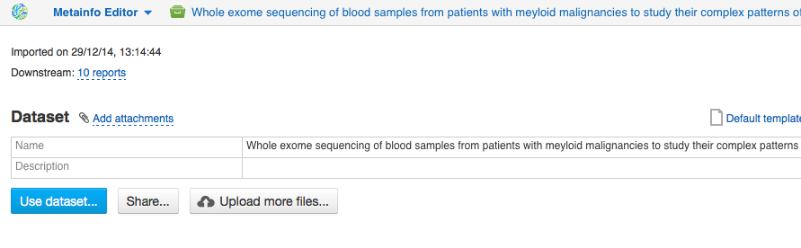

Besides, you can remove files from a dataset: select files you want to exclude and click
**Remove files from dataset** button.

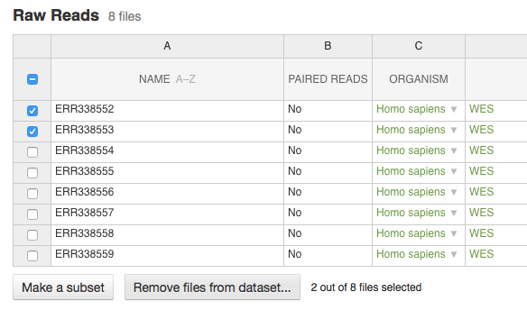

And if you are sure, confirm removing of the data by click **Remove** button. Remember that if
the files you are going to exclude from a dataset are not used anywhere, they will be
deleted from the platform without any possibility to restore.

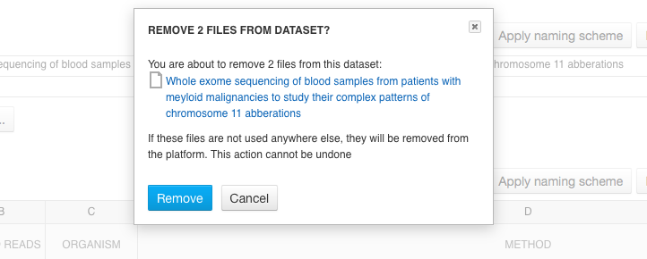

If your dataset is made from subsets of other datasets, use **metainfo filters in File Provenance**.
Open the dataset in File Provenance to see based on which metadata samples were selected,
and, therefore, you can be sure that no significant data was omitted.

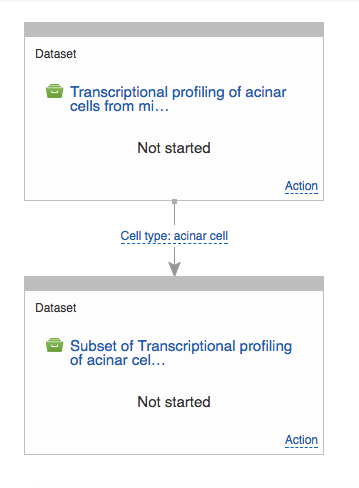

File manager
~~~~~~~~~~~~

Like on any operating system, the **File Manager** is where you can easily access
all of your files, organise them into folders and open them with various applications.

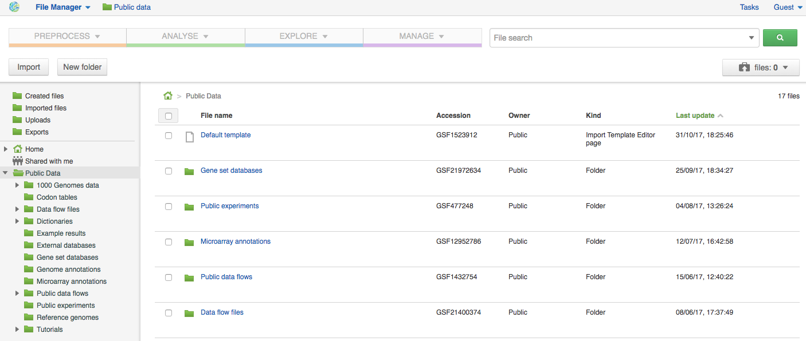

The panel (tree view) on the left-hand side is the file system navigator.
Here you can see many different folders. Some special folders are worth mentioning:

**Created files** is the folder where any new file created by an application on Genestack goes.

**Imported files** is where imported data goes, organized by
date: all files imported at the same time (during one import action)
will be located in the same folder. 

**Uploads** contains all the files you have uploaded into Genestack —
FASTQ and BAM files, pdf documents, excel tables etc.

.. note:: **What is the difference between uploads and imported files?**

          When you have just started importing your files (in various formats like
          FASTQ, BAM etc.), they all go to the specific storage area (the "Uploads"
          folder). During import, Genestack will recognize these uploaded files and
          allocate them to appropriate biological types (you can also do it
          manually), e.g. sequencing assays, mapped reads etc. These meaningful
          biological objects are what you work with on Genestack, and these are
          located in the "Imported files" folder.

The **Exports** folder contains data ready for export. See the :ref:`data-export-label` section for more information.

**Shared with me** give access to all files that other users have shared with
you or that you shared with other users. See the :ref:`sharing-label` section for more details.

**Public Data** folder contains all of the goodies we have preloaded on Genestack
to make life a bit simpler for our users. This folder contains:

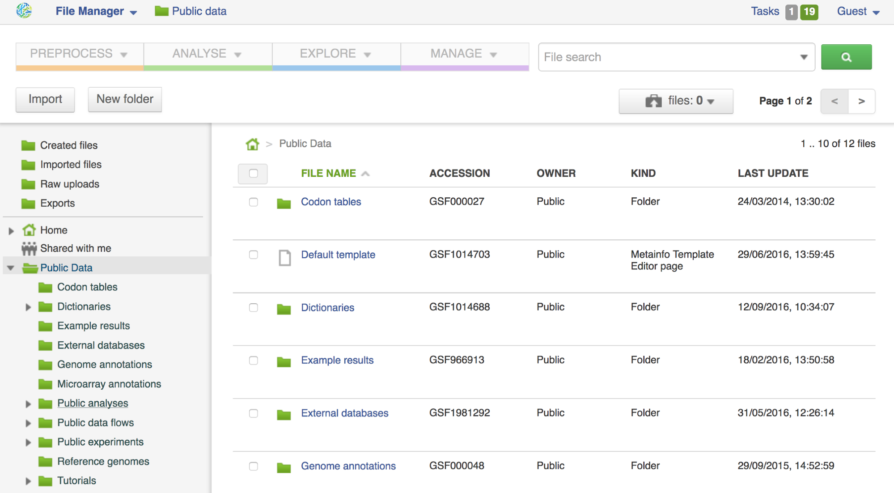

#. **Codon tables**: currently 18 different tables such as yeast
   mitochondrial, vertebrate mitochondrial, blepharisma macronuclear
   etc.;
#. **Default template**: is an import template thai is used by default in data importing process. It provides the list of optional and required metadata fields for each file kind. An ontology or a dictionary can be associated with metadata keys to validate metainfo;
#. **Dictionaries**: dictionaries include terms from external ontologies and are used to
   curate and harmonize metainfo, e.g. sex, platform, NCBI taxonomy.
#. **Example results**: so you can play around with our platform and see
   what types of visualizations are available;
#. **External databases**: sets of sequences with associated annotation,
   e.g. Greengenes for 16S rRNA;
#. **Genome annotations**: for a range of different organisms and platforms
   (for WES analysis);
#. **Microarray annotations**: annotation lists to be used as the
   translation table to link probes and common public domain sequences;
#. **Public analyses**: all files created during re-analysis of previously
   published datasets;
#. **Reference genomes**: various reference genomes for the most commonly
   analysed organisms;
#. **Public data flows**: all data flows available to our users, including
   tutorial data flows and the ones found on the Dashboard;
#. **Public experiments**: this is a feature we are particularly proud of
   have pre-loaded the platform with thousands and thousands of publicly
   available datasets, from public repositories such as GEO,
   ArrayExpress, SRA, and ENA. Currently, we have more than 110,000
   datasets in our database.
#. **Tutorials**: the folder contains files we use as examples during
   various tutorials.

To access the **context menu** for a given file, you can either do a right or left click
on the respective entry in the file browser. The topmost entry is the
application that was used to generate this file or the application that should be used
to view it. The next four entries are submenus for each of the four different
types of applications that can be used on the file. Further down are options for
viewing and re-using the pipeline used to generate the file. The final
section allows you to manage file locations and names. For folders,
left-clicking opens the folder, while right-clicking opens the menu.
The **Add to** and **Move to** action allow you to link or move a file to a chosen directory.

.. note:: **This does not perform a copy**

          We use the word "linking" and not "copying" in this context because in Genestack,
          adding a file to a folder does not physically create a duplicate of
          that file (unlike copy-pasting in your traditional operating system). It just adds a link to
          that file from the folder (similar to symbolic links on UNIX).

**Show all parent containers** shows you a list of all the folders in which the
current file is linked. The **file accession** is a unique identifier attached to each file.
Unlike other metainfo attributes, it will never change for any file.

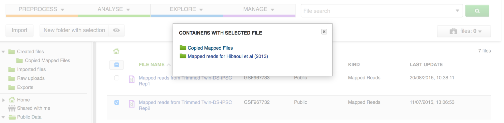

Above the File Manager pane, you can find the **Import** button. Clicking
it takes you to the Import application page, where you can upload your files,
import them into the platform and edit their metainfo. 

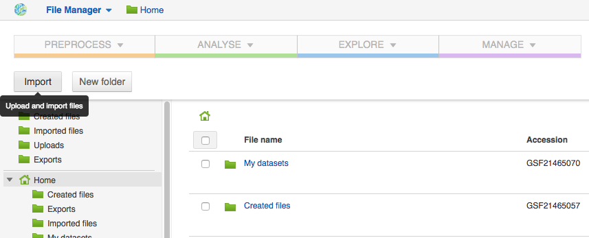

Next to the Import button, you can see a **New Folder** button. Using it
you will be able to create a new folder wherever you want. Another option
— **New folder with selection** — appears when you have selected files and
want to put all of them in a separate folder.

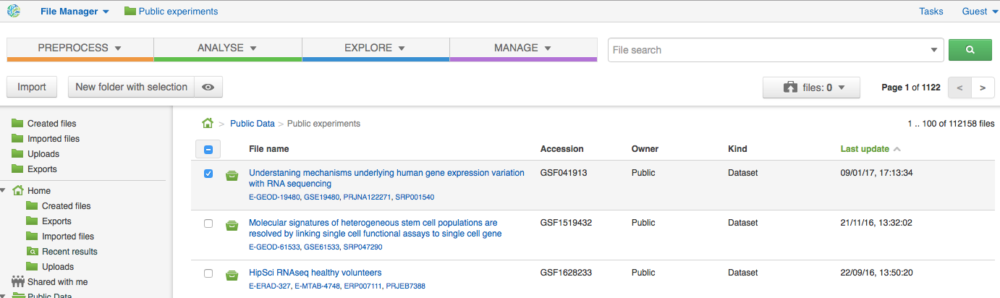

The **Preprocess, Analyse, Explore and Manage** menus at the top of the page
correspond to the four groups of applications that can be used to process and view data.
These menus will become available when you select a file. 

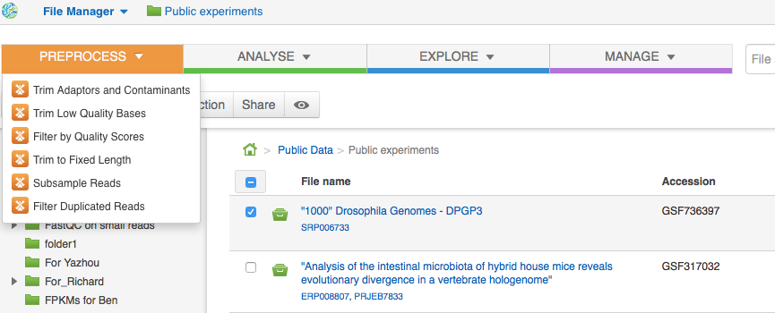

When you choose a file, the system will suggest applications which can work with the specific
file type (e.g. sequencing assay). However, you still need to think about the nature of
the data. For instance, if you want to align a raw WGBS sequencing assay,
Genestack will suggest several mappers, but only the Bisulfite
Sequencing Mapping application will be suitable in this case. To figure out what
applications are recommended to process WGBS, WES, RNA-Seq or other sequencing
data, go to the :ref:`pipelines-and-applications-label` section of this guide.

**File search** in the top-right corner allows you to search for files by
metadata (names, organism, method). To limit the search by file
type or whether or not the file is shared with you, click on the arrow
inside the search box.

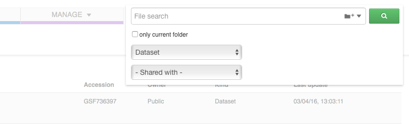

Below the search box is a button to access your **briefcase**. Your
briefcase is a place where you can temporarily store files from various
folders. **To delete** an item from your briefcase hover over it and
click on the "x" button. **To clear all** items from the briefcase, select
the "Clear all" option.

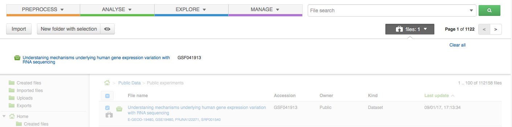

**To add** files to your briefcase, hover over each
individual file and use the special "briefcase" button or
select several files, right-click on them and choose "Add to
briefcase...".

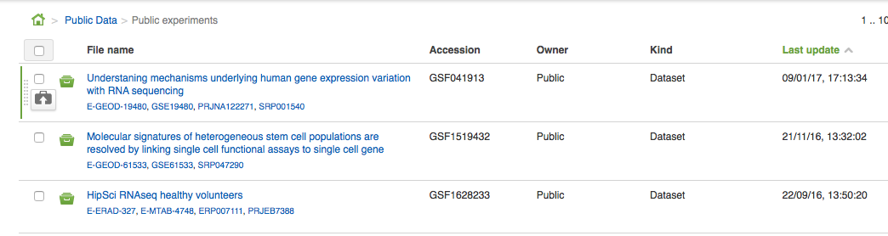

If you select a file, **three additional** buttons will show up, allowing
you to **share**, **delete** the file or **view metainfo** (an "eye"-icon) for
the file.

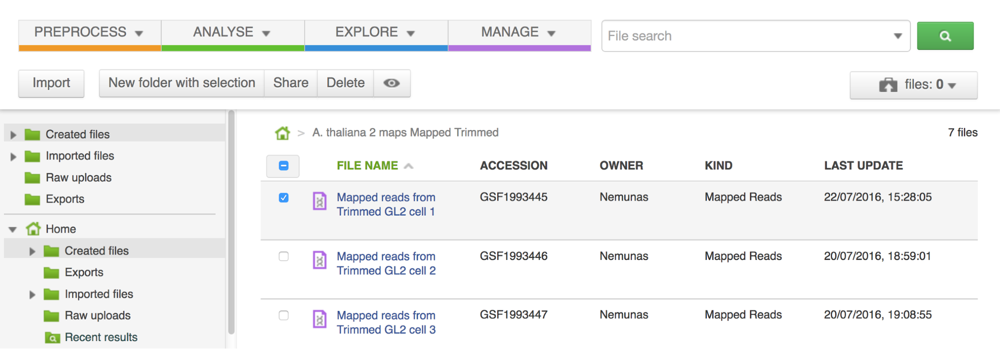

Use the **Share** button to share your data with colleagues (the share button
will not be available if you are using a guest account).
Read more about sharing on Genestack in the section :ref:`sharing-label`.

.. image:: images/share.png

The **Delete** button allows you to remove your files from the system.

.. image:: images/delete.png

The **View metainfo** button gives you more information about the file: technical
(file type, its owner, when the file was created and modified,
etc.), biological (e.g. cell line, cell type, organism, etc.), and file permissions.

.. image:: images/eye.png

.. _Getting Started With Genestack Platform: https://genestack.com/tutorial/getting-started-with-genestack-platform/
.. _Testing Differential Gene Expression: https://genestack.com/tutorial/testing-differential-gene-expression-on-genestack-platform/
.. _Whole Genome Bisulfite Sequencing Analysis: https://genestack.com/tutorial/whole-genome-bisulfite-sequencing-analysis/
.. _Whole Genome Sequencing Analysis: https://genestack.com/tutorial/wgs-analysis-on-genestack/