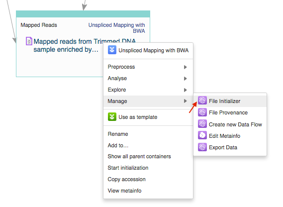

Initialising files
------------------

You can initialize files in different ways:

1. Using the **Start initialization** option in the **context menu**.

For instance, click on the name of the created dataset at the top of the application page
and select **Start initialization**.

.. image:: images/start_initialization.png
   :scale: 75 %
   :align: center

2. Clicking **Start initialization now** in the **Data Flow Runner** application.

If you want to save the pipeline and specific parameters you used in your pipeline to re-use
again on other files, you can create a new data flow with the **Data Flow Editor** app.

To proceed, сlick on the **Run dataflow** button and create all the relevant files for each
app in the pipeline. This will take you to the **Data Flow Runner** page where you can check
or change parameters of the applications by click app name and, then, initialize the
computations with the **Run Data Flow** button in the last cell.

Choose the **Start initialization now** option if you would like to run the
computations immediately or **Delay initialization till later**.

.. image:: images/start_initialization_now.png
   :scale: 90 %
   :align: center

This data flow, along with all your results (after computations are finished)
will be stored in the **Created files** folder.

3. Using **File initializer** application.

Select the data you are interested in, right click on them, choose the **File Initializer**
in the **Manage** section.

The File Initializer reports the status of the files and allows you to initialize
those that need to be by clicking on their respective the **Go!** buttons, or
**Initialize all** to do them all at once. Files do not need to be produced by
the same applications to be initialized together.

.. image:: images/file_initializer.png
   :align: center

4. Using the **Start initialization** button in the **File Provenance**.

Alternatively, you can click on the name of the last created file, go to Manage
and choose the File Provenance application. The application displays the pipeline
and also allows you to run the computation using the **Start initialization** button.
Doing this will begin initialization of all the files (including intermediate files) you have
created whilst building this pipeline.

.. image:: images/file_provenance_init.png
   :scale: 70 %
   :align: center

Regardless the way you start initialization, you can track the progress of tasks in
the **Task Manager**.