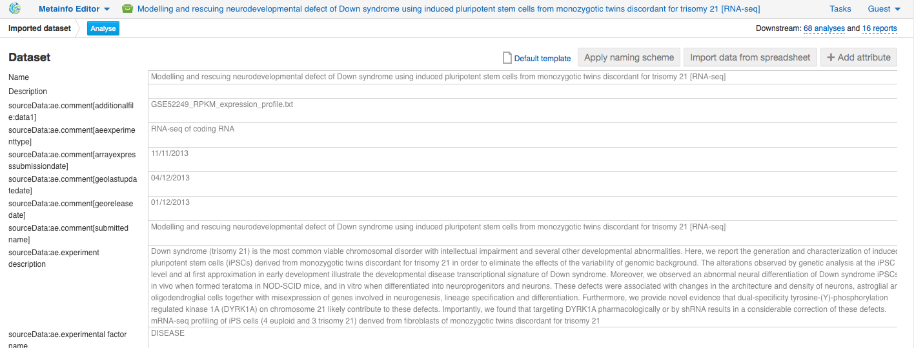

One of the most widespread applications of RNA-Seq technology is differential
gene expression (DGE) analysis. By how gene expression levels change across
different experimental conditions, we can gain clues about gene function and
learn how genes work together to carry out biological processes.

.. .. raw:: html

..    <iframe width="640" height="360" src="https://www.youtube.com/embed/aLT-FnZMIls" frameborder="0" allowfullscreen="1">&nbsp;</iframe>

In this tutorial we will use Genestack applications to identify differentially
expressed (DE) genes and further annotate them according to biological
process, molecular function, and cellular component.

The whole analysis includes the following steps:

#. Setting up an RNA-Seq experiment
#. Quality control of raw reads
#. Preprocessing of raw reads
#. Mapping RNA-Seq reads onto a reference genome
#. Quality control of mapped reads
#. Calculate read coverage for genes
#. Differential gene expression analysis

Let’s deal with these steps one by one.

Setting up an RNA-seq experiment
********************************

The first step is to choose RNA-Seq dataset. There are more than 110.000 datasets (see the
`Public experiments`_ folder) imported from various
biological databases and public repositories (e.g. ArrayExpress, GEO, SRA, and ENA).
All these data are absolutely free to use. The `Data Browser`_ app allows you to explore already
existing RNA-Seq data. Data Browser provides filters that help to find the most appropriate data,
that you can use it further in the analysis. Besides searching through all the data available
on the platform, you can also `upload your own data`_ with the **Import** app.

.. _Public experiments: https://platform.genestack.org/endpoint/application/run/genestack/filebrowser?a=GSF070886&action=viewFile
.. _Data Browser: https://platform.genestack.org/endpoint/application/run/genestack/databrowser
.. _upload your own data: https://platform.genestack.org/endpoint/application/run/genestack/uploader

Feel free to find all the data for this tutorial in the folder `Testing Differential Gene
Expression on Genestack Platform`_. To find it go to File Manager app and open the "Tutorials"
folder located in the `Public Data`_.

.. _Testing Differential Gene Expression on Genestack Platform: https://platform.genestack.org/endpoint/application/run/genestack/filebrowser?a=GSF000811&action=viewFile
.. _public data: https://platform.genestack.org/endpoint/application/run/genestack/filebrowser?a=public&action=viewFile

The RNA-Seq experiment we will use comes from `Hibaoui et al. 2013`_ and is publicly available
on Genestack. Open it in `Metainfo Editor`_ to see more details:

.. _Hibaoui et al. 2013: https://www.ncbi.nlm.nih.gov/geo/query/acc.cgi?acc=GSE52249
.. _Metainfo Editor: https://platform.genestack.org/endpoint/application/run/genestack/metainfo-editor-app?a=GSF091068&action=viewFile

The authors investigated the transcriptional signature of `Down syndrome
(trisomy 21)`_ during development, and analysed mRNA of induced pluripotent
stem cells (iPSCs) derived from fetal fibroblasts of monozygotic twins
discordant for trisomy 21: three replicates from iPSCs carrying the trisomy,
and four replicates from normal iPSCs. They identified down-regulated genes
expressed in trisomic samples and involved in multiple developmental
processes, specifically in nervous system development. Genes up-regulated in
Twin-DS-iPSCs are mostly related to the regulation of transcription and
different metabolic processes.

.. _Down syndrome (trisomy 21): https://en.wikipedia.org/wiki/Down_syndrome

To reproduce these results, we will use
`Differential Gene Expression Analysis`_ data flow. But before let's check
the quality of raw reads to decide whether we should improve it or not.

.. _Differential Gene Expression Analysis: https://platform.genestack.org/endpoint/application/run/genestack/datafloweditor?a=GSF968176&action=viewFile

