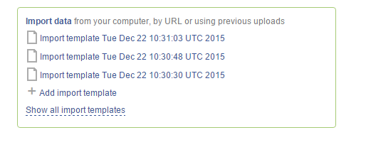

How to import data?
*******************

.. .. raw:: html

..   ..  <iframe width="640" height="360" src="https://www.youtube.com/embed/eOl1uabctzI" frameborder="0" allowfullscreen="1">&nbsp;</iframe>

Now let's discuss importing data into the platform. On the `dashboard`_ you
can find an **Import data** option. Once you click it, this will take you to
the `Import Data`_ app page.

.. image:: images/dashboard_import.png
   :scale: 90 %
   :align: center

There are various options for importing your data. You can drag and
drop or select files from your computer, import data from URL or use
previous uploads.

.. image:: images/import_1.png
   :align: center

After data is uploaded and imported, the platform automatically recognizes file
formats and transforms them into biological data types such as raw reads,
mapped reads, reference genomes and so on. This means you will not have to
worry about formats at all and this will most likely save you a lot of
time. If files are unrecognized, you can manually allocate them to a
specific data type by drag and drop.

.. image:: images/import_2.png
   :align: center

On the next **Edit metainfo** step, you can describe uploaded data. Using an Excel-like spreadsheet you can
edit the file metainfo and add new attributes, for example, cell type or
age.

.. image:: images/import_3.png
   :align: center

Additional option of importing your data is using import templates. On
the Dashboard you can find an `Add import template`_
option. Import templates allow you to specify required and optional
metainfo attributes for different file kinds. When you scroll down to
the bottom of the page, you will see an **Add import template** button.

.. _dashboard: https://platform.genestack.org/endpoint/application/run/genestack/welcome
.. _Import Data: https://platform.genestack.org/endpoint/application/run/genestack/uploader
.. _Add import template: https://platform.genestack.org/endpoint/application/run/genestack/metainfotemplateeditorapp?action=openInBrowser
.. _Genome Browser: https://genestack.com/blog/2015/05/28/navigation-in-genestack-genome-browser/
