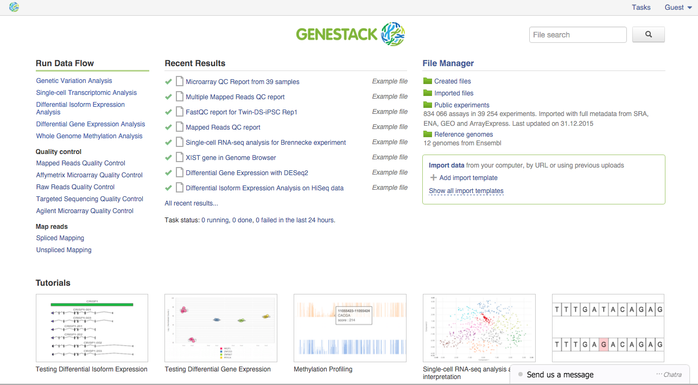

In this tutorial, we would like to introduce you to the core features of
Genestack Platform. You will learn how our system deals with files, how
it helps you organise and manage your data and how to share data with
your colleagues. You will see how easy it is to work on private and
public data simultaneously and seamlessly, and how to reproduce complex
analyses with data flows, a built-in mechanism for capturing and
replaying your research.

How to create an account?
*************************

.. .. raw:: html

..     <iframe width="640" height="360" src="https://www.youtube.com/embed/asMhUjD_i68" frameborder="0" allowfullscreen="1">&nbsp;</iframe>

It is easy to register on Genestack_. All you need to do is provide an email
and set up a password. You will quickly receive a confirmation email with a link to click on and then
you will be able to log in. After you log in, the system will take you to the
`Dashboard <wp-blog_>`_.

This is your main point of entry and the place
where you can manage and search data using the **Data Browser**, view your
recent results and share the findings with your colleagues, set up and
launch analysis pipelines and visit the tutorials section.
You can always change the settings of your account
and instead of the Dashboard choose the File Manager as the main
point of entry to the platform.

.. _Genestack: https://platform.genestack.org/endpoint/application/run/genestack/signin
.. _wp-blog: https://genestack.com/blog/2015/10/01/new-dashboard-style-start-screen-for-genestack/
