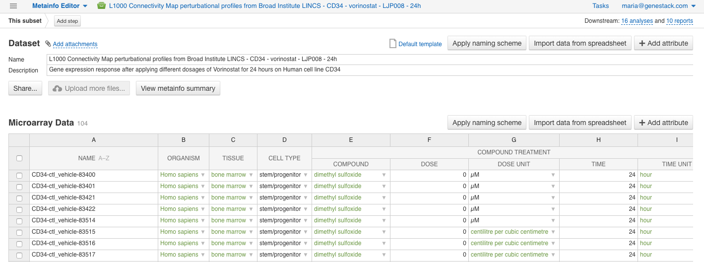
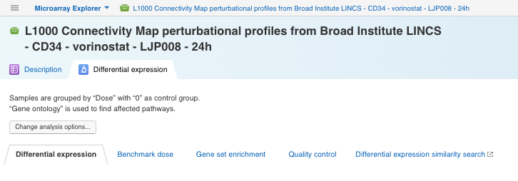
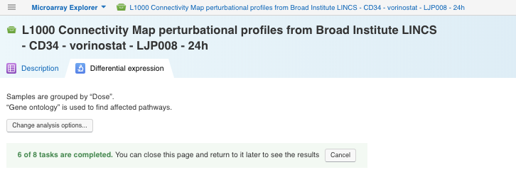
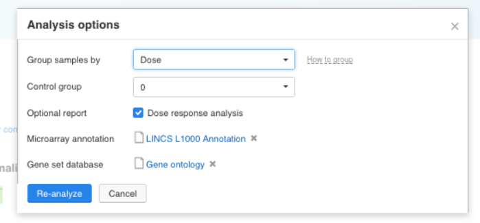
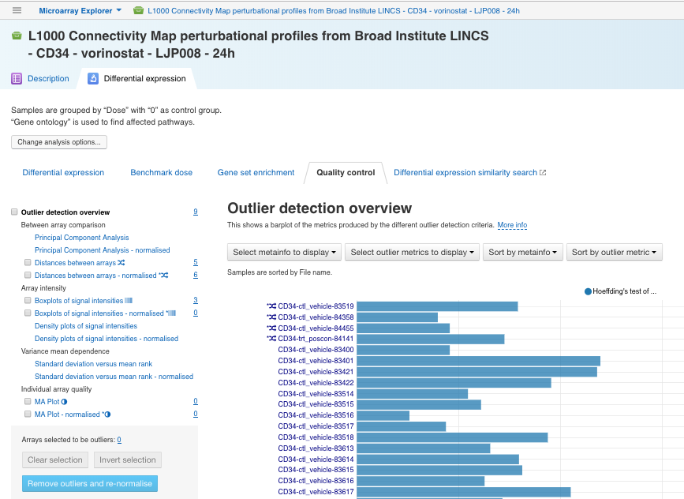

Expression microarray data analysis with Microarray Explorer
************************************************************

This tutorial will show you how to use our Microarray Explorer applied to expression microarray data analysis.

Microarray Explorer performs the comprehensive microarray data analysis from quality control check,
to dose response analysis and differential expression analysis.

The microarray analysis pipeline includes the following steps:

- Normalisation;
- Quality control;
- Differential gene expression analysis;
- Dose response analysis (optional);
- Gene set enrichment analysis.

Setting up a microarray dataset
-------------------------------

As an input for the app, you can use either your own data or one of the pre-imported public
experiments. You can explore already existing datasets with Data Browser app.

The experiment we will use further is coming from the Library of Integrated Network-Based Cellular
Signatures (LINCS) `Project`_ :
"L1000 Connectivity Map perturbational profiles from Broad Institute LINCS - CD34 - vorinostat - LJP008 - 24h".

Click the name of the experiment and open it in **Metainfo Editor** to learn more:

.. _Project: http://www.lincsproject.org/

Data analysis
-------------

You can open the input microarray dataset in the Microarray Explorer not only by right-clicking
the experiment name and selecting Microarray Explorer under "Explore" but also
via just one left-click on the experiment name.

There are two tabs on the opening application page:

1. **Description tab**, where you can find metadata associated with the data set of your choice.

.. image:: images/description.png
   :align: center

2. **Differential expression** tab that allows you to run the pipeline and
   change default parameters if it is necessary.

You can consider setting the following parameters:

- **Group samples by** option —
  to group the samples by the experimental factor specified in the associated metadata;
  for example, to group samples by different dosages of Vorinostat, you should
  select "Dose" in the list of suggested metainfo fields.

- **Control group** option — to specify the control group if needed, e.g. select 0 to compare each group of
  samples with Vorinostat against the group of samples without Vorinostat.
  If you do not set a control group ("No control group" option), each group will be compared against
  the average of the other groups.

- **Optional report** option — if you group the samples by compound dosages, the app suggests you
  to produce a dose response analysis report.

- **Microarray annotation** — to select microarray annotation that will be used in the analysis. It will only show annotations
  relevant to the platform (Affymetrix, Agilent, or L1000), for this example, you will see
  the only "LINCS L1000 Annotation".

- **Gene set database** — to choose Gene set database for the gene set enrichment analysis,
  In this tutorial, we will choose the Gene Ontology database.

To start the analysis just click on the **Analyze** button.

In the earlier stage in the microarray data analysis Microarray Explorer performs **normalisation**
to eliminate some sources of technical variation which can affect the measured gene expression levels.
Then, the quality of normalized microarrays is assessed to detect and remove potential outliers and
normalized microarrays that are of good quality, can then be processed for downstream processing.

As the reports are ready, the generated reports will appear on the app page. You can explore
the results and apply filters to show particular genes and pathways. Change parameters and **re-run
the analysis** if necessary.

You can save the results with set filters as an immutable view by clicking the
**Save current view** and share the view with your collaborator by clicking the **Share** link.
As a result, the shared view will appear in your colleague’s **Saved view list**.

Explore results
---------------

Let's look at the interactive reports that can be generated by the Microarray Explorer app in more details:

1. **Differential Expression** report. The report shows the list of top differentially expressed genes which can
   be filtered and sorted by Log FC, Log Expr, and FDR parameters.

.. image:: images/DE.png
   :align: center

2. **Benchmark dose** report.  The output of *Dose Response Analysis* that represents the compound
   dosages at which genes start to show significant expression changes, i.e. the *Benchmark Doses* (BMDs).

.. image:: images/benchmarck-dose.png
   :align: center

3. **Gene set enrichment** report. The report provides results of *Fisher’s hypergeometric test* between significant
   differentially expressed genes and gene sets corresponding to pathways or/and biological functions,
   which allows to determine whether differentially expressed genes were affected.

.. image:: images/gene-set-enrichment.png
   :align: center

4. **Quality control** report. This report represents results of a quality assessment of microarrays
   and allows to detect apparent outlier arrays. To remove outliers select the probes that should be excluded
   (some will already be automatically tagged and selected as possible outliers) and
   click the **Remove outliers** button to subset the dataset and re-run the analysis.

5. **Differential expression similarity search** link opens *Differential expression
   similarity search* application that helps you to find experiments characterised by similar differential
   expression signatures.

.. image:: images/similarity-search.png
   :align: center

Explore existing reports
------------------------

If you open an experiment in the Microarray Explorer app and go
to the **Differential Expression** tab, the latest reports you produced or viewed
will be shown on the app page. However, you can manually switch to other reports
(if any have been already created) by clicking the **Saved view** link. Immediately you
will see the list of all the available Microarray Explorer reports for a given experiment, either generated by you or
shared with you by a colleague.

