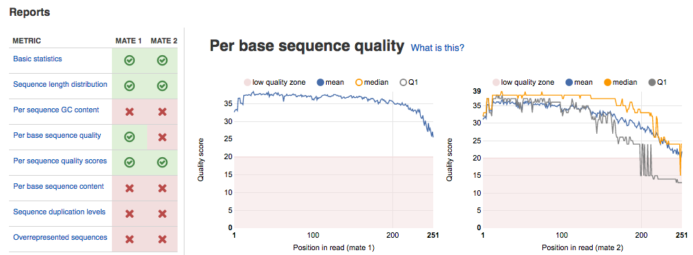
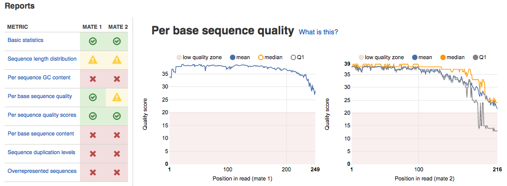

Quality control of preprocessed reads
*************************************

After preprocessing steps, we will use the **FastQC Report** application again to
compare the quality of raw and preprocessed reads and to make sure that we
improved reads quality.

Here is the FastQC report for "Mouth of Pci_SN265" sample before preprocessing:

The **Per base sequence quality** plots depict low-quality bases at the ends of
the second mate reads. After trimming and filtering, the overall quality of
reads has been improved (see the **Per base sequence quality** and **Per sequence
content** modules). We also expect warnings for **Sequence length distribution**
since the length of the reads has been changed during preprocessing.

You can find all FastQC reports for preprocessed reads in the `QC reports of
preprocessed raw reads for Alfano et al (2015)`_ folder.

.. _QC reports of preprocessed raw reads for Alfano et al (2015): https://platform.genestack.org/endpoint/application/run/genestack/filebrowser?a=GSF3775110&action=viewFile&page=1

All in all, we can notice that the quality of the reads has been noticeably improved after
preprocessing, and our samples are ready for the downstream microbiome analysis.
