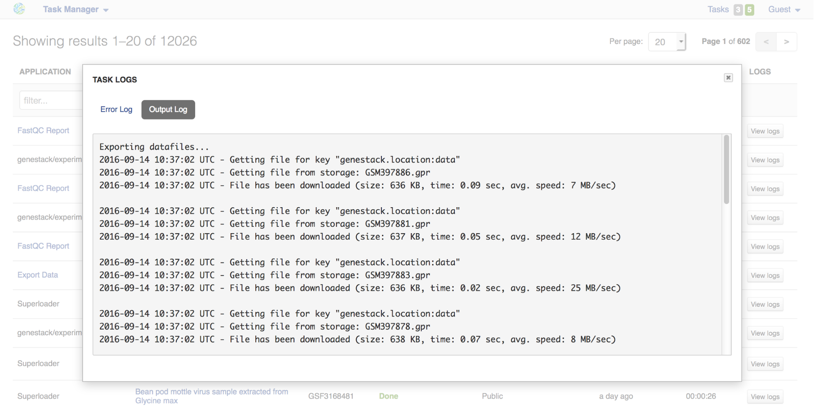
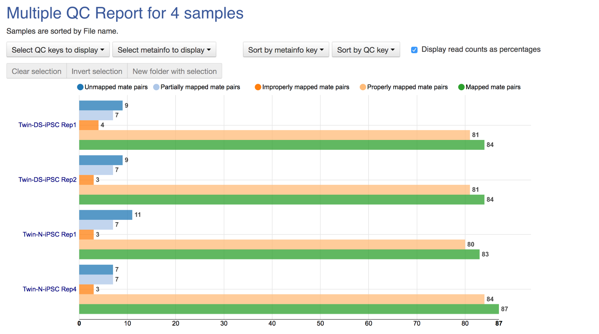

Getting Help
============

Tutorials 
---------

In our tutorials we take you through examples based on public
experiments, re-analysing the data to demonstrate the features of
particular apps. All files used (from raw sequencing reads and reference
genomes to results and data visualisations) are stored on the platform
in the “Tutorials” folder.

We have prepared tutorials on Differential Gene Expression, Methylation
Profiling, Whole Exome Sequencing, and Whole Genome Sequencing and me
plan to add more in the future.

You can find all of our tutorials here: https://genestack.com/tutorial/

Getting in touch with Genestack 
-------------------------------

There are various ways to get in touch with our team:

1)Chatra: a chat window can be found at the bottom of our homepage.
During our operating hours at least one of us is always available to
help. Outside of our operating hours, you can leave us a message using
the chat window and we will get back to you as soon as we can.

2)Forum: when you have a question about the platform, try posting it on
our forum: forum.genestack.org. Our community will definitely be keen to
help you, and if not, our team regularly checks the forum and will
answer any unanswered questions.

3)Email: you can email us at support@genestack.com 

.. |image0| image:: images/image39.png
.. |image1| image:: images/image10.png
.. |image2| image:: images/image27.png
.. |image3| image:: images/image05.png
.. |image4| image:: images/image33.png
.. |image5| image:: images/image01.png
.. |image6| image:: images/image57.png
.. |image7| image:: images/image28.png
.. |image8| image:: images/image34.png
.. |image9| image:: images/image20.png
.. |image10| image:: images/image14.png
.. |image11| image:: images/image56.png
.. |image12| image:: images/image01.png
.. |image13| image:: images/image22.png
.. |image14| image:: images/image16.png
.. |image15| image:: images/image38.png
.. |image16| image:: images/image45.png
.. |image17| image:: images/image50.png
.. |image18| image:: images/image00.png
.. |image19| image:: images/image07.png
.. |image20| image:: images/image44.png
.. |image21| image:: images/image53.png
.. |image22| image:: images/image41.png
.. |Metainfo editor.png| image:: images/image60.png
.. |managing-and-sharing-tutorial-tick-box-for-write-permissions-in-sharing-popup| image:: images/image08.png
.. |image25| image:: images/image15.png
.. |image26| image:: images/image59.png

.. |image28| image:: images/image46.png
.. |image29| image:: images/image49.png
.. |image30| image:: images/image17.png
.. |image31| image:: images/image61.png
.. |image32| image:: images/image51.png

.. |image36| image:: images/image13.png
.. |image37| image:: images/image52.png
.. |image38| image:: images/image40.png
.. |image39| image:: images/image29.png
.. |image40| image:: images/image47.png
.. |image41| image:: images/image04.png
.. |image42| image:: images/image23.png

.. |image44| image:: images/image43.png
.. |image45| image:: images/image55.png
.. |spliced mapping| image:: images/image35.png
.. |image47| image:: images/image09.png
.. |image48| image:: images/image03.png
.. |unspliced mapping with BWA| image:: images/image26.png
.. |unspliced mapping with bowtie2| image:: images/image54.png
.. |image51| image:: images/image21.png
.. |bisulfite sequencing mapping| image:: images/image31.png
.. |reduced representation bisulfite sequencing mapping| image:: images/image02.png
.. |image54| image:: images/image19.png
.. |image55| image:: images/image11.png
.. |image56| image:: images/image30.png
.. |image57| image:: images/image58.png
.. |image58| image:: images/image12.png
.. |image59| image:: images/image42.png
.. |image60| image:: images/image24.png
.. |image61| image:: images/image37.png
.. |image62| image:: images/image36.png

FAQ
====

Where do I find data shared with me?

If they have been linked, you can find them in the corresponding
group subfolder folder within the “Shared with me” folder. Otherwise,
they can be found using search.

Where do I find the data flows I have created?

How do I reuse a data flow?

Why are my tasks failing?

What’s the difference between Data Flow Runner and Data Flow Editor?

Data Flow Editor is used to create data flow templates: e.g. selecting
source files.

When you want to use the data flow to run your analysis, on the Data
Flow Editor page you can click on “Run Data Flow” button, which will
take you to Data Flow Runner. Here you can not only edit source files
and parameters, but also start initialization of your files.

How do I initialize the files?

How do I create a data flow? To create a data flow, select the data you
wish to analyse and choose the first app you wish to use in your
analysis. On the app page, using the “add step” button, add the rest of
the desired steps. Once you are done, click on the name of the file (or
files) at the top of the page, go to Manage, and click on Create New
Data Flow. Your new data flow can be found in the Created Files folder

If you don’t want to create a data flow from scratch, but rather re-use
the same analysis pipeline used to create a file, click on the name of
that file, go to Manage, and select Create New Data Flow.

Selecting File Provenance instead of Create New Data Flow will show you
the pipeline (in the form of a data flow) that was used to create this
file.

Read more about data flows in this tutorial_:

What’s the difference between BWA and Bowtie2?

The biggest differences between the two aligners are:

1)The way of accepting or rejecting an alignment.

BWA: counts the number of mismatches between the read and the
corresponding genomic position.

Bowtie2: uses a quality threshold bases on the probability of the
occurrence of the read sequence given an alignment location.

2)Accepting colorspace data:

BWA: No.

Bowtie2: Yes.

How does Genestack process paired-end reads?

There are three types of raw reads that our platform supports:

-  single-end (1 file locally, 1 file in Genestack)
-  paired-end (2 files locally, 1 file in Genestack)
-  paired-with-unpaired (3 or 4 files locally, 2 files in Genestack)

During import, Genestack recognises these types and imports them in
their respective format-free form.as 1 or 2 files. If the platform
cannot recognise the files automatically, you can allocate the files
manually.

What’s the difference between an experiment and a folder?

The main difference between a folder and an experiment is in the content
specificity.

Folders work just like folders on your computer and can contain various
biological objects\ :sup:``[bd] <#cmnt56>`__`\ : your assays, processed
files, output reports, etc.

Experiments contain only sequencing assays, but provide additional
features for storing experimental details, e.g. attached pdfs with
experiment notes. When you upload raw reads onto Genestack, they will
automatically be imported as one experiment. On the experiment page, you
can click on “View details” to read the summary of the experiment, get
more information about overall design and experiment type, contributors,
and find links to public databases.

All public experiments available on our platform are provided as
experiments, not folders. Remember you can share both experiments and
folders with other Genestack users using Groups. You can read more about
this in our `“Getting Started”`_ tutorial.

What’s the difference between masked and unmasked reference genomes?

In general, when a genomes is “masked” it means that all repeats and low
complexity regions of your reference genome (detected
by `RepeatMasker`_ tool)
are hidden away and replaced with “N”s, so that they will not be aligned
to.

We do not recommend using a masked genome, as it always  results in a
 loss of information. Masking can never be 100% accurate, and can lead
to an increase in the number of falsely mapped reads. If you’d like to
perform filtering, it’s better to do it after the mapping step.

In “soft-masked” genomes, repeated and low complexity regions are still
present, but they have been replaced with lowercased versions of their
nucleic base.

“Unmasked” genomes contain all repeats and low complexity regions
without any changes.

How do I change the name of the file?

How do I add files to the briefcase?

Where can I find the import templates I created?

.. _tutorial: https://genestack.com/tutorial/reproducing-your-work-with-data-flows/
.. _“Getting Started”: https://genestack.com/blog/2016/01/06/getting-started/
.. _RepeatMasker: http://www.repeatmasker.org/&sa=D&ust=1480960532173000&usg=AFQjCNE4ktR5xI4yZEvRi94d-Tc1QkJnvA

