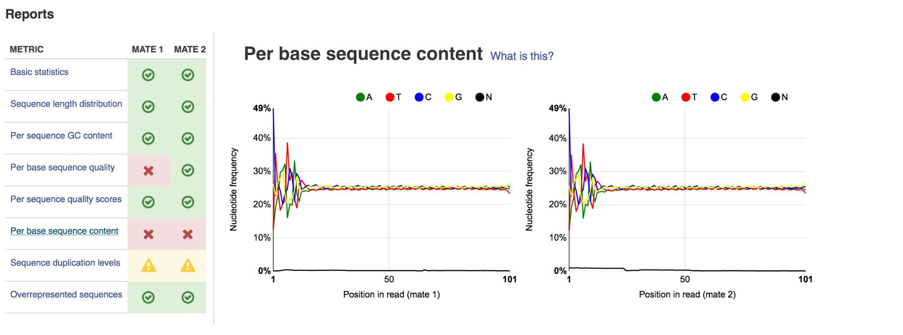
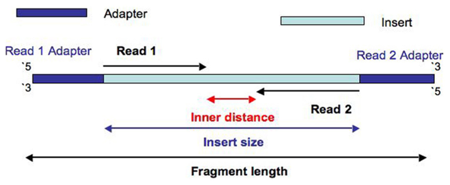
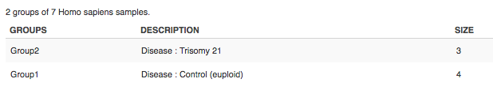
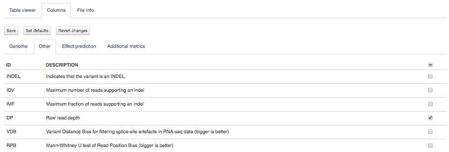
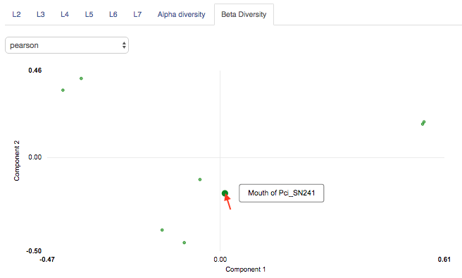
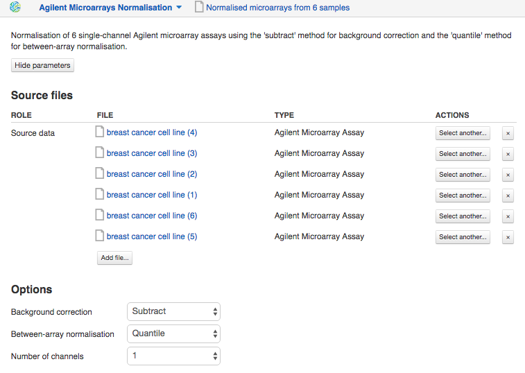
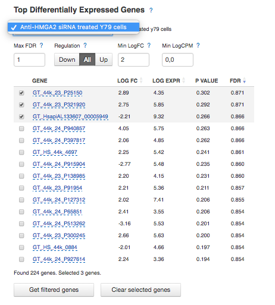
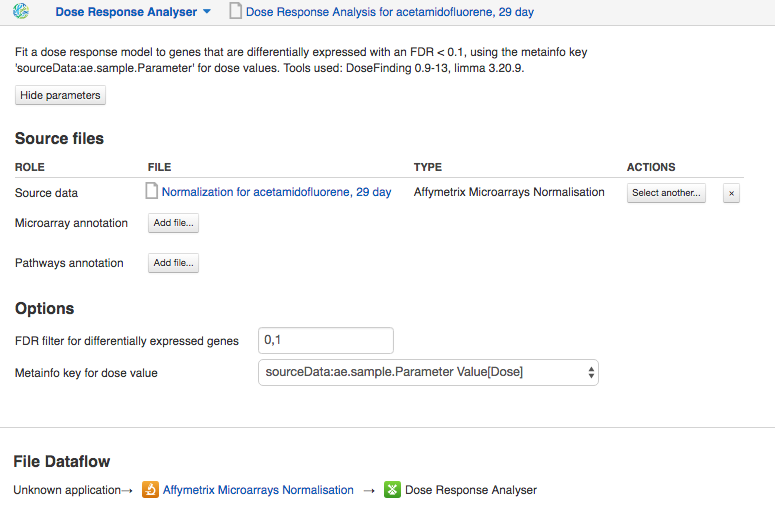
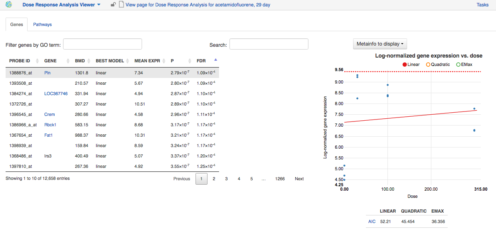
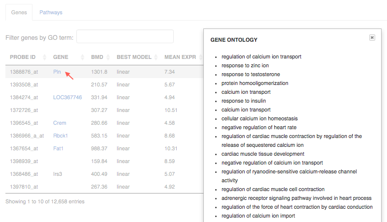

Pipelines and applications
==========================

.. TODO Add links on our youtube videos

Applications available on Genestack are grouped into four categories:
Preprocess, Analyse, Explore and Manage.

**Preprocess** contains all applications used to process files pre- or
post-alignment in order to increase the data quality.

**Analyse** contains all mappers and all other applications required to analyse
sequencing data.

**Explore** contains all interactive graphical interface applications
allowing users to view the results of their
computations. Applications for visualizing QC reports, the Genome Browser,
applications for exploring  genomic variants, and many more.

**Manage** contains applications used to manage your data: applications dealing
with data flows, file provenance, export, metadata editing and so on.

An extended version (including information on licensing and references)
of every application description found in this guide can be found in the
**"About application"** text of each of the individual application.

To view this text for a specific application, click on the application's name at the
top-left corner of the page, and in the dropdown menu select "About application".

.. image:: images/about_app.png

Sequencing data
---------------

Raw Reads Quality Control and Preprocessing
~~~~~~~~~~~~~~~~~~~~~~~~~~~~~~~~~~~~~~~~~~~

Once you have got raw sequencing data in Genestack the next steps are to
check the quality of the reads and improve it if it is necessary. Let's go
through the applications developed to assess the quality of the data and do
preprocessing.

FastQC report
^^^^^^^^^^^^^

.. TODO this is a tutorial on data flows !!!!!!
.. TODO tips: depending on the technology (WGS, WES, Microbiome, etc. data) and Organism, you can expect warnings and faiures as well

**Action**: to perform quality control (QC) of raw sequencing reads. According to
the "garbage in, garbage out" rule, if we begin our analysis with poor quality
reads, we should not expect great results at the end. Luckily, there are a few
procedures that can be used to improve the data quality if that proves to be
unsatisfactory.

The tool used for raw reads quality check is **FastQC Report** application, based on
the `FastQC tool`_ developed by Simon Andrews at the Babraham Institute.

.. _FastQC tool: http://www.bioinformatics.babraham.ac.uk/projects/fastqc/

The quickest way to perform the quality assessment of your data in Genestack
is via the public data flow `Raw Reads Quality Control`_.

.. _Raw Reads Quality Control: https://platform.genestack.org/endpoint/application/run/genestack/dataflowrunner?a=GSF3778184&action=viewFile

Another way to run the data flow is to select all of your raw reads,
right click on them and from the dropdown menu select **Run data flow on
selection** and choose the appropriate data flow.

Remember you need to initialize the computation! On the Data Flow Runner page
click on **Run Data Flow** and select **Start initialization now**.

You will have to wait for the results (you can track the progress of your
tasks in **Task Manager**). Once they are completed, you can find your files in
"Created files" folder.

Since these files were created using a data flow, they will be located in one
folder (see Platform architecture for more details). To open up one of these
reports, click on the report and select FastQC Report application from the
dropdown menu or in "Explore" section in File Manager.

On the FastQC Report page you can view both the result and the provenance of
the report file. At the top of the page you will see the file name and the
version of the fastQC application used. The **View parameters** button will show you
source files and the command line options used to generate the report. The
**Hide parameters** button will hide this technical information. Below that you
will see the File Dataflow, in this case it should only contain two application entries -
Experiment Loader and FastQC Report. In other cases, you might see more than
two applications in this line.

Finally, the results can be viewed in the "Reports" section. Here you will find
various graphs that visualize the quality of your data. We’ll go through all
of them one by one and tell you:

1. how they should  look for data of perfect quality; 
2. how they may look if there is something wrong with your data;
3. what you can do if the quality is unsatisfactory.

The metrics table gives you quick indicators as to the status of each of
the quality metrics calculated.

- Yellow triangles - warnings;
- Red X-es - failures;
- Green check marks in circles - ok.

1. **Basic statistics**

.. image:: images/fastqc_basic_statistics.png

Information on type and number of reads, GC content, and total sequence length.

2. **Sequence length distribution**

.. image:: images/fastqc_sequence_length_distribution.png

Reports lengths of all sequences.

*Warning*

This report will warnings if the lengths are not identical, but this can
usually be ignored, as it is expected for some sequencing platforms.

3. **Per sequence GC content**

.. image:: images/fastqc_per_sequence_gc_content.png

For data of good quality, the graph will show a normal, bell-shaped
distribution.

*Warning*

It raises a warning when the sum of the deviations from the normal distribution
represents more than 15% of the reads.

Warnings are usually caused by a presence of contaminants. Sharp peaks may
represent a presence of a very specific contaminant (e.g. an adaptor). Broader
peaks may indicate contamination with a range of contaminants.

*Improving data quality*

Run **Trim Adaptors and Contaminants** preprocessing application.

4. **Per base sequence quality** plot

.. image:: images/fastqc_per_base_sequence_quality.png

For data of good quality, the median quality score per base (Phred) should not
drop below 20.

*Failure*

A failure will be raised if the lower quartile for quality at any base position
is less than 5 or if the median for any base is less than 20.

*Improving data quality*

If the quality of the library falls to a low level over the
course of a read, the blueprint solution is to perform quality trimming of low
quality bases or omitting low quality reads. This can be performed using **Trim
Low Quality Bases** or **Filter by Quality Scores** applications respectively.

5. **Per sequence quality scores** plot 

Ideally, we expect to see a sharp peak at the very end of the graph (meaning
most frequently observed mean quality scores are above 27)

*Warning*

A warning is raised when the peak is shifted to the left, which means the most
frequently observed mean quality is below 27. This equals to a 0.2% error rate.

*Improving data quality*

Perform quality-based trimming or selection using **Trim Low
Quality Bases** or **Filter by Quality Scores** applications respectively.

6. **Per base sequence content**

Ideally, in a random library we would see four parallel lines representing the
relative base composition. Fluctuations at the beginning of reads in the tested
sample may be caused by adapter sequences or other contaminations of the
library.

A bias at the beginning of the reads is common for RNA-Seq data. This occurs
during RNA-seq library preparation, when "random" primers are annealed to the
start of sequences. These primers are not truly random, and it leads to a
variation at the  beginning of the reads.

*Warning*

A warning will be raised  if the difference between A and T, or G and C is
greater than 10% at any position.

*Improving data quality*

If there is instability at the start of the read the consensus is that no QC
is necessary. If variation appears over the course of a read **Trim to Fixed
Length** application may be used. If there is persistent variation throughout
the read it may be best to discard it. Some datasets may trigger a warning due
to the nature of the sequence. For example, bisulfite sequencing data will have
almost no Cytosines. Some species may be unusually GC rich or poor and
therefore also trigger a warning.

7. **Sequence duplication levels** plots

.. image:: images/fastqc_sequence_duplication_levels.png

Reports total number of reads, number of distinct reads and mean duplication
rates.

*Warning*

This module will issue a warning if non-unique sequences make up more than 20%
of the total.

There are two potential types of duplicates in a library: technical duplicates
arising from PCR artefacts or biological duplicated which are natural
collisions where different copies of exactly the same sequence are randomly
selected. From a sequence level there is no way to distinguish between these
two types and both will be reported as duplicates here.

*Improving data quality*

If the observed duplications are due to primer/adaptor contamination, they can
be removed using the **Trim Adaptors and Contaminants** application. **Filter
Duplicated Reads** application can also be used for DNA sequencing data but
will distort expression data.

8. **Overrepresented sequences**

.. image:: images/fastqc_overrepresented_sequences.png

Shows the highly overrepresented sequences (more than 0.1% of total sequence)
in the sample.

*Warning*

A warning will be raised  if any sequence is found to represent more than 0.1%
of the total.

There are several possible sources of overrepresented sequences:

- technical biases (one region was sequenced several times; PCR amplification
  biases);
- feature of library preparation (e.g. for targeted sequencing);
- natural reasons (RNA-Seq libraries can naturally present high duplication
  rates).

Overrepresented sequences should only worry you if you think they are present
due to technical biases.

*Improving data quality*

Procedures and caveats for improving data quality are the same as for sequence
duplication level.

Multiple QC Report
^^^^^^^^^^^^^^^^^^

**Action**: to display metrics from multiple reports at once. It accepts as
input a collection of QC reports. For example, let's select our FastQC reports
in order to compare them in **Multiple QC Report**.

Select from a range of QC keys to display on the plot, e.g. Total nucleotide
count (mate 1 and 2), Number of reads (mate 1 and 2):

You can select which metainfo to display in the plot labels:

.. image:: images/multiple_qc_report_metinfo.png

Also, samples in the Multiple QC Report can be sorted by metainfo key or
specified QC metric.

.. image:: images/multiple_qc_report_sorting.png

Finally, you can highlight the interesting reports and put them in a separate
folder (**New folder with selection** button).

When the quality of the raw reads is unsatisfactory, several preprocessing
applications are available on the platform that can increase the quality of
your raw reads. Here we will walk you through each one and give you a
checklist to use when deciding which to select. After each of the
preprocessing steps, you can use the FastQC Report application again to compare the
quality pre- and post-processing (remember that in order to do this, you need
to run a different computation, this time inputting processed data source
files into the data flow).

Subsample Reads
^^^^^^^^^^^^^^^

**Action**: to create a random subset of raw reads.

Let's look at the options:

1. **Random  seed** value will let you create different subsets with the same
   number of reads. (default: 100)
2. **Number of reads in subset** tells the application how many reads you
   expect the output subsample will contain. (default: 50,000)

Using the same seed and the same number of reads will result in identical
subsets.

This application is based on Seqtk_.

.. _Seqtk: https://github.com/lh3/seqtk

Filter Duplicated Reads
^^^^^^^^^^^^^^^^^^^^^^^

**Action**: to discard duplicated sequenced fragments from raw reads data. If
the sequence of two paired reads or a single read occurs multiple times in a
library, the output will include only one copy of that sequence.

The phred quality scores are created by keeping the highest score across all
identical reads for each position.

This tool is based on Tally_.

.. _Tally: http://www.ebi.ac.uk/~stijn/reaper/tally.html

If you suspect contamination with primers, or some  other repetitive sequence.
This should be evident from Sequence duplication levels and Overrepresented
Sequences of the FastQC report. Keep in mind this application should not be used with
RNA-seq data as it will remove observed differences in expression level.

Filter by Quality Scores
^^^^^^^^^^^^^^^^^^^^^^^^

**Action**: to discard reads from a sequencing assay based on Phred33 quality
scores. The application classifies the sequence as pass or fail calculating
quality score distribution for each read.

1. **Minimum quality score (Phred+33 range, 0... 41)** is quality cuttoff
   value. A score of 20 means that there is a 1% chance that the corresponding
   base was called incorrectly by the sequencer. A score of 30 means a 0.1%
   chance of an incorrect base call. (default: 20)
2. **Percentage of bases to be above the minimum quality score** is number of
   nucleotides in the reads having quality equal to or higher than the chosen
   minimum quality score. 100% requiers all bases in the reads to be equal to
   or higher than the quality cut-off value. 50% means requires the median of
   the bases to be at least the quality cut-off value. (default: 80)

Let's take an example, to understand how the application works. So, here is our
read:

.. image:: images/filter_by_quality_scores_example.png

Second line represents nucleotide sequence (10 bases in this case). The forth
line contains quality scores for each nucleotide in the read.

- If "Minimum quality score" is equal to 30 and "Percentage of bases" is equal
  to 50, this read will not be discarded, because the median quality of the
  read is higher than 30.
- If "Minimum quality score" is equal to 20 and "Percentage of bases" is equal
  to 100, the read will be discarded, because not all bases have quality equal
  to or higher than 20.

This tool is based on **fastq_quality_filter**, which is part of the
FASTX-Toolkit_.

.. _FASTX-Toolkit: http://hannonlab.cshl.edu/fastx_toolkit/

This application is best used if you have some low quality reads, but others are of
high quality. You should be able to tell if this is the case from the shape of
the Per sequence quality scores plot from FastQC. It may also be worth trying
this application if the per base sequence quality is low.

Trim Adaptors and Contaminants
^^^^^^^^^^^^^^^^^^^^^^^^^^^^^^

**Action**: to find and trim adaptors and known contaminating sequences from
raw reads data.

The application uses an internal list of sequences that can be considered as
contaminants. This list is based on the possible sequencing technologies and
platform used. For instance, it contains widely used PCR primers and
adaptors for Illumina, ABI etc (see the `list of primers and adaptors`_ we
remove).

.. _list of primers and adaptors: https://s3.amazonaws.com/bio-test-data/Genestack_adapters.txt

The occurrence threshold before adapter clipping is set to 0.0001. It refers to
the minimum number of times an adapter needs to be found before clipping is
considered necessary.

1. **Minimum length of the trimmed sequence (bp)**. The application will
   discard trimmed reads of length below this number. (default: 15)

his tool is based on fastq-mcf_, one of the EA-Utils_ utilities.

.. _fastq-mcf: https://github.com/ExpressionAnalysis/ea-utils/blob/wiki/FastqMcf.md
.. _EA-Utils: https://expressionanalysis.github.io/ea-utils/

The application is best used when you have irregularities in GC content, in
base content at the start of reads, duplicated reads. Since this QC application relies
on sequence matching it should be run first if used in conjunction with other
QC applications.

Trim Low Quality Bases
^^^^^^^^^^^^^^^^^^^^^^

**Action**: to isolate high-quality regions from raw reads.

Trim Low Quality Bases application is based on `Phred algorithm`_. It finds
the longest subsequence in read where the estimated error rate is below the
error threshold (which is equal to 0.01 by default).

.. _Phred algorithm: http://www.phrap.org/phredphrap/phred.html

To understand how the application works let's take an example. So, imagine we
have a sequence:

The application will find the fragment of the read where the sum of all
probability errors will not be more than 0.01 (in our case). In this case, the
best sequence will be "TAGA" (.001*2 + .0001*2 = .0022) and it will be the
output read. Other fragments will have the sum of error probabilities more
than the cuttoff 0.01, so they will be ignored.

This tool is based on the `Seqtk`_ tool and uses Phred algorithm to pick out
the reqions of highest quality.

.. _Seqtk: https://github.com/lh3/seqtk

Trim Reads to Fixed Length
^^^^^^^^^^^^^^^^^^^^^^^^^^

**Action**: to trim a specific amount of bases from the extremities of all
reads in a sample.

1. **Keep bases from position** option asks you to specify the first base that
   should be kept. (default: 1)
2. **Keep bases to position (set to zero for entire read)**. Indicate the
   position of the last nucleotide that should be kept in the read. (default:
   0)

For example, if you set 5 as the first base to keep and 30 as the last base to
keep, it means that the application trims all nucleotides before the 5th
position, and all nucleotides after the 30th base.

This tool is based on **fastx_trimmer**, which is part of the `FASTX-Toolkit`_.

.. _FASTX-Toolkit: http://hannonlab.cshl.edu/fastx_toolkit/

Trim Reads to Fixed Length application is helpful when you want to obtain
reads of a specific length (regardless of the quality).

.. TODO Add info about Merge Raw Reads application (the one without UI)

Mapped Reads Quality Control and Preprocessing
~~~~~~~~~~~~~~~~~~~~~~~~~~~~~~~~~~~~~~~~~~~~~~

If you analysing mapped reads, we recommend you check if there are any
biases taken place during mapping process (e.g. low coverage, experimental
artifacts, etc.) and do preprocessing of mapped reads.

Mapped Reads QC Report
^^^^^^^^^^^^^^^^^^^^^^

**Action**: to perform quality control (QC) of mapped reads.

We follow a similar procedure to the one used to generate FastQC reports.
After selecting all the mapped reads we wish to check the quality of, we can
use the `Mapped Reads QC`_ public data flow, initialize the computations, and
then explore the results. You can read more about the Mapped Reads QC Report
application in the "Explore" section of this guide.

.. _Mapped Reads QC: https://platform.genestack.org/endpoint/application/run/genestack/dataflowrunner?a=GSF3778257&action=viewFile

An individual Mapped Reads QC report contains some technical information about
source data, tools used and data flow.

Also, it includes a range of **Mapping statistics**. For **single reads**,
you'll calculate these QC metrics:

#. *Total number of reads*: how many reads used to map to the reference genome;
#. *Unmapped reads*: total number of reads which failed to map to the reference
   genome;
#. *Mapped reads*: total number of reads aligned to the reference genome;
#. *Uniquely mapped reads*: total number of reads aligned exactly 1 time to the
   reference genome;
#. *Multi-hit mapped reads*: total number of reads aligned >1 times to the
   reference genome.

In case you analyse **paired-end reads** data, you'll see the following
statistics:

#. *Total number of mate pairs*: how many paired-end reads used to map to the reference genome;
#. *Mapped mate pairs*: total number of paired reads where both mates were
   mapped;
#. *Partially mapped mate pairs*: total number of paired reads where only one
   mate in the pair was mapped;
#. *Unmapped mate pairs*: total number of paired reads which failed to map to the
   reference genome;
#. *Improperly mapped mate pairs*: total number of paired reads where one of the
   mates was mapped with an unexpected orientation;
#. *Properly mapped mate pairs*: total number of paired reads where both mates
   were mapped with the expected orientation.

**Coverage by chromosome** plot is reported for both read types.

This plot shows the percentage of reads covered by at least x reads. To clear
it up, let's just imagine that we have a plot which shows coverage only for one
chromosome and therefore it shows 1 line. If on the x-axis we have e.g. 100
reads, on y-axis - 10% (percentage of chromosome bases covered by 100 reads).
So, it looks like we have 100-reads coverage for 10% of chromosome.

The amount of coverage you are expecting varies with the experimental
techniques you are using. Normally you want similar coverage patterns across
all chromosomes, but this may not be the case if e.g. you are dealing with
advanced stage cancer.

.. TODO: What does it look like when data is of poor quality ( + what can we do about it)

**Insert Size statistics** will be calculated for paired-end reads only.

.. note:: **What is the difference between fragment size, insert size and mate
          inner distance?**

          Mate inner distance is the length between the two sequence reads.
          Insert size is normally the distance between paired-end adaptors
          (paired-end reads + mate inner distance). Fragment size is the
          insert plus both adaptors.

Insert size statistics are useful to validate library construction and include:

#. *Median insert size* - a middle of a sorted list of insert sizes;
#. *Median absolute deviation* is calculated by taking the median of the absolute
   deviations from the median insert size;
#. *Mean insert size (trimmed)* - an average of the insert sizes;
#. *Standard deviation of insert size* measures the variation in insert sizes
   from the mean insert size.

**Insert size distribution** graph is displayed for paired-end reads:

This graph shows the  distribution of insert sizes.

Of course, the expected proportions of these metrics vary depending on the type
of library preparation used, resulting from technical differences between
pair-end libraries and mate-pair libraries.

Mapped Reads QC Report application is based on `BEDtools
<http://bedtools.readthedocs.io/en/latest/>`_ and Picard_ tool.

.. _Picard: http://broadinstitute.github.io/picard/

.. TODO What should "Insert size distribution" plot look like normally?
.. TODO What does it look like when data is of poor quality ( + what can we do about it)

You can analyse the output for several Mapped Reads QC reports at once using
our Multiple QC Report application.

This is helpful, because it allows you to see in comparison, how many reads in
your experiment are unmapped, partially or improperly mapped.

Targeted Sequencing QC Report
^^^^^^^^^^^^^^^^^^^^^^^^^^^^^

This application is good to use when analysing Targeted Sequencing data, e.g.
Whole Exome Sequencing assays.

**Action**: to assess whether the target capture has been successful, i.e. if
most of the reads actually fell on the target, if the targeted bases reached
sufficient coverage, etc.

1. **Compute enrichment statistics based on** option. The application allows
   you to compute enrichment statistics for reads mapped only on exome, only
   on target file, or both exome and target file. (default: Exome)

The following enrichment statistics are computed:

- Number and proportion of mapped reads on target;
- Mean coverage on target with at least 2X coverage;
- Target bases with at least 2, 10, 20, 30, 40, and 50 x coverage.

You can generate these reports directly by choosing Mapped Reads files, right
clicking on them and selecting the appropriate application (in "Explore" section) or
using "Run data flow on selection..." option and `Targeted Sequencing Quality
Control`_ public data flow.

.. _Targeted Sequencing Quality Control: https://platform.genestack.org/endpoint/application/run/genestack/dataflowrunner?a=GSF3778331&action=viewFile

You can analyse the output for multiple reports at once using the Multiple QC
Report application.

This application is based on `BEDtools
<https://code.google.com/archive/p/bedtools/>`_, Picard_ tools and `SAMtools
<http://samtools.sourceforge.net/>`_.

.. _Picard: http://broadinstitute.github.io/picard/

Apart from quality control applications, Genestack suggests you a bunch of
applications to preprocess mapped reads.

Mark Duplicated Mapped Reads
^^^^^^^^^^^^^^^^^^^^^^^^^^^^

Duplicated reads are reads of identical sequence composition and length,
mapped to the same genomic position. Marking duplicated reads can help speed
up processing for specific applications, e.g. variant calling step, where
processing additional identical reads would lead to early PCR amplification
effects (jackpotting) contributing noise to the signal.

You can read more about duplicated mapped reads in this excellent `SeqAnswers
thread`_.

.. _SeqAnswers thread: http://seqanswers.com/forums/showthread.php?t=6854

**Action**: to go through all reads in a mapped reads sample, marking as
"duplicates" for paired or single reads where the orientation and the 5’
mapping coordinate are the same.

3’ coordinates are not considered due to two reasons:

#. The quality of bases generated by sequencers tends to drop down toward the
   3’ end of a read. Thus its alignment is less reliable compared to the 5’
   bases.
#. If reads are trimmed at 3’ low-quality bases before alignment, they will
   have different read lengths resulting in different 3’ mapping coordinates.

In such cases, when the distance between two mapped mates differs from the
internally estimated fragment length, including mates mapping to different
chromosomes, the application will not identify or use them but will not fail
due to inability to find the mate pair for the reads.

Marking duplicated reads can help speed up processing for specific applications,
e.g. **Variant Calling** application.

This tool is based on **MarkDuplicates**, part of `Picard`_ tool.

.. _Picard: http://broadinstitute.github.io/picard/

Remove Duplicated Mapped Reads
^^^^^^^^^^^^^^^^^^^^^^^^^^^^^^

The point of removing duplicated mapped reads is to try to limit the influence
of early PCR selection (jackpotting). Whether or not you should remove
duplicate mapped reads depends on the type of data you have. If you are
dealing with whole-genome sequencing data where expected coverage is low and
sequences are expected to be present in similar amounts, removing duplicated
reads will reduce processing time and have little deleterious effect on
analysis. If however you are processing RNA-seq data, where the fold-variation
in expression can be up to 10^7, reads are relatively short, and your main
point of interest is the variation in expression levels, this probably is not
the tool for you.

You can read more about duplicated mapped reads in this excellent `SeqAnswers
thread`_.

.. _SeqAnswers thread: http://seqanswers.com/forums/showthread.php?t=6854

**Action**: to go through all reads in a Mapped Reads file, marking as
"duplicates" paired or single reads where the orientation and the 5’ mapping
coordinate are the same and discarding all except the "best" copy.

3’ coordinates are not considered due to two reasons:

#. The quality of bases generated by sequencers tends to drop down toward the
   3’ end of a read. Thus its alignment is less reliable compared to the 5’
   bases.
#. If reads are trimmed at 3’ low-quality bases before alignment, they will
   have different read lengths resulting in different 3’ mapping coordinates.

The application also takes into account interchromosomal read pairs.

In such cases, when the distance between two mapped mates differs from
the internally estimated fragment length, including mates mapping to
different chromosomes, the application  application cannot identify them but
will not fail due to inability to find the mate pair for the reads.

This application is based on **MarkDuplicates**, part of the Picard_ tools.

.. _Picard: http://broadinstitute.github.io/picard/

Subsample Reads
^^^^^^^^^^^^^^^

You can use this application if you want to take a look at what your final
experimental results will look like, but do not want to spend time processing
all your data right away.

**Action**: to create a random subset of mapped reads.

1. **Subsampling ratio (percentage)** option is used to set a fraction of
   mapped reads you would like to extract (default: 50).
2. **Random seed** option will let you produce different subsets with the same
   number of mapped reads. (default: 0)
   
Using the same random seed and the same subsampling ratio will result in
identical subsets.

This application is based on `SAMtools <http://samtools.sourceforge.net/>`_.

Merge Mapped Reads
^^^^^^^^^^^^^^^^^^

The application is useful when you have multiple replicates of the same
experiment and want to combine them before producing your final result.

**Action**: to merge multiple Mapped Reads files, producing one single
output Mapped Reads file.

The application is based on `SAMtools <http://samtools.sourceforge.net/>`_.

Convert to Unaligned Reads
^^^^^^^^^^^^^^^^^^^^^^^^^^

The application will be very useful when you are interested in fraction of reads
that exactly will map to genome or when you'd like to remap the reads with
other aligner.

**Action**: to convert mapped reads into unaligned reads.

This application is based on Picard_ tools.

.. _Picard: http://broadinstitute.github.io/picard/

Variants Preprocessing
~~~~~~~~~~~~~~~~~~~~~~

While analysing variants, you also can preprocess them. Just select Genetic
Variations file and click on "Preprocess" section to see what applications
are available for you.

Merge Variants
^^^^^^^^^^^^^^

Merging variants can be useful, when you have, for example, one Genetic
Variations file for SNPs and another one for Indels. After their merging, the
result Genetic Variations file will separately contain information about SNPs
and about Indels.

**Action**: to merge two or more Genetic Variations files into a single file.

This application is based on `BCFtools
<http://samtools.github.io/bcftools/bcftools.html>`_.

Concatenate Variants
^^^^^^^^^^^^^^^^^^^^

Concatenation would be appropriate if you, for example, have separate Genetic
Variations files for each chromosome, and simply wanted to join them
'end-to-end' into a single Genetic Variations file.

**Action**: to join two or more Genetic Variations files by concatenating them
into a larger, single file.

The application always allows overlaps so that the first position at the start
of the second input will be allowed to come before the last position of the
first input.

1. **Remove duplicated variants** option checks for the duplicated variants and
   makes sure that there are no redundant results. (default: unchecked)

The application is based on `BCFtools
<http://samtools.github.io/bcftools/bcftools.html>`_.

RNA-seq Data Analysis
~~~~~~~~~~~~~~~~~~~~~

.. TODO: Add info about RNA-seq technology

Mapping (also called alignment) refers to the process of aligning sequencing
reads to a reference sequence, whether the reference is a complete genome,
transcriptome, or de novo assembly.

.. note:: **What is a difference between genome, exome and transcriptome**?

          Genome includes both coding (genes) and noncoding DNA in a given cell
          type.

          Exome is a  part of genome formed by exons, i.e it includes all
          DNA that is transcribed into mRNA.

          Transcriptome is a collection of all mRNAs present in a given cell
          type. In comparison to the genome, the transcriptome is dynamic in
          time (within the same cell type) in response to both internal and
          external stimuli. Thus, the transcriptome derived from any one cell
          type will not represent the entire exome, i.e. all cells my have
          essentially the same genome/exome, but not all genes are expressed in
          a specific cell type.

There are at least two types of mapping strategies - Spliced Mapping and
Unspliced Mapping. In case of RNA-seq data, reads are derived from mature mRNA,
so there's typically no introns in the sequence. For example, if the read spans
two exons, the reference genome might have one exon followed by an intron.

.. note:: **What is a difference between exons and introns?**

          Exons and introns are both parts of genes. However, exons code for
          proteins, whereas introns do not. In RNA splicing, introns are
          removed and exons are jointed to one another to generate mature
          messenger RNA (mRNA) which is further used to synthesize proteins.

In this case, if you'll use Unspliced Mapper, the reference genome would find
a matching sequence in only one of the exons, while the rest of the read would
not match the intron in the reference, so the read can't be properly aligned.
When analysing RNA-seq data using unspliced aligner, the reads may be mapped to
potentially novel exons, however reads spanning splice junctions are likely to
remain unmapped.

In contrast, Spliced Mappers would know not to try to align RNA-seq reads to
introns, and would somehow identify possible downstream exons and try to align
to those instead ignoring introns altogether. Taking this into account, we
recommend you use Spliced Mapping applications to analyse RNA-seq data.

On Genestack, you will find two spliced aligners - Spliced Mapping with
Tophat2 and Spliced Mapping to Transcriptome with STAR.

.. TODO: Add a forum post on the differences between the two spliced mappers and paste a link on it here.

Spliced Mapping with Tophat2
^^^^^^^^^^^^^^^^^^^^^^^^^^^^

**Action**: to map raw reads with transcriptomic data like RNA-seq to a
reference genome, taking or not taking into account splice junctions.

.. note:: **What is splice junction?**

          Splice junctions are exon-intron boundaries, at which RNA splicing
          takes place. For example, to cut an intron (between two exons) you
          need to splice in two places so that two exons might be jointed.

Let’s have a look at the application page and talk about various parameters:

Details on various settings:

1. **Strand-specificity protocol**. If you are using strand-specific RNA-seq
   data, this option will let you choose between the "dUTP" and "ligation"
   method. If you are not sure whether your RNA-seq data is strand-specific
   or not, you can try using Subsample Reads application to make a small
   subsample, map it with Spliced Mapping with Tophat2 and check the coverage
   in Genome Browser for genes on both strands. (default: None)
2. **Rule for mapping over known annotations**. This option allows you to use
   annotated transcripts from the reference genome to distinguish between
   novel and known junctions ("Yes, and discover novel splice junctions").
   Also, you can restrict mappings only across known junctions ("Yes, without
   novel splice junctions discovery") or infer splice junctions without any
   reference annotation ("Do not use known annotations"). (default: "Yes, and
   discover novel splice junctions")
3. **Rule for filtering multiple mappings**. If you set "Unique mappings only",
   the application will report only unique hits for one mappable read. If you
   are interested in reads mapped to multiple positions in the genome, choose
   "Multiple mappings only". Select "None", if you would like to get both
   unique and multiple mappings. (default: None)
4. **Number of best mappings to report** option lets you increase the number
   of reported mappings. This can be used together with "Rule for filtering
   mappings" to choose whether to keep reads mapping to uniquely or to
   multiple positions, e.g. report up to 5 possible mappings, and only for
   multi-hit reads. (default: 1)
5. **Number of allowed mismatches** option lets you set the maximum number of
   allowed mismatches per read. (default: 2)
6. **Disallow unique mappings of one mate** option allows you to discard pairs
   of reads where one mate maps uniquely and the other to multiple positions.
   (default: unchecked)
7. **Disallow discordant mappings** will discard all mappings where the two
   mates map uniquely but with unexpected orientation, or where the distance
   between two mapped mates differs from and internally estimated fragment
   length, including mates mapping to different chromosomes. (default:
   unchecked)

The application is based on Tophat2_ aligner and used in the `Testing
Differential Gene Expression tutorial`_.

.. _Tophat2: https://genomebiology.biomedcentral.com/articles/10.1186/gb-2013-14-4-r36
.. _Testing Differential Gene Expression tutorial: http://genestack-user-tutorials.readthedocs.io/tutorials/DGE_analysis/index.html

Spliced Mapping to Transcriptome with STAR
^^^^^^^^^^^^^^^^^^^^^^^^^^^^^^^^^^^^^^^^^^

**Action**: to perform gapped read alignment of transcriptomic data (like
RNA-seq) to a Reference Genome taking into account splice junctions.

In comparison to Tophat2, STAR works fast, at the same time being very accurate
and precise. Moreover, in contrast to all our other mappers, it maps reads onto
the reference transcriptome, not the genome. Another advantage of the
application is that it can be used to analyse both: short and long reads,
making it compatible with various sequencing platforms. What's more, this
Spliced Mapper supports two-pass alignment strategy when it runs the second
alignment pass to align reads across the found splice junctions, which improves
quantification of the novel splice junctions. Taking all these features into
account, the Spliced Mapping to Transcriptome with STAR application can be a
very good alternative to other RNA-seq aligners.

Here is the application page:

Now, let's look through the application parameters:

1. **Enable two pass mapping mode** option is recommended for sensitive novel
   junction discovery. The idea is to collect the junctions founded in the
   first pass, and use them as "annotated" junctions for the 2nd pass mapping.
   (default: unchecked)
2. **Maximum number of multiple alignments allowed for a read: if exceeded,
   the read is considered unmapped**. This option allows you to set how many
   mappings you expect for one mappable read if it is mapped in multiple
   positions of the genome. (default: 10)
3. **Minimum overhang for unannotated junctions** prohibits alignments with very
   small spilce overhangs for unannotated junctions (overhang is a piece of
   the read which is spliced apart). (default: 5)
4. **Minimum overhang for annotated junctions** option does the same job as
   "Minimum overhang for unannotated junctions" but for annotated junctions.
   (default: 3)
5. **Maximum number of mismatches per pair** parameter sets how many
   mismatches you allow per pair. (default: 10)
6. **Minimum intron length** is a minimum intron size for the spliced
   alignments. Read `this paper`_ in case you are not sure about the value.
   (default: 21)
7. **Maximum intron length** is a maximum intron size you consider for the
   spliced alignments. For example, set 1,000 and the application will take into
   account the introns of maximum 1,000 bp in size. Note, that the default 0
   here means the max intron size equal about 590,000 bp. If you are not sure
   about intron size value, `this paper`_ may help you to make a decision.
   (default: 0)
8. **Maximum genomic distance between mates** is the maximum gap between reads
   from a pair when mapped to the genome. If reads map to the genome farther
   apart the fragment is considered to be chimeric. (default: 0)

.. _this paper: https://www.ncbi.nlm.nih.gov/pubmed/10454621

The application is based on STAR_ aligner.

.. _STAR: https://github.com/alexdobin/STAR

Gene Quantification with RSEM
^^^^^^^^^^^^^^^^^^^^^^^^^^^^^

**Action**: to use STAR mapper to align reads against reference transcripts
and apply an `Expectation-Maximization algorithm`_ to estimate gene and
isoform expression levels from RNA-Seq data.

.. _Expectation-Maximization algorithm: https://en.wikipedia.org/wiki/Expectation%E2%80%93maximization_algorithm

Let's look at the application page and discuss the parameters available there.

1. **The RNA-Seq protocol used to generate the reads is strand specific**. If
   the reads are strand-specific, check this option. (default: unchecked)
2. **Estimated average fragment length (for single-end reads only)** option.
   It is important to know the fragment length distribution to accurately
   estimate expression levels for single-end data. Typical Illumina libraries
   produce fragment lengths ranging between 180–200 bp. For paired-end reads,
   the average fragment length can be directly estimated from the reads.
   (default: 190)
3. **Estimated standard deviation of fragment length (for single-end reads
   only)** option. If you do not know standard deviation of the fragment
   library, you can probably assume that the standard deviation is 10% of the
   average fragment length. For paired-end reads this value will be estimated
   from the input data. (default: 20)

When the task is complete, click **View report** in Explore section to get gene
and isoform level expression estimates.

The output report represents a table with the following main columns:

- *transcript_id* - name of the transcript;
- *gene_id* - name of the gene which the transcript belongs to. If no gene
  information is provided, gene\_id and transcript\_id are the same;
- *length* - transcript's sequence length (poly(A) tail is not counted);
- *effective_length* - counts only the positions that can generate a valid
  fragment. If no poly(A) tail is added, effective length is equal to
  transcript length - mean fragment length + 1. If one transcript's effective
  length is less than 1, this transcript's both effective length and abundance
  estimates are set to 0;
- *expected_count* - the sum of the posterior probability of each read comes
  from this transcript over all reads;
- *TPM* - transcripts per million normalized by total transcript count in
  addition to average transcript length;
- *FPKM* - fragments per kilobase of exon per million fragments mapped;
- *IsoPct* - the percentage of the transcript's abundance over its parent
  gene's abundance. If the parent gene has only one isoform or the gene
  information is not provided, this field will be set to 100.

The application is based on the `RSEM`_ program and the `STAR`_ mapper.

.. _RSEM: http://deweylab.github.io/RSEM/
.. _STAR: https://github.com/alexdobin/STAR

Gene Quantification with HTSeq-count
^^^^^^^^^^^^^^^^^^^^^^^^^^^^^^^^^^^^

**Action**: to compute gene counts from mapped reads. The application takes as
input a mapped reads file, and uses a reference genome to produce a mapped
reads counts file, indicating how many reads overlap each gene specified in the
genome's annotation.

Let's go through the application parameters:

1. **Feature type** option. Depending on your tasks, you should specify the
   feature type for which overlaps choosing from "exon", "CDS" (coding DNA
   sequence), "3’UTR" (the 3’  untranslated region) or "5’UTR" (the 5’
   untranslated region). For example, you may consider each exon as a feature
   in order to check for alternative splicing. By default, the "gene-id" will
   be used as a feature identifier. (default: exon)
2. **Rule for overlaps** option dictates how mapped reads that overlap genomic
   features will be treated. There are three overlap resolution modes: union,
   strict-intersection, and non-empty intersection. (default: union)

   The first one - "union" - is the most recommended. It combines all cases
   when the read (or read pair) at least partly overlaps the feature. The
   "strict-intersection" mode is about strict intersection between the
   feature and the read overlapping this feature. But if you are interested in
   counting reads that are fully or partly intersected with the feature, you
   should use the last mode. It is important that the read will be counted for
   feature if it overlaps precisely only one feature. If the read overlaps
   with more than one feature, it will not be counted.

.. image:: images/overlap_resolution_modes.png

3. **Strand-specific reads**. The application takes into account the direction
   of the read and the reference, so that a read from the wrong direction,
   even if it is mapped to the right place, will not be counted. This option
   can be useful if your data is strand-specific and you are interested in
   counting of reads overlapping with feature regarding to whether these reads
   are mapped to the same or the opposite strand as the feature. Choose "Yes",
   if the reads were mapped to the same strand as the feature and "Reverse" -
   if the reads were mapped on the opposite strand as the feature. Specify
   "No", if you do not consider strand-specificity. (default: Yes)

This application is based on HTSeq_ tool and used in `Differential Gene
Expression Analysis pipeline`_. After calculating read abundance on the gene
level, you'll be able to run **Test Differential Gene Expression** application.

.. _HTSeq: http://www-huber.embl.de/HTSeq/doc/overview.html
.. _Differential Gene Expression Analysis pipeline: https://platform.genestack.org/endpoint/application/run/genestack/dataflowrunner?a=GSF3778423&action=viewFile

Isoform quantification with Kallisto
^^^^^^^^^^^^^^^^^^^^^^^^^^^^^^^^^^^^

Specific genes can produce a range of different transcripts encoding various
isoforms, i.e. proteins of varying lengths containing different segments of the
basic gene sequence. Such isoforms can be generated, for example, in the
process of alternative splicing.

**Action**: to quantify abundances of genes and isoforms from RNA-Seq data
without the need for alignment. It uses an `Expectation-Maximization algorithm`_
on "pseudoalignments" to find a set of potential transcripts a read could have
originated from. Note, that the application accepts reference transcriptome
(cDNA) not a genome (DNA).

.. _Expectation-Maximization algorithm: https://en.wikipedia.org/wiki/Expectation%E2%80%93maximization_algorithm

Let's inspect the application options:

1. **Strand-specificity protocol** parameter is used to specify how to process
   the pseudoalignments. If "None", the application does not take into account
   strand specificity. To run the application in strand specific mode, change
   this value to "Forward" if you are interested only in fragments where the
   first read in the pair is pseudomapped to the forward strand of a transcript.
   If a fragment is pseudomapped to multiple transcripts, only the transcripts
   that are consistent with the first read are kept. The "Reverse" is the same
   as "Forward" but the first read will be pseudomapped to the reverse strand
   of the transcript. (default: None)
2. **Enable sequence based bias correction** option will correct the
   transcript abundances according to the model of sequences specific bias.
   (default: checked)
3. **Estimated average fragment length (for single-end reads only)** option
   must be specified in case of single-end reads. Typical Illumina libraries
   produce fragment lengths ranging from 180–200 bp. For paired-end reads, the
   average fragment length can be directly estimated from the reads. (default:
   190)
4. **Estimated standard deviation of fragment length (for single-end reads
   only)** option. If you do not know standard deviation of the fragment
   library, you can probably assume that the standard deviation is 10% of the
   average fragment length. For paired-end reads this value will be estimated
   from the input data. (default: 20)

Use the **View report** application in the Explore section to review the
Kallisto output report.

.. image:: images/kallisto_report.png

It contains a table with the following main columns:

- *target_id* - feature name, e.g. for transcript, gene;
- *length* - feature length;
- *eff_length* - effective feature length, i.e. a scaling of feature length by
  the fragment length distribution;
- *est_counts* - estimated feature counts;
- *tpm* - transcripts per million normalized by total transcript count in
  addition to average transcript length.

The application is based on Kallisto_ tool.

.. _Kallisto: https://pachterlab.github.io/kallisto/

Isoforms quantification with Cuffquant
^^^^^^^^^^^^^^^^^^^^^^^^^^^^^^^^^^^^^^

Specific genes can produce a range of different transcripts encoding various
isoforms, i.e. proteins of varying lengths containing different segments of the
basic gene sequence. Such isoforms can be generated, for example, in the
process of alternative splicing.

**Action**: to quantify reads abundance at the isoform level. It accepts mapped
reads (corresponding to isoform alignment) and reference genome as inputs. The
output is a file containing isoform counts. Several such files corresponding to
samples with different biological conditions and isoforms can be further used
in **Test Differential Isoforms Expression** application.

Before running the application, you can choose the following parameters:

1. **Strand-specificity protocol** is used for generating your reads. If "None",
   the application will consider your data as none-strand-specific, but this
   value can be changed to "dUTP" or "RNA-ligation". (default: None)
2. **No correction by effective length** option is used if you would like to
   not apply effective length normalization to transcript FPKM (fragments per
   kilobases of exons for per million mapped reads). (default: unchecked)

The application always makes an initial estimation procedure to more
accurately weight reads mapping to multiple places in the genome.

This application is based on **cuffquant** (a part of Cufflinks_ tool) and
used in `Differential Isoform Expression Analysis`_ public data flow.

.. _Cufflinks: http://cole-trapnell-lab.github.io/cufflinks/
.. _Differential Isoform Expression Analysis: https://platform.genestack.org/endpoint/application/run/genestack/dataflowrunner?a=GSF3778459&action=viewFile

Test Differential Gene Expression
^^^^^^^^^^^^^^^^^^^^^^^^^^^^^^^^^

**Action**: to perform differential gene expression analysis between groups of
samples. The application accepts Mapped Read Counts (from Quantify Raw
Coverage in Genes application) and generates Differential Expression
Statistics file which you can view in Expression Navigator application.

1. **Group samples by** option allows you to apply autogrouping, i.e. when the
   application helps you to group your samples according to experimental factor
   indicated in metainfo for the samples (e.g. disease, tissue, sex, cell type,
   cell line, treatment, etc.). (default: None)
2. **Methods for differential expression**. The application supports two
   methods - "DESeq2" and "edgeR" statistical R packages - to perform
   normalization across libraries, fit negative binomial distribution and
   likelihood ratio test (LRT) using generalized linear model (GLM). (default:
   DESeq2)

   With edgeR, one of the following types of dispersion estimate is used, in
   order of priority and depending on the availability of biological replicates:
   Tagwise, Trended, or Common. Also, edgeR is much faster than DESeq2 for
   fitting GLM model, but it takes slightly longer to estimate the dispersion. It
   is important that edgeR gives moderated fold changes for the extremely lowly
   Differentially Expressed (DE) genes which DESeq2 discards, showing that the
   likelihood of a gene being significantly differentially expressed is related
   to how strongly it's expressed. So, choose one of the packages according to
   your desires and run the analysis.

For each group, a GLM LRT is carried out to find DE genes in this group
compared to the average of the other groups. In the case of 2 groups, this
reduces to the standard analysis of finding genes that are differentially
expressed between 2 groups. Thus, for N groups, the application produces N
tables of Top DE genes. Each table shows the corresponding Log2(Fold Change),
Log2(Counts per Million), P-Value, and False Discovery Rate for each gene.
Look at all result tables and plots in Expression Navigator application.

-  **Log2(Fold Change)**. Let’s assume, that we have two groups - with tumor and
   with control samples. Then, for each gene in sample we know read counts
   (output of Quantify Raw Coverage in Genes application). If we divide read
   counts value for gene X (in the tumor sample) by the read counts value for
   gene X (in the control sample) we’ll get Fold Change value:

   *Fold Change = tumor/control*
   
   And if we apply Log2 transform for this value we’ll get Log2(Fold Change):

   *Log2 Fold Change =  Log2 (tumor) - Log2(control)*

   Log transformed values contains the same information as Fold Change but
   makes it more clear for interpretation because of symmetric values.

-  **Log2(Counts per Million)**. Dividing each read count by 10^6 yields
   counts per million (cpm), a simple measure of read abundance that can be
   compared across libraries of different sizes. And if we apply Log2 transform
   for this value we will get Log2(Counts per Million).

-  **p-value**. The application also computes a p-value for each gene. A low
   p-value (typically, < 0.005) is viewed as evidence that the null hypothesis
   can be rejected (i.e. the gene is differentially expressed). However, due to
   the fact that we perform multiple testing, the value that should be looked at
   to safely assess significance is the false discovery rate.

-  **False discovery rate**. The FDR is a corrected version of the p-value,
   which accounts for `multiple testing correction`_. Typically, an FDR <
   0.05 is good evidence that the gene is differentially expressed. You can
   read more about it `here <http://www.cbil.upenn.edu/PaGE/fdr.html>`_.

.. _multiple testing correction: https://en.wikipedia.org/wiki/Multiple_comparisons_problem#Correction

This application is based on two statistical R packages - `DESeq2`_ and
`edgeR`_.

.. _DESeq2: http://www.bioconductor.org/packages/release/bioc/html/DESeq2.html
.. _edgeR: http://www.bioconductor.org/packages/2.13/bioc/html/edgeR.html

Test Differential Isoform Expression
^^^^^^^^^^^^^^^^^^^^^^^^^^^^^^^^^^^^

**Action**: to perform differential isoform expression analysis between groups
of samples. The application accepts FPKM Read Counts (from Quantify FPKM
Coverage in Isoforms application) and generates Differential Expression
Statistics file which↵you can view in Expression Navigator application.

.. image:: images/test_differential_isoform_expression.png

In application options, you can find these ones:

1. **Group samples by** option allows you to apply autogrouping, i.e. when the
   application helps you to group your samples according to experimental
   factor indicated in metainfo for the samples (e.g. disease, tissue, sex,
   cell type, cell line, treatment, etc.). (default: None)
2. **Apply fragment bias correction** option - if checked, the application
   will run the bias detection and correction algorithm which can
   significantly improve accuracy of transcript abundance estimates. (default:
   checked)
3. **Apply multiple reads correction** option is useful if you would like to
   apply the multiple reads correction. (default: checked)

The application finds isoforms that are differentially expressed (DE) between
several groups of samples and produces tables of Top DE transcripts. Each
table shows the corresponding Log2(Fold Change), Log2(Counts per Million),
P-Value, and False Discovery Rate for each isoform. To visualize your results
use Expression Navigator application.

- **Log2(Fold Change)**. Let’s assume, that we have two groups - with tumor
  and with control samples. Then, for each transcript in sample we know read
  counts (output of Quantify FPKM Coverage in Isoforms application). If we
  divide read counts value for transcript X (in the tumor sample) by the read
  counts value for transcript X (in the control sample) we’ll get Fold Change
  value:

  *Fold Change = tumor/control*

  And if we apply Log2 transform for this value we’ll get Log2(Fold Change):

  *Log2 Fold Change =  Log2 (tumor) - Log2(control)*
  
  Log transformed values contains the same information as Fold Change but
  makes it more clear for interpretation because of symmetric values.

- **Log2(Counts per Million)**. Dividing each read count by 10^6 yields
  counts per million (cpm), a simple measure of read abundance that can be
  compared across libraries of different sizes. And if we apply Log2 transform
  for this value we’ll get Log2(Counts per Million).

- **p-value**. The application also computes a p-value for each isoform. A low
  p-value (typically, < 0.005) is viewed as evidence that the null hypothesis
  can be rejected (i.e. the isoform is differentially expressed). However, due to
  the fact that we perform multiple testing, the value that should be looked at
  to safely assess significance is the false discovery rate.

- **False discovery rate**. The FDR is a corrected version of the p-value,
  which accounts for `multiple testing correction`_. Typically, an FDR <
  0.05 is good evidence that the isoform is differentially expressed. You can
  read more about it `here <http://www.cbil.upenn.edu/PaGE/fdr.html>`_.

.. _multiple testing correction: https://en.wikipedia.org/wiki/Multiple_comparisons_problem#Correction

This application is based on **cuffdiff** which is a part of Cufflinks_.

.. _Cufflinks: http://cole-trapnell-lab.github.io/cufflinks/

Expression Navigator
^^^^^^^^^^^^^^^^^^^^

**Action**: to view and filter the results of differential gene and isoform
expression analyses.

.. image:: images/expression_navigator_for_RNA-seq.png

The Expression Navigator page contains 4 sections:

1. **Groups Information** section. It is a summary of the groups available for
   comparison. Size refers to the number of samples used to generate each
   group.

2. **Top Differentially Expressed Genes** section allows you to choose which groups
   to compare and how to filter and sort identified differentially expressed
   (DE) genes.

You can filter DE genes by maximum acceptable false discovery rate (FDR), up or
down regulation, minimum log fold change (LogFC), and minimum log counts per
million (LogCPM).

Let’s look through these statistics:

- **Log2(Fold Change)**. Let’s assume, that we have two groups - with tumor
  and with control samples. Then, for each gene in a sample we know read counts
  (output of Quantify Raw Coverage in Genes application). If we divide read
  counts value for gene X (in the tumor sample) by the read counts value for
  gene X (in the control sample) we’ll get the Fold Change value:

  *Fold Change = tumor/control*

  And if we apply a Log2 transform for this value we’ll get Log2(Fold Change):

  *Log2 Fold Change =  Log2 (tumor) - Log2(control)*
  
  Log transformed values contains the same information as Fold Change but
  makes it more clear for interpretation because of symmetric values.
  Genes with positive Log FC are considered to be up-regulated in the selected
  group, ones with negative Log FC are down-regulated.

- **Log2(Counts per Million)**. Dividing each read count by 10^6 yields
  counts per million (cpm), a simple measure of read abundance that can be
  compared across libraries of different sizes. And if we apply Log2 transform
  for this value we’ll get Log2(Counts per Million).

- **p-value**. The application also computes a p-value for each gene. A low
  p-value (typically, < 0.005) is viewed as evidence that the null hypothesis
  can be rejected (i.e. the gene is differentially expressed). However, due to
  the fact that we perform multiple testing, the value that should be
  looked at to safely assess significance is the false discovery rate.

- **False discovery rate**. The FDR is a corrected version of the p-value,
  which accounts for `multiple testing correction`_. Typically, an FDR 0.05 is
  good evidence that the gene is differentially expressed. You can read more
  about it `here <http://www.cbil.upenn.edu/PaGE/fdr.html>`_.
  
.. _multiple testing correction: https://en.wikipedia.org/wiki/Multiple_comparisons_problem#Correction

Moreover, you can sort the DE genes by these statistics, clicking the small
arrows near the name of the metric in the table.

The buttons at the bottom of the section allow you to refresh the list based on
your filtering criteria or clear your selection.

3. The top-right section contains **a boxplot of expression levels**. Each
   colour corresponds to a gene. Each boxplot corresponds to the distribution
   of a gene's expression levels in a group, and coloured circles represent the
   expression value of a specific gene in a specific sample.

.. image:: images/expression_navigator_de_boxplots.png

4. The bottom-right section contains **a search box** that allows you to look for
   specific genes of interest. You can look up genes by gene symbol, with
   autocomplete. You can search for any gene (not only those that are visible
   with the current filters).

You can read more about this application in the corresponding `tutorials`_.

.. _tutorials: http://genestack-user-tutorials.readthedocs.io/index.html

.. TODO: add Differential Similarity Search application

Single-cell RNA-seq Analysis
^^^^^^^^^^^^^^^^^^^^^^^^^^^^

**Action**: to identify heterogeneously-expressed (HE) genes across cells,
while accounting for technical noise. The application analyses single-cell
RNA-seq data and accepts several Mapped Read Counts as inputs. The output
report you can see in Single-cell RNA-seq Visualiser.

The application supports two algorithms for HE analysis. The first uses
spike-in data (artificially introduced RNAs of known abundance) to calibrate a
noise model. The second method is a non-parametric algorithm based on
smoothing splines and does not require the presence of spike-in data.

To identify highly variable genes you can try different options:

1. **Use spike-ins to calibrate noise** option determines whether or not
   spike-in data should be taken into account. If you select only one folder
   before running the application, you will use spike-free algorithm and this
   option will be switched off by default. But if you select two folders, one
   for biological and the other for spike-in data, you can use the Brennecke
   algorithm which requires this option.
2. **Exclude samples with low coverage** option allows you to exclude or
   include for analysis samples with low read counts. (default: checked)
3. **Significance level for the p-value (-10log₁₀(p))**. If you set it equal
   to 1, the application will select the genes for which p-value is smaller
   than 0.1. (default: 1)

The next three options will be available if spike-ins are included in the
experiment and "Use spike-ins to calibrate noise" option is switched:

4. **Expected biological CV** is the minimum threshold chosen for quantifying
   the level of biological variability (CV - coefficient of variation)
   expected in the null hypothesis of the model. (default: 0.5)
5. **Noise fit - proportion of genes with high CV² to remove** option allows
   you to exclude spike-in genes with high CV² to fit the noise model.
   (default: 0)
6. **Noise fit - proportion of genes with low mean expression to remove**
   option enables you to exclude a fraction of spike-in genes with low mean
   expression to fit the noise model, because extreme outliers tend to skew
   the fit. (default: 0.85)

To look at the HE analysis results, open the created Single-cell RNA-seq
Analysis page in  Single-cell RNA-seq Visualiser.

This application is based on such R packages as `DESeq`_, `statmod`_, `ape`_,
`flashClust`_ and `RSJONIO`_.

.. _DESeq: http://bioconductor.org/packages/release/bioc/html/DESeq.html
.. _statmod: https://cran.r-project.org/web/packages/statmod/index.html
.. _ape: https://cran.r-project.org/web/packages/ape/index.html
.. _flashClust: https://cran.r-project.org/web/packages/flashClust/index.html
.. _RSJONIO: https://cran.r-project.org/web/packages/RJSONIO/RJSONIO.pdf

Read more about single-cell RNA-seq analysis on Genestack `here
<https://genestack.com/blog/2016/02/22/visualisation-clustering-methods-single-cell-rna-seq-data/>`_.

Single-cell RNA-Seq Visualiser
^^^^^^^^^^^^^^^^^^^^^^^^^^^^^^

**Action**: to explore cell-to-cell variability in gene expression in even
seemingly homogeneous cell populations based on scRNA-seq datasets.

The application shows basic statistics such as the number of identified highly
variable genes across the analysed samples.

It also provides several quality control (QC) plots allowing to check the
quality of raw sequencing data, estimate and fit technical noise for the
Brennecke algorithm, and detect the genes with significantly high variability
in expression.

.. image:: images/qc_plots_in_single_cell_visualizer.png

QC plots are adopted from the original `paper by Brennecke et al`_. In all the
plots described below, gene expression levels are normalized using the DESeq
normalization procedure.

.. _paper by Brennecke et al: http://www.nature.com/nmeth/journal/v10/n11/full/nmeth.2645.html

The first plot describing the quality of raw data is the Scatter Plot of
Normalised Read Counts, which shows the cell-to-cell correlation of normalized
gene expression levels. Each dot represents a gene, its x-coordinate is the
normalized gene count in the first cell, and its y-coordinate is the
normalized gene count in the second cell. If spike-ins were used during the
analysis, separate plots will be rendered for spike-in genes and for sample
genes.

.. image:: images/sc-rna-seq_qc_raw.png

The Technical Noise Fit and Highly Variable Genes plots provide a visual
summary of the gene expression noise profile in your dataset across all cells.

.. image:: images/sc-rna-seq_technical_noise_fit_and_variable_genes.png

They graph the squared coefficient of variation (CV²) against the average
normalized read counts across samples.  The Gene Expression Variability QC plot
allows you to visualize the genes whose expression significantly varies across
cells. A gene is considered as highly variable if its coefficient of biological
variation is significantly higher than 50% (CV² > 0.25)  and the biological
part of its coefficient of variation is significantly higher than a
user-defined threshold (its default value is 50%, and can be modified in the
Single-cell Analyser). The coefficient of variation is defined as the standard
deviation divided by the mean. It is thus a standardized measure of variance.

If spike-ins were used to calibrate technical noise, then the separate
Technical Noise Fit plot is displayed. On this plot, each dot corresponds to a
“technical gene” (spike-in gene).It plots the mean normalized count across all
samples on the x-coordinate and the squared coefficient of variation (CV²) of
the normalized counts across all samples on the y-coordinate. The coefficient
of variation is defined as the standard deviation divided by the mean. It is
thus a standardized measure of variance. The plot also represents the fitted
noise model as a solid red line (with 95% confidence intervals as dotted red
lines). It allows you to check whether the noise model fits the data reasonably
well. If it is not the case, you should change the noise fitting parameters in
the Single-cell Analysis application.

Expression of the highly variable genes across all cell samples is represented
by an interactive clustered heatmap.

.. image:: images/heatmap_single_cell_visualizer.png

The interactive heatmap depicts the log normalised read count of each
significant highly variable gene (rows) in each cell sample (columns).
Hierarchical clustering of molecular profiles from cell samples is based on the
similarity in gene expression of highly expressed genes and allows
identification of  molecularly distinct cell populations. The heatmap is
clustered both by columns and by rows, to identify clusters of samples with
similar gene expression profiles, and clusters of potentially co-expressed
genes. The bi-clustered heatmap is provided by an open source interactive
Javascript library InCHlib_ (Interactive Cluster Heatmap library).

.. _InCHlib: http://www.openscreen.cz/software/inchlib/home/

Finally, several plots in the Samples Visualisation section can be used to
detect cell subpopulations and identify novel cell populations based on gene
expression heterogeneity in the single-cell transcriptomes.

The Samples Visualisation section provides interactive plots used to cluster
cell samples based on expression of highly variable genes. Currently, two
alternative methods are supported for visualisation and clustering of samples:
the first one is based on the t-distributed Stochastic Neighbour Embedding
(t-SNE) algorithm and the second one uses Principal Component Analysis (PCA).

For automatic cluster identification, the k-means clustering algorithm can be
used in combination with either  t-SNE or PCA. K-means clustering requires you
to supply a number of clusters to look for ("k"). You can either enter it
manually using the dropdown menu or use the suggested value estimated using
the "elbow" method (choosing a value of k such that increasing the number of
clusters does not significantly reduce the average "spread" within each
cluster).

The Interactive Principal Component Analysis (PCA) scatter plot is rendered
using the NVD3_ Javascript library. The PCA features and k-means algorithm
results are computed using R's built-in functions prcomp_ and knn_. The
t-SNE transformation is computed using the Rtsne_ package.

.. _NVD3: http://nvd3.org/
.. _prcomp: https://stat.ethz.ch/R-manual/R-patched/library/stats/html/prcomp.html
.. _knn: https://stat.ethz.ch/R-manual/R-devel/library/class/html/knn.html
.. _Rtsne: https://cran.r-project.org/web/packages/Rtsne/index.html

You can read more about the app and single-cell RNA-seg analysis `here
<https://genestack.com/blog/2016/02/22/visualisation-clustering-methods-single-cell-rna-seq-data/>`_.

Genome/Exome Sequencing Data Analysis
~~~~~~~~~~~~~~~~~~~~~~~~~~~~~~~~~~~~~

.. TODO: add a few words about WGS and WES technologies

Mapping (also called alignment) refers to the process of aligning sequencing
reads to a reference sequence, whether the reference is a complete genome,
transcriptome, or de novo assembly.

There are at least two types of mapping strategies - Spliced Mapping and
Unsplaced Mapping. In contrast to spliced aligners, unspliced read aligners map
reads to a reference without allowing large gaps such as those arising from
reads spanning exon boundaries, or splice junctions. When analysing whole
genome sequencing (WGS) or whole exome sequencing (WES) data, there is no need
to look for spliced these sites precisely. That's why we reccommed use Unspliced
Mapping applications in such cases.

On Genestack, you will find two unspliced aligners - Unspliced Mapping with BWA
and Unspliced Mapping with Bowtie2. You can read about the difference between
these two applications on `our forum`_.

.. _our forum: http://forum.genestack.org/t/unspliced-mapping-with-bwa-app-vs-unspliced-mapping-with-bowtie2-app/36

Unspliced Mapping with BWA
^^^^^^^^^^^^^^^^^^^^^^^^^^

**Action**: to map WES or WGS data to a reference genome without allowing
splice junctions. The application generates Mapped Reads which cun be used
further with our Variant Calling application which is based on samtools mpileup.

Here is the uspliced mapping application page:

BWA’s MEM algorithm will be used to map paired or single-ends reads from 70 bp
up to 1Mbp ("mem" option in command line). For reads up to 70 bp the algorithm
called BWA-backtrack will be applied. This algorithm is implemented with the
"aln" command, which produces the suffix array (SA) coordinates of the input
reads. Then the application converts these SA coordinates to chromosome
coordinates using the "samse" command (if your reads are single-end) or
"sampe" (for paired-end reads).

When “Perform targeted mapping” option is selected, a bed file is used to
specify the genome locations, that the reads should be mapped to. The reference
genome is altered to only contain those locations, using the bedtools
"getfasta" command and the reads are then mapped to the altered genome. The
resulting sam file contains local genome co-ordinates, which are converted back
to the global coordinates of the reference genome.

The application is based on BWA_ aligner and it's used in `Whole Exome
Sequencing Data Analysis`_ and `Whole Genome Sequencing Data Analysis`_
tutorials.

.. _BWA: http://bio-bwa.sourceforge.net/
.. _Whole Exome Sequencing Data Analysis: http://genestack-user-tutorials.readthedocs.io/tutorials/WES_data_analysis/index.html
.. _Whole Genome Sequencing Data Analysis: http://genestack-user-tutorials.readthedocs.io/tutorials/WGS_data_analysis/index.html

Unspliced Mapping with Bowtie2
^^^^^^^^^^^^^^^^^^^^^^^^^^^^^^

**Action**: to map WES or WGS data to a reference genome without allowing
splice junctions. The application generates Mapped Reads which cun be used
further with our Variant Calling application which is based on samtools
mpileup.

Let's look at the application page and the parameters we can use to do mapping:

1. By default, the application will report the best mapping for one mappable
   read. If you are interested in reads mapping to multiple positions, switch
   off this option and set N mappable positions for one read in the text box
   "Limit the number of mappings to search".
2. You can apply a rule for filtering mappings to choose whether to keep reads
   mapping uniquely or to multiple positions.
3. If you want to be stricter, you can change the maximum number of allowed
   mismatches, e.g. if you set it to 1, any mapping with 2 or more mismatches
   won’t be reported.
4. For paired reads, using the option "Disallow unique mappings of one mate"
   you can discard pairs of reads where one mate maps uniquely and the other
   to multiple positions. Selecting "Disallow discordant mappings" will
   discard all mappings where the two mates map uniquely but with unexpected
   orientation or where the distance between two mapped mates differs from and
   internally estimated fragment length, including mates mapping to different
   chromosomes.

The application is based on Bowtie2_ aligner.

.. _Bowtie2: http://bowtie-bio.sourceforge.net/bowtie2/index.shtml

Variant Calling with SAMtools and BCFtools
^^^^^^^^^^^^^^^^^^^^^^^^^^^^^^^^^^^^^^^^^^

**Action**: to identify genomic variants. The application accepts Mapped Reads
file(s) to call variants. You'll be able to perform variant calling for each
single Mapped Reads file separately or run Variant Calling application on
multiple mapped reads samples. The last option maybe helpful because you
increase the accuracy of the analysis by taking the reads from several samples
into consideration and reducing the probability of calling sequencing errors.
After the variants are detected you can annotate them running Effect Prediction
application or/and use Genome Browser and Variant Explorer for exploring the
results.

Here is the Variant Calling page:

The app uses samtools mpileup which automatically scans every position
supported by an aligned read, computes all the possible genotypes supported by
these reads, and then calculates the probability that each of these genotypes
is truly present in your sample.

As an example, let’s consider the first 1000 bases in a Reference Genome file.
Suppose the position 35 (in reference G) will have 27 reads with a G base and
two reads with a T nucleotide. Total read depth will be 29. In this case, the
application concludes with high probability that the sample has a genotype of
G, and the T reads are likely due to sequencing errors. In contrast, if the
position 400 in reference genome is T, but it is covered by 2 reads with a C
base and 66 reads with a G (total read depth equal to 68), it means that the
sample more likely will have G genotype.

Then the application executes bcftools call which uses the genotype likelihoods
generated from the previous step to call and filter genetic variants and
outputs the all identified variants in the Genetic Variations file.

Let's now look at the command line options more closely:

#. By default, the application call both SNPs and indels, but if you’d like to
   report only SNPs change "Variants to report" option to "SNPs only" value.
#. Also, you can tell the application to call only multi-allelic variants,
   switching the "Call multi-allelic variants" option. The multiallelic
   calling is recommended for most tasks.
#. In some cases, it’ll be interested to report only potential variant sites
   and exclude monomorphic ones (sites without alternate alleles) in output
   Genetic Variation file. For this purpose, switch the option “Only report
   variant sites”.
#. To skip anomalous read pairs in variant calling, use option "Discard
   anomalous read pairs" checked.
#. "Maximum per-sample read depth to consider per position" (250 reads by
   default) option sets the maximum number of reads at the position to
   consider.
#. "Minimum number of gapped reads for an INDEL candidate" is equal 1 by
   default.
#. "Minimum per-sample depth to call non-variant block" is equal 1 by default.
#. "Minimum variant quality" is set to 20 by default. The application will
   ignore the variant with quality score below this value.
#. "Minimum average mapping quality for a variant" is 20 by default.
#. "Minimum all-samples read depth for a variant" is a minimum number of reads
   covering position (it's equal 1 by default).
#. You are also able to select chromosomes for analysis, using “Chromosome to
   analyse” option.
#. Merge samples with the same metainfo key (specify “Key to merge samples)”.
   This option can be useful for merging technical replicates.

Moreover, base alignment quality (BAQ) recalculation is turned on by default.
It helps to rule out false positive SNP calls due to alignment artefacts near
small indels.

Also, the application will always write DP (number of reads covering position),
DV (number of high-quality variant reads), DP4 (number of forward reference,
reverse reference, forward non-reference and reverse non-reference alleles
used in variant calling) and SP (phred-scaled strand bias P-value) tags in
the output file.

The result Genetic Variations file can be opened in Genome Browser as a
separate  variation track, further annotated using Effect Prediction
application, or viewed immediately using Variant Explorer application.

This application is based on `SAMtools
<http://www.htslib.org/doc/samtools-1.1.html>`_ and
`BCFtools <http://www.htslib.org/doc/bcftools-1.1.html>`_ utilities and best
used when performing `Whole Exome Sequencing Analysis`_ and `Whole Genome
Sequencing Analysis`_.

.. _Whole Exome Sequencing Analysis: http://genestack-user-tutorials.readthedocs.io/tutorials/WES_data_analysis/index.html
.. _Whole Genome Sequencing Analysis: http://genestack-user-tutorials.readthedocs.io/tutorials/WGS_data_analysis/index.html

Effect Prediction with SnpEff
^^^^^^^^^^^^^^^^^^^^^^^^^^^^^

**Action**: to annotate variants based on their genomic locations and
calculate the effects they produce on known genes. The application accepts
Genetic Variations and adds annotations for them.

.. image:: images/effect_prediction_app.png

The annotated variants can be further explored in Genome Browser, Variant
Explorer or View Report applications.

In Genome Browser, the *Variation track* shows the genetic variants (SNPs,
insertions etc.), their exact position on genome, average mapping quality and
raw read depth.

.. image:: images/gb_annotated_variants.png

If you’d like to see the whole list of effects and annotations for variants as
well as to get some general statistics (for example, to know number of
variants by chromosome, find out how many variants are corresponding to SNP or
insertions, to know number of effects by type and region and some other
information), just open the annotated Genetic Variations file in View Report
application. Read about the variant annotations and report statisctics in
Whole Exome Sequencing tutorial, in `Effect annotation`_ section.

.. _Effect annotation: http://genestack-user-tutorials.readthedocs.io/tutorials/WES_data_analysis/index.html#effect-annotation

Use Variant Explorer application to know what effect is generated by each
separate variant as well as to sort and filter the variants by various fields,
such as mutation type, quality, locus, etc.

This application is based on the open-source SnpEff_ tool and best used in
`Whole Exome Sequencing`_ and `Whole Genome Sequencing` analyses.

.. _SnpEff: http://snpeff.sourceforge.net/
.. _Whole Exome Sequencing: http://genestack-user-tutorials.readthedocs.io/tutorials/WES_data_analysis/index.html
.. _Whole Genome Sequencing: http://genestack-user-tutorials.readthedocs.io/tutorials/WGS_data_analysis/index.html

Variant Explorer
^^^^^^^^^^^^^^^^

.. TODO add description for "File info" tab, "Filters summary" and "Filters history"

**Action**: to interactively explore genetic variations such as SNPs, MNPs,
and indels at specific genomic positions. The app not only displays the
information about variants but also allows you to sort and filter by various
fields, such as mutation type, quality, locus, etc.

Variant Explorer takes as input a  Genetic Variations file which can be
imported or generated with the Variant Calling app. If you open it in the app,
you’ll see default DP (Raw read depth) and MQ (Average mapping quality)
columns ("Other" tab in "Columns" section).

Variants can be annotated with the Effect Prediction app that analyzes genomic
position of the variants and reveals the effects they produce on known genes
(such as amino acid changes, synonymous and nonsynonymous mutations, etc.).
For such variants the following information will be shown (find it in "Effect
prediction" tab).

.. image:: images/variant_explorer_effect_prediction_tab.png

-  Effect - effect predicted by SnpEff tool;
-  Impact - impact predicted by SnpEff tool;
-  Functional class - functional class of a region, annotated by SnpEff
   tool.

Moreover, the app calculates "Additional metrics" such as genotype
frequencies for homozygous samples with reference and alteration alleles
(GF HOM REF and GF HOM ALT columns correspondingly), reads depth for
homozygous samples with alteration allele (DP HOM ALT) and reads depth
for heterozygous samples (DP HET).

.. image:: images/variant_explorer_additional_metrics.png

To change the default columns or add more columns, choose them in the
corresponding tabs in "Columns" section and "Save" your changes. After
that all selected columns will be displayed in Table viewer.

You can "download filtered data as .tsv" or create new file with filtered
variants.

Read more about this app in our tutorials on `Whole Exome Sequencing`_ and
`Whole Genome Sequencing`_ analyses.

.. _Whole Exome Sequencing: http://genestack-user-tutorials.readthedocs.io/tutorials/WES_data_analysis/index.html
.. _Whole Genome Sequencing: http://genestack-user-tutorials.readthedocs.io/tutorials/WGS_data_analysis/index.html

Intersect Genomic Features
^^^^^^^^^^^^^^^^^^^^^^^^^^

**Action**: to perform an intersection between several feature files such as
Mapped Reads files or Genetic Variations files. Depending on the input files,
the applications generates different outputs, either Mapped Reads or Genetic
Variations files.

Here is the application page:

Let's look at the options:

1. "Rule for filtering". With default settings, the application will report
   overlapping features. For example, you could isolate single nucleotide
   polymorphisms (SNPs) that overlap with SNPs from another file. For this,
   intersect two Genetic Variations files. But there are cases when you’d like
   to know which features don’t overlap with other ones. To get such outputs,
   use "Report non-overlapping features" filter.
2. By setting "Minimum overlapping fraction" equal to 10 (default value), you
   can check whether a feature of interest has at least 10% of its length
   overlapping another feature.
3. The "Rule for overlap strandedness" option allows you to ignore overlaps on
   the same strand or on the other strand. By default, overlapping features
   are reported without respect to the strandedness.

This application is based on `BEDtools
<http://bedtools.readthedocs.io/en/latest/content/tools/intersect.html>`_.

Bisulfite Sequencing Data Analysis
~~~~~~~~~~~~~~~~~~~~~~~~~~~~~~~~~~

.. TODO Add a few words about bisulfite sequencing technology

Bisulfite Sequencing Mapping with BSMAP
^^^^^^^^^^^^^^^^^^^^^^^^^^^^^^^^^^^^^^^

**Action**: to map high-throughput bisulfite sequencing (BS) reads at the
level of the whole genome. To calculate 

Let’s talk a bit about various settings:

1. "Number of mismatches" option lets you set the maximum number of allowed
   mismatches per read. Changing this number you can affect application
   runtime and percentage of mapped reads. There is an increase in the
   percentage of mapped reads and in the application runtime when increasing
   this value. For example, by default the read could be mapped to the genome
   with no more than 5 mismatches.
2. By default, the application only reports unique hits for one mappable read.
   But if your reads are mapped to multiple positions in the genome, than you
   can change "Rule for multiple mappings" to report one random "best"
   mapping. This stops duplicated genome regions from being omitted altogether.
3. Depending on the "BS data generation protocol" that was used to construct
   the bisulfite converted library, BS reads need to  be analysed in different
   ways.

   If  the "Lister" protocol was used, your reads will be mapped to two
   forward strands. You can read more about this protocol in `Lister et al`_.
   If you Choose the "Cokus" protocol the application will align your reads to
   all four strands. You can find more details about this protocol in the
   original study by `Cokus et al`_.

.. _Lister et al: https://www.ncbi.nlm.nih.gov/pmc/articles/PMC2857523/
.. _Cokus et al: https://www.ncbi.nlm.nih.gov/pmc/articles/PMC2377394/

The application is based on BSMAP_ aligner and used in the `Whole-Genome
Bisulfite Sequencing Analysis`_ tutorial.

.. _BSMAP: https://sites.google.com/a/brown.edu/bioinformatics-in-biomed/bsmap-for-methylation
.. _Whole-Genome Bisulfite Sequencing Analysis: http://genestack-user-tutorials.readthedocs.io/tutorials/Methylation_profiling/index.html

Reduced Representation Bisulfite Sequencing Mapping with BSMAP
^^^^^^^^^^^^^^^^^^^^^^^^^^^^^^^^^^^^^^^^^^^^^^^^^^^^^^^^^^^^^^

**Action**: to map reduced representation bisulfite sequencing (RRBS) reads to
the specific digestion sites on the genome.

.. image:: images/RRBS_mapping_app_page.png

Let’s talk a bit about various settings:

1. You should set the "Enzyme sequence" which was recognized by by the
   restriction enzyme used to digest genomic DNA in the process of library
   preparation. By default, the application uses the *C-CGG* sequence which is
   recognised in MspI restriction.
2. The option "Number of mismatches" lets you set the maximum number of allowed
   mismatches per read. Decreasing this number you can reduce application
   runtime and percentage of mapped reads. By default the application aligns
   reads to the reference genome with no more than 5 mismatches.
3. By default the application only reports unique hits for one mappable read.
   You can change the "Rule for multiple mappings" to report one random "best"
   mapping, if your reads are mapped to multiple positions in the genome.
4. Choose the "BS data generation protocol" that was used to construct the
   bisulfite converted library. If it is the `Lister protocol`_, than your
   reads will be mapped to two forward strands.  Reads generated using the
   `Cokus experimental protocol`_ will be aligned to all four strands.

.. _Lister protocol: https://www.ncbi.nlm.nih.gov/pmc/articles/PMC2857523/
.. _Cokus experimental protocol: https://www.ncbi.nlm.nih.gov/pmc/articles/PMC2377394/

The application is based on BSMAP_ aligner.

.. _BSMAP: https://sites.google.com/a/brown.edu/bioinformatics-in-biomed/bsmap-for-methylation

Methylation Ratio Analysis
^^^^^^^^^^^^^^^^^^^^^^^^^^

**Action**: to determine the percent methylation at each ‘C’ base in mapped
reads. Next, you can view methylation ratios in Genome Browser.

Command line options are the following:

1. To get results filtered by depth of coverage use "Minimum coverage" option.
   By default, this value is not set. But raising it to a higher value (e.g.
   5) requires that at least five reads will cover the position.
2. For paired-end mappings, you can trim from 1 to 240 fill-in nucleotides in
   the DNA fragment end-repairing. By default, this "Trim N end-repairing
   fill-in bases" option is switched off. For RRBS mappings, the number of
   fill-in bases could be determined by the distance between cuttings sites on
   forward and reverse strands. If you analyse WGBS mappings, it’s recommended
   to set this number between 0~3.
3. Switch "Report loci with zero methylation ratios" option to report
   positions with zero methylation. The application doesn’t apply this option
   by default.
4. To combine CpG methylation ratio from both strands, set "Combine ratios on
   both strands" option switched. By default, it is unchecked. If you want to
   process only unique mappings, check "Only unique mappings" option.
5. For paired reads, using the option "Discard discordant mappings" you can
   discard all mappings where the two mates map uniquely but with unexpected
   orientation, or where the distance between two mapped mates differs from
   and internally estimated fragment length, including mates mapping to
   different chromosomes.
6. Sometimes you need to remove duplicates from your Mapped Reads files. For
   this purpose, use "Discard duplicated reads" option.
7. To ignore positions where there is a possible C/T SNPs detected, choose
   "skip" value for "C/T SNPs filtering" option. If you want to correct the
   methylation ratio according to the C/T SNP information estimated by the
   G/A counts on reverse strand, set "correct" value. By default, the
   application doesn’t consider C/T SNPs ("no-action" value).

The outputs from Methylation Analysis application can be represented in the
Genome Browser as *Methylation ratios* track.

.. image:: images/methratio_in_gb.png

.. note:: **What does the 0-1000 side bar represent?**

   These bars represent the final methylation frequency. To understand this,
   take a simple example.
   Let's imagine, we investigate position 30 in the Chr X. This position has 10
   reads contributing to the methylation frequency. 7 of these 10 reads reported
   Cs in this position (i.e. methylated Cs, no bisulfite conversion and Cs do not
   transform into Ts) and 3 reads showed Ts (unmethylated Cs, bisulfite conversion
   takes place). Then the final methylation frequency will be calculated as 7/10 =
   0.7. This value is multiplied by 1000 to get 700 (this is the bar sides you see
   in Genome Browser).
   So, it means, that side bars with 0 value represent unmetylated position, and
   vice versa side bars with 1000 - show max methylation (all reads have
   methylated Cs in this case).

The Methylation Analysis application is based on `methratio.py
<https://sites.google.com/a/brown.edu/bioinformatics-in-biomed/bsmap-for-methylation>`_
script and used in the `Whole-Genome Bisulfite Sequencing Analysis`_ tutorial.

.. _Whole-Genome Bisulfite Sequencing Analysis: http://genestack-user-tutorials.readthedocs.io/tutorials/Methylation_profiling/index.html

Microbiome Data Analysis
~~~~~~~~~~~~~~~~~~~~~~~~

Microbiome Analysis with QIIME
^^^^^^^^^^^^^^^^^^^^^^^^^^^^^^

.. TODO Update this part when the app will be updated

**Action**: to identify microbial species and the percentage composition of the
sample. The application accepts microbial sequencing reads and outputs
Clinical or Research reports with abundance plots and microbiological diversity
metrics.

Microbiome Analysis application uses Greengenes_ (for bacteria) and UNITE_
(for fungi) reference databases to estimate the taxonomic composition of the
microbial communities.

.. _Greengenes: http://greengenes.lbl.gov/cgi-bin/nph-index.cgi↵               
.. _UNITE: http://www2.dpes.gu.se/project/unite/UNITE_intro.htm↵

Let's review the application options:

1. To pick OTUs (Operational Taxomonic Units), the application provides two
protocols:

.. TODO Add pros and cons of the protocols
.. TODO Add forum post on pros and cons between the protocols and link on it

- *closed-reference*: reads are clustered against a reference sequence
  collection and any reads which do not hit a sequence in the reference
  sequence collection are excluded from downstream analyses

- *open-reference*: reads are clustered against a reference sequence collection
  and any reads which do not hit the reference sequence collection are
  subsequently clustered de novo (i.e. against one another without any external
  reference).

2. Algorithms for open-reference close-reference OTU picking differ. In case
   open-reference protocol, the application suggests you use uclust or
   sortmera_sumclust algorithms. If you prefer closed-reference protocol,
   choose between blast, uclust_ref and sortmera algorithms.

3. A pre-clustering quality filtering step excludes all reads with a similarity
   level below the default 0.99 from any gene in the reference database.

4. Taxonomy assignment performs using the blust, rdp classifier, rtax, mothur,
   uclust or sortmerna algorithm (for open-reference approach) or uclust (in
   case of closed-reference method).

5. As mentioned, when using open-reference protocol, some reads may not hit the
   reference database.  In such case you can set the percent of failure
   sequences to include in the subsample to cluster de novo (0.001 by default).

6. If you analyse paired-end reads, you can join them using "Join paired-end
   reads" option.

Output reports include the following metrics:

– counts for every taxonomic unit (how many reads match to a given group) in
form of interactive plot:

or table:

.. image:: images/microbiome_analysis_table.png

– alpha diversity (within each sample, how rich the sample is e.g. number of
taxa identified):

.. image:: images/microbiome_analysis_alpha_diversity.png

– beta diversity (difference between a pair of samples)(heterogeneity of
samples):

The application is based on QIIME_ open source tool.

.. _QIIME: http://qiime.org/home_static/dataFiles.html

Additional Visualisation Applications
~~~~~~~~~~~~~~~~~~~~~~~~~~~~~~~~~~~~~

.. TODO think about the proper name for this section

This section includes the applications that can be used in
various pipelines to view the content of the data (e.g. Sequencing
Assay Viewer) or to display multiple data types on different
steps of analyses (e.g Genome Browser).

Sequencing Assay Viewer
^^^^^^^^^^^^^^^^^^^^^^^

**Action**: to show the content of Sequencing Assay or Raw Reads
file and look for specific nucleotide sequences which can be exact,
reverse, complement or reverse complement to the sequence of interest.

To access this application, select the assay you are interested in,
right click on it and from the "Explore" section select the application.

Genome Browser
^^^^^^^^^^^^^^

**Action**: to visualize different types of genomic data: mapped reads,
genetic variants, methylation ratios and others.

There are several tracks that can be visualized in Genome Browser:

-  *Reference track* displays reference genome, its genes, transcripts,
   and their coordinates;

.. image:: images/gb_reference_track.png

-  *Coverage track* represents the sequencing reads coverage for mapped reads

.. image:: images/gb_coverage_track.png

-  *Variation track* shows genetic variants (SNPs, insertions etc.), their
   exact position on the genome, average mapping quality and raw read
   depth;

.. image:: images/gb_variation_track.png

-  *Methylation ratios track* reflects the proportion of methylated and
   unmethylated cytosine residues.

.. image:: images/gb_methylation_ratios_track.png

Also you can manage tracks: add new ones, hide or delete them. When
manipulating with multiple tracks you can use the tracks mentioned above
to create *Combined track* or *Formula track*. On the combined track several
tracks are imposed and shown together, thereby comparing coverage for
different samples.

.. image:: images/gb_combined_track.png

Or you can apply some basic mathematical operations
and create formulas based on your genomic data, for example, quantify
average value between values corresponding to different samples. The
results of the computations will be shown on the formula track.

Moreover, each track can be personalised by changing its properties
(track color, normalized values, show only SNPs, maximum and minimum
values to be shown on a track, etc.). Use "Edit" button to change
properties for multiple tracks at once.

Genome Browser allows you to browse either a specific genomic position
(search by coordinates) or a specific feature (search by feature name).
You can navigate through the data to find a feature of interest or
explore regions surrounding the feature, and zoom in to nucleotide
resolution. The found feature can be marked with sticky notes (Shift +
click on the position on the track). When you share the Genome Browser
page with your collaborators, sticky notes will  help to focus their
attention on your findings.

You can see the Genome browser in action in this blog post_.

.. _post: https://genestack.com/blog/2015/05/28/navigation-in-genestack-genome-browser/

Reference Genomes
-----------------

One way or another, most bioinformatics analysis pipelines, regardless of the
data type analysed, require the use of a reference genome. For instance,  we
use reference genomes in `DNA methylation analysis`_, in `differential gene
expression analysis`_, and in the `analysis of transcriptomic heterogeneity
within populations of cells`_. The choice of a reference genome can increase
the quality and accuracy of the downstream analysis or it can have a harmful
effect on it. For example, it has been shown that the choice of a gene
annotation has a big impact on RNA-seq data analysis, but also on `variant
effect prediction`_.

.. _DNA methylation analysis: http://genestack-user-tutorials.readthedocs.io/tutorials/Methylation_profiling/index.html
.. _differential gene expression analysis: http://genestack-user-tutorials.readthedocs.io/tutorials/DGE_analysis/index.html
.. _analysis of transcriptomic heterogeneity within populations of cells: https://genestack.com/blog/2014/09/24/single-cell-rna-seq-analysis-tutorial/
.. _variant effect prediction: http://genestack-user-tutorials.readthedocs.io/tutorials/WGS_data_analysis/index.html

On Genestack, you can find `several reference genomes`_ for some of the most
common model organisms. We are adding more and more reference genomes of model
organisms to this list regularly.

.. _several reference genomes: https://platform.genestack.org/endpoint/application/run/genestack/signin?original_url=%2Fendpoint%2Fapplication%2Frun%2Fgenestack%2Ffilebrowser%3Fa%3DGSF000018%26action%3DviewFile%26page%3D1
 
For some organisms we provide several genomes, e.g.  there are a couple of
reference genomes for *Homo sapiens*.

What are the differences between these reference
genomes? And how do you chose the correct one?  The answer is not so
straightforward and depends on several factors – let’s discuss each of them:

1. **Reference genome assembly and release version**

For instance: "Homo sapiens / GRCh37 release 75" vs "Homo sapiens / GRCh38
release 86".

The numbers correspond to versions (or “builds”) of the reference genome – the
higher the number, the more recent the version. We generally recommend you use
the latest version possible. One thing to remember is that for the newest
genome builds, it’s likely that resources such as genome annotations and
functional information will be limited, as it takes time for Ensembl/ UCSC to
integrate additional genomic data with the new build. You can read more about
it a `blog post`_ from Genome Spot blog and in `this article`_ from Bio-IT.

.. _blog post: http://genomespot.blogspot.ru/2015/06/mapping-ngs-data-which-genome-version.html
.. _this article: http://www.bio-itworld.com/2014/1/27/getting-know-new-reference-genome-assembly.html

2. **One organism – many strains**

K12 and O103 are two different strains of *E.coli*. K12_ is an innocuous strain
commonly used in various labs around the world. O103_ is a pathogenic strain,
commonly isolated from human cases in Europe. Depending on your experiment, you
should choose a matching reference genome.

.. _K12: https://www.genome.wisc.edu/resources/strains.htm
.. _O103: http://aem.asm.org/content/79/23/7502.full

3. **Toplevel sequence or primary assembly**

- TOPLEVEL SEQUENCE

  As a rule, toplevel reference genomes contain all chromosomes, sequence
  regions not assembled into chromosomes and padded haplotype/patch regions.

- PRIMARY ASSEMBLY

  Primary assembly genomes contain all toplevel sequence region excluding
  haplotypes and patches.

We are stringly recommend to use primary assembly reference genomes, since they
are best for performing sequence similarity searches while patches and
haplotypes would confuse analysis.

4. **DNA or cDNA**

- DNA - reference genome contains sequence of genomic DNA;
- cDNA reference genome consists of all transcripts sequences for actual and
  possible genes, including pseudogenes.

5. **Masked, soft-masked and unmasked genomes**

There are three types of Ensembl reference genomes: unmasked, soft-masked and
masked.

Masking is used to detect and conceal interspersed repeats and low complexity
DNA regions so that they could be processed properly by alignment tools.
Masking can be performed by special tools, like RepeatMasker_. The tool goes
through DNA sequence looking for repeats and low-complexity regions.

.. _RepeatMasker: http://www.repeatmasker.org/

There are two types of masked reference genomes: masked and soft-masked.

- MASKED

  Masked reference genomes are also known as hard-masked DNA sequences.
  Repetitive and low complexity DNA regions are detected and replaced with
  ‘N’s. The use of masked genome may adversely affect the analysis
  results, leading to wrong read mapping and incorrect variant calls.

.. note:: **When should you use a masked genome?**

          We generally don’t recommend using masked genome, as it relates to the
          loss of information (after mapping, some "unique" sequences may not be
          truly unique) and does not guarantee 100% accuracy and sensitivity (e.g.
          masking cannot be absolutely perfect). Moreover, it can lead to the
          increase in number of falsely mapped reads.

- SOFT-MASKED

  In soft-masked reference genomes, repeats and low complexity regions are
  also detected but in this case they are masked by converting to a lowercase
  variants of the base (e.g. acgt).

.. note:: **When should you use a soft-masked genome?**

          The soft-masked sequence does contain repeats indicated by lowercase
          letters, so the use of soft-masked reference could improve the quality
          of the mapping without detriment to sensitivity. But it should be noted
          that most of the alignment tools do not take into account soft-masked
          regions, for example BWA, tophat, bowtie2 tools always use all bases in
          alignment weather they are in lowercase nucleotides or not. That is why,
          there is no actual benefit from the use of soft masked genome in
          comparison with unmasked one.

We recommend you use UNMASKED genomes when you don’t want to lose any
information. If you want to perform some sort of filtering, it’s better to do
so  after the mapping step.

Usually, reference genome name includes information about all these factors:
organism, genome assembly, release, primary assembly/toplevel, masking
procedure and molecule.

*Example*:

To perform Whole Exome Sequencing analysis, we recommend you use an unmasked
reference genome of the latest releases and assemblies (e.g. Homo sapiens /
GRCh38 release 85 (primary assembly, unmasked, DNA) for human samples).

The bioinformatics community is divided on the topic of the use of reference
genomes. It is our personal opinion that it is best to always use unmasked
genome and perform filtering after the mapping step. However, if you would like
to read more on the topic, we suggest taking a look at the following papers:

#. McCarthy DJ, Humburg P, Kanapin A, Rivas MA, Gaulton K, Cazier JB, Donnelly P.
   Choice of transcripts and software has a large effect on variant annotation.
   Genome Med. 2014;6(3):26. DOI: 10.1186/gm543;
#. Frankish A, Uszczynska B, Ritchie GR, Gonzalez JM, Pervouchine D, Petryszak R,
   et al. Comparison of GENCODE and RefSeq gene annotation and the impact of
   reference geneset on variant effect prediction. BMC Genomics. 2015;16 (Suppl
   8):S2. DOI: 10.1186/1471-2164-16-S8-S2.

Microarray data
---------------

DNA microarray analysis is one of the fastest-growing technologies in the field
of genetic research. Scientists are using DNA microarrays to quantify gene
expression levels on a large scale or to genotype multiple regions of a genome.

.. note:: **What is a DNA Microarray?**

          It is a collection of microscopic DNA spots attached to a solid
          surface. Each spot contains multiple identical DNA sequences (known
          as probes or oligos) and represents a gene or other DNA element that
          are used to hybridize a cDNA or cRNA sample (called target) under
          high-stringency conditions. Probe-target hybridization is measured by
          detection of targets labeled with a molecular marker of either
          radioactive or fluorescent molecules.

Expression arrays
~~~~~~~~~~~~~~~~~

The human genome contains approximately 21,000 genes. At any given moment, each
of our cells has some combination of these genes turned on, and others are
turned off. To determine the gene activity in biological samples scientists use
gene expression microarrays.

Microarrays Normalisation
^^^^^^^^^^^^^^^^^^^^^^^^^

When investigating differential gene expression using microarrays, it is often
the case that the expression levels of genes that should not change given
different conditions (e.g. housekeeping genes) report an expression ratio
other than 1. This can be caused by a variety of reasons, for instance:
variation caused by differential labelling efficiency of the two fluorescent
dyes used or different amounts of starting mRNA. You can read more about this
`here <http://www.mrc-lmb.cam.ac.uk/genomes/madanm/microarray/chapter-final.pdf>`_.

Normalisation is a process that eliminates such variations in order to allow
users to observe the actual biological differences in gene expression levels.
On Genestack, we have four different Microarray Normalisation applications -
one for each of the four commonly used chips: Affymetrix_, Agilent_, L1000_
and GenePix_.

.. _Affymetrix: http://www.affymetrix.com/estore/
.. _Agilent: http://www.agilent.com/home/more-countries?currPageURL=http://www.agilent.com/home
.. _L1000: http://genometry.com/
.. _GenePix: https://www.moleculardevices.com/systems/microarray-scanners

Affymetrix Microarrays Normalisation
************************************

**Action**: to perform normalisation of Affymetrix microarray assays.

To normalize affymetrix microarrays the application uses RMA (Robust
Multi-array Average) method. First, the raw intensity values are background
corrected, log2 transformed and then quantile normalized. Next a linear model
is fit to the normalized data to obtain an expression measure for each probe
set on each array. For more on RMA, see `here
<https://jhu.pure.elsevier.com/en/publications/exploration-normalization-and-summaries-of-high-density-oligonucl-5>`_.

Further, the normalised microarrays can be assessed using the Microarray QC
Report application to detect and remove potential outliers. Normalised
microarrays that are of good quality can then be processed for downstream
processing such as Dose Response Analysis or Test Differential Expression.

The application is based on the affy_ R package.

.. _affy: http://bioconductor.org/packages/release/bioc/html/affy.html

Agilent Microarrays Normalisation
*********************************

**Action**: to perform normalisation of Agilent microarray assays.

For 1-channel Agilent microarrays, various procedures for background
correction (e.g. "subtract", "half", "minimum", "normexp"), and between-array
normalisation (e.g. "quantile", "scale"), can be applied.

For 2-channel Agilent microarrays, procedures for within-array normalisation
(e.g. "loess", "median") can also be applied.

.. note:: **What is the difference between 1-channel and 2-channel microarray?**

          Two-channel (or two-color) microarrays are typically hybridized with
          cDNA prepared from two samples (or two experimental conditions)
          that the scientists want to compare, e.g. disseased tissue vs.
          healthy tissue. These arrays samples are labeled with two different
          fluorophores, say Cy5 and Cy3 dyes, and will emit signal with
          different intensuty. Relative intensities of each fluorophore may then
          be used in ratio-based analysis to identify up-regulated and
          down-regulated genes
          
          In single-channel arrays, also called one-color microarrays, each
          experimental condition must be applied to a separate chip. They give
          estimation of the absolute levels of gene expression and only a sigle
          dye is uded.

Further, the normalised microarrays can be assessed using the Microarray QC
Report application to detect and remove potential outliers. Normalised
microarrays that are of good quality can then be processed for downstream
processing such as Dose Response Analysis or Test Differential Expression.

The application is based on the limma_ R package.

.. _limma: https://www.bioconductor.org/packages/3.3/bioc/html/limma.html

GenePix Microarrays Normalisation
*********************************

**Action**: to perform normalisation of GenePix microarray assays.

For GenePix microarrays, quantile between-array normalisation is performed and
various procedures for background correction (e.g. "subtract", "half",
"minimum", "normexp") can be applied.

Further, the normalised microarrays can be assessed using the Microarray QC
Report application to detect and remove potential outliers. Normalised
microarrays that are of good quality can then be processed for downstream
processing such as Dose Response Analysis or Test Differential Expression.

L1000 Microarrays Normalisation
*******************************

**Action**: to perform normalisation of L1000 microarray assays.

To normalize L1000 microarrays, the application applys the "quantile" method
for between-array normalisation.

Further, the normalised microarrays can be assessed using the Microarray QC
Report application to detect and remove potential outliers. Normalised
microarrays that are of good quality can then be processed for downstream
processing such as Dose Response Analysis or Test Differential Expression.

Microarray Quality Control
^^^^^^^^^^^^^^^^^^^^^^^^^^

As in any statistical analysis, the quality of the data must be checked. The
goal of this step is to determine if the whole process has worked well enough
so that the data can be considered reliable.

**Action**: to perform quality assessment of normalised microarrays and detect
potential outliers.

The application generates report containing quality metrics based on
between-array comparisons, array intensity, variance-mean dependence and
individual array quality. Some metrics have their own labels. It helps to
undertsand according to which metric(s) the particular microarray is
considered to be outlier.

QC metrics are computed for both the unnormalised and normalised microarrays
and include:

1. **Between array comparison** metrics.
  
- Principal Component Analysis (PCA) is a dimension reduction and visualisation
  technique that is used to project the multivariate data vector of each
  array into a two-dimensional plot, such that the spatial arrangement of the
  points in the plot reflects the overall data (dis)similarity between the
  arrays.

  For example, in the picture below, PCA identifies variance in datasets,
  which can come from real differences between samples, or, as in our case,
  from the failed "CD4 T lymphocytes, blood draw (1)" array.

.. image:: images/microarray_qc_pca.png

- Distances between arrays. The application computes the distances between
  arrays. The distance between two arrays is computed as the mean absolute
  difference (L1-distance) between the data of the arrays (using the data from
  all probes without filtering).

  The array will be detected as an outlier if for this array the sum of the
  distances to all other arrays is extremly large.

2. **Array intensity** statistics.
  
- Boxplots of signal intensities represents signal intensity distributions of
  the microarrays. Typically, we expect to see the boxes similar in position
  and width. If they are different, it may indicate an experimental problem.

- Density plots of signal intensities show density distributions for
  microarrays. In a typical experiment, we expect these distributions to have
  similar shapes and ranges. The differences in density distributions can
  indicate the quality related problems.

.. image:: images/microarray_qc_density_plots_of_signal_intensities.png

3. **Variance mean dependence** metric.
  
- "Standard deviation versus mean rank" plot is a density plot of the standard
  deviation of the intensities across arrays on the y-axis versus the rank of
  their mean on the x-axis. The red dots, connected by lines, show the running
  median of the standard deviation.

  After normalisation procedure we typically expect the red line to be almost
  horizontal. A hump on the right-hand side of the line may indicate a
  saturation of the intensities.

4. **Individual array quality**.
  
- MA Plots allow pairewise comparison of log-intensity of each array to a
  "pseudo"-array (which consists of the median across arrays) and
  identification of intensity-dependent biases. The Y axis of the plot
  contains the log-ratio intensity of one array to the median array, which is
  called 'M' while the X axis contains the average log-intensity of both
  arrays - called 'A'. Typically, probe levels are not likely to differ a lot
  so we expect a MA plot centered on the Y=0 axis from low to high intensities.

Additional Affymetrix-specific metrics are also computed for Affymetrix
microarrays.

Overall, if you click on "Outlier detection overview" the appication will
detect apparent outlier arrays, suggest you remove them and re-normalise
your data or continue Differential Expression or Dose Response analyses.

The application is based on ArrayQualityMetrics_ R package.

.. _ArrayQualityMetrics: https://www.bioconductor.org/packages/release/bioc/html/arrayQualityMetrics.html

Differential Gene Expression for Microarrays
^^^^^^^^^^^^^^^^^^^^^^^^^^^^^^^^^^^^^^^^^^^^

Expression microarrays can simultaneously measure the expression level of
thousands of genes between sample groups. For example, to understand the effect
of a drug we may ask which genes are up-regulated or down-regulated between
treatment and control groups, i.e. to perform differential expression analysis.

.. note:: **What are up-regulated and down-regulated genes?**

          The up-regulated genes are genes that are more highly expressed
          compared to the reference ones (i.e wild type). Down-regulated genes
          are the ones having a decrease in their expression in comparison
          with the reference expression.

Since the microarrays are normalized, they are ready for the downstream
Differential Expression Analysis.

Test Differential Expression for Microarrays
********************************************

**Action**: to perform differential expression analysis between groups of
microarrays.

The application requires normalized microarrays to calculate differential
expression statistics (such as normalized counts, log-fold change, p-value and
FDR) and microarray annotation to map probe identifiers to the gene symbols.

Let's look at the options:

1. First, you need to **group samples by** experimental factor or condition you
   specified in metainfo for samples. For example, if you have 6 samples -
   three of them are treated by compound X, and the rest three are untreated - the
   grouping factor will be the treatment procedure. If you do not have any
   grouping factors here, please open Metainfo Editor application on the raw
   samples and fill in the corresponding metainfo for them.
2. If youe experiment uses control group specify it under the **Control group**
   option.

.. note:: **What is the difference between Control Group and Experimental
          Group?**

          The difference between a control group and an experimental group is
          one group is exposed to the experimental conditions (e.g. compound
          treatment) and the other is not (without compound treatment).

When the analysis in finished, you can explore the results in Expression
Navigator.

Expression Navigator
********************

**Action**: to view and filter the results of differential gene expression
analysis.

.. image:: images/en_microarrays_app_page.png

The Expression Navigator page contains 4 sections:

1. **Groups Information** section. It is a summary of the groups available for
   comparison. Size refers to the number of samples used to generate each
   group.
   
2. **Top Differentially Expressed Genes** section allows you to choose which
   groups to compare and how to filter and sort identiffied differentially
   expressed (DE) genes.
   

   
You can filter DE genes by maximum acceptable false discovery rate (FDR), up
or down regulation, minimum log fold change (LogFC), and minimum log counts
per million (LogCPM).

.. image:: images/en_microarrays_filtering.png

Let's look through these statistics:

- **Log2(Fold Change)**. Let’s assume, that we have two groups - with tumor and
  with control samples. Then, for each gene in a sample we know read counts
  (output of Quantify Raw Coverage in Genes application). If we divide read
  counts value for gene X (in the tumor sample) by the read counts value for
  gene X (in the control sample) we’ll get the Fold Change value:

  *Fold Change = tumor/control*

  And if we apply a Log2 transform for this value we’ll get Log2(Fold Change):

  *Log2 Fold Change = Log2 (tumor) - Log2(control)**

  Log transformed values contains the same information as Fold Change but makes
  it more clear for interpretation because of symmetric values. Genes with
  positive Log FC are considered to be up-regulated in the selected group, ones
  with negative Log FC are down-regulated.

- **Log2(Counts per Million)**. Dividing each read count by millions yields counts
  per million (cpm), a simple measure of read abundance that can be compared
  across libraries of different sizes. And if we apply Log2 transform for this
  value we’ll get Log2(Counts per Million).

  *Counts per Million =  reads(gene)^106/reads(all genes)*

- **p-value**. The application also counts p-value for each gene. A low p–value is
  seen as evidence that the null hypothesis may not be true (i.e., our gene is
  differentially expressed).

- **False discovery rate**. FDR is the expected proportion of Type I errors among
  the rejected null hypotheses. In other words, it’s the fraction of genes for
  which a significant variation was identified incorrectly. You can read more
  about it `here <http://www.cbil.upenn.edu/PaGE/fdr.html>`_.

Moreover, you can sort the DE genes by these statistics, clicking the small
arrows near the name of the metric in the table.

.. image:: images/en_microarrays_sorting.png

The buttons at the bottom of the section allow you to refresh the list based on
your filtering criteria or clear your selection.

3. The top right section contains a **box plots of expression levels**. Genes are
   listed on the x axis with one bar present for each  selected group. Log
   normalized expression levels are plotted on the y axis.

4. The bottom right section contains a **search box for genes of interest**. You
   can search for one gene at a time with auto-complete functionality. These
   genes do not need to be on the filtered list.

.. image:: images/en_microarrays_search_genes.png

Compound Dose Response Analysis
^^^^^^^^^^^^^^^^^^^^^^^^^^^^^^^

.. TODO Add more info about dose response analysis

Dose Response Analyser
**********************

**Action**: to identify differentially expressed (DE) genes, fit various dose
response models (linear, quadratic and Emax), find the optimal model and
compute benchmark dose and dose response for each gene for this model.

The application performs dose response analysis on normalized microarrays.
Also, it requires microarray annotation (you can upload your own or use the publicly
available one). If you'd like to perform pathway enrichment analysis, choose
pathways annotation as well.

Let's look at the options:

1. For each gene, `false discovery rate
   <http://www.cbil.upenn.edu/PaGE/fdr.html>`_ (FDR) is calculated. Set "FDR filter
   for differentially expressed genes" to say application the genes with what
   what FDR should be considered as DE (by default, with FDR < 0.1).
2. You need to specify "Metainfo key for dose value". Without this to be done,
   the application will not work properly. So, if you indicated dose values in
   metainfo for your data, then just select the appropriate metainfo key here.
   If not, please open Metainfo Editor aplication on you raw data and fill in
   this metainfo.

The application is based on `limma
<https://www.bioconductor.org/packages/release/bioc/html/limma.html>`_ R package. The benchmark dose is estimated
based on the method described in the `Benchmark Dose Software (BMDS) user manual`_.

.. _Benchmark Dose Software (BMDS) user manual: https://www.epa.gov/bmds/benchmark-dose-software-bmds-user-manual

Dose Response Analysis Viewer
*****************************

**Action**: to describe the expression profiles of the significant genes as a
function of the dose. If there no significant genes will be found, the
application will report the genes with the smallest unadjusted p-values.

Various regression models (linear, quadratic and Emax) are fitted for each
identified DE gene to describe its expression profile as a function of the
dose. These results are presented in an interactive table.

.. image:: images/dose_response_analysis_table.png

The table includes information about:

- *PROBE ID* - an identifier of the probe which is designed to interrogate a
  given sequence;
- *GENE* - a gene interrogated to a particular probe. If you click on the gene
  name, you'll get a list of Gene Ontology terms representing the properties of
  the gene product.

- *BMD* - a benchmark dose (BMD) is computed for gene and used to estimate
  acceptable dose levels of exposure;
- *BEST MODEL* - an optimal model for gene suggested based on the Akaike
  Information Criterion (AIC);
- *MEAN EXPR* - a mean gene expression at a given dose level;
- *T* - the Student’s t-statistic used for comparison between two groups of
  data;
- *P* - p-value;
- *FDR* - false discovey rate value;
- *B* - a slope parameter, depicting the steepness of the dose-response curve.
  It will be negative in case of an increasing dose-response relationship.

Here is the dose-response curves (linear and EMax models) for *MCOLN1* gene:

.. image:: images/dose_response_analysis_plot.png

Let *m(d)* be the expected gene expression at dose *d*. The BMD then satisfies
the following equation: *|m(BMD)-m(0)| = 1.349σ*. In this formula, *σ* is the
standard deviation of the response at dose 0, which we approximate by the
sample standard deviation of the model residuals.

If you specified pathways annotation, the application shows you pathways
enrichment (see in "Pathways" tab).

The table includes:

- *PATHWAY* - pathway name, e.g. "Iron metabolism in placenta";
- *SIZE* - pathway size, i.e. how many genes are involved in the given pathway;
- *DE GENES* - how many pathway genes are found to be differentially expressed
  in our data. Clicking on the specific pathway takes you to the "Genes" tab
  where you can get expression profiles and regression curves for the DE genes.
- *P* - p-value;
- *FDR* - false discovey rate value;
- *BMD* - a benchmark dose (BMD) is computed for a pathway;
- *BMD SD* - BMD standard deviation.

Methylation arrays
~~~~~~~~~~~~~~~~~~

Microarrays Normalisation
^^^^^^^^^^^^^^^^^^^^^^^^^

.. TODO comming soon

Methylation array QC (coming soon)
^^^^^^^^^^^^^^^^^^^^^^^^^^^^^^^^^^

Expression navigator for methylation arrays (coming soon)
^^^^^^^^^^^^^^^^^^^^^^^^^^^^^^^^^^^^^^^^^^^^^^^^^^^^^^^^^

.. _here: http://www.mrc-lmb.cam.ac.uk/genomes/madanm/microarray/chapter-final.pdf
