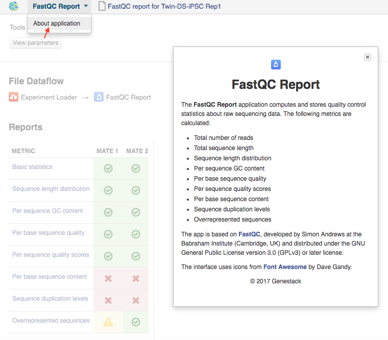

.. _pipelines:

Pipelines and applications
==========================

Applications available on Genestack are grouped into four categories:
Preprocess, Analyse, Explore and Manage.

Preprocess contains all applications used to process files pre- or
post-alignment in order to increase the data quality.

Analyse contains all mappers and all other apps required to analyse
sequencing data.

Explore contains all interactive graphical interface applications
allowing users to view the results of their
computations. Apps for visualizing QC reports, the Genome Browser, apps
 for exploring  genomic variants, and many more.

Manage contains apps used to manage your data: apps dealing with data
flows, file provenance, export, metadata editing and so on.

An extended version (including information on licensing and references)
of every application description found in this guide can be found in the
"About application" text of each of the individual apps.

To view this text for a specific app, click on the application's name at the
top-left corner of the page, and in the dropdown menu select "About application".

Sequencing data
---------------

Raw Reads quality control and preprocessing
~~~~~~~~~~~~~~~~~~~~~~~~~~~~~~~~~~~~~~~~~~~

.. _fastqc:

FastQC report
^^^^^^^^^^^^^

.. TODO this is a tutorial on data flows !!!!!!

The usual first step of any NGS data
analysis is quality control of raw sequencing reads. According to the
"garbage in, garbage out" rule, if we begin our analysis with poor
quality reads, we shouldn’t expect great results at the end. Luckily,
there are a few procedures that can be used to improve the data quality
if that proves to be unsatisfactory.

How can you check the quality of the data?

The tool used for raw reads quality check is FastQC Report app, based on the
`FastQC tool`_ developed by Simon Andrews at the Babraham Institute.

The quickest way to perform the quality assessment of your data in
Genestack is via the public data flow "Raw Reads Quality Control".

In order to use it, select all of your raw reads, right click on them
and from the dropdown menu select "Run dataflow on selection" and choose
the appropriate data flow.  Remember you need to initialize the
computation! On the Data Flow Runner page click on Run Data Flow and
select Start initialization now

You will have to wait for the results (you can track the progress of
your tasks in Task Manager). Once they are completed, you can find your
files in Created Files folder.

Since these files were created using a data flow, they will be located
in one folder (see Platform architecture for more details). To open up
one of these reports, click on the report and from the dropdown menu
select FastQC Report app.

If you don’t want to use a data flow, you can select all of your raw
reads, right click on them, go to "Explore" and select the appropriate
app. In this case you’ll also need to wait until the computations are
done and you will be able to track the progress of your tasks using Task
Manager.

On the FastQC Report page you can view both the result and the
provenance of the report file. At the top of the page you will see the
file name and the version of the FASTQC app used. The View parameters
button will show you the command line options used to generate the
report.  Below that you will see the File Data flow, in this case it
should only contain two app entries. Finally, the results can be viewed
in the Reports section. Here you will find  various graphs that
visualize the quality of your data. We’ll go through all of them one by
one and tell you:

a)how they should  look for data of perfect quality; 

b)how they may look if there’s something wrong with your data; 

c)what you can do if the quality is unsatisfactory.

The metrics table gives you quick indicators as to the status of each of
the quality metrics calculated.  Warnings: Yellow Triangles

Failures: Red X-es

Metrics

1) Basic Statistics

[FastQC 1]|image34|

Info on type and number of reads, GC content, and total sequence length.

2) Sequence Length Distribution

[FastQC 2]|image35|

Reports lengths of all sequences.

Warning

This report will raise an issue if the lengths are not identical, but
this can usually be ignored, as it is expected for some sequencing
platforms.

3) Per sequence GC content

[FastQC 3]|image36|

For data of good quality, the graph will show a normal, bell-shaped
distribution.

Warning

It raises a warning when the sum of the deviations from the normal
distribution represents more than 15% of the reads.

Warnings are usually caused by a presence of contaminants. Sharp peaks
may represent a presence of a very specific contaminant (e.g. an
adaptor). Broader peaks may indicate contamination with a range of
contaminants.

Improving data quality

Best solution: Run the Trim Adaptors and Contaminants preprocessing app.

4) Per base sequence quality plot

[FastQC 4]|image37|

For data of good quality, the median quality score per
base (Phred) should not drop below 20.

Failure 

A failure will be raised if the lower quartile for quality at any
base position is less than 5 or if the median for any base is less than
20.

Improving data quality
Best solution: If the quality of the library falls to a low level over
the course of a read, the blueprint solution is to perform quality
trimming of low quality bases or omitting low quality reads. This  can
be performed using Trim Low Quality Bases or Filter By Quality Score
apps respectively.

5) Per sequence quality scores plot 

[FastQC 5]|image38|

Ideally, we’d want to see a sharp peak at the very end of the graph
(meaning most frequently observed mean quality scores are above 27)

Warning

A warning is raised when the peak is shifted to the left, which means
the most frequently observed mean quality is below 27. This equals to a
0.2% error rate.

Improving data quality

Best solution: Perform quality-based trimming or selection using Trim
Low Quality Bases or Filter By Quality Score apps respectively.

6) Per base sequence content

[FastQC 6]|image39|

 

Ideally, in a random library we would see four parallel lines
representing the relative base composition. Fluctuations at the
beginning of reads in the tested sample may be caused by adapter
sequences or other contaminations of the library.

A bias at the beginning of the reads is common for RNA-Seq data. This
occurs during RNA-seq library preparation, when "random" primers are
annealed to the start of sequences. These primers are not truly random,
and it leads to a variation at the  beginning of the reads.

Warning

A warning will be raised  if the difference between A and T, or G and C
is greater than 10% at any position.

Improving data quality

If there is instability at the start of the read the consensus is that
no QC is necessary. If variation appears over the course of a read the
Trim to Fixed Length app may be used. If there is persistent variation
throughout the read it may be best to discard it. Some datasets may
trigger a warning due to the nature of the sequence. For example,
bisulfite sequencing data will have almost no Cytosines. Some species
may be unusually GC rich or poor and therefore also trigger a
warning.

7) Sequence duplication levels plots

[FastQC 7]|image40|

Reports total number of reads, number of distinct reads and mean
duplication rates.

Warning

This module will issue a warning if non-unique sequences make up more
than 20% of the total.

There are two potential types of duplicates in a library: technical
duplicates arising from PCR artefacts or biological duplicated which are
natural collisions where different copies of exactly the same sequence
are randomly selected. From a sequence level there is no way to
distinguish between these two types and both will be reported as
duplicates here.

Improving data quality

If the observed duplications are due to primer/adaptor contamination,
they can be removed using the Trim Adaptors and Contaminants app. Filter
Duplicated Reads can also be used for DNA sequencing data but will
distort expression data.

8) Overrepresented Sequences

[FastQC 8]|image41|

Shows the highly overrepresented sequences (more than 0.1% of total
sequence) in the sample

Warning

A warning will be raised  if any sequence is found to represent more
than 0.1% of the total.

There are several possible sources of overrepresented sequences:

–technical biases (one region was sequenced several times; PCR
amplification biases)

–feature of library preparation (e.g. for targeted sequencing)

–natural reasons (RNA-Seq libraries can naturally present high
duplication rates)

Overrepresented sequences should only worry you if you think they are
present due to technical biases.

Improving data quality

Procedures and caveats for improving data quality are the same as for
sequence duplication level.

Multiple QC Report
^^^^^^^^^^^^^^^^^^

You can also display metrics from multiple reports at once using the Multiple QC Report app.
It accepts as input a collection of FastQC or other types of QC reports.

You can select from a range of QC keys to display on a barplot, you can also select
which metainfo to display in the plot labels, and you can sort reports by a specified metric.

Finally, you can select reports by drawing a rectangle over the barplot and subsequently move the
corresponding files into a separate folder (for instance, to exclude outliers).

<screenshot>|image42|

What are the signs that something is wrong with our data?

GC content that is far from 50% and read counts that are low compared to
other files in the dataset are ways of identifying which files
should not be used for further analysis.

Subsample Reads
^^^^^^^^^^^^^^^

Action: used to create a random subset of raw reads.

The number of reads in the subset can be changed (default: 50,000). It
is also possible to specify a fraction of the original number of
reads. Changing the seed value will let you create different
subsets with the same number of reads. Using the same seed and
the same number of reads will result in identical subsets.

This application is based on Seqtk_.

When the quality of the raw reads is unsatisfactory, several
preprocessing apps are available on the platform that can increase the
quality of your raw reads. Here we will walk you through each one and
give you a checklist to use when deciding which to select. After each of
the preprocessing steps, you can use the FastQC Report app again to
compare the quality pre- and post-processing (remember that in order to
do this, you need to run a different computation, this time inputting
processed data source files into the data flow).

Filter Duplicated Reads
^^^^^^^^^^^^^^^^^^^^^^^

Action: discards duplicated sequenced fragments from raw reads data. If
the sequence of two paired reads or a single read occurs multiple times
in a library, the output will include only one copy of that sequence.

The phred quality scores are created by keeping the highest score across
all identical reads for each position.

This tool is based on Tally_.

If you suspect contamination with primers, or some  other repetitive
sequence. This should be evident from Sequence duplication levels and
Overrepresented Sequences of the FastQC report. Keep in mind this app
should not be used with RNA-seq data as it will remove observed
differences in expression level.

Filter By Quality Score
^^^^^^^^^^^^^^^^^^^^^^^

Action: discards reads from a sequencing assay based on Phred33 quality
scores. You can change the minimum quality score, which is set to 20 by
default. A score of 20 means that there is a 1% chance that the corresponding
base was called incorrectly by the sequencer. A score of 30 means a 0.1% chance of an incorrect base call.

You can also discard reads specifying a minimum percentage of bases to
be above the minimum quality score.

This tool is based on *fastq\_quality\_filter*, which is part of the
FASTX-Toolkit_.

This app is best used if you have some low quality reads, but others are high-quality.
You should be able to tell if this is the case from the shape of the Per
sequence quality scores plot from FastQC. It may also be worth trying
this app if the per base sequence quality is low.

Trim Adaptors and Contaminants
^^^^^^^^^^^^^^^^^^^^^^^^^^^^^^

Action: finds and trims adaptors and known contaminating sequences from
raw reads data. It is possible to specify the minimum length of trimmed
reads. Trimmed reads below the minimum length are discarded.

The app uses an internal list of sequences that can be considered as
contaminants. This list is based on the possible sequencing technologies
and platform used. For instance, it contains widely used PCR primers and
adaptors for Illumina, ABI etc. You can view the full list
`here <https://s3.amazonaws.com/bio-test-data/Genestack_adapters.txt>`_.

This tool is based on `fastq-mcf`_ , one of the EA-Utils_ utilities.

Best used when you have irregularities in GC content, in base content at the start of
reads, duplicated reads. Since this QC app relies on sequence matching
it should be run first if used in conjunction with other QC apps

Trim Low Quality Bases
^^^^^^^^^^^^^^^^^^^^^^

Action: isolate high-quality regions from raw reads

Best used when:
If your per-base quality declines over the course of your reads the Trim
Low Quality Bases will select the highest quality region for each read.

This tool is based on the `Seqtk tool`_, which uses the Phred algorithm.

Trim Reads to Fixed Length
^^^^^^^^^^^^^^^^^^^^^^^^^^

Action: trims a specific amount of bases from the extremities of all
reads in a sample.

You should specify the first base and the last base that should be
kept. For example, if you set 5 as the first base to keep and 30 as the
last base to keep, it means that the application trims all nucleotides
before the 5th position, and all nucleotides after the 30th base.

This tool is based on fastx_trimmer, which is part of the
FASTX-Toolkit.

Best used when: Trim to fix length is helpful when you want to obtain
reads of a specific length (regardless of the quality).

Mapped Reads Preprocessing and QC
~~~~~~~~~~~~~~~~~~~~~~~~~~~~~~~~~

Mapped Reads QC Report
^^^^^^^^^^^^^^^^^^^^^^

In order to perform the mapped reads QC we follow a similar procedure to
the one used to generate FastQC reports. After selecting all the mapped
reads we wish to check the quality of, we can use the Mapped Reads QC
public data flow, initialize the computations, and then explore the
results. You can read more about the Mapped Reads QC Report app in the
"Explore" section of this guide.

An individual Mapped Reads QC report contains a range of mapping
statistics including:

#. Mapped reads: total number of reads which mapped to the reference
   genome;
#. Unmapped reads: total reads which failed to map to the reference
   genome;
#. Mapped reads with mapped mate: total paired reads where both mates
   were mapped;
#. Mapped reads with partially mapped mate: total paired reads where
   only one mate in the pair was mapped;
#. Mapped reads with "properly" mapped mate: total paired reads where
   both mates were mapped with the expected orientation;
#. Mapped reads with "improperly" mapped mate: total paired reads where
   one of the mates was mapped with an unexpected orientation.

→ what should we be on a lookout for here?

Large numbers of reads that are not properly mapped.|image43|

As well as two graphs.

1)Coverage by chromosome plot |image44|

This plot shows the percentage of reads covered by at least x reads. The
amount of coverage you are expecting varies with the experimental
techniques you are using. Normally you want similar coverage patterns
across all chromosomes, but this may not be the case if e.g. you are
dealing with advanced stage cancer. .

What should it look like normally?

What does it look like when data is of poor quality ( + what can we do
about it)

let's just imagine that we have a plot which shows coverage only for one
chromosome --> 1 line. On the x-axis we have the number of reads (e.g
100), on y-axis - percentage of chromosome bases covered by this number
of reads (e.g. 10%). So, it looks like we have 100-reads coverage for
10% of chromosome.

2) The insert size distribution plot

|image45|

What should it look like normally?

What does it look like when data is of poor quality ( + what can we do
about it)

This plot shows the  distribution of insert sizes. Inserts are the
distance between reads in mate pairs. Insert sizes can show e.g. indel
mutations if our data is from a specific genomic region.

Targeted Sequencing QC Report
^^^^^^^^^^^^^^^^^^^^^^^^^^^^^

Good to use during: Whole Exome Sequencing Analysis

Besides general quality control of mapped reads, you might also want to
assess whether the target capture has been successful, i.e. if most of
the reads actually fell on the target, if the targeted bases reached
sufficient coverage, etc. To do that, you can use Targeted Sequencing QC
Report.

By default the application allows you to compute enrichment statistics
for reads mapped only on exome. If you go to the app page, change the
value to "Both exome and target file" and select the appropriate target
annotation file, you get both exome and/or target enrichment statistics.

The following enrichment statistics are computed:

-  Number and proportion of mapped reads on target
-  Mean coverage on target with at least 2X coverage
-  Target bases with at least 2, 10, 20, 30, 40, and 50 x coverage

You can generate reports directly by choosing all of the files, right
clicking on them and choosing an appropriate app or  one of our
dedicated public data flows (Targeted Sequencing Quality Control public
data flow).

You can analyse the output for multiple reports at once using the
Multiple QC Report app.

Watch the video here: https://youtu.be/\_jHrtq\_3ya8

This application is based
on `BED tools`_ ,
`Picard <https://www.google.com/url?q=http://broadinstitute.github.io/picard/&sa=D&ust=1480960531903000&usg=AFQjCNE7Nx1DN1A6MJS58mdncbZw3paNKQ>`__ `tools <https://www.google.com/url?q=http://broadinstitute.github.io/picard/&sa=D&ust=1480960531904000&usg=AFQjCNHQu-By-46lV8YOZ9fOB5PWZPMzGA>`__,
and SAMtools.

Mark Duplicated Mapped Reads
^^^^^^^^^^^^^^^^^^^^^^^^^^^^

Best used when: Duplicated reads are reads of identical sequence
composition and length, mapped to the same genomic position. Marking
duplicated reads can help speed up processing for specific apps, e.g.
the Variant Calling application, where processing additional identical
reads would lead to early PCR amplification effects (jackpotting)
contributing noise to the signal.

You can read more about Duplicated Mapped Reads in this excellent
`SeqAnswers thread`_.

Action:goes through all reads in a Mapped Reads file, marking as
"duplicates" for paired or single reads where the orientation and the 5’
mapping coordinate are the same.

3’ coordinates are not considered due to two reasons:

#. The quality of bases generated by sequencers tends to drop down
   toward the 3’ end of a read. Thus its alignment is less reliable
   compared to the 5’ bases.
#. If reads are trimmed at 3’ low-quality bases before alignment, they
   will have different read lengths resulting in different 3’ mapping
   coordinates.

In such cases, when the distance between two mapped mates differs from
the internally estimated fragment length, including mates mapping to
different chromosomes, the application will not identify or use them but
will not fail due to inability to find the mate pair for the reads.

Marking duplicated reads can help speed up processing for specific apps,
e.g. the Variant Calling application.

This tool is based on MarkDuplicates, part of
`Picard <https://www.google.com/url?q=http://broadinstitute.github.io/picard/&sa=D&ust=1480960531908000&usg=AFQjCNFUTguXnVG8T-pHtUqYKTBvJRxSqQ>`__`  <https://www.google.com/url?q=http://broadinstitute.github.io/picard/&sa=D&ust=1480960531909000&usg=AFQjCNGhATTNeU1Rut4z-myvh2ew4jquEw>`__`tools <https://www.google.com/url?q=http://broadinstitute.github.io/picard/&sa=D&ust=1480960531909000&usg=AFQjCNGhATTNeU1Rut4z-myvh2ew4jquEw>`__.

Remove Duplicated Mapped Reads
^^^^^^^^^^^^^^^^^^^^^^^^^^^^^^

Best used when:The point of removing duplicated mapped reads is to try
to limit the influence of early PCR selection (jackpotting). Whether or
not you should remove duplicate mapped reads depends on the type of data
you have. If you are dealing with whole-genome sequencing data where
expected coverage is low and sequences are expected to be present in
similar amounts, removing duplicated reads will reduce processing time
and have little deleterious effect on analysis. If however you are
processing RNA-seq data, where the fold-variation in expression can be
up to 10^7, reads are relatively short, and your main point of interest
is the variation in expression levels, this probably isn’t the tool for
you.

You can read more about Duplicated Mapped Reads in this excellent
`SeqAnswers
thread <https://www.google.com/url?q=http://seqanswers.com/forums/showthread.php?t%3D6854&sa=D&ust=1480960531910000&usg=AFQjCNFadUu7kTaUIPWmbsa6k4trTNpkHA>`__.

Action: goes through all reads in a Mapped Reads file, marking as
"duplicates" paired or single reads where the orientation and the 5’
mapping coordinate are the same and discarding all except the "best"
copy.

3’ coordinates are not considered due to two reasons:

#. The quality of bases generated by sequencers tends to drop down
   toward the 3’ end of a read. Thus its alignment is less reliable
   compared to the 5’ bases.
#. If reads are trimmed at 3’ low-quality bases before alignment, they
   will have different read lengths resulting in different 3’ mapping
   coordinates. 

The app also takes into account interchromosomal read pairs.

In such cases, when the distance between two mapped mates differs from
the internally estimated fragment length, including mates mapping to
different chromosomes, the application  app cannot identify them but
will not fail due to inability to find the mate pair for the reads.

This tool is based on MarkDuplicates, part of the `Picard
tools <https://www.google.com/url?q=http://broadinstitute.github.io/picard/&sa=D&ust=1480960531914000&usg=AFQjCNH7a8doEzmn-2YlGchG7q_J-PR-YA>`__.

Subsample Reads
^^^^^^^^^^^^^^^

Best used when: For example, if you want to take a look at what your
final experimental results will look like, but don’t want to spend time
processing all your data right away.

Action: used to create a random subset of mapped reads.

Use subsampling ratio option to set a fraction of mapped reads you’d
like to extract (default: 50%). Changing random seed value will let you
produce different subsets with the same number of mapped reads. Using
the same random seed and the same subsampling ratio will result in
identical subsets.

This application is based on
`SAMtools <https://www.google.com/url?q=http://samtools.sourceforge.net/&sa=D&ust=1480960531916000&usg=AFQjCNFB4gFPcb-Qn-otAuuvXdgQxS-qew>`__.

Merge Mapped Reads
^^^^^^^^^^^^^^^^^^

Best used when: For example, if you have multiple replicates of the same
experiment and want to combine them before producing your final result.

Action: used to merge multiple Mapped Reads files, producing one single
output Mapped Reads file.

This application is based on
`SAMtools <https://www.google.com/url?q=http://samtools.sourceforge.net/&sa=D&ust=1480960531918000&usg=AFQjCNExyI1vxeDPJ4fJDe3oEq6iaUomvA>`__.

Merge Variants 
^^^^^^^^^^^^^^^

Best used when: Merging Genomic Variations files can be useful, when you
have, for example, one Genetic Variations file for SNPs and another one
for Indels. After their merging, the result Genetic Variations file will
separately contain information about SNPs and about Indels.

Action: allows you to merge two or more Genetic Variations files into a
single file.

This application is based on
`BCFtools <https://www.google.com/url?q=http://samtools.github.io/bcftools/bcftools
.html&sa=D&ust=1480960531922000&usg=AFQjCNENqYzPwnsR_l1c-R1nKiaEfyV6JA>`_.

Concatenate Variants 
^^^^^^^^^^^^^^^^^^^^^

Best used when: Concatenation would be appropriate if you, for example,
have separate Genetic Variations files for each chromosome, and simply
wanted to join them 'end-to-end' into a single Genetic Variations file.

Action: allows you to join two or more Genetic Variations files by
concatenating them into a larger, single file.

The application always allows overlaps so that the first position at the
start of the second input will be allowed to come before the last
position of the first input. There is an option to remove duplicated
variants to make sure that there are no redundant results.

This application is based on `BCFtools <https://www.google.com/url?q=http://samtools.github.io/bcftools/bcftools
.html&sa=D&ust=1480960531922000&usg=AFQjCNENqYzPwnsR_l1c-R1nKiaEfyV6JA>`_.

.. _FastQC tool:  http://www.bioinformatics.babraham.ac.uk/projects/fastqc/
.. _Seqtk: https://www.google.com/url?q=https://github.com/lh3/seqtk
.. _Tally: https://www.google.com/url?q=http://www.ebi.ac.uk/~stijn/reaper/tally.html
.. _FASTX-Toolkit: https://www.google.com/url?q=http://hannonlab.cshl.edu/fastx_toolkit/
.. _fastq-mcf: https://code.google.com/p/ea-utils/wiki/FastqMcf
.. _EA-Utils: https://code.google.com/archive/p/ea-utils/
.. _Seqtk tool: https://github.com/lh3/seqtk
.. _BED tools: https://code.google.com/p/bedtools/
.. _SeqAnswers thread: http://seqanswers.com/forums/showthread.php?t%3D6854&sa=D&ust=1480960531906000&usg=AFQjCNEf4S1SCRUDkW22TsOHHRxjWD6Bvg

..|about_app| image:: images/about_app.png

RNA-seq
~~~~~~~

Mapping (also called alignment) of sequencing reads allows us to detect
variation in samples by comparing your data to the reference genome. By
doing this you can begin to analyse the relationship between variations
in genotype and phenotype in the population. Next generation sequencing
produces single-end or paired-end reads. For single-end sequence reads,
the sequencer reads the fragment only from one end and usually stops
before reaching the other. For paired-end reads, sequencing starts off
at one end, reads a specified numbers of base pairs, and then starts
another round of the reading from the opposite end of the fragment.
Paired-end sequencing improves the ability to detect genetic
rearrangements (e.g. deletions). This is due to the additional data
carried by pairing reads - they can only be a certain maximum distance
away from each other which limits the regions of the genome to which
they can be mapped. This is particularly useful for regions which are
repeated throughout the genome.

To compare your data to the reference genome, you need to find a
corresponding part of that sequence for each of the reads in our data
– this is the essence of sequence mapping. Following mapping, you will
be able to look at specific variations (SNPs, InDels etc).

Spliced Mapping with TopHat2
^^^^^^^^^^^^^^^^^^^^^^^^^^^^

This application is used to map Raw Reads with transcriptomic data like
RNA-seq to a Reference Genome, taking into account splice junctions.

Let’s take a look at the app page and talk about various parameters:

|spliced mapping|

Details on various settings:

If you are using strand-specific RNA-seq data, the option
"Strand-specificity protocol" will let you choose between the "dUTP" and
"ligation" method. If you are not sure whether your RNA-seq data is
strand-specific or not, you can try using Subsample reads to make a
small subsample, map it with Spliced Mapping and check the coverage in
Genome Browser for genes on both strands.

By default, the application uses annotated transcripts from the
Reference Genome to distinguish between novel and known junctions. Using
the option "Rule for mapping over known annotation" you can restrict
mappings only across known junctions or infer splice junctions without
any reference annotation.

With default settings, the application will report the single best
mapping for each read, even if there are multiple valid mapping
positions. The option "Number of "best" mappings to report" lets you
increase the number of reported mappings. This can be used together with
"Rule for filtering mappings" to choose whether to keep reads mapping to
uniquely or to multiple positions, e.g. report up to 5 possible
mappings, and only for multi-hit reads. If you want to be stricter, you
can set the number of allowed mismatches from 2 to 1 or 0.

For paired reads, using the option "Disallow unique mappings of one
mate" you can discard pairs of reads where one mate maps uniquely and
the other to multiple positions. Selecting "Disallow discordant
mappings" will discard all mappings where the two mates map uniquely but
with unexpected orientation, or where the distance between two mapped
mates differs from and internally estimated fragment length, including
mates mapping to different chromosomes.

This app is used in the the Testing Differential Gene Expression tutorial
that can be found
`here <https://www.google.com/url?q=https://genestack.com/tutorial/mapping-rna-seq-reads-onto-a-reference-genome/&sa=D&ust=1480960531934000&usg=AFQjCNFMSiaZdYZX9Sp1-nzMlTdCUM_5DA>`_

Spliced Mapping with STAR
^^^^^^^^^^^^^^^^^^^^^^^^^

.. TODO

Gene Quantification with RSEM
^^^^^^^^^^^^^^^^^^^^^^^^^^^^^

RSEM Report application uses STAR mapper to align reads against
reference transcripts and applies an expectation-maximization algorithm
to estimate gene and isoform expression levels from RNA-Seq data.

However, it is important to know the fragment length distribution to
estimate expression levels from for single-end data accurately. In this
case, you need to specify the "Estimated average fragment length (for
single-end reads only)". Typical Illumina libraries produce fragment
lengths ranging between 180–200 bp. By default the fragment length is set equal to 190. For
paired-end reads, the average fragment length can be directly estimated
from the reads.

You can also set the "Estimated standard deviation of fragment length
(for single-end reads only)" (the default value is 20). For paired-end
reads this value will be estimated from the input data.

"The RNA-Seq protocol used to generate the reads is strand specific"? If
yes, check it. By default, the app considers the reads as
non-strand-specific.

When the task is complete, click View report in the Explore section to get
gene and isoform level expression estimates. The output report
represents a table with the following main columns:

-  transcript\_id - name of the transcript;
-  gene\_id - name of the gene which the transcript belongs to. If no
   gene information is provided, gene\_id and transcript\_id are the
   same;
-  length - transcript's sequence length (poly(A) tail is not counted);
-  effective\_length - counts only the positions that can generate a
   valid fragment. If no poly(A) tail is added, effective length is
   equal to transcript length - mean fragment length + 1. If one
   transcript's effective length is less than 1, this transcript's both
   effective length and abundance estimates are set to 0;
-  expected\_count - the sum of the posterior probability of each read
   comes from this transcript over all reads;
-  TPM - transcripts per million normalized by total transcript count in
   addition to average transcript length;
-  FPKM - fragments per kilobase of exon per million fragments mapped;
-  IsoPct - the percentage of the transcript's abundance over its parent
   gene's abundance. If the parent gene has only one isoform or the gene
   information is not provided, this field will be set to 100.

The application is based on the `RSEM <http://deweylab.github.io/RSEM/>`_ program
and the `STAR <https://github.com/alexdobin/STAR>`_ mapper, which are distributed under the GPLv3 license.

References:

#. Li B and Dewey C N. "RSEM: accurate transcript quantification from
   RNA-Seq data with or without a reference genome." BMC Bioinformatics
   2011 12:323, doi: 10.1186/1471-2105-12-323
#. Dobin A, Davis C A, Schlesinger F, Drenkow J, Zaleski C, Jha S, Batut
   P, Chaisson M and Gingeras T R. "STAR: ultrafast universal RNA-seq
   aligner." Bioinformatics 2012 29(1): 15-21.
#. Do C B and Batzoglou S. "What is the expectation maximization
   algorithm?" Nature biotechnology, 2008 26(8): 897-899.

Gene Quantification with HTSeq-count
^^^^^^^^^^^^^^^^^^^^^^^^^^^^^^^^^^^^

Good for: Differential Gene Expression Analysis

Input: Mapped Reads and Reference Genome

Output: Mapped Read Counts (containing information about number of reads
overlapping each gene specified in the reference annotation)

Further apps to use: Test Differential Gene Expression

Depending on your tasks, you should specify the feature type for which
overlaps choosing from "exon", "CDS" (coding DNA sequence), "3’UTR" (the
3’ untranslated region) or "5’UTR" (the 5’ untranslated region). For
example, you may consider each exon as a feature in order to check for
alternative splicing.

By default, the "gene-id" will be used as a feature identifier. If some
features will have the same feature identifier the application will
consider all these features as relating to the same feature.

You also need to choose a rule for overlaps that dictates how mapped
reads that overlap genomic features will be treated. There are three
overlap resolution modes: union, strict-intersection, and non-empty
intersection.

The first one - "union" - is the most recommended. It combines all cases
when the read (or read pair) at least partly overlaps the feature. The
"strict-intersection" mode is about strict intersection between the
feature and the read overlapping this feature. But if you are interested
in counting reads that are fully or partly intersected with the feature,
you should use the last mode. It’s important that the read will be
counted for feature if it overlaps precisely only one feature. If the
read overlaps with more than one feature, it will not be counted. 

|image47|

An additional useful option is "Strand-specific reads". The application
takes into account the direction of the read and the reference, so that
a read from the wrong direction, even if it is mapped to the right
place, will not be counted. This option can be useful if your data is
strand-specific and you are interested in counting of reads overlapping
with feature regarding to whether these reads are mapped to the same or
the opposite strand as the feature. Choose "yes", if the reads were
mapped to the same strand as the feature and "reverse" - if the reads
were mapped on the opposite strand as the feature. Specify "no", if you
don’t consider strand-specificity.

Spliced Mapping and quantification with Kallisto
^^^^^^^^^^^^^^^^^^^^^^^^^^^^^^^^^^^^^^^^^^^^^^^^

Kallisto Report application quantifies abundances of transcripts from
RNA-Seq data without the need for alignment. It uses an expectation-maximization algorithm
on "pseudoalignments" to find a set of potential transcripts a read
could have originated from.

Use "Strand-specificity protocol" parameter to specify how to process
the pseudoalignments. By default, the app does not take into account
strand specificity ("none" value). To run the app in strand specific
mode, change this value to "forward" if you are interested only in
fragments where the first read in the pair is pseudomapped to the forward
strand of a transcript. If a fragment is pseudomapped to multiple
transcripts, only the transcripts that are consistent with the first
read are kept. The "reverse" is the same as "forward" but the first read
will be pseudomapped to the reverse strand of the transcript.

To correct the transcript abundances according to the model of sequences
specific bias, check "Enable sequence based bias correction" option.

In the case of single-end reads, the "Estimated average fragment length
(for single-end reads only)" option must be used to specify the average
fragment length. Typical Illumina libraries produce fragment lengths
ranging from 180–200 bp. By default it’s equal to 190. For paired-end
reads, the average fragment length can be directly estimated from the
reads.

Finally, you can set the "Estimated standard deviation of fragment length
(for single-end reads only)" (the default value is 20). For paired-end
reads this value will be estimated from the input data.

Use the "View report" app in the Explore section to review the Kallisto output
report. It contains a table with the following main columns:

-  target\_id - feature name, e.g. for transcript, gene;
-  length - feature length;
-  eff\_length - effective feature length, i.e. a scaling of feature
   length by the fragment length distribution;
-  est\_counts - estimated feature counts;
-  tpm - transcripts per million normalized by total transcript count in
   addition to average transcript length.

The application is based on `Kallisto <https://pachterlab.github.io/kallisto/>`_.

References:

#. Bray N L, Pimentel H, Melsted P and Pachter L. "Near-optimal
   probabilistic RNA-seq quantification." Nature Biotechnology 2016
   34:525–527, doi:10.1038/nbt.3519
#. Do C B and Batzoglou S. "What is the expectation maximization
   algorithm?" Nature biotechnology, 2008 26(8): 897-899.

Isoforms quantification with cuffQuant
^^^^^^^^^^^^^^^^^^^^^^^^^^^^^^^^^^^^^^

Good for: Differential Isoform Expression Analysis

Input: Mapped Reads (corresponding to isoform alignment) and Reference
Genome

Output: Multiple output files corresponding to samples with different
biological conditions and isoforms, can be further processed together
for Differential Isoforms Expression analysis.

Action: The app is used to quantify isoform expression.

Further applications: Test Differential Isoform Expression

Specific genes can produce a range of different transcripts encoding
various isoforms, i.e. proteins of varying lengths containing different
segments of the basic gene sequence. Such isoforms can be generated, for
example, in the process of alternative splicing.

We use this application to calculate expression levels of these
isoforms. It takes the input Mapped Reads (corresponding to isoform
alignment) and Reference Genome files. Multiple output files
corresponding to samples with different biological conditions and
isoforms, can be further processed together for Differential Isoforms
Expression analysis using Test Differential Isoform Expression
application.

Before running the application, you can choose strand-specificity
protocol used for generating your reads. By default, the application
takes "none" strand-specific data, but this value can be changed to
"dUTP" or "RNA-ligation".

Switch the "No correction by effective length" option if you’d like to
not apply effective length normalization to transcript FPKM (fragments
per kilo bases of exons for per million mapped reads).

The application always makes an initial estimation procedure to more
accurately weight reads mapping to multiple places in the genome.

This application is based on cuffQuant which is a part of
`Cufflinks <http://cole-trapnell-lab.github.io/cufflinks/>`_.

Test Differential Gene Expression
*********************************

**Good for**: Differential Gene Expression Analysis
**Input**: Mapped Read Counts (from Quantify Raw Coverage in Genestack app)
**Action**: The app performs differential gene expression analysis between
groups of samples. You can create these groups manually or apply auto
grouping when the application helps you to group your samples according to
experimental factor such as disease, tissue, sex, cell type, cell line,
treatment, organism, etc.
**Further apps to use**: Expression Navigator application

The application supports two statistical R packages - **DESeq2** and **edgeR**
to perform normalization across libraries, fit negative binomial distribution
and likelihood ratio test (LRT) using generalized linear model (GLM). With
edgeR, one of the following types of dispersion estimate is used, in order of
priority and depending on the availability of biological replicates: Tagwise,
Trended, or Common. Also, edgeR is much faster than DESeq2 for fitting GLM
model, but it takes slightly longer to estimate the dispersion. It is important
that edgeR gives moderated fold changes for the extremely lowly DE genes which
DESeq2 discards, showing that the likelihood of a gene being significantly
differentially expressed is related to how strongly it's expressed. So, choose
one of the packages according to your desires and run the analysis.

For each group, a GLM LRT is carried out to find Differentially Expressed (DE)
genes in this group compared to the average of the other groups. In the case
of 2 groups, this reduces to the standard analysis of finding genes that are
differentially expressed between 2 groups. Thus, for N groups, the application
produces N tables of Top DE genes. Each table shows the corresponding
Log2(Fold Change), Log2(Counts per Million), P-Value, and False Discovery Rate
for each gene. Look at all result tables and plots in Expression Navigator
application.

#. **Log2(Fold Change)**. Let’s assume, that we have two groups - with tumor and
   with control samples. Then, for each gene in sample we know read counts
   (output of Quantify Raw Coverage in Genes application). If we divide read
   counts value for gene X (in the tumor sample) by the read counts value for
   gene X (in the control sample) we’ll get Fold Change value:

   *Fold Change = tumor/control*
   
   And if we apply Log2 transform for this value we’ll get Log2(Fold Change).

#. **Log2(Counts per Million)**. Dividing each read count by millions yields
   counts per million (cpm), a simple measure of read abundance that can be
   compared across libraries of different sizes. And if we apply Log2 transform
   for this value we’ll get Log2(Counts per Million).

#. **p-value**. The application also counts p-value for each gene. A low
   p–value is seen as evidence that the null hypothesis may not be true (i.e.,
   our gene is differentially expressed).

#. **False discovery rate**. FDR is the expected proportion of Type I errors
   among the rejected hypotheses.

Expression Navigator for RNA-seq
********************************

**Good for**: Differential Gene expression analysis, Differential Isoform
expression analysis.

|expression_navigator_for_RNA-seq|

**Used to**: filter and view the results of differential gene expression
analyses, including isoform expression.

The Expression navigator page contains 4 sections.

#. The topmost section, "Groups Information", is a summary of the groups
   available for comparison. Size refers to the number of samples used to
   generate each group. The drop-down selection menu lets you choose which
   groups to compare.
#. The leftmost section allows you to filter and choose genes for comparison.
   You can filter by maximum acceptable false discovery rate (FDR), up or down
   regulation, minimum log fold change (LogFC), and minimum log counts per
   million (LogCPM).

- **Log2(Fold Change)**. Let’s assume, that we have two groups - with tumor
  and with control samples. Then, for each gene in a sample we know read counts
  (output of Quantify Raw Coverage in Genes application). If we divide read
  counts value for gene X (in the tumor sample) by the read counts value for
  gene X (in the control sample) we’ll get the Fold Change value:

  *Fold Change = tumor/control*

  And if we apply a Log2 transform for this value we’ll get Log2(Fold Change).
  Genes with positive Log FC are considered to be up-regulated in the selected
  group, ones with negative Log FC are down-regulated.

- **Log2(Counts per Million)**. Dividing each read count by millions yields
  counts per million (cpm), a simple measure of read abundance that can be
  compared across libraries of different sizes. And if we apply Log2 transform
  for this value we’ll get Log2(Counts per Million).

  *Counts per Million =  reads(gene)\^106/reads(all genes)*

- **p-value**. The application also counts p-value for each gene. A low
  p–value is seen as evidence that the null hypothesis may not be true (i.e.,
  our gene is differentially expressed).

- **False discovery rate**. FDR is the expected proportion of Type I errors
  among the rejected null hypotheses. In other words, it’s the fraction of
  genes for which a significant variation was identified incorrectly. You
  can read more about it `here`_.

  The buttons at the bottom of the section allow you to refresh the list
  based on your filtering criteria or clear your selection.

#. The top right section contains a box plots of expression levels. Genes are
   listed on the x axis with one bar present for each  selected group. Log
   normalized expression levels are plotted on the y axis.

#. The bottom right section contains a search box for genes of interest. You
   can search for one gene at a time with auto-complete functionality. These
   genes do not need to be on the filtered list.

This application is based on two R packages - `DESeq2`_ and `edgeR`_.

You can read more about this app in the following `tutorial`_.

References:
-----------

- Love MI, Huber W and Anders S. "Moderated estimation of fold change
  and dispersion for RNA-seq data with DESeq2." Genome Biology. 2014;15(12):550.
- Robinson MD, McCarthy DJ and Smyth GK. "edgeR: a Bioconductor package for
  differential expression analysis of digital gene expression data."
  Bioinformatics. 2010; 26(1):139-140.

.. _here: http://www.cbil.upenn.edu/PaGE/fdr.html
.. _DESeq2: http://www.bioconductor.org/packages/release/bioc/html/DESeq2.html
.. _edgeR: http://www.bioconductor.org/packages/2.13/bioc/html/edgeR.html
.. _tutorial: http://genestack-user-tutorials.readthedocs.io/index.html

Expression Navigator for splice isoforms
^^^^^^^^^^^^^^^^^^^^^^^^^^^^^^^^^^^^^^^^

Good for: Testing Differential Isoform Expression Analysis

Input: Multiple Data files with FPKM isoform counts (produced by
Quantify FPKM Coverage in Isoforms app)

Action: The app performs differential expression (DE) analysis between
two groups of samples corresponding to different conditions. You can
create these groups manually or apply auto grouping when the application
helps you to group your samples according to experimental factor such as
disease, tissue, cell type, cell line, treatment etc. It’s important
that to run DE analysis you need to create only two groups.

Results exploration:  Expression Navigator for Isoforms

In "Program Options" section you can apply two options to run the
analysis. The first one - "Apply fragment bias correction" - if checked,
the application runs the bias detection and correction algorithm which
can significantly improve accuracy of transcript abundance estimates.
Use the second option "Apply multiple reads correction" if you’d like to
apply the multiple reads correction.

The application finds isoforms that are differentially expressed between
2 groups and produces 2 tables of Top DE transcripts. Each table shows
the corresponding Log2(Fold Change), Log2(Counts per Million), P-Value,
and False Discovery Rate for each isoform. To visualize your results run
Expression Navigator for Isoforms application.

1) Log2(Fold Change). Let’s assume, that we have two groups - with tumor
and with control samples. Then, for each transcript in sample we know
read counts (output of Quantify Raw Coverage in Genes
 application). If we divide read counts
value for transcript X (in the tumor sample) by the read counts value
for transcript X (in the control sample) we’ll get Fold Change value:

Fold Change = tumor/control

And if we apply Log2 transform for this value we’ll get Log2(Fold
Change).

2) Log2(Counts per Million). Dividing each read count by millions yields
counts per million (cpm), a simple measure of read abundance that can be
compared across libraries of different sizes. And if we apply
Log2 transform for this value we’ll get Log2(Counts per Million).

3) p-value. The application also counts p-value for each isoform. A low
p–value is seen as evidence that the null hypothesis may not be true
(i.e., our isoform is differentially expressed).

4) False discovery rate. FDR is the expected proportion of Type I errors
among the rejected hypotheses.

This application is based on cuffdiff which is a part of
`Cufflinks <https://www.google.com/url?q=http://cufflinks.cbcb.umd.edu/&sa=D&ust=1480960531994000&usg=AFQjCNH88na23xIz5CUAowl7LLWgSpC31A>`__.

Single cell RNA-seq analysis
^^^^^^^^^^^^^^^^^^^^^^^^^^^^

Single-cell RNA-seq Analyser + Visualiser need to be merged

Good for: Single-cell RNA-seq Analysis

Input: single-cell RNA-seq data

Action: The app identifies heterogeneously-expressed (HE) genes across
cells, while accounting for technical noise.

Further apps to use : Single-cell RNA-seq Visualiser

The application supports two algorithms for HE analysis. The first uses
spike-in data (artificially introduced RNAs of known abundance) to
calibrate a noise model [1]. The second method is a non-parametric
algorithm based on smoothing splines and doesn’t require the presence of
spike-in data.

To identify highly variable genes you can try different options.
"Exclude samples with low coverage" option (switched by default) allows
you to exclude or include for analysis samples with low read
counts.

Set significance level for the p-value (-10log₁₀(p)). The application
will use the default of 1, which corresponds to selecting genes for
which P is smaller than 0.1.

The "Use spike-ins to calibrate noise" option determines whether or not
spike-in data should be taken into account. If you select only one
folder before running the app, you will use spike-free algorithm and
this option will be switched off by default. But if you select two
folders, one for biological and the other for spike-in data, you can use
the Brennecke algorithm [1]  which requires this option.  

The next three options will be available if spike-ins are included in
the experiment and "Use spike-ins to calibrate noise" option is
switched. You’ll be able to set "Expected
biological CV" which is the minimum threshold chosen for quantifying the
level of biological variability (CV - coefficient of variation) expected
in the null hypothesis of the model. The default value is 0.5.

The other two options - "Noise fit - proportion of genes with high CV²
to remove" and "Noise fit - proportion of genes with low mean expression
to remove" - enable us to exclude a fraction of spike-in genes to fit
the noise model, because extreme outliers tend to skew the fit. The
default values for these options are 0 and 0.85, consequently.

To look at the HE analysis results, open the created Single-cell RNA-seq
Analysis page in  Single-cell RNA-seq visualizer.

This application is based on such `R
packages <https://www.google.com/url?q=http://cran.r-project.org/&sa=D&ust=1480960532001000&usg=AFQjCNE1yhmhcF9OD882Ld6di-TrSBg14w>`__ as
DESeq, statmod, ape, flashClust and RSJONIO.

References:

#. Brennecke P, Anders S, Kim JK, Kolodziejczyk AA, Zhang X, Proserpio
   V, Baying B, Benes V, Teichmann SA, Marioni JC, Heisler MG.
   "Accounting for technical noise in single-cell RNA-seq experiments."
   Nature Methods. 2013 Sep 22; 10(11):1093–1095.

Read more about single-cell RNA-seq analysis on Genestack here:
`https://genestack.com/blog/2016/02/22/visualisation-clustering-methods-single-cell-rna-seq-data/ <https://www.google.com/url?q=https://genestack.com/blog/2016/02/22/visualisation-clustering-methods-single-cell-rna-seq-data/&sa=D&ust=1480960532003000&usg=AFQjCNFAjkflTkJ-VOc9Pmyr7WT2N61K8Q>`__

Single-cell RNA-Seq Visualisation
^^^^^^^^^^^^^^^^^^^^^^^^^^^^^^^^^

Good for: Single-cell RNA-seq Analysis

Used to: Explore cell-to-cell variability in gene expression in even
seemingly homogeneous cell populations based on scRNA-Seq datasets.

The application shows basic statistics such as the number of identified
highly variable genes across the analysed samples. It also provides
several quality control (QC) plots allowing to check the quality of raw
sequencing data, estimate and fit technical noise for the
Brennecke algorithm, and detect the genes with significantly high
variability in expression. Expression of the highly variable genes
across all cell samples is represented by an interactive clustered
heatmap. Finally, several plots in the Samples Visualisation section can
be used to detect cell subpopulations and identify novel cell
populations based on gene expression heterogeneity in the single-cell
transcriptomes.

QC plots are adopted from the original paper by Brennecke et al [1]. In
all the plots described below, gene expression levels are normalized
using the DESeq normalization procedure [2].

QC plots are adopted from the original paper by Brennecke et al [1].

The first plot describing the quality of raw data is the Scatter Plot of
Normalised Read Counts, which shows the cell-to-cell correlation of
normalized gene expression levels. Each dot represents a gene, its
x-coordinate is the normalized gene count in the first cell, and its
y-coordinate is the normalized gene count in the second cell. If
spike-ins were used during the analysis, separate plots will be rendered
for spike-in genes and for sample genes.

The Technical Noise Fit and Highly Variable Genes plots provide a visual
summary of the gene expression noise profile in your dataset across all
cells. They graph the squared coefficient of variation (CV2) against the
average normalized read counts across samples.  The Gene Expression
Variability QC plot allows you to visualize the genes whose expression
significantly varies across cells. A gene is considered as highly
variable if its coefficient of biological variation is significantly
higher than 50% (CV2 > 0.25)  and the biological part of its coefficient
of variation is significantly higher than a user-defined threshold (its
default value is 50%, and can be modified in the Single-cell
Analyser). The coefficient of variation is defined as the standard
deviation divided by the mean. It is thus a standardized measure of
variance.

If spike-ins were used to calibrate technical noise, then the separate
Technical Noise Fit plot is displayed. On this plot, each dot
corresponds to a " technical gene" (spike-in gene).It plots the mean
normalized count across all samples on the x-coordinate and the squared
coefficient of variation (CV2) of the normalized counts across all
samples on the y-coordinate. The coefficient of variation is defined as
the standard deviation divided by the mean. It is thus a standardized
measure of variance. The plot also represents the fitted noise model as
a solid red line (with 95% confidence intervals as dotted red lines). It
allows you to check whether the noise model fits the data reasonably
well. If it is not the case, you should change the noise fitting
parameters in the Single-cell Analysis application.

The interactive heatmap depicts the log normalised read count of each
significant highly variable gene (rows) in each cell sample (columns).
Hierarchical clustering of molecular profiles from cell samples is based
on the similarity in gene expression of highly expressed genes and
allows identification of  molecularly distinct cell populations. The
heatmap is clustered both by columns and by rows, to identify clusters
of samples with similar gene expression profiles, and clusters of
potentially co-expressed genes. The bi-clustered heatmap is provided by
an open source interactive Javascript library
`InCHlib <https://www.google.com/url?q=http://openscreen.cz/software/inchlib/home/&sa=D&ust=1480960532013000&usg=AFQjCNGnCwLQvBZYAwnvVft_NSwJUYeZrg>`__ (Interactive
Cluster Heatmap library) [3].

The Samples Visualisation section provides interactive plots used to
cluster cell samples based on expression of highly variable genes.
Currently, two alternative methods are supported for visualisation and
clustering of samples: the first one is based on the t-distributed
Stochastic Neighbour Embedding (t-SNE) algorithm [4] and the second one
uses Principal Component Analysis (PCA). For automatic cluster
identification, the k-means clustering algorithm can be used in
combination with either  t-SNE or PCA.
K-means clustering requires you to supply
a number of clusters to look for ("k"). You can either enter it manually
using the dropdown menu or use the suggested value estimated using the
"elbow" method (choosing a value of k such that increasing the number of
clusters does not significantly reduce the average "spread" within each
cluster).

The Interactive Principal Component Analysis (PCA) scatter plot is
rendered using the
`NVD3 <https://www.google.com/url?q=http://nvd3.org/&sa=D&ust=1480960532015000&usg=AFQjCNGqXKChcZFjmqBSR5lfGkPjYLtq_A>`__ Javascript
library. The PCA features and k-means algorithm results are computed
using R's built-in functions
`prcomp <https://www.google.com/url?q=https://stat.ethz.ch/R-manual/R-patched/library/stats/html/prcomp.html&sa=D&ust=1480960532015000&usg=AFQjCNG0r7sbyWopaE14KyEE4d1vgwm92A>`__ and
`knn <https://www.google.com/url?q=https://stat.ethz.ch/R-manual/R-devel/library/class/html/knn.html&sa=D&ust=1480960532016000&usg=AFQjCNEqyNo-UhfT52yacNJBHNwelCFISA>`__.
The t-SNE transformation is computed using the
`Rtsne <https://www.google.com/url?q=http://cran.r-project.org/web/packages/Rtsne/index.html&sa=D&ust=1480960532017000&usg=AFQjCNGbgjxYIH_Ao0k-ARQ5A9JAqJLUwQ>`__ package.

You can read more about the app
`here <https://www.google.com/url?q=https://genestack.com/blog/2016/02/22/visualisation-clustering-methods-single-cell-rna-seq-data/&sa=D&ust=1480960532018000&usg=AFQjCNGwmsnPH2lWurlcrYcwrekhm-9OkQ>`__.

References: 

#. Brennecke P, Anders S, Kim JK, Kołodziejczyk AA, Zhang X, Proserpio
   V, Baying B, Benes V, Teichmann SA, Marioni JC and Heisler MG.
   "Accounting for technical noise in single-cell RNA-seq experiments."
   Nature Methods 2013 10(11), 1093-1095. PMID: 24056876
#. Anders S and Huber W. "Differential expression analysis for sequence
   count data". Genome Biology 2010 11:R106  
#. Škuta C, Bartůněk P and Svozil D. "InCHlib–interactive cluster
   heatmap for web applications." Journal of Cheminformatics 2014 6(1),
   1-9.
#. van der Maaten LJP and Hinton GE. "Visualizing High-Dimensional Data
   Using t-SNE." Journal of Machine Learning Research 2008 9(11),
   2579-2605

Read more about single-cell RNA-seq analysis on Genestack here:
`https://genestack.com/blog/2016/02/22/visualisation-clustering-methods-single-cell-rna-seq-data/ <https://www.google.com/url?q=https://genestack.com/blog/2016/02/22/visualisation-clustering-methods-single-cell-rna-seq-data/&sa=D&ust=1480960532022000&usg=AFQjCNFHLp_YAJtq-t55uRJlHo1K1NAPwg>`__

.. note:: **Reference Genomes**

          One way or another, most bioinformatics analysis pipelines, regardless
          of the data type analysed, require the use of a reference genome. For
          instance,  we use reference genomes in `DNA methylation
          analysis <https://www.google.com/url?q=https://genestack.com/tutorial/whole-genome-bisulfite-sequencing-analysis/&sa=D&ust=1480960532024000&usg=AFQjCNEON1E936WzebWy5w5hCqDobFfbyQ>`__,
          in `differential gene expression
          analysis <https://www.google.com/url?q=https://genestack.com/tutorial/testing-differential-gene-expression-on-genestack-platform/&sa=D&ust=1480960532025000&usg=AFQjCNF8iK-m3LAGKdEi3YCpFxG4BQO4jg>`__,
          and analysis of the `transcriptomic heterogeneity within populations of
          cells <https://www.google.com/url?q=https://genestack.com/blog/2014/09/24/single-cell-rna-seq-analysis-tutorial/&sa=D&ust=1480960532025000&usg=AFQjCNF8rzNCeKOex8EvDd2Y0DVNHe855A>`__.
          The choice of a reference genome can increase the quality and accuracy
          of the downstream analysis or it can have a harmful effect on it. For
          instance, it has been shown that the choice of a gene annotation has a
          big impact on RNA-seq data analysis, but also on `variant effect
          prediction <https://www.google.com/url?q=http://www.intechopen.com/books/references/next-generation-sequencing-advances-applications-and-challenges/impact-of-gene-annotation-on-rna-seq-data-analysis%23B34&sa=D&ust=1480960532026000&usg=AFQjCNHaCNQIeKNrxp0ot4JjVhZTFfN3fA>`__[
          1, 2].

          On Genestack, you can find `several reference
          genomes <https://www.google.com/url?q=https://platform.genestack.org/endpoint/application/run/genestack/signin?original_url%3D%252Fendpoint%252Fapplication%252Frun%252Fgenestack%252Ffilebrowser%253Fa%253DGSF000018%2526action%253DviewFile%2526page%253D1&sa=D&ust=1480960532027000&usg=AFQjCNHhglPt1_5NPlkDPhTBlVLosmZJ6A>`__ for
          some of the most common model organisms. We are adding more and more
          reference genomes of model organisms to this list regularly.
           
          For some organisms we provide several genomes, e.g.  there are 3
          reference genomes for H. sapiens. What are the differences between these
          reference genomes? And how do you chose the correct one?  The answer is
          not so straightforward and depends on several factors – let’s discuss
          each of them:

          1) Versions of the reference genome

          For instance:  Homo sapiens GRCh37.75 (unmasked) vs GRCh38.80 (unmasked)

          The numbers correspond to versions (or "builds") of the reference genome
          – the higher the number, the more recent the version. We generally
          recommend you use the latest version possible. One thing to remember is
          that for the newest genome builds, it’s likely that resources such as
          genome annotations and functional information will be limited, as it
          takes time for Ensembl/ UCSC to integrate additional genomic data with
          the new build. You can read more about it a `blog
          post <https://www.google.com/url?q=http://genomespot.blogspot.co.uk/2015/06/mapping-ngs-data-which-genome-version.html&sa=D&ust=1480960532030000&usg=AFQjCNFBJPxQvY3k5N-9Vf16-S9qYj1Sqg>`__ from
          Genome Spot blog and in
          `this <https://www.google.com/url?q=http://www.bio-itworld.com/2014/1/27/getting-know-new-reference-genome-assembly.html&sa=D&ust=1480960532030000&usg=AFQjCNHF02fY7GpNpuUrkVxx4steDpXYng>`__`article <https://www.google.com/url?q=http://www.bio-itworld.com/2014/1/27/getting-know-new-reference-genome-assembly.html&sa=D&ust=1480960532030000&usg=AFQjCNHF02fY7GpNpuUrkVxx4steDpXYng>`__ from
          Bio-IT.

          2) One organism – many strains

          K12 and O103:H2 are two different strains of E.coli.
          `K12 <https://www.google.com/url?q=https://www.genome.wisc.edu/resources/strains.htm&sa=D&ust=1480960532032000&usg=AFQjCNH9An3zJ5ilwpvmVlEVsxbLsRLFFA>`__ is
          an innocuous strain commonly used in various labs around the world.
          `O103:H2 <https://www.google.com/url?q=http://aem.asm.org/content/79/23/7502.full&sa=D&ust=1480960532033000&usg=AFQjCNEHcWj9cqdYfeXTHPadk8p4twNGrQ>`__ is
          a pathogenic strain, commonly isolated from human cases in Europe.
          Depending on your experiment, you should choose a matching reference
          genome. 

          3) Masked, soft-masked and unmasked genomes

          There are three types of Ensembl reference genomes: unmasked,
          soft-masked and masked.

          Generally speaking, it’s recommended to use unmasked reference genome
          builds for alignment.

          Masking is used to detect and conceal interspersed repeats and low
          complexity DNA regions so that they could be processed properly by
          alignment tools.

          Masking can be performed by special tools, like
          `RepeatMasker <https://www.google.com/url?q=http://www.repeatmasker.org/&sa=D&ust=1480960532035000&usg=AFQjCNHVO50QRN7dUkikjWjvgoLYePqSgg>`__.
           The tool goes through DNA sequence looking for repeats and
          low-complexity regions.

          There are two types of masked reference genomes: masked and soft-masked.

          MASKED

          Masked reference genomes are also known as hard-masked DNA sequences.
          Repetitive and low complexity DNA regions are detected and replaced with
          ‘N’s. The use of masked genome may adversely affect the analysis
          results, leading to wrong read mapping and incorrect variant calls.

          When should you use a masked genome?

          We generally don’t recommend using masked genome, as it relates to the
          loss of information (after mapping, some "unique" sequences may not be
          truly unique) and does not guarantee 100% accuracy and sensitivity (e.g.
          masking cannot be absolutely perfect). Moreover, it can lead to the
          increase in number of falsely mapped reads.

          SOFT-MASKED  

          In soft-masked reference genomes, repeats and low complexity regions are
          also detected but in this case they are masked by converting to a
          lowercase variants of the base (e.g. acgt).

          When should you use a soft-masked genome?

          The soft-masked sequence does contain repeats indicated by lowercase
          letters, so the use of soft-masked reference could improve the quality
          of the mapping without detriment to sensitivity. But it should be noted
          that most of the alignment tools do not take into account soft-masked
          regions, for example BWA, tophat, bowtie2 tools always use all bases in
          alignment weather they are in lowercase nucleotides or not. That is why,
          there is no actual benefit from the use of soft masked genome in
          comparison with unmasked one.

          Therefore, we recommend you use unmasked genomes when you don’t want to
          lose any information. If you want to perform some sort of filtering,
          it’s better to do so  after the mapping step.

          Example:

          To perform WES analysis, we recommend you use an unmasked reference
          genome of the latest releases and assemblies (e.g. Homo sapiens /
          GRCh38.80 (unmasked) for human samples).

          The bioinformatics community is divided on the topic of the use of
          reference genomes. It is our personal opinion that it is best to always
          use unmasked genome and perform filtering after the mapping step.
          However, if you would like to read more on the topic, we suggest taking
          a look at the following papers:

          #. `McCarthy DJ, Humburg P, Kanapin A, Rivas MA, Gaulton K, Cazier JB,
             Donnelly P. Choice of transcripts and software has a large effect on
             variant annotation. Genome Med.
             2014;6(3):26; <https://www.google.com/url?q=https://genomemedicine.biomedcentral.com/articles/10.1186/gm543&sa=D&ust=1480960532039000&usg=AFQjCNFQKTLLLg3B69W8VzPfoavzieNoow>`__

          2. `Frankish A, Uszczynska B, Ritchie GR, Gonzalez JM, Pervouchine D,
             Petryszak R, et al. Comparison of GENCODE and RefSeq gene annotation
             and the impact of reference geneset on variant effect prediction. BMC
             Genomics. 2015;16 (Suppl
             8):S2 <https://www.google.com/url?q=http://bmcgenomics.biomedcentral.com/articles/10.1186/1471-2164-16-S8-S2&sa=D&ust=1480960532040000&usg=AFQjCNEhK7CXAJi8svzmvtqxfNNceHfm2w>`__

Genome/ exome sequencing
~~~~~~~~~~~~~~~~~~~~~~~~

Unspliced Mapping with BWA
^^^^^^^^^^^^^^^^^^^^^^^^^^

On Genestack, you will find two Unspliced Mapping applications. This one
is based on the
`BWA <https://www.google.com/url?q=http://bio-bwa.sourceforge.net/&sa=D&ust=1480960532041000&usg=AFQjCNFYstLRthqjGP-BtyzLwe9HS6KRLg>`__tool
and is used to map exome sequencing reads to a Reference Genome. It is
meant to be used further with our Variant Calling application which is
in turn based on `samtools
mpileup <https://www.google.com/url?q=http://samtools.sourceforge.net/mpileup.shtml&sa=D&ust=1480960532042000&usg=AFQjCNGpkrHDwz5QYy5CU1RuQFJoCWqgIQ>`__.

|unspliced mapping with BWA|

BWA’s MEM algorithm will be used to map paired or single-ends reads from
70 bp up to 1Mbp ("mem" option in command line). For reads up to 70 bp
the algorithm called BWA-backtrack will be applied. This algorithm is
implemented with the "aln" command, which produces the suffix array (SA)
coordinates of the input reads. Then the application converts these SA
coordinates to chromosome coordinates using the "samse" command (if your
reads are single-end) or "sampe" (for paired-end reads).

We used this app in the Whole Exome Sequencing Data Analysis tutorial
that can be found
`here <https://www.google.com/url?q=https://genestack.com/tutorial/whole-exome-sequencing-data-analysis-on-genestack-platform/&sa=D&ust=1480960532043000&usg=AFQjCNEgMlyhiYZgyATe8MnVYwl2hoL55Q>`__.

Unspliced Mapping with Bowtie2
^^^^^^^^^^^^^^^^^^^^^^^^^^^^^^

This application is based on the
`Bowtie2 <https://www.google.com/url?q=http://bowtie-bio.sourceforge.net/bowtie2/manual.shtml&sa=D&ust=1480960532044000&usg=AFQjCNFOzcbBeA6op29d_stzX10eJKYp4w>`__tool
and is used to map sequencing libraries to a Reference Genome. Suitable
sequencing methods include DNA-seq and ChIP-seq.

|unspliced mapping with bowtie2|

Let’s talk a bit about the various settings:

1)By default the application will report the best mapping for one
mappable read. If you are interested in reads mapping to multiple
positions, switch off this option and set N mappable positions for one
read in the text box "Limit the number of mappings to search".

2)You can apply a rule for filtering mappings to choose whether to keep
reads mapping uniquely or to multiple positions. If you want to be
stricter, you can change the maximum number of allowed mismatches, e.g.
if you set it to 1, any mapping with 2 or more mismatches won’t be
reported.

3)For paired reads, using the option "Disallow unique mappings of one
mate" you can discard pairs of reads where one mate maps uniquely and
the other to multiple positions. Selecting "Disallow discordant
mappings" will discard all mappings where the two mates map uniquely but
with unexpected orientation or where the distance between two mapped
mates differs from and internally estimated fragment length, including
mates mapping to different chromosomes.

Read more about differences between BWA and Bowtie2 on our
`forum <https://www.google.com/url?q=http://forum.genestack.org/t/unspliced-mapping-with-bwa-app-vs-unspliced-mapping-with-bowtie2-app/36/2&sa=D&ust=1480960532046000&usg=AFQjCNHMGtJKMz1PN9VHw-BLzEMS4G5bYw>`__.

Variant calling with samtools and bcftools
^^^^^^^^^^^^^^^^^^^^^^^^^^^^^^^^^^^^^^^^^^

Good for: Variant Calling, Whole Exome Sequencing Analysis, Whole Genome
Sequencing Analysis

Input: Mapped Reads

Action: identifying genomic variants from Mapped Reads files.

Further apps to use:Effect Prediction and Genome Browser or Variant
Explorer for exploring results

The app uses samtools mpileup which automatically scans every position
supported by an aligned read, computes all the possible genotypes
supported by these reads, and then calculates the probability that each
of these genotypes is truly present in your sample.

As an example, let’s consider the first 1000 bases in a Reference Genome
file. Suppose the position 35 (in reference G) will have 27 reads with a
G base and two reads with a T nucleotide. Total read depth will be 29.
In this case, the application concludes with high probability that the
sample has a genotype of G, and the T reads are likely due to sequencing
errors. In contrast, if the position 400 in reference genome is T, but
it is covered by 2 reads with a C base and 66 reads with a G (total read
depth equal to 68), it means that the sample more likely will have G
genotype.

Then the application executes bcftools call which uses the genotype
likelihoods generated from the previous step to call genetic variants
and outputs the all identified variants in the Genetic Variations file.

By default, the application call both SNPs and indels, but if you’d like
to report only SNPs change "Variants to report" option to "SNPs only"
value. Also, you can tell the application to call only multi-allelic
variants, switching the "Call multi-allelic variants" option. The
multiallelic calling is recommended for most tasks.

To skip anomalous read pairs in variant calling, use option "Discard
anomalous read pairs" checked.

In some cases, it’ll be interested to report only potential variant
sites and exclude monomorphic ones (sites without alternate alleles) in
output Genetic Variation file. For this purpose, switch the option "Only
report variant sites".

The application allows you to set maximum read depth to consider per
position and minimum number of gapped reads for an INDEL candidate. The
default value for the first option is 250 reads at the position per
input Mapped Reads file. For the second one, value is not set by
default.

Moreover, base alignment quality (BAQ) recalculation is turned on by
default. It helps to rule out false positive SNP calls due to alignment
artefacts near small indels.

The application will always write DP (number of reads covering
position), DV (number of high-quality variant reads), DP4 (number of
forward reference, reverse reference, forward non-reference and reverse
non-reference alleles used in variant calling) and SP (phred-scaled
strand bias P-value) tags in the output file.

You are also able to select chromosomes for analysis, using "Chromosome
to analyse" option and merge samples with the same metainfo key
(specify "Key to merge samples)". The last option can be useful for
merging technical replicates.

The result Genetic Variations file can be opened in Genome Browser as a
separate  variation track, further annotated using Effect Prediction
application, or viewed immediately using Variant Explorer application.

This application is based on
`SAMtools <https://www.google.com/url?q=http://www.htslib.org/doc/samtools-1.1.html&sa=D&ust=1480960532055000&usg=AFQjCNFwdKm7yBHfHi6jm4j8pH433nu17Q>`_ and
`BCFtools <https://www.google.com/url?q=http://www.htslib.org/doc/bcftools-1.1.html&sa=D&ust=1480960532055000&usg=AFQjCNFOwJEgoQz7drG9vyiBT7c2nzCelQ>`_.

Variant effect prediction with SnpEff
^^^^^^^^^^^^^^^^^^^^^^^^^^^^^^^^^^^^^

Good for: Whole Exome Sequencing Analysis, Whole Genome Sequencing
Analysis

Input: Genetic Variations file

Action: The app annotates these variants based on their genomic
locations and calculates the effects they produce on known genes.

Further apps to use: Variant Explorer, View Report

Use Variant Explorer application to know what effect is generated by
each separate variant. If you’d like to see the whole list of effects
and annotations as well as to get some general statistics (for example,
to know number of variants by chromosome, find out how many variants are
corresponding to SNP or insertions, to know number of effects by type
and region and some other information), just open this output annotated
Genetic Variations file in View Report application.

This application is based on the open-source
`SnpEff <https://www.google.com/url?q=http://snpeff.sourceforge.net/SnpEff_manual.html&sa=D&ust=1480960532059000&usg=AFQjCNFeW4EzcYHgiT0J3ml4QfiSuTPRxg>`_ tool.

Variant Association Analysis
^^^^^^^^^^^^^^^^^^^^^^^^^^^^

Good for: Variant Calling, Whole Exome Sequencing Analysis, Whole Genome
Sequencing Analysis

Input: Genetic Variations files

Action: The application extends input Genetic Variations with P values
of allelic association with variants found in 'control' Genetic
Variations file.

Further apps to use: Variant Explorer

The association test is based on comparing allele frequencies in groups
of samples using two-tailed `Fisher Exact
Test <https://www.google.com/url?q=http://en.wikipedia.org/wiki/Fisher%2527s_exact_test&sa=D&ust=1480960532062000&usg=AFQjCNF-F7myaweRgSBSsp1oC316tPZ9Xw>`_,
which compares tables of alternative allele count and reference allele
count in called genotypes.

For example, if a variant is found to be common in a 'control' group,
but is very rare or enriched in your cohort, than that variant is
associated with your population’s phenotype (e.g. trait or disease) and
have a correspondingly small p-value.

If 'control' file has an additional info of dividing samples into the
smaller groups, the values will be also calculated for the groups.

For example, to reduce spurious allelic association due to population
stratification in `1000 Genomes Project <https://www.google.com/url?q=http://www.1000genomes
.org/&sa=D&ust=1480960532063000&usg=AFQjCNF1ZanVn015hOAQ9yYbMRVrwc4X2g>`_ data,
samples are also divided to the main ancestries groups (American,
European, East Asian, and African).

So if you run the analysis with this file, FET is computed not only
against the combined 1000G population, but also against each of its main
ancestries groups.

To control the false discovery rate due to multiple FET testing,
Benjamini-Hochberg P Value adjustment is applied.

With Variant Explorer application the file can be filtered and sorted by
this values.

.. _variant-explorer:

Variant Explorer
^^^^^^^^^^^^^^^^

|image51|

Good for: Any analysis type dealing with genetic variants

Used to: Interactively explore genetic variations such as SNPs, MNPs,
and indels at specific genomic positions. The app not only displays the
information about variants but also allows you to sort and filter by
various fields, such as mutation type, quality, locus, etc.

Variant Explorer takes as input a  Genetic Variations file which can be
imported or generated with the Variant Calling app. If you open it in
the app, you’ll see default DP (Raw read depth) and MQ (Average mapping
quality) columns ("Other" tab in "Columns" section).

Variants can be annotated with the Effect Prediction app that analyzes
genomic position of the variants and reveals the effects they produce on
known genes (such as amino acid changes, synonymous and nonsynonymous
mutations, etc.). For such variants the following information will be
shown (find it in "Effect prediction" tab):

-  Effect - effect predicted by SnpEff tool;
-  Impact - impact predicted by SnpEff tool;
-  Functional class - functional class of a region, annotated by SnpEff
   tool.

Moreover, the app calculates "Additional metrics" such as genotype
frequencies for homozygous samples with reference and alteration alleles
(GF HOM REF and GF HOM ALT columns correspondingly), reads depth for
homozygous samples with alteration allele (DP HOM ALT) and reads depth
for heterozygous samples (DP HET).

To change the default columns or add more columns, choose them in the
corresponding tabs in "Columns" section and "Save" your changes. After
that all selected columns will be displayed in Table viewer.

You can read more about this app in the following
`tutorial <https://www.google.com/url?q=https://genestack.com/tutorial/wgs-exploring-variants/%23filtering&sa=D&ust=1480960532068000&usg=AFQjCNFKsWZyvjtKfnI1DPMwtD0YvIw4KA>`__.

Intersect Genomic Features
^^^^^^^^^^^^^^^^^^^^^^^^^^

Good for: various analysis types

Input: Mapped Reads file or Genetic Variations file

Action: The app performs an intersection between several feature files
such as Mapped Reads files or Genetic Variations files. 

Output: Depending on input files, you can get different outputs, either
Mapped Reads or Genetic Variations files.

Further apps to use: depends on the analysis type
\

With default settings, the application will report overlapping features
(see option "Rule for filtering"). For example, you could isolate single
nucleotide polymorphisms (SNPs) that overlap with SNPs from another
file. For this, intersect two Genetic Variations files. But there are
cases when you’d like to know which features don’t overlap with other
ones. To get such outputs, use "Report non-overlapping features" filter.

The application has also other possibilities. For example, by setting
minimum overlapping fraction equal to 10 (default value), you can check
whether a feature of interest has at least 10% of its length overlapping
another feature.

The "Rule for overlap strandedness" option allows you to ignore overlaps
on the same strand or on the other strand. By default, overlapping
features are reported without respect to the strandedness.

This application is based on
`BEDtools <https://www.google.com/url?q=http://bedtools.readthedocs.org/en/latest/content/tools/intersect.html&sa=D&ust=1480960532075000&usg=AFQjCNGU8dqh1cQxlk22wUALFNLXZK0Llg>`__.

DbNSFP Annotation
^^^^^^^^^^^^^^^^^

Good for: Whole Exome Sequencing Analysis, Whole Genome Sequencing
Analysis

Input: Genomic Variants

Action: The app processes variants adding annotations from `dbNSFP
database <https://www.google.com/url?q=https://sites.google.com/site/jpopgen/dbNSFP&sa=D&ust=1480960532076000&usg=AFQjCNECi4z5Eln9J4cljP2qQym75ATpeQ>`__,
computes FET (Fisher’s Exact Test) for the corresponding` 1000 Genomes
Project <https://www.google.com/url?q=http://www.1000genomes.org/&sa=D&ust=1480960532077000&usg=AFQjCNFvsi5JusJ5sf2fwpNkB5VlRUdniA>`__ data
and tests for HWE (Hardy-Weinberg equilibrium).

Further apps to use: Annotated variants can be further interactively
analysed in Variant Explorer

The app uses
`VCFtools <https://www.google.com/url?q=http://vcftools.sourceforge.net/&sa=D&ust=1480960532078000&usg=AFQjCNFVEJHrn3K8lJPf6pKO7Hwblhfxuw>`__.

Methylation Analysis
~~~~~~~~~~~~~~~~~~~~

Bisulfite sequencing mapping with BSMAP
^^^^^^^^^^^^^^^^^^^^^^^^^^^^^^^^^^^^^^^

The application is based on the
`BSMAP <https://www.google.com/url?q=https://code.google.com/archive/p/bsmap/&sa=D&ust=1480960532079000&usg=AFQjCNFq0kN0aK1f-Wy2i7s1c83XjQg8IA>`__ tool
and is used to map high-throughput bisulfite reads at the level of the
whole genome.|bisulfite sequencing mapping|

Let’s talk a bit about various settings:

1)The option "Number of mismatches" lets you set the maximum number of
allowed mismatches per read. Changing this number you can affect
application runtime and percentage of mapped reads. There is an increase
in the percentage of mapped reads and in the application runtime when
increasing this value. For example, by default the read could be mapped
to the genome with no more than 5 mismatches.

2)By default, the application only reports unique hits for one mappable
read. But if your reads are mapped to multiple positions in the genome,
than you can change rule for multiple mappings to report one random
"best" mapping. This stops duplicated genome regions from being omitted
altogether.

3)Depending on the BS data generation protocol that was used to
construct the bisulfite converted library, BS reads need to  be analysed
in different ways. If  the "Lister" protocol was used, your reads will
be mapped to two forward strands. You can read more about this protocol
in Lister et al. [1]. If you Choose the "Cokus" protocol the application
will align your reads to all four strands. You can find more details
about this protocol in the original study by Cokus et al. [2].

We used this app in the Methylation Profiling Using Genestack Platform
tutorial that can be accessed
`here <https://www.google.com/url?q=https://genestack.com/tutorial/mapping-sequencing-reads-merging-techinical-replicates/&sa=D&ust=1480960532082000&usg=AFQjCNEzDwcTF01UsBP5l0UyOKnKYYJKIA>`__.

Reduced representation bisulfite sequencing mapping with BSMAP
**************************************************************

The application is based on the `BSMAP`_ tool and is used for mapping reduced
representation bisulfite sequencing reads to the specific digestion sites on
the genome.

|reduced_representation_bisulfite_sequencing_mapping|

Let’s talk a bit about various settings:

#. You should set the **Enzyme sequence** which was recognized by by the
   restriction enzyme used to digest genomic DNA in the process of library
   preparation. By default, the application uses the *C-CGG* sequence which is
   recognised in MspI restriction.
#. The option **Number of mismatches** lets you set the maximum number of allowed
   mismatches per read. Decreasing this number you can reduce application
   runtime and percentage of mapped reads. By default the application aligns
   reads to the reference genome with no more than 5 mismatches.
#. By default the application only reports unique hits for one mappable read.
   You can change the **rule for multiple mappings** to report one random "best"
   mapping, if your reads are mapped to multiple positions in the genome.
#. Choose the **BS data generation protocol** that was used to construct the
   bisulfite converted library. If it is the Lister protocol [1], than your
   reads will be mapped to two forward strands.  Reads generated using the
   Cokus experimental protocol [2] will be aligned to all four strands.

References:
-----------

- Lyko F, Foret S, Kucharski R, Wolf S, Falckenhayn C, Maleszka R. "The honey
  bee epigenomes: differential methylation of brain DNA in queens and workers."
  PLoS Biol. 2010 Nov 2;8(11):e1000506.
- Lister R, Pelizzola M, Dowen RH, Hawkins RD, Hon G, Tonti-Filippini J, Nery
  JR, Lee L, Ye Z, Ngo Q-M, Edsall L, Antosiewicz-Bourget J, Stewart R, Ruotti
  V, Millar AH, Thomson JA, Ren B, Ecker JR. “Human DNA methylomes at base
  resolution show widespread epigenomic differences.” Nature. 2009
  462(7271):315-22.
- Cokus SJ, Feng S, Zhang X, Chen Z, Merriman B, Haudenschild CD, Pradhan S,
  Nelson SF, Pellegrini M, Jacobsen SE. “Shotgun bisulphite sequencing of the
  Arabidopsis genome reveals DNA methylation patterning.” Nature. 2008
  452(7184):215–219.

.. _BSMAP: https://code.google.com/archive/p/bsmap/

Methylation Ratio Analysis
^^^^^^^^^^^^^^^^^^^^^^^^^^

Good for: Methylation Profiling

Input: Mapped Reads

Action: The app allows to determine the percent methylation at each ‘C’
base in the Mapped Reads file.

Further apps to use: Genome Browser

To get results filtered by depth of coverage use "Minimum coverage"
option. By default, this value is not set. But raising it to a higher
value (e.g. 5) requires that at least five reads will cover the
position.

For paired-end mappings, you can trim from 1 to 240 fill-in nucleotides
in the DNA fragment end-repairing. By default, this "Trim N
end-repairing fill-in bases" option is switched off. For RRBS mappings,
the number of fill-in bases could be determined by the distance between
cuttings sites on forward and reverse strands. If you analyse WGBS
mappings, it’s recommended to set this number between 0~3.

Switch "Report loci with zero methylation ratios" option to report
positions with zero methylation. The application doesn’t apply this
option by default.

To combine CpG methylation ratio from both strands, set "Combine ratios
on both strands" option switched. By default, it is unchecked. If you
want to process only unique mappings, check "Only unique mappings"
option.

For paired reads, using the option "Discard discordant mappings" you can
discard all mappings where the two mates map uniquely but with
unexpected orientation, or where the distance between two mapped mates
differs from and internally estimated fragment length, including mates
mapping to different chromosomes.

Sometimes you need to remove duplicates from your Mapped Reads files.
For this purpose, use "Discard duplicated reads" option.

To ignore positions where there is a possible C/T SNPs detected, choose
"skip" value for "C/T SNPs filtering" option. If you want to correct the
methylation ratio according to the C/T SNP information estimated by the
G/A counts on reverse strand, set "correct" value. By default, the
application doesn’t consider C/T SNPs ("no-action" value).

This application is based on methratio.py script.

Microbiome Analysis
~~~~~~~~~~~~~~~~~~~

Microbiome Analysis with QIIME
^^^^^^^^^^^^^^^^^^^^^^^^^^^^^^

Good for: Microbiome Analysis

Input: Targeted Microbiome Sequencing Data

Action: Application report on the recorded microbial species and the
percentage composition of the sample.

Output: Clinical and Research reports

Further apps to use: None

The application can be used to create a  clinical or research
microbiology report with abundance plots and microbiological diversity
metrics.

Metrics include:

– counts for every taxonomic unit (how many reads match to a given
group)

– alpha diversity (within each sample, how rich the sample is e.g.
number of taxa identified)

– beta diversity (difference between a pair of samples) (heterogeneity
of samples)

Microbiome analysis is performed using QIIME (open source tool), using
"Greengenes 13.8" (for bacteria) and UNITE (for fungi) reference
databases to estimate the taxonomic composition of the microbial
communities.

The OTU picking step is performed using an open-reference procedure with
uclust. Taxonomy assignment is done using the blast algorithm. Any reads
that failed mapping to reference sequence are excluded. Tools used:
qiime 1.9.1

Others
~~~~~~

Sequencing Assay Viewer app
^^^^^^^^^^^^^^^^^^^^^^^^^^^

Use this app to look through the content of a Sequencing Assay or a Raw
Reads file and search specific nucleotide sequences which can be exact,
reverse, complement or reverse complement to the sequence of interest.

<Sequencing Assay Viewer> |image33|

How to access the app?

Select the assay you are interested in, right click on it and from the
"Explore" section select the name of the app.

Genome Browser
^^^^^^^^^^^^^^

Good for: Variant Calling, Methylation Profiling, Whole Exome Sequencing
Analysis, Whole Genome Sequencing Analysis and many more.
Used to: View and explore different types of genomic data: mapped reads,
genetic variants, methylation ratios and others.

There are several tracks that can be visualized in Genome Browser:

-  Reference genome: displays annotated genes, transcripts, and their
   coordinates;

-  Coverage: represents the sequencing reads coverage for Mapped Reads

[Genome browser whole exome sequencing tutorial]];|image54|

-  Variation: shows genetic variants (SNPs, insertions etc.), their
   exact position on the genome, average mapping quality and raw read
   depth;

[genome browser methylation tutorial];|image55|

-  DNA methylation ratio: reflects the proportion of methylated and
   unmethylated cytosine residues.

Also you can manage tracks: add new ones, hide or delete them. When
manipulating with multiple tracks you can use the tracks mentioned above
to create Combined track or Formula track. On the combined track several
tracks are imposed and shown together, thereby comparing coverage for
different samples. Or you can apply some basic mathematical operations
and create formulas based on your genomic data, for example, quantify
average value between values corresponding to different samples. The
results of the computations will be shown on the formula track.

Moreover, each track can be personalised by changing its properties
(track color, normalized values, show only SNPs, maximum and minimum
values to be shown on a track, etc.). Use "Edit" button to change
properties for multiple tracks at once.

Genome Browser allows you to browse either a specific genomic position
(search by coordinates) or a specific feature (search by feature name).
You can navigate through the data to find a feature of interest or
explore regions surrounding the feature, and zoom in to nucleotide
resolution. The found feature can be marked with sticky notes (Shift +
click on the position on the track). When you share the Genome Browser
page with your collaborators, sticky notes will  help to focus their
attention on your findings.

You can see the Genome browser in action in this blog
post_.

.. _post: https://genestack.com/blog/2015/05/28/navigation-in-genestack-genome-browser/

Microarray data
---------------

Expression arrays
~~~~~~~~~~~~~~~~~

Microarray normalisation
^^^^^^^^^^^^^^^^^^^^^^^^

When investigating differential gene expression using microarrays, it’s
often the case that the expression levels of genes that should not
change given different conditions (e.g. housekeeping genes) report an
expression ratio other than 1. This can be caused by a variety of
reasons, for instance: variation caused by differential labelling
efficiency of the two fluorescent dyes used or different amounts of
starting mRNA. You can read more about this here_.

Normalisation is a process that eliminates such variations in order to
allow users to observe the actual biological differences in gene
expression levels. On Genestack, we have three different Microarray
Normalisation apps - one for each of the three commonly used chips:
Affymetrix, Agilent, and GenePix.

Affymetrix Microarray Normalisation.

Best used: for Affymetrix microarray data

Action: Normalisation of microarray data

Normalisation performed using using RMA.(Robust Multi-array Average).

The normalised microarray output can be assessed using the Microarrays
Quality Control application to detect and remove potential outliers.
Normalised microarrays that are of good quality can then be processed
for downstream processing such as Dose Response
Analysis.

RMA normalisation is based on the affy R package developed by Gautier L,
Cope L, Bolstad BM and Irizarry RA (2004), distributed under the GNU
Lesser General Public License (LGPL) version 2.0 or later license.

Agilent Microarray Normalisation

Best used: for Agilent microarray data

Action: Normalisation of microarray data

For 1-channel Agilent microarrays, various procedures for background
correction (e.g. "subtract", "half", "minimum", "normexp"), and
between-array normalisation (e.g. "quantile", "scale"), can be applied.

For 2-channel Agilent microarrays, procedures for within-array
normalisation (e.g. "loess", "median") can also be applied.

The normalised microarray output can be assessed using the Microarrays
Quality Control application to detect and remove potential outliers.
Normalised microarrays that are of good quality, can then be used for
downstream processing, such as Dose Response Analysis.

Normalisation procedures for Agilent are based on the limma R package
developed by Ritchie ME, Phipson B, Wu D, Hu Y, Law CW, Shi W and Smyth
GK (2015), distributed under GNU General Public License (GPL) version
2.0 or later.

Link:

-  https://www.bioconductor.org/packages/3.3/bioc/html/affy.html
-  https://www.bioconductor.org/packages/3.3/bioc/html/limma.html

References:

-  `Gautier L, Cope L, Bolstad BM and Irizarry RA (2004). "affy—analysis
   of Affymetrix GeneChip data at the probe
   level." <https://www.google.com/url?q=http://www.ncbi.nlm.nih.gov/pubmed/14960456&sa=D&ust=1480960532113000&usg=AFQjCNFtiT-91LNqFrgRk1EAgdkumx1r9A>`__`Bioinformatics <https://www.google.com/url?q=http://www.ncbi.nlm.nih.gov/pubmed/14960456&sa=D&ust=1480960532114000&usg=AFQjCNGv5JUcbSDpTnNCyxm5J-sW76IfVQ>`__`, <https://www.google.com/url?q=http://www.ncbi.nlm.nih.gov/pubmed/14960456&sa=D&ust=1480960532114000&usg=AFQjCNGv5JUcbSDpTnNCyxm5J-sW76IfVQ>`__`20 <https://www.google.com/url?q=http://www.ncbi.nlm.nih.gov/pubmed/14960456&sa=D&ust=1480960532114000&usg=AFQjCNGv5JUcbSDpTnNCyxm5J-sW76IfVQ>`__`(3),
   pp.
   307–315. <https://www.google.com/url?q=http://www.ncbi.nlm.nih.gov/pubmed/14960456&sa=D&ust=1480960532114000&usg=AFQjCNGv5JUcbSDpTnNCyxm5J-sW76IfVQ>`__
-  `Ritchie ME, Phipson B, Wu D, Hu Y, Law CW, Shi W and Smyth GK
   (2015). "limma powers differential expression analyses for
   RNA-sequencing and microarray
   studies." <https://www.google.com/url?q=http://europepmc.org/abstract/MED/25605792&sa=D&ust=1480960532115000&usg=AFQjCNFI070iNpVwXIIiQQNFN2Yq6-aqMA>`__`Nucleic
   Acids
   Research <https://www.google.com/url?q=http://europepmc.org/abstract/MED/25605792&sa=D&ust=1480960532115000&usg=AFQjCNFI070iNpVwXIIiQQNFN2Yq6-aqMA>`__`, <https://www.google.com/url?q=http://europepmc.org/abstract/MED/25605792&sa=D&ust=1480960532115000&usg=AFQjCNFI070iNpVwXIIiQQNFN2Yq6-aqMA>`__`43 <https://www.google.com/url?q=http://europepmc.org/abstract/MED/25605792&sa=D&ust=1480960532116000&usg=AFQjCNHHiEdnVuGvopb20Ndrx5PTDAUPkg>`__`(7),
   pp.
   e47. <https://www.google.com/url?q=http://europepmc.org/abstract/MED/25605792&sa=D&ust=1480960532116000&usg=AFQjCNHHiEdnVuGvopb20Ndrx5PTDAUPkg>`__

GenePix Microarray Normalisation

Best used: for GenePix microarray data

Action: Normalisation of GenePix microarray data

For GenePix microarrays, quantile between-array normalisation is
performed and various procedures for background correction (e.g.
"subtract", "half", "minimum", "normexp") can be applied.

The normalised microarrays output can be assessed using the Microarrays
Quality Control application to detect and remove potential outliers.
Normalised microarrays that are of good quality, can then be processed
for downstream processing such as Dose Response
Analysis.

Microarray QC
~~~~~~~~~~~~~

Expression navigator for expression analysis
~~~~~~~~~~~~~~~~~~~~~~~~~~~~~~~~~~~~~~~~~~~~

Compound dose response analysis
~~~~~~~~~~~~~~~~~~~~~~~~~~~~~~~

Good for: Microarray data analysis

Input: Microarray data

Action: Describes the expression profiles of the significant genes as a
function of the dose.

Output:

Further apps to use:

This application performs dose response analysis on microarray data. It
identifies differentially expressed genes using the Bioconductor package
`limma <https://www.google.com/url?q=https://www.bioconductor.org/packages/release/bioc/html/limma.html&sa=D&ust=1480960532122000&usg=AFQjCNG3x6jMZtVXNPxYzOvN8LfePE4Upw>`__.
It then fits various regression models (linear, quadratic and power) to
describe the expression profiles of the significant genes as a function
of the dose.

The results are then reported in an interactive table. For each gene, an
optimal model is suggested based on the Akaike Information Criterion
(AIC), and the benchmark dose (BMD) is computed for that model. The
benchmark dose is estimated based on the method described in the
`Benchmark Dose
Software <https://www.google.com/url?q=http://www2.epa.gov/bmds/benchmark-dose-software-bmds-user-manual&sa=D&ust=1480960532124000&usg=AFQjCNHr41OQZN2zUawMuYPhF2n_To5Okg>`__` (BMDS)
user
manual: <https://www.google.com/url?q=http://www2.epa.gov/bmds/benchmark-dose-software-bmds-user-manual&sa=D&ust=1480960532124000&usg=AFQjCNHr41OQZN2zUawMuYPhF2n_To5Okg>`__

Let m(d) be the expected gene expression at dose d. The BMD then
satisfies the following equation: \|m(BMD)-m(0)\| = 1.349σ0 . In this
formula, σ0 is the standard deviation of the response at dose 0, which
we approximate by the sample standard deviation of the model residuals.

Link:
 `https://www.bioconductor.org/packages/release/bioc/html/limma.html <https://www.google.com/url?q=https://www.bioconductor.org/packages/release/bioc/html/limma.html&sa=D&ust=1480960532126000&usg=AFQjCNE45BYdIt9VkhhDfo8s1lWXV9K96A>`__ (Bioconductor
package limma).

Methylation arrays
~~~~~~~~~~~~~~~~~~

Methylation array normalisation (coming soon)
^^^^^^^^^^^^^^^^^^^^^^^^^^^^^^^^^^^^^^^^^^^^^

Methylation array QC (coming soon)
^^^^^^^^^^^^^^^^^^^^^^^^^^^^^^^^^^

Expression navigator for methylation arrays (coming soon)
^^^^^^^^^^^^^^^^^^^^^^^^^^^^^^^^^^^^^^^^^^^^^^^^^^^^^^^^^

.. _here: http://www.mrc-lmb.cam.ac.uk/genomes/madanm/microarray/chapter-final.pdf
