Using Genestack
===============

Registering
-----------

If you haven't done so already, you can create an account on Genestack.
Go to `platform.genestack.org`_, click on "Sign Up", fill in the form and
wait for a confirmation email.

.. _platform.genestack.org: https://platform.genestack.org

If you’re just taking Genestack out for a spin, you can also use our platform
as a guest (by clicking on "Continue as guest" button). However, remember that as a guest,
you can only create up to 200 files, and your results will disappear after 24h
of inactivity.

Dashboard
---------

After you log in, you will see the **Dashboard**. Let’s cover the basics.

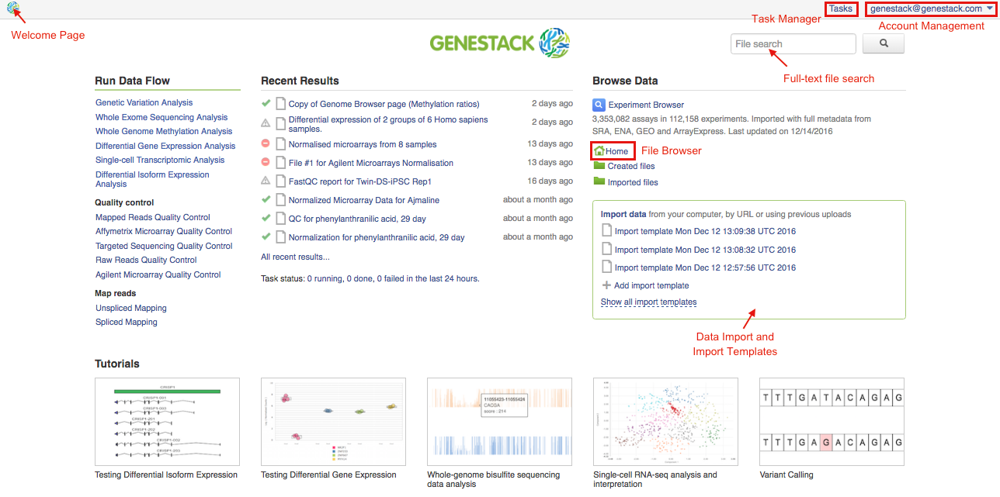

The very top of the page is static and you can always refer to it. Clicking
on your username (your email address) in the top right corner of the page will
give you access to your **profile** and allows to log out of the platform.

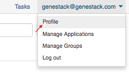

Clicking on your username in the top-right corner provides
access to **your profile**.

In this section you can change your name, password, the name of your
organisation and your vendor ID. 

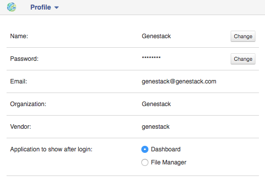

Organizations are a way of enforcing group permissions. There are two
types of user in an organization – administrators and non-administrators. If you are in
the same organization as another user, you can add them to groups you
control and share files with them freely. If you are in different
organizations, administrators from both organizations first need to
approve adding them to the group. You can learn more about data sharing,
permissions and groups in the `Sharing Data and Collaboration`_ section.

Vendor IDs are used for app development. Apps you have created will be
marked with your vendor ID. Moreover, here you can specify which page you
would like to see after login: Dashboard or File Manager.

**Tasks** links to the Task Manager app, where you can monitor running and
previous computations.

In the bottom right corner of the page you can see the Chatra **chat window**.
You can chat with us at any time if you get stuck or if you find a bug.

Let’s go back to the Dashboard. Here you can find the following sections:

1. **Run Data Flow** includes a collection of *most commonly used data flows*
   we have prepared for our users.
2. **Recent Results** shows you the files you have recently created with 
   their initialization or completion status.
3. **Browse data** section allows you to browse through public, private and
   shared data with Experiment Browser app which allows you to search through
   the wealth of your data using complex queries.
   In the Browse Data section, you’ll also find a link to the File Manager
   (home), as well as often used folders: Uploaded files, Imported files,
   Created files and Exports.
4. **Import data** allows you to import your data using either a
   custom or the default import template. See the section "Import" for more information.
5. **Tutorials** explain the most common analysis types in greater detail.
6. **Search** across the metadata of all your files using the full-text file
   search text box.

Wherever you are on the platform, you can also access a **shortcuts menu** by
clicking on the Genestack logo in the top left corner of any platform page.
It’s an easy way to reach most commonly used apps and folders. Dashboard,
Manage Applications, Manage Groups, Manage Users,
Import Data and Import Template Editor,
Experiment Browser, File Manager as well as the folders
for created and imported files can all be found here. To access the shortcuts
menu, simply click Genestack logo in the upper-left corner of any page.
Let's look deeper into each of these items.

Manage Applications
~~~~~~~~~~~~~~~~~~~

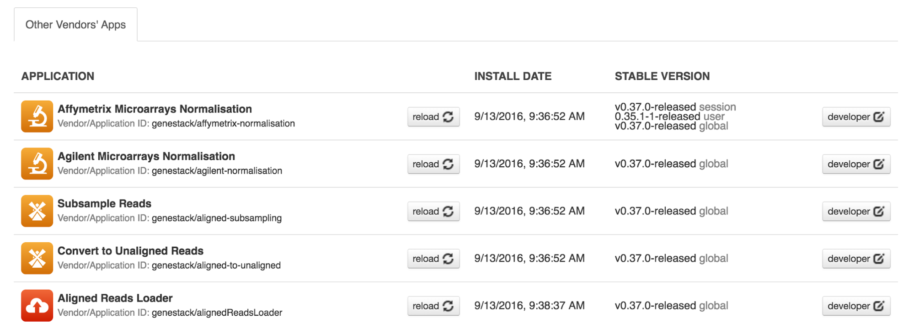

Here you can view the list of all applications available on the platform
– both ones you have written as well as public ones.

The **Developer** button will give you the option to choose which version of
an app you want to use.

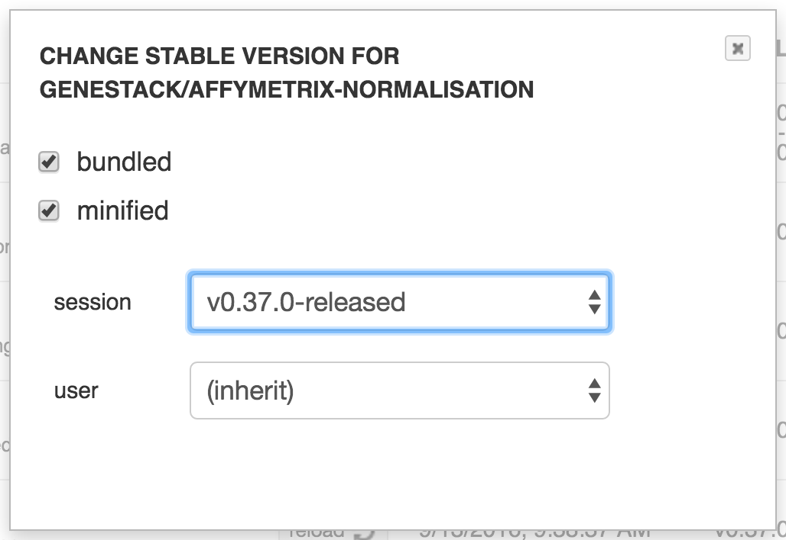

The **‘bundled’** and **‘minified’** options optimize
loading of CSS and JS used in the app. You can find more details on
bundling and minifying in `blog post by Dino Esposito`_.

.. _blog post by Dino Esposito: https://msdn.microsoft.com/en-us/magazine/dn451436.aspx

The **Session** and **User** dropdown menus allow you to chose the version of
the app you want to use for your current log-in session and for your
current user account respectively. **Inherit** is the default option and the
order of version choice inheritance is Global → User → Session. If you
change the version of an application, you also need to **reload** it to run
the version of your choice.

Manage Groups
~~~~~~~~~~~~~

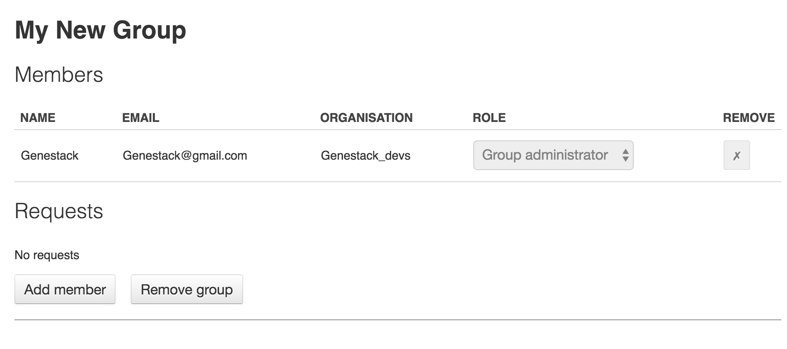

In order to share data, we use **groups**. In the Manage Groups section you
can change the settings of your current collaboration groups or create
new ones and invite other users to join. You can also view and accept
all the invitations you have received from other users.
Read more about collaboration on Genestack in the `Sharing Data and Collaboration`_ section.

Manage Users
~~~~~~~~~~~~

In this section, you can change password of your users or create new users.
You can find more about managing users on Genestack from `this video`_.

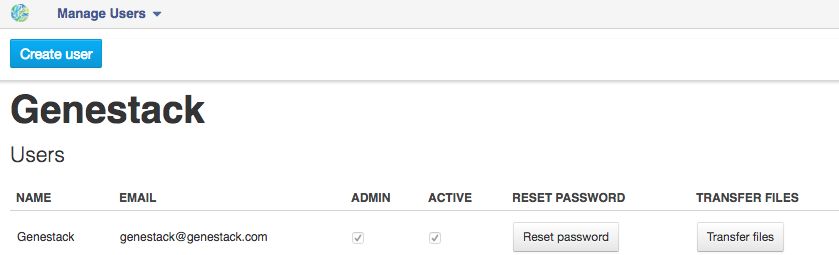
.. _this video: https://www.youtube.com/watch?v=asMhUjD_i68&list=PLqGSwEO9VFw1e7Z996-gQWE4vgRZMyY3Z&index=1

Importing Data
--------------

Supported file types
~~~~~~~~~~~~~~~~~~~~

Here is a list of file types that can be imported into Genestack.
Note that gzippped (.gz) and zipped (.zip) files are also supported.

- **Microarray Assay** - raw microarray data obtained from a microarray
  experiment (you can import Affymetrix (CEL), Agilent (TXT) or GenePix microarray data (GPR));
- **Infinium Microarray Assay** - raw intensity data files for Illumina Infinium Microarrays (IDAT);
- **Sequencing Assay** - raw sequencing data (FASTQ, SRA or FASTA+QUAL);
- **Microarray Annotation** - annotation file containing information about
  association of microarray probes to biological entities like genes,
  transcripts and proteins;
- **Continuous Genomic Data** - contains information on continuous genome
  statistics, e.g. GC% content (WIGGLE, WIG);
- **Discrete Genomic Data** - information on discrete regions of the genome
  with an exact start and end position (BED);
- **Mapped Reads** - reads aligned to a specific reference genome (BAM or CRAM);
- **Ontology Files** - OWL, OBO or CSV files used to annotate metainfo;
- **Reference Genome** - Reference genome sequence for a specific organism
  with annotation; (FASTA and GTF/GFF);
- **Variation Files** - Genetic Variations files, storing gene sequence
  variations (VCF).

When you upload microarrays or sequencing assays onto the platform, they will
be automatically imported as an experiment.

- **Experiment** - An experiment is a special type of folder that can only
  contain assays. When you import files that are detected as raw sequencing or
  microarray assays, Genestack creates an experiment and adds the assays to it.

- **Experiment attachments** additional documents in any file format (e.g. PDF, Word, text, etc.)
  can be uploaded as an experiment attachment. We will discuss teh use of attachments below.

Moreover, when you perform any analysis on Genestack, you can create other data
types, which cannot be imported. They include:

- **Affymetrix/Agilent/GenePix Microarrays Normalisation** - File with
  normalized Affymetrix/Agilent/GenePix microarrays data;
- **Differential Expression Statistics** - expression statistics for
  change in expression of individual genes or other genomic features between groups of samples,
  such as fold-changes, p-values, FDR, etc;
- **Genome Annotations** - A technical file used for matching GO terms and
  gene symbols to gene coordinates;
- **Mapped Read Counts** - The number of reads mapped to each feature of a reference
  sequence. Produced from Mapped Reads files;
- **Raw Reads** - Raw sequencing data that does not need to be associated with
  an experiment (as opposed to a sequencing assay);

Data Import
~~~~~~~~~~~

There are several ways you can access the **Import** application:

- using the **Import data** link on the Welcome Page;

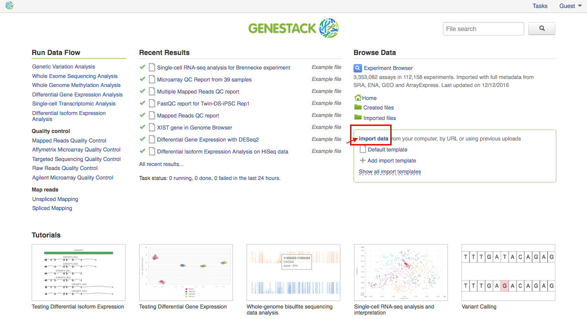

- clicking the **Import** button in the File Manager;

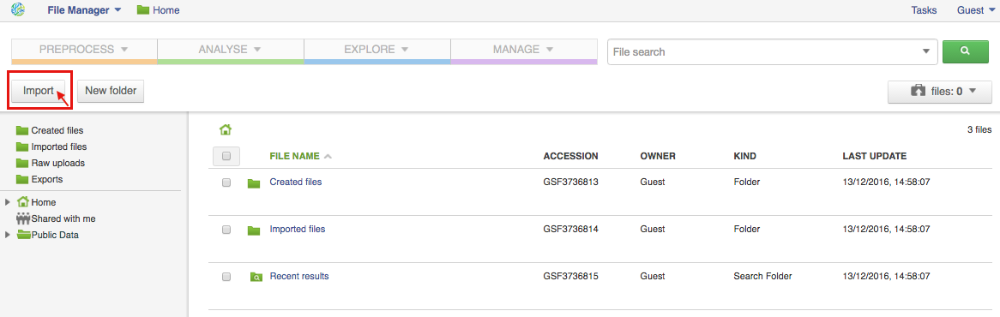

- clicking **Upload** button when you choose sources in the dataflow you'd like
  to run;

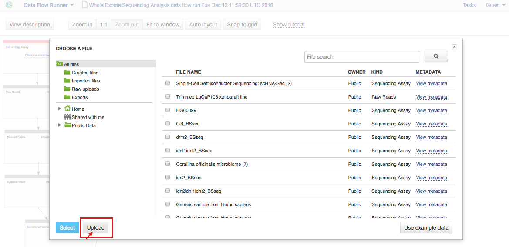

- using an **import template**. We’ll describe what import template is and how to
  use it later in the guide.

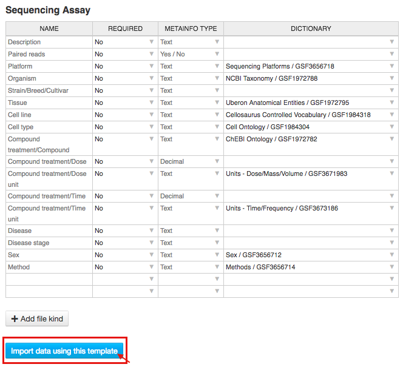

Import data includes three steps:

Step 1: Uploading files
^^^^^^^^^^^^^^^^^^^^^^^

There are two ways to upload data into the platform:

1. **Use data from your computer** - select or drag-and-drop files.

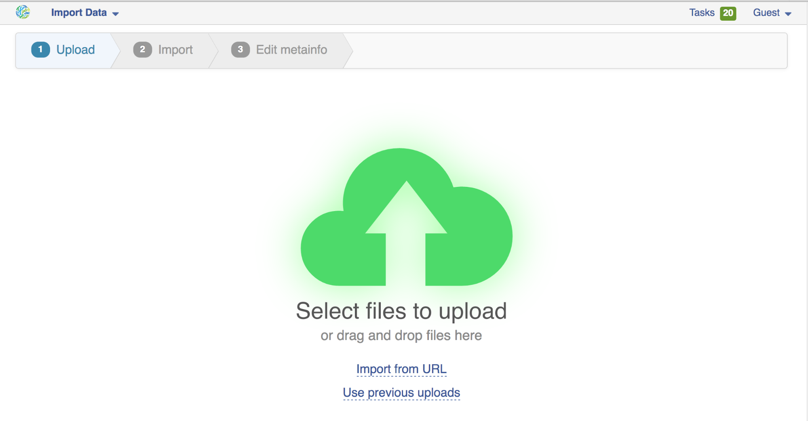

2. **Upload from URLs (FTP or HTTP/HTTPS)** - specify URLs for separate files or
   directories.

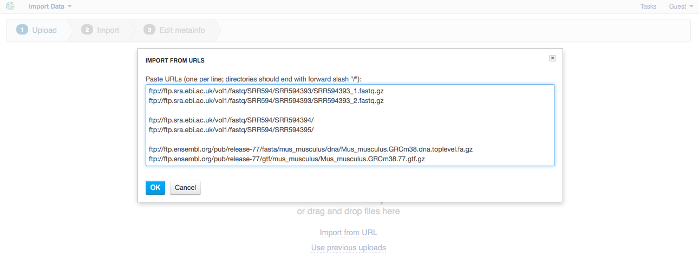

The **Use previous uploads** option allows you to avoid uploading the data a
second time.

Files are uploaded in multiple streams to increase upload speed. Uploading
from URLs is done in the background. This means that even while these files
are being uploaded, you can edit their metadata and use them in
pipelines.

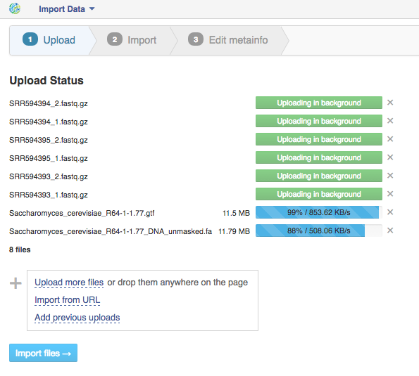

If during uploading you lose your Internet connection, you will be able to
resume unfinished uploads later.

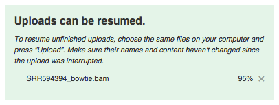

Click the "Import files" button to proceed.

Step 2: Format recognition
^^^^^^^^^^^^^^^^^^^^^^^^^^

After your data is uploaded, Genestack automatically recognizes file formats
and transforms them into biological data types: raw reads, mapped reads,
reference genomes, etc. Format conversions will be handled internally by
Genestack. You won’t have to worry about formats at all.

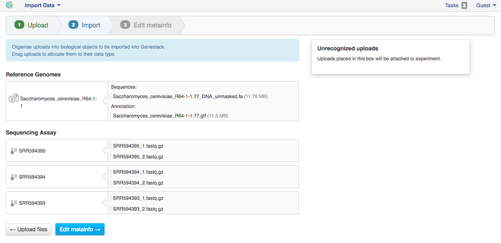

If files are unrecognized or recognized incorrectly, you can manually allocate
them to a specific data type: drag the raw file and move it to the green
"Choose type" box at the top of the page.

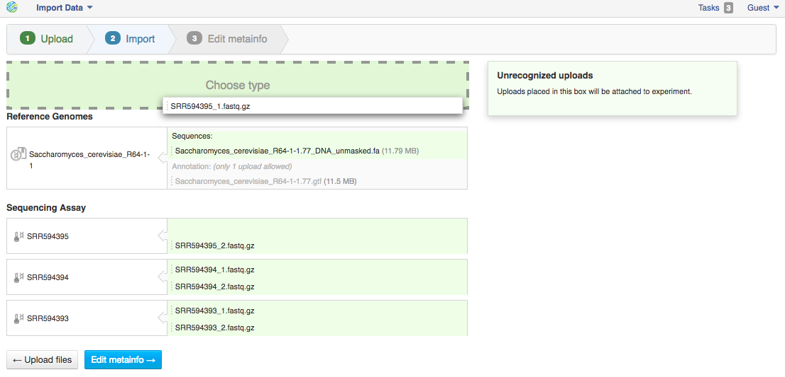

Choose the data type you find suitable:

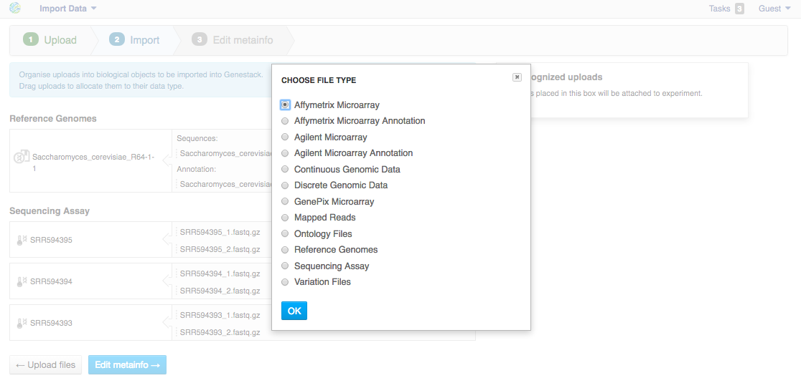

Click the "Edit metainfo" button to proceed.

Step 3: Editing metainfo
^^^^^^^^^^^^^^^^^^^^^^^^

In this step, you can describe uploaded data using an Excel-like spreadsheet.
Importantly, during this step, the import has already completed - you will
notice a message at the top of the page with the name of the folder where
the imported files are located (named "Imported on <date> <time>"), and
offering to share the data:

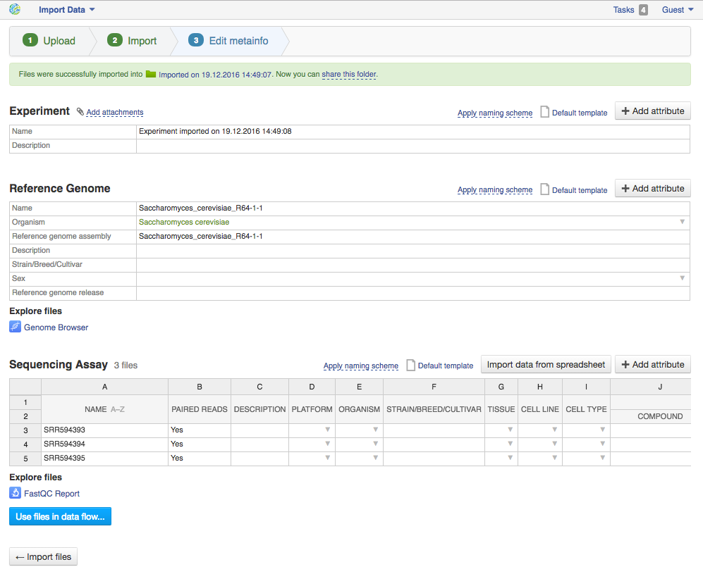

By default, you see all metainfo fields available for files, you can fill them
or create new custom columns. Click the "Add column" button, name new metainfo
field and choose its type (Text, Integer, etc.):

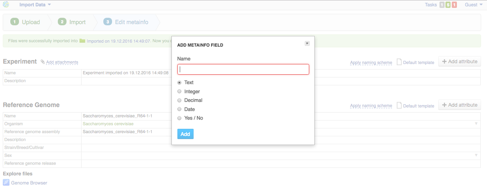

You can also choose to apply a naming scheme. This allows you to generate
file names automatically based on other metainfo attributes.

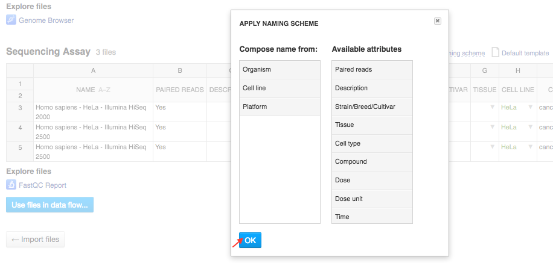

Metainfo fields can be associated with specific dictionaries and
ontologies. We pre-uploaded some public dictionaries such as the
`NCBI Taxonomy`_ (for the Organism field), Cellosaurus_ (for Cell Line),
ChEBI_ for chemical compounds, and the `Cell ontology`_.

.. _NCBI Taxonomy: https://www.ncbi.nlm.nih.gov/taxonomy
.. _Cellosaurus: http://web.expasy.org/cellosaurus/description.html
.. _ChEBI: https://www.ebi.ac.uk/chebi
.. _Cell ontology: http://www.obofoundry.org/ontology/cl.html

We also created our own controlled vocabularies to cover the Sex, Method and Platform fields.
You can find out more about ontologies in the
`Public Experiments, Automated Data Curation and Managing Metadata`_ section.

Finally, you can also create your own custom dictionary by importing it into the
platform as OWL, OBO or CSV file and attach it to the import template.

.. note:: **What is an import template?**

          Import templates allow you to select what metainfo attributes of your imported
          files will be tightly controlled (so you don’t lose any information in the
          process). Import templates allow you to set default fields for file metadata
          based on file type (e.g. Experiments, Discrete Genomic Data, Genetic
          Variations, etc.). Of course, if you’re only importing mapped reads, you don’t
          need to specify metainfo attributes for other data types.

You can select which import template to use in two ways: from the Welcome
Page, or during the 3rd step of the import process by right-clicking on the
import template name ("Default template" is for the public one). You can add
new import templates using the **Import Template Editor** app, which can be
found by clicking "Add import template" from the Welcome Page or from the
"Manage" submenu when you right click on an import template.

.. image:: images/import_templates.png
   :scale: 45 %

Genestack will attempt to fill these fields automatically, but you can always
edit the contents manually during the import process. By using metainfo
templates you can make sure that all of your files will be adequately and
consistently described so you will not lose any valuable information. For
example, here is the list of metainfo attributes used by default to describe
Reference Genome data:

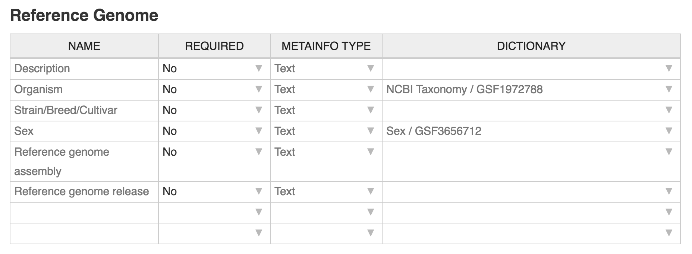

Now let’s say you wish to create an import template where you want to control
the metainfo attributes of sequencing assays (e.g. you always need to know the
tissue and sex of your samples). In order to do this, click on "Add import
template", then look for the table related to Sequencing Assays and for the
fields "tissue" and "sex", change the required fields to ‘Yes’. As you can
see, the system controls what type of information can you put into your
metainfo fields. In this case, for tissue the system will map your entries to
the Uberon ontology and the metainfo type must be text. You can edit
existing templates by right-clicking on a template and selecting the **Import
Template Editor** app from the "Manage" submenu.

If you wanted to add other metainfo fields that are not included in the table
already, you can do this at the bottom of the table where there are blank
spaces. For each entry, you must specify whether or not this field is
required and what is it’s metainfo type (e.g. text, yes/no, integer).

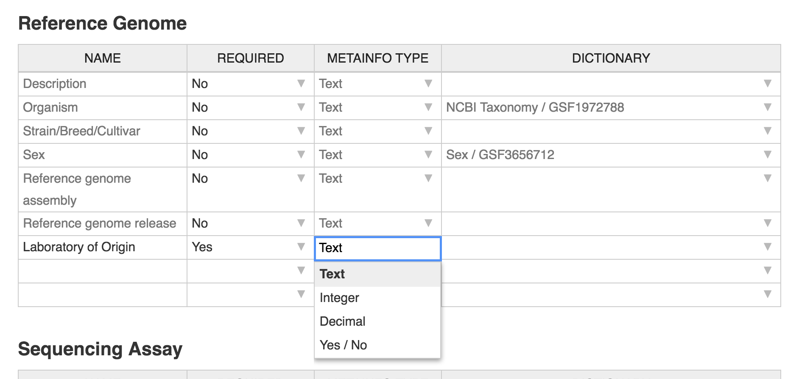

If you are using a file kind that is not yet listed, you can add a new one by
clicking on the **Add File Kind** button at the bottom of the page and
specifying the required metainfo attributes. Keep in mind that file kinds are
defined in Genestack - you won’t be able to create a template entry for a
file kind that is not used on the platform.

When you’re done, click on the blue "Import data using this template" button.
This will take you to the import page, where you can go through three import
stages described above.

Once you have completed the metainfo editing step, you may see a "Use files in
data flow" button at the bottom of the page by "Import files". This depends on
the file type you have imported. Later you can find your files in the "Imported
files" folder which can be accessed from the Dashboard and from the File
Manager.

Metadata Import
~~~~~~~~~~~~~~~

Apart from importing data, you can also import and validate the
metainfo attached to the assays and to the experiment. The **Import data from spreadsheet**
button allows you to retrieve the metainfo from a local CSV or
Excel file and map it to the Genestack assays:

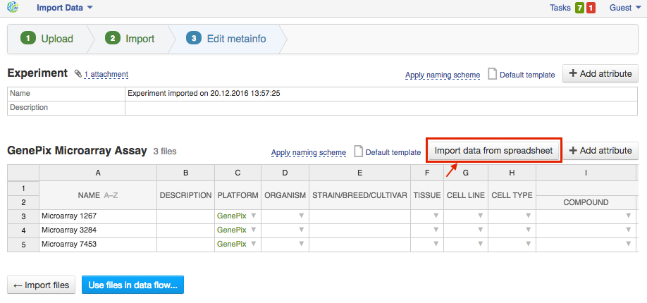

Click "Import data from spreadsheet" and drag the file with metainfo:

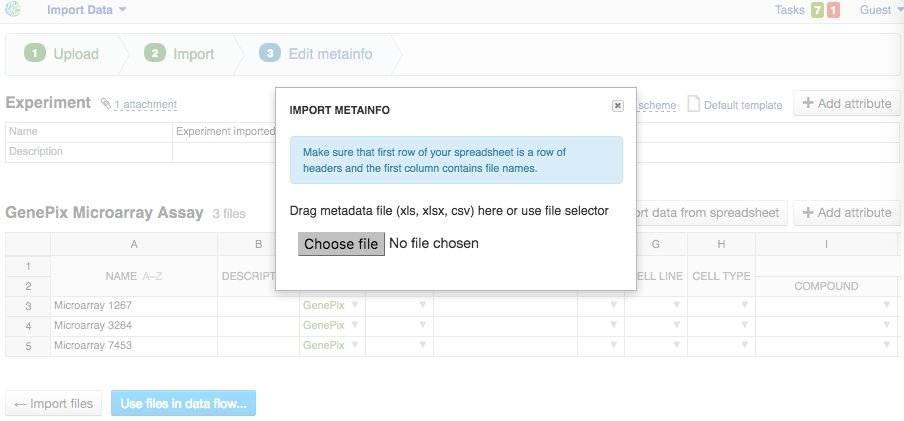

You should see something like this:

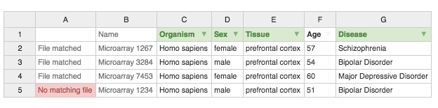

Each row of the Excel file was matched to one of the assays, based on the
"Name" column. We can see that the last row did not match to any of the
imported files. Columns that are mapped to a key present in the experiment's
template will be highlighted in green.

We can specify for each column whether the column should be imported, and if it
should be mapped to a different metainfo key, by clicking on the column header.
Click "Import" when you finish editing the table:

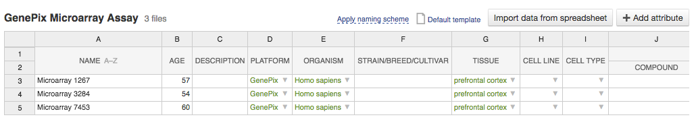

For instance, in this case we added new column "Age" and filled "Organism",
"Sex", "Tissue" and "Disease" columns that came from the default template.

Attachments
~~~~~~~~~~~

While importing an experiment into Genestack (just to remind you, an
experiment is a special folder that is created when you import sequencing or
microarray assays) you can choose to attach various files to it. For
example, you could include a PDF file with the experiment plan, an R script
that you used to process your data, etc. When you open your newly-imported
experiment, all of the attachments will accompany it. They will be safely
stored on Genestack, so later you can download them from the platform, in case
they get lost on your computer.

**How to upload an attachment?**

The attachment are uploaded together with the experiment data. In the "Upload"
section of the Import app, choose the attachments from your computer along
with your experiment data. On the "Import" step, the platform will
recognize the raw data and the fact that you have uploaded unrecognisable
files.

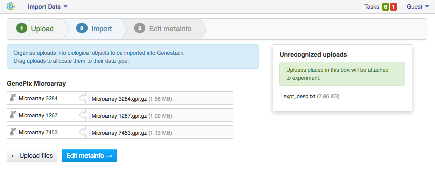

All the unrecognised uploads will be stored as attachments to your
experiment. You can also upload more or remove attachments later on the "Edit
metainfo" step:

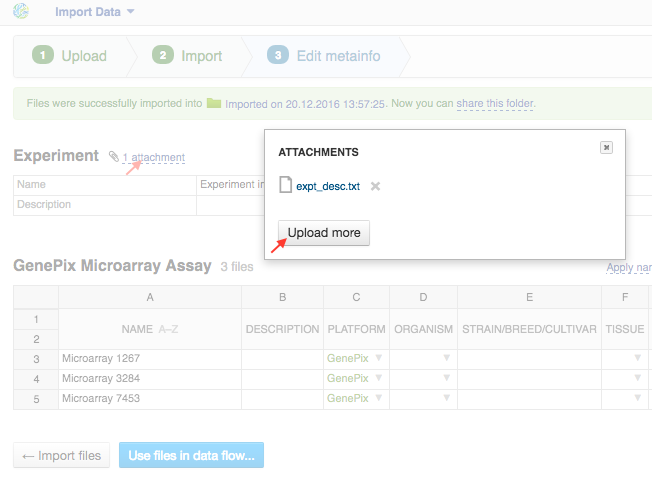

Or, add and remove attachments from inside the File Manager, when you open an
experiment. There is an "attachments" link by the experiment name and
description:

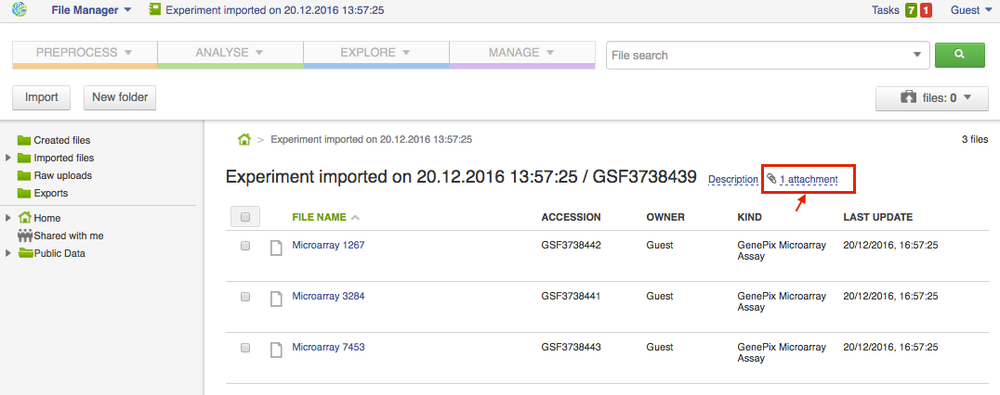

Browsing Data
-------------

Efficient data search and browsing are at the core of Genestack. The
platform provides rapid access to private, shared, and public data
analyses results.

Experiment Browser
~~~~~~~~~~~~~~~~~~

Genestack Platform provides a rich collection of public experiments from SRA, ENA, GEO
and ArrayExpress. Data is synchronizes regularly from these databases, keeping
things up-to-date. There are currently more than 3 million sequencing and microarray assays from over
100,000 public experiments indexed in Genestack.

The Experiment Browser allows to browse these public datasets, as well as your private
experiments or the ones shared with you on Genestack. You can access the Experiment
Browser either from the **Dashboard** or the **Shortcuts Menu** on the left-hand side.

You can search relevant data with **a free-text query**, and you can further
filter down experiments by **metadata attributes** using the checkboxes
on the left. These attributes are generated based on the metadata available for experiments.
For instance, you can set the filters 'Access', 'Method'
and 'Organism' to 'Public', 'RNA-Seq', 'Mus musculus', respectively,
to filter out publicly accessible data on mice obtained from mouse RNA-Seq data.

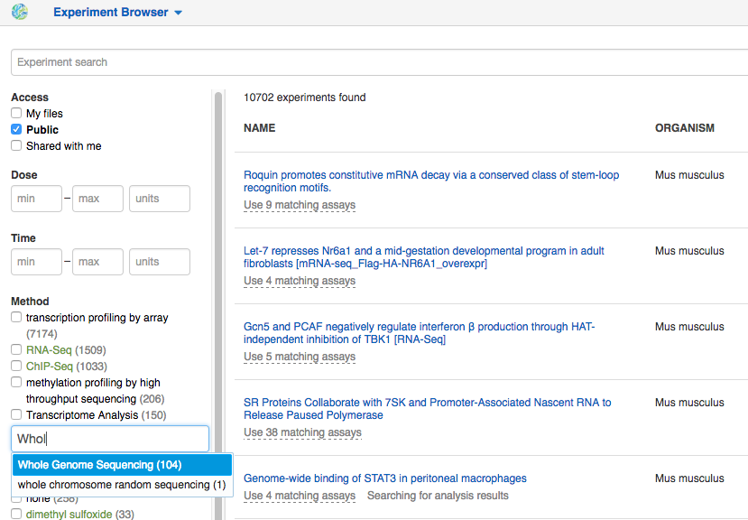

Click **Save N matching assays** link to explore
the list of matching assays and save them into one folder.

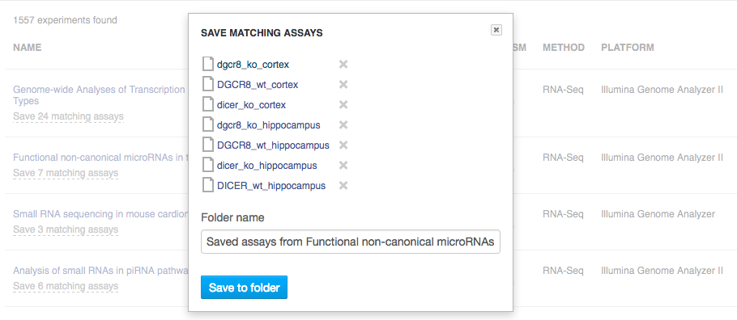

Moreover, Experiment Browser allows you to find bioinformatics analyses results
associated with raw data. If there are analysis performed on a given experiment,
and you have access to these results (i.e. they are yours, or they are shared with you),
then under the experiment name you will see a **View N analysis results** link.
Clicking it shows you the list of existing resulting files such as, for example, QC reports
or Genome Browser pages.

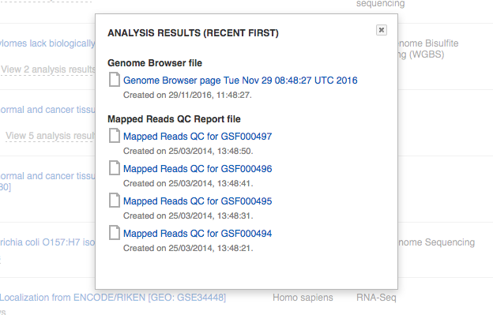

Clicking on the name of any of the experiments will take you to
the **Metainfo editor**, where you can view (and possibly edit) the metadata of this
experiment and its assays.

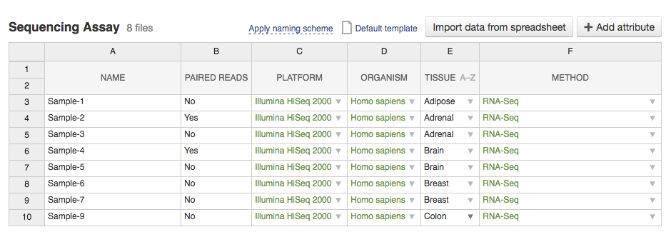

Besides that, on the Metainfo Editor page you can run the assays through a pipeline via the button
**Start new data flow with application**. You can either use an existing data flow matching the assays, or build a
new pipeline step by step.

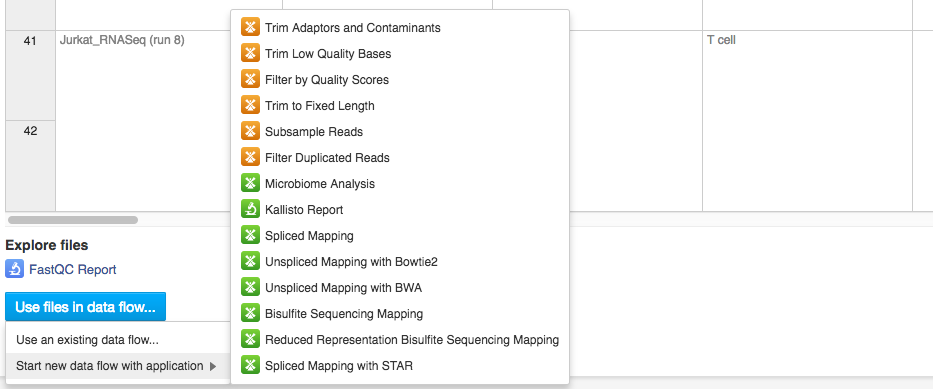

From the Metainfo Editor, you can also open the experiment in the **File Manager** by clicking on
the experiment's name at the top of the page and selecting **Explore > File Manager**.

.. image:: images/from-ME-to-FB.png

File Manager
~~~~~~~~~~~~

Like on any operating system, the **File Manager** is where you can easily access
all of your files, organise them into folders, and open them with various applications.

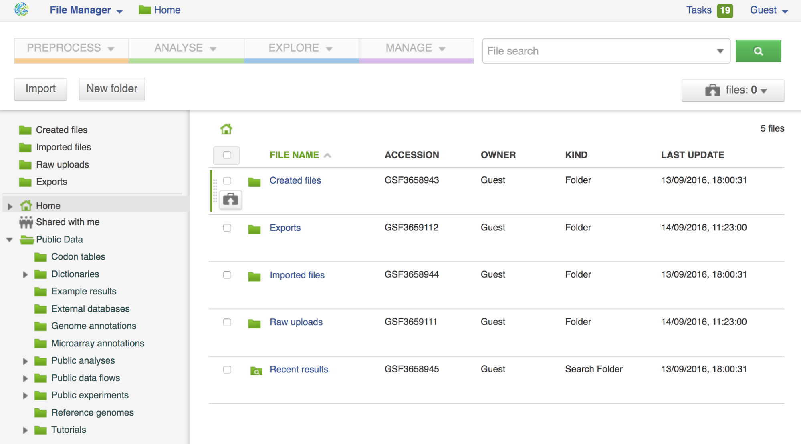

The panel (tree view) on the left-hand side is the file system navigator.
Here you can see many different folders. Some special folders are worth mentioning:

**Created files** is the folder where any new file created by an application on Genestack goes.

The files are organized by date, with oldest ones on top; however, you
can change this order to show the most recent ones - just click on the
header of the "Last Update" column.

**Imported files** is where imported data goes, organized by
date: all files imported at the same time (during one import action)
will be located in the same folder. 

**Uploads** contains all the files you’ve uploaded into Genestack -
FASTQ and BAM files, pdf documents, excel tables etc.

.. note:: **What is the difference between uploads and imported files?**

          When you have just started importing your files (in various formats like
          FASTQ, BAM etc), they all go to the specific storage area (the "Uploads"
          folder). During import, Genestack will recognize these uploaded files and
          allocate them to appropriate biological types (you can also do it
          manually), e.g. sequencing assays, mapped reads etc. These meaningful
          biological objects are what you work with on Genestack, and these are
          located in the "Imported files" folder.

The **Exports** folder contains data ready for export. See the `Data Export`_ section for more information.

Below these four grouped folders, you will see two more: Shared with me
and Public Data.

**Shared with me** contains all files that other users have shared with
you or that you shared with other users. See the `Sharing Data and Collaboration`_ section for more details.

**Public Data** contains all of the goodies we have preloaded on Genestack
to make life a bit simpler for our users. This folder contains:

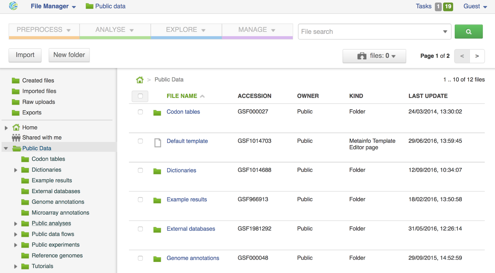

#. **Codon tables**: currently 18 different tables such as yeast
   mitochondrial, vertebrate mitochondrial, blepharisma macronuclear
   etc;
#. **Dictionaries**: used for metainfo editing and curation, e.g. sex,
   sequencing platform, NCBI taxonomy. Read more about dictionaries in
   "Data and Metainfo Management" section;
#. **Example results**: so you can play around with our platform and see
   what types of visualizations are available;
#. **External databases**: sets of sequences with associated annotation;
   e.g. greengenes for 16S rRNA;
#. **Genome annotations**: for a range of different organisms and platforms
    (for WES Analysis);
#. **Microarray annotations**: annotation lists to be used as the
   translation table to link probes and common public domain sequences;
#. **Public analyses**: all files created during re-analysis of previously
   published data sets;
#. **Reference genomes**: various reference genomes for the most commonly
   analysed organisms;
#. **Public data flows**: all data flows available to our users, including
   tutorial data flows and the ones found on the Welcome page;
#. **Public experiments**: this is a feature we’re particularly proud of. We
   have pre-loaded the platform with thousands and thousands of publicly
   available experiments, from public repositories such as GEO,
   ArrayExpress, SRA, and ENA. Currently we have about 100,000
   experiments in our database.
#. **Tutorials**: the folder contains files we use as examples during
   various tutorials. To read more on particular analysis types, go to https://genestack.com/tutorials/.

To access the **context menu** for a given file, you can either do a right or left click
on the respective entry in the file browser. The topmost entry is the
app that was used to generate this file, or the app that should be used
to view it. The next four entries are submenus for each of the four different
types of apps that can be used on the file. Further down are options for
viewing and re-using the pipeline used to generate the file. The final
section allows you to manage file locations and names. For folders,
left-clicking opens the folder, while right-clicking opens the menu.
The **Add to** and **Move to** action allow you to link or move a file to a chosen directory.

.. note:: **This does not perform a copy**

          We use the word "linking" and not "copying" in this context, because in Genestack,
          adding a file to a folder does not physically create a duplicate of
          that file (unlike copy-pasting in your traditional operating system). It just adds a link to
          that file from the folder (similar to symbolic links on UNIX).

**Show all parent containers** shows you a list of all the folders in which the
current file is linked. The **file accession** is a unique identifier attached to each file.
Unlike other metainfo attributes, it will never change for any file.

.. image:: images/parent-containers.png

Above the File Manager pane, you can find the **Import** button. Clicking
it takes you to the Import app page, where you can upload your files,
import them into the platform and edit their metainfo. 

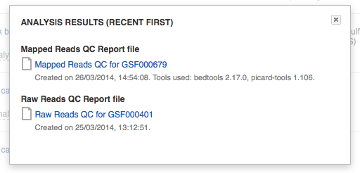

Next to the Import button, you can see a **New Folder** button. Using it
you will be able to create a new folder wherever you want. Another option
- **New folder with selection** - appears when you have selected files and
want to put all of them in a separate folder.

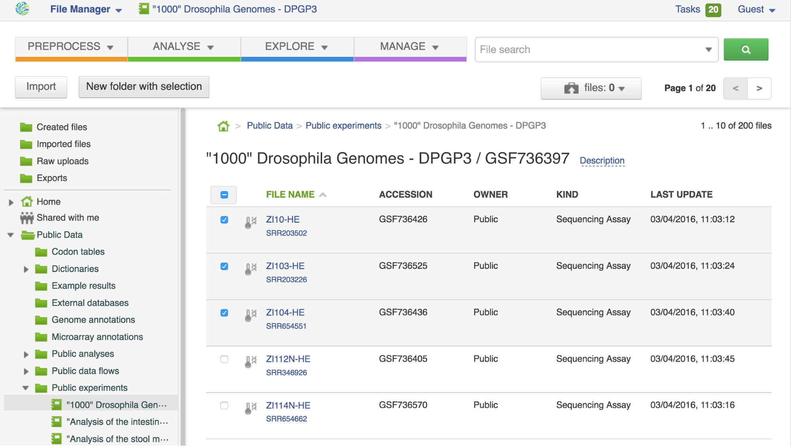

The **Preprocess, Analyse, Explore and Manage** menus at the top of the page
correspond to the four groups of applications that can be used to process and view data.
These menus will become available when you select a file. 

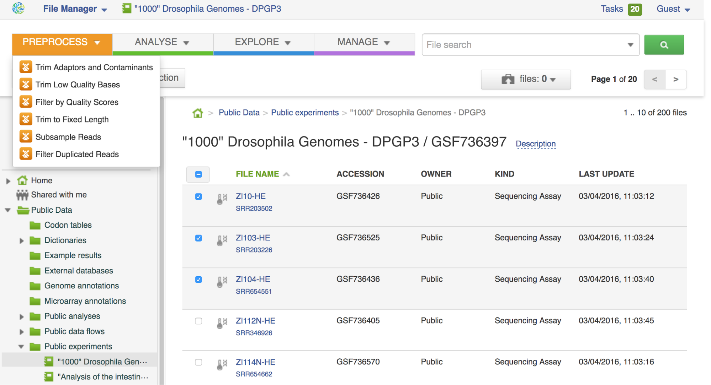

When you choose a file, the system will suggest apps which can work with the specific
file type (e.g. sequencing assay). However, you still need to think about the nature of
the data. For instance, if you want to align a raw WGBS sequencing assay,
Genestack will suggest several mappers, but only the Bisulfite
Sequencing Mapping app will be suitable in this case. To figure out what
apps are recommended to process WGBS, WES, RNA-seq or other sequencing
data, go to the "Building pipelines" section of this guide.

**File search** in the top-right corner allows you to search for files by
metadata (names, organism, method). To limit the search by file
type or whether or not the file is shared with you, click on the arrow
inside the search box.

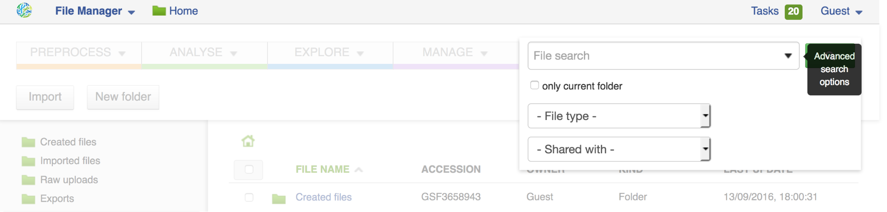

Below the search box is a button to access your **briefcase**. Your
briefcase is a place where you can temporarily store files from various
folders. **To add** files to your briefcase, hover over each
individual file and use the special "briefcase" button that appears or
select several files, right-click on them and choose "Add to
briefcase...". **To delete** an item from your briefcase hover over it and
click on the "x" button. **To clear all** items from the briefcase, select
the "Clear all" option.

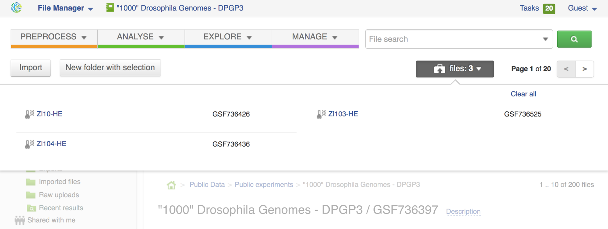

If you select a file, **three additional** buttons will show up, allowing
you to **share**, **delete** the file or **view metainfo** (an "eye"-icon) for
the file.

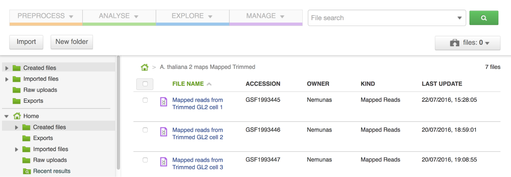

.. image:: images/3buttons-2.png

Use the **Share** button to share your data with colleagues (the share button
will not be available if you are using a guest account).
Read more about sharing on Genestack in the section `Sharing Data and Collaboration`_.

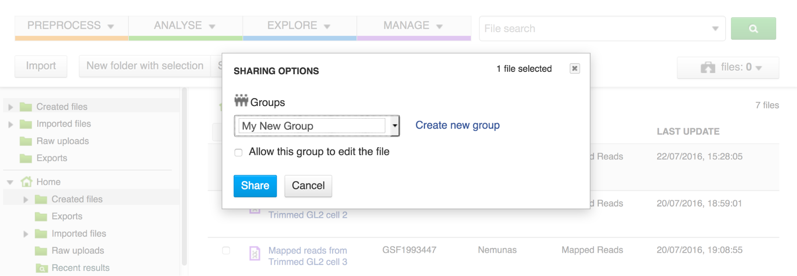

The **Delete** button allows you to remove your files from the system.

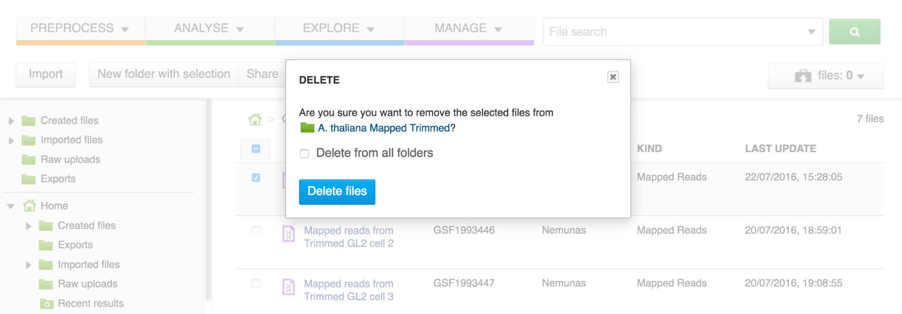

The **View metainfo** button gives you more information about the file: technical
(file type, its accession and owner, when the file was created and modified,
etc.), biological (e.g. cell line, cell type, organism, etc.), and file
permissions.

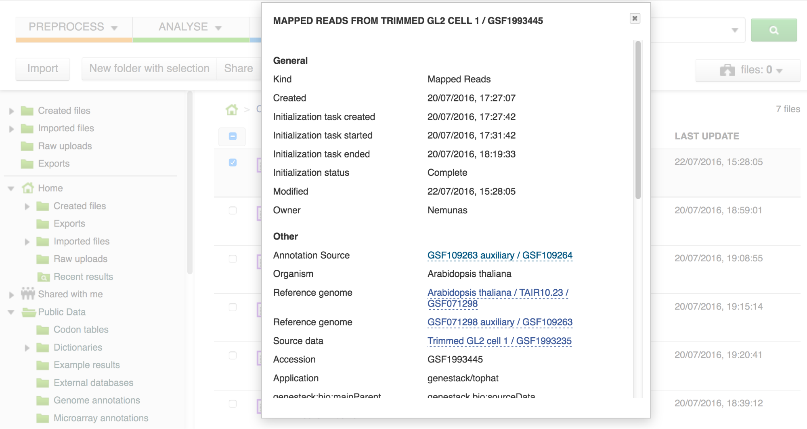

.. _Getting Started With Genestack Platform: https://genestack.com/tutorial/getting-started-with-genestack-platform/
.. _Testing Differential Gene Expression: https://genestack.com/tutorial/testing-differential-gene-expression-on-genestack-platform/
.. _Whole Genome Bisulfite Sequencing Analysis: https://genestack.com/tutorial/whole-genome-bisulfite-sequencing-analysis/
.. _Whole Genome Sequencing Analysis: https://genestack.com/tutorial/wgs-analysis-on-genestack/

Public Experiments, Automated Data Curation and Managing Metadata
-----------------------------------------------------------------

Our platform provides you with a huge collection of freely accessible experiments that we
imported from various well-known repositories, such as GEO NCBI, ENA, SRA and Array Express.
All the public experiments and assays are accompanied by original metainformation
describing biological. Generally, this information is not standardized that makes operations
with biological data, like browsing data and combining assays from several experiments or reproducing some
analysis, difficult or even impossible without human participation.
To harmonize raw metadata we apply **automated curation** where we map raw entries to
controlled terms that we store and maintain in special files called **Dictionaries**.
To prepare these Dictionaries we adopted terms from external ontologies or created them manually.
You can also use our standardized and unified terminology to describe your own data
or analysis results.

Our **Edit Metainfo** app enable you to prepare metadata manually. You can edit metadata on
the last step of data importing process (see Import section for more information) or
later from any place of the platform with context menu.

Regardless the way we access Edit Metainfo app on its page we can see that
our files are broken down into groups by file type and their metadata are shown in tables where
rows represents metainfo fields.

By default a table is based on **Default Import Template** that, however, you can easily
replace with a custom one (learn more about templates in the section Importing data).
To do so click on the template's name, select **Change template**,
then in the appear pop-up window pick template of interest.

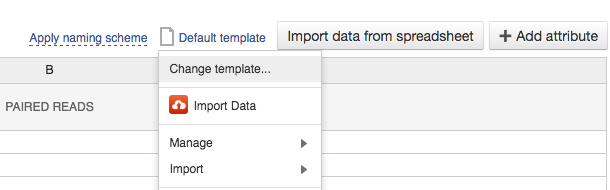

When you start typing in the corresponding cell, you will be
suggested with terms from our controlled dictionaries if possible. Although, you are free to enter
any values, we encourage you to use our standartized terminology, that helps you
to avoid typos and harmonise metadata.

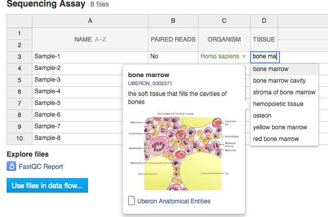

Furthermore, you can add several terms to one metadata field for each file. To do so
enter the first term as usual, click the button **Add another** and either add
one of the existing fields or create your own one (i. e. custom key).

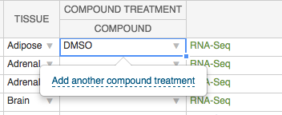

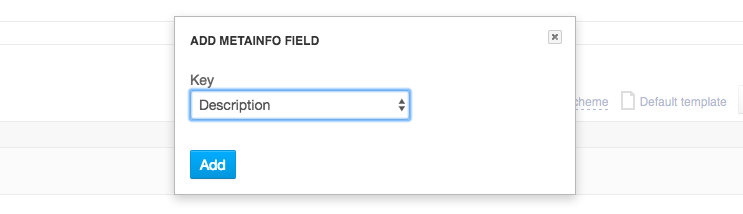

If you create new metadata field, you also need to specify its type:
for example, for free-text values you should select "Text", and for
numeric value you should use "Integer" or "Decimal" one.

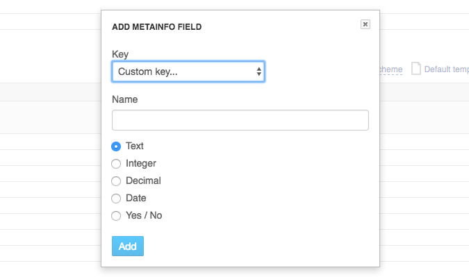

Click column name to **sort** metadata or **delete** the selected column if needed.

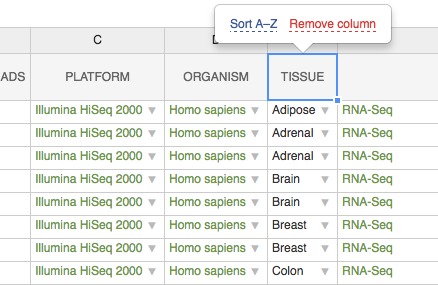

Besides filling metadata manually in the app, you can import it from your local computer.
Click the **Import data from spreadsheet** button and select a CSV, XLS or XLSX file with metadata
that you would like to attach.

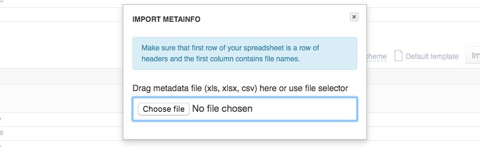

However, make sure that names of samples in the imported file are the same as
the ones shown in the column "Name" in Metainfo Editor app. Otherwise, all not matching information in
the imported file will not be imported. It will be marked in red, so you could easily fix
it by clicking on "Select file" link.

.. image:: images/from-spreadsheet-2.png

During metadata import process you can also decide whether a column should be imported and
associate it with another metadata field by click on the name of the column.

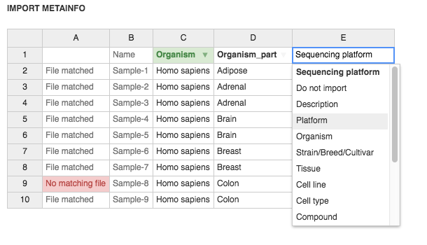

When you complete describing your samples, you can use the metadata to name them.
Click **Apply naming scheme** button and select metainfo fields that you want to use
to create names.

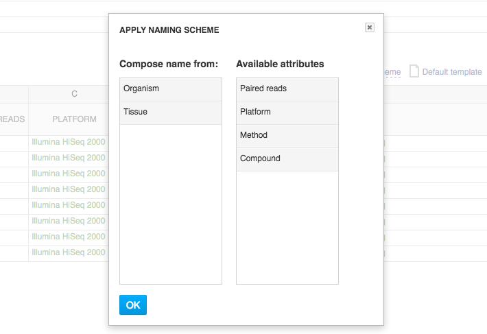

Once you are happy with the metadata for your files, you can proceed to analyse them by clicking
the button **Use all N files...**. You can use the suggested visualize apps
to explore your files, like "FastQC Report" to check the quality of raw sequencing assays, use on of the
an existing public data flows or build your own pipeline by adding applications ste-by-step.
Moreover you could share the files with your collaborators and add them to a folder of your choice.

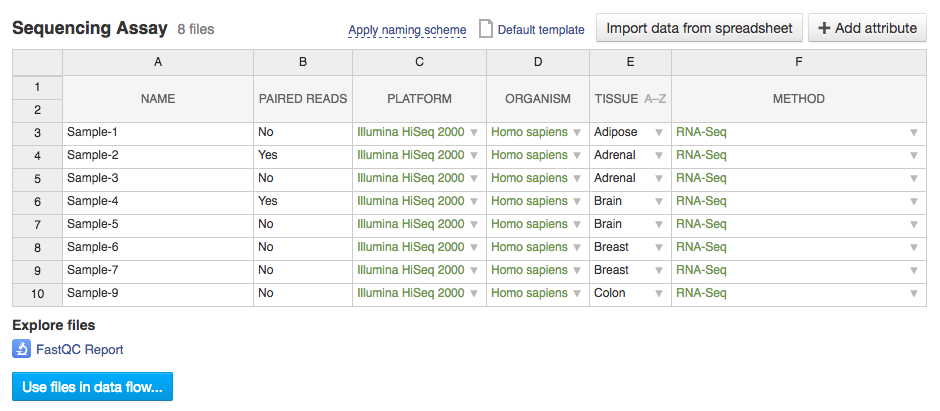

Sharing Data and Collaboration
------------------------------

Access control model
~~~~~~~~~~~~~~~~~~~~

There are three concepts around access control in Genestack: **users**, **groups**
and **organisations**. Each user belongs to a single organisation (typically
corresponding to the user's company or institution, or a specific team within
the institution). Organisations have two types of users: regular users and
administrators, who have the right to add new users, and deactivate existing
ones.

To check which organisation you belong to, you can go to the "Profile" page,
accessible via the menu which opens when you click on your email address at the
top-right corner of any page.

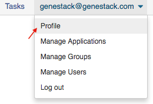

Managing users
~~~~~~~~~~~~~~

**If you are an administrator of your organisation**, the menu under your email
address will also have an additional item, "Manage Users", which takes you to
the organisation's user management page.

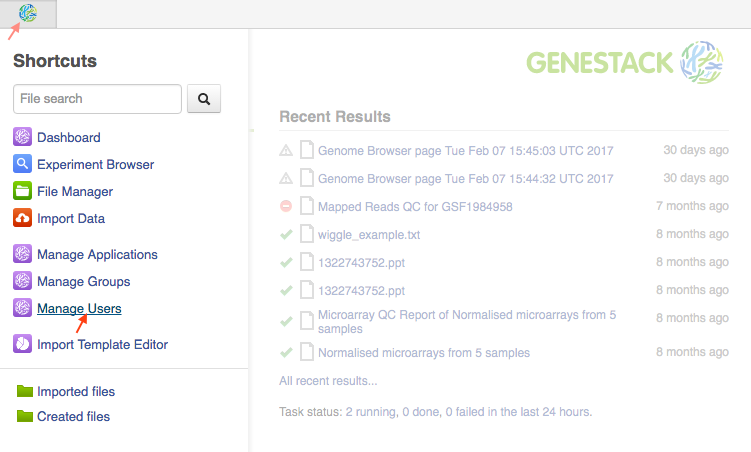

From there, administrators can add or disable users, and reset passwords.

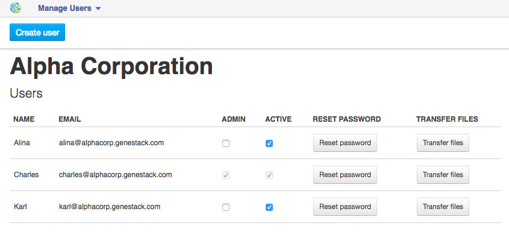

Sharing in Genestack is done through groups: every user can create any
number of groups, and add other users to them. Each file in the system can
be shared with any number of groups, who are granted different permissions
(read-only, read and write, etc.).

Managing groups
~~~~~~~~~~~~~~~

To manage your groups, click on your email address at the
top-right corner of any screen and select "Manage Groups".

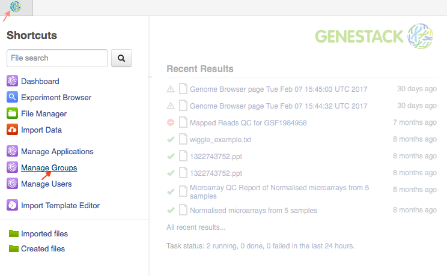

From there, you can create groups using the "Create group" button, add or remove
people from groups, and change users' privileges within groups. By default, you
will be a group administrator of any group that is created by your user.

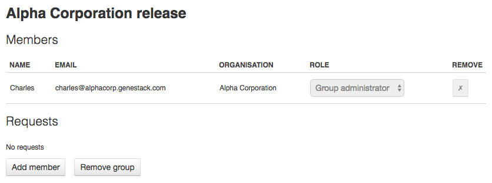

If you are an administrator of a group, you can click the "Add member" button
to add people to a group. From there you will be
prompted for the e-mail of the user you want to add. If they are in your
organisation, you will be provided with autocomplete

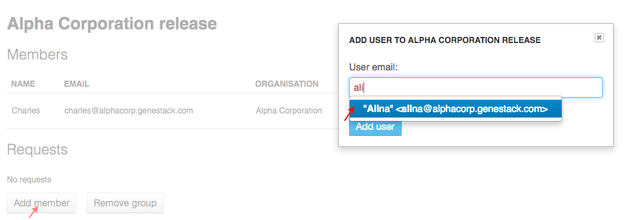

.. note:: **Can I add users from other organisations?**

          You can also add users from other organisations to a group
          ("cross-organisation group"). However, in that case, every user invitation will
          need to be approved by an organisation administrator of both your organisation
          and the other user's organisation.

Once you have added a user from your organisation to the newly created group,
you will also be able to set up their permissions within the group. Within a
group, a user can be:

- **Non-sharing user** (can only view data shared with the group);
- **Sharing user** (can view data shared with the group, and share data);
- **Group administrator** (all of the above, and can add/remove users to the
  group and change users' privileges).

By default, newly added users will be granted the lowest permission level
(Non-sharing user). You can change that using the dropdown next to their name.

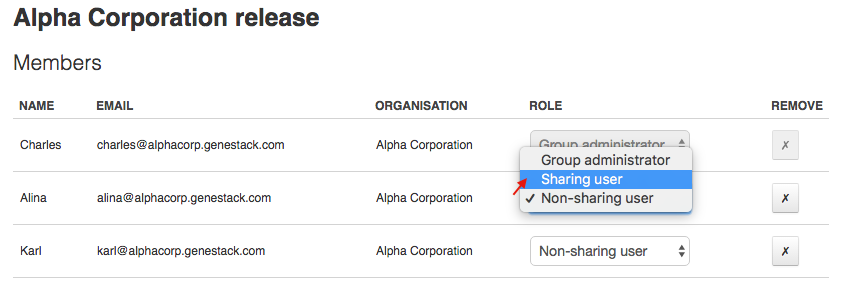

.. TODO I don't like the fact that we are linking to tutorials and videos from here

Learn more on how to Create and Manage Groups `in our tutorial`_.

.. _in our tutorial: https://genestack.com/tutorial/managing-and-sharing-data/

Sharing files with a group
~~~~~~~~~~~~~~~~~~~~~~~~~~

If you are a sharing user or an administrator of a group, you can share files with that group.
Any file created on Genestack can be shared.

To share a file, you can select it in the File Manager by
ticking the checkbox next to it, then clicking the "Share" button in the top bar.
Alternatively you can right-click on the file and select the "Share" option in the context menu.

.. image:: images/sharing_experiment.png

From there, you will be taken to the file sharing dialog, which asks you to
select a group to share the file with. By default, files are shared with
read-only permissions (both for data and metadata). But you have the option of
giving members the ability to edit the files in addition to just viewing them.

.. image:: images/sharing_dialog.png

Once you click the blue "Share" button, you will be prompted for your password,
and then asked whether you would like to link the file into the group's shared
folder.

.. image:: images/sharing_with_link.png

If you link the file into that folder, it will be visible to the group's users
when they open that folder (which can make it easier for them to find it). If
you click "No", the file will not be linked into the group folder but the
group's users will still be able to find the file through the File Search box
(for instance, if you tell them the accession of the file), in File Provenance
and through the Experiment Browser.

Each group has an associated group folder which you can access from the File
Manager under "Shared with me" in the left-hand side panel.

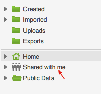

All files you share with other people, along with all files shared with you,
will be located in that folder.

.. TODO rewrite this section

Building pipelines
------------------
Select the assays you wish to analyse and from the menu on top of
the page or from the dropdown menu, select the first app you wish to see
in your pipeline. Application on The Platform are divided in several categories
such as *Preprocess* to prepare the data for actual analysis, *Analyse* perform
various kinds of analysis, *Explore* to visualise QC check or analysis results
and *Manage* to operate with your files. For each individual file the system
suggests only applications that can be used to analyse your data, considering
its type and metadata.

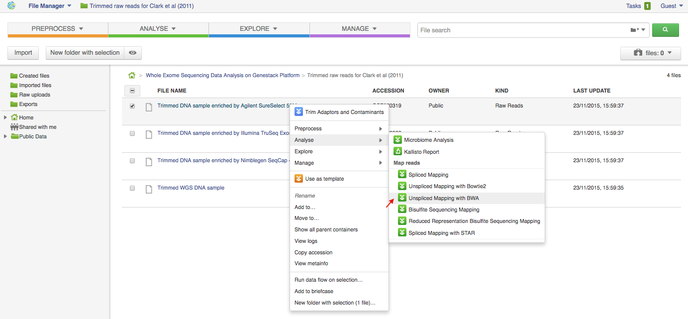

This will take you to the app page where you can:

- learn more about the application;
– view and edit app parameters;
– explore your results;
– add further steps to the file data flow (the pipeline).

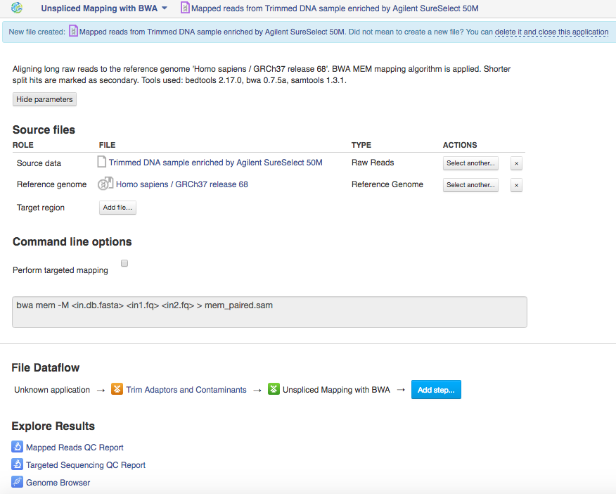

To proceed click on **Add step** button that will show you the list of all the
matching apps.

Continue adding steps until you have completed building your pipeline. When
you add each of the steps, you create new files which end up in the **Created files**
folder. However, these files are not yet ready to use - they need to be
initialized first.

Reproducing your work
---------------------

Complete reproducibility is one of the core strengths of Genestack. For any
file in the system, you can view its provenance and then replay the same
exact analysis on other data files. Select assay which history you wish
to explore and open it with **File Provenance** app
located in the Manage section.

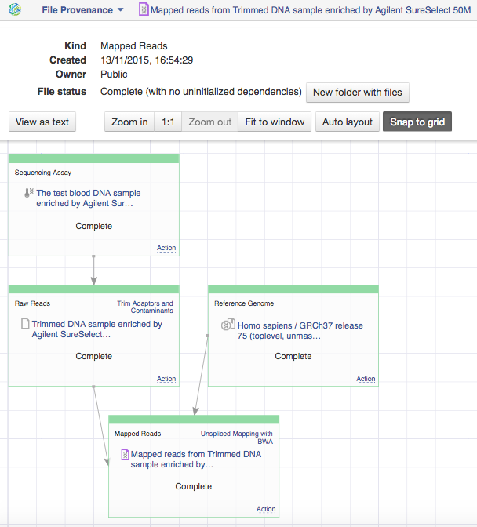

Besides that, the File Provenance app allows you to view the text description of the
pipeline used to create a given file. Clicking the **View as text** button
allows you to see what parameters and what tool versions were used at each
analytical step. You can copy this text and use it in a publication or a report.

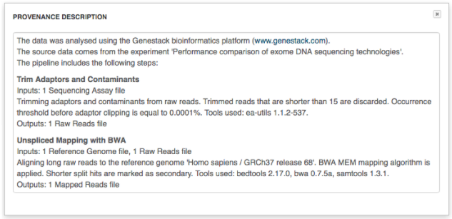

Clicking the **New folder with files** button will create a folder with all the
files used in this pipeline.

If you want to reuse the same pipeline on different data, you can
create the data flow identical to the pipeline used to create the original file,
by selecting the file of interest and choosing **Create new Data Flow** from the
available "Manage" apps.

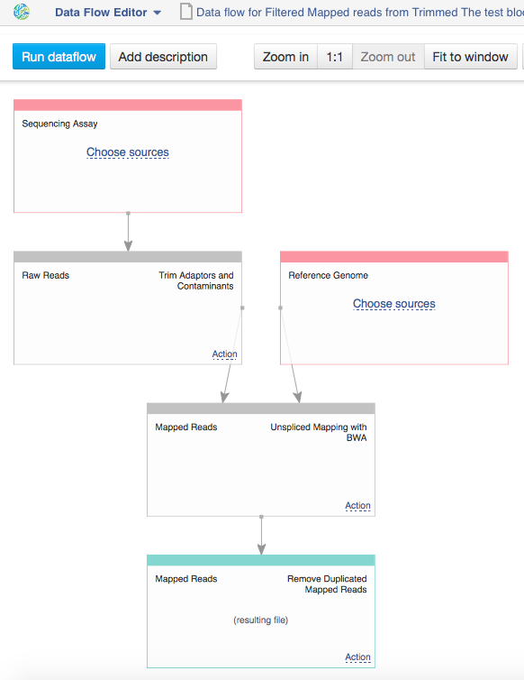

This will open **Data Flow Editor** app - one of apps in our system that are
used to work on data flows. Data Flow Editor app gives a visual
representation of the pipeline and allows you to choose your input files, for example
sequencing assays, and a reference genome. We would like to highlight here also that
a range of public reference genomes have already imported from Ensembl and readily
available on the platform. To add new inputs to the created data flow click choose sources.

 .. image:: images/data-flow-editor-2.png

 At this stage, no files have been created nor initialized.

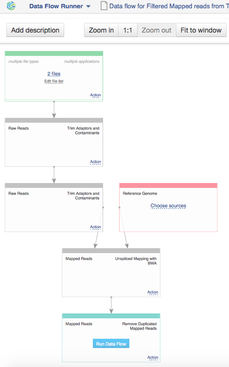

When you click on "Run Data Flow" button, this will take you to the **Data Flow Runner** app.
Click **Run dataflow** button to create all the relevant files in an
uninitialized state.

.. image:: images/data-flow-runner-1.png

Separate file is created for each individual input file on every step of analysis.
You can find them in separate folder in the "Created files" folder.

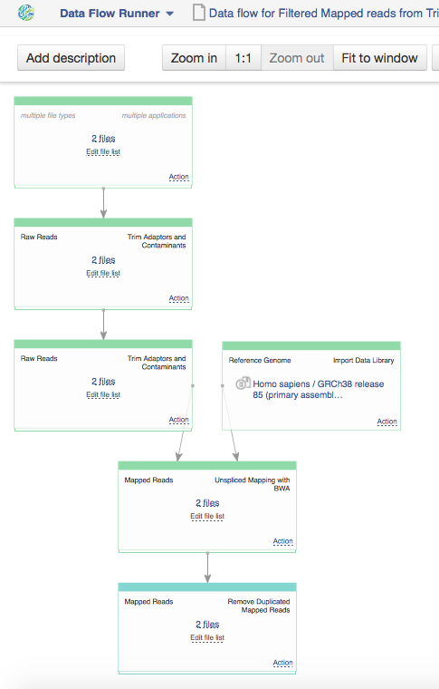

When the files are created, you will be suggested to either start initialization right away
or delay it till later.

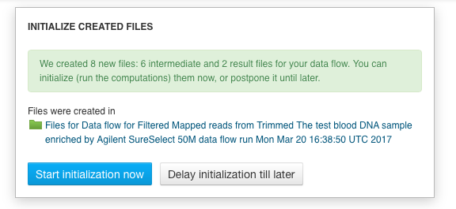

Remember, that you can check and change parameters if needed only before computations started.
To do so, click app name in the corresponding node of the data flow.
However just as initialization process started, any changes of files are forbidden.

Finally, whether you decide to start the computation or not, you will be suggested with
a list of matching app to explore results or continue analysis.

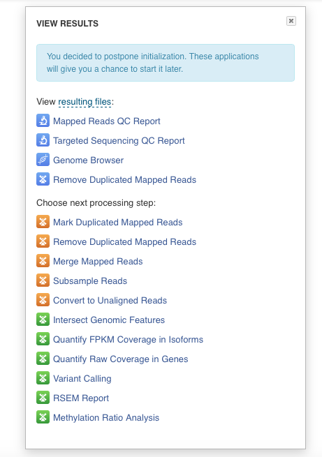

Public data flows
-----------------

On our platform, you can find a range of public data flows we have
prepared for our users. We cover most of the common analysis types:

- Single-cell Transcriptomic Analysis
- Genetic Variation Analysis
- Whole Exome Sequencing Analysis
- Differential Isoform Expression Analysis
- Whole Genome Methylation Analysis
- Differential Gene Expression Analysis
- Affymetrix Microarray Quality Control
- Targeted Sequencing Quality Control
- Mapped Reads Quality Control
- Raw Reads Quality Control
- Agilent Microarray Quality Control
- Unspliced Mapping
- Spliced Mapping

Clicking on the data flow will take you to the Data Flow Editor where you can
add source files and reference genomes. When you have chosen your files,
click on "Run data flow" to go to the Data Flow Runner. If you don’t want to
change any settings, you can click "Start initialization now". To tweak the
parameters and settings of the apps, select "Delay initialization until later".
To change the settings, click on the name of the app in the data flow. This
will take you to the app page, where you can select "Edit parameters" and
introduce your changes. When you are done introducing your changes, go back to
the data flow and initialize your computations.

Initialising files
------------------

You can initialize files in different ways:

1. Using **Start initialization** option in the context menu.

Click on the name of your last created file at the top of the application page
and select "start initialization".

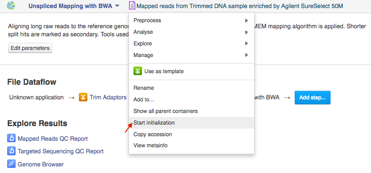

2. Clicking **Start initialization now** in Data Flow Runner application.

If you want to save the pipeline and specific parameters you used here
to re-use again on other files you can create a new data flow. You need
to do this, before you start initialization. Click on the name of the
last created file, go to Manage and **Create new Data Flow**.

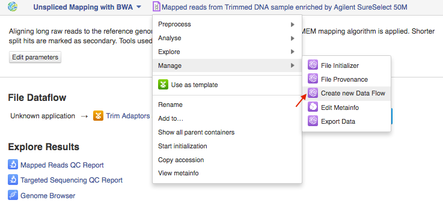

This will take you to the Data Flow Editor where you can introduce any last
changes to your pipeline. Click on "Run dataflow" button once you are done.

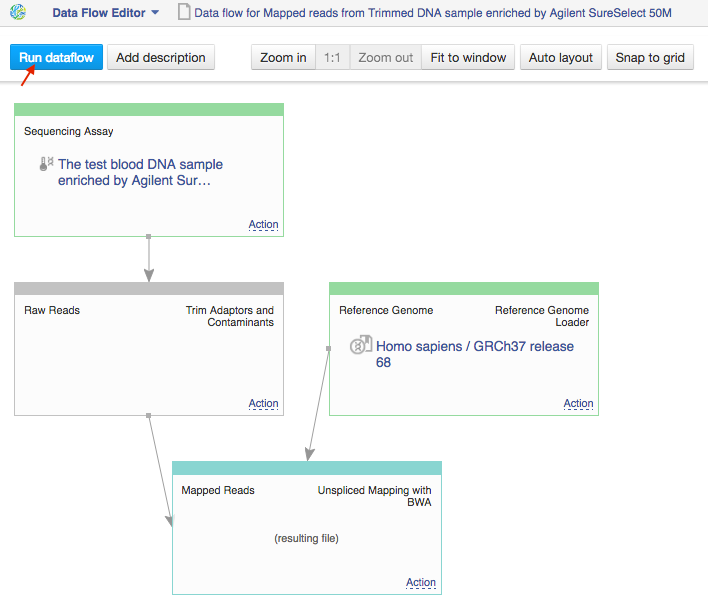

This will take you to **Data Flow Runner** page where you can initialize the
computations (by clicking "Run Data Flow" in the last cell).

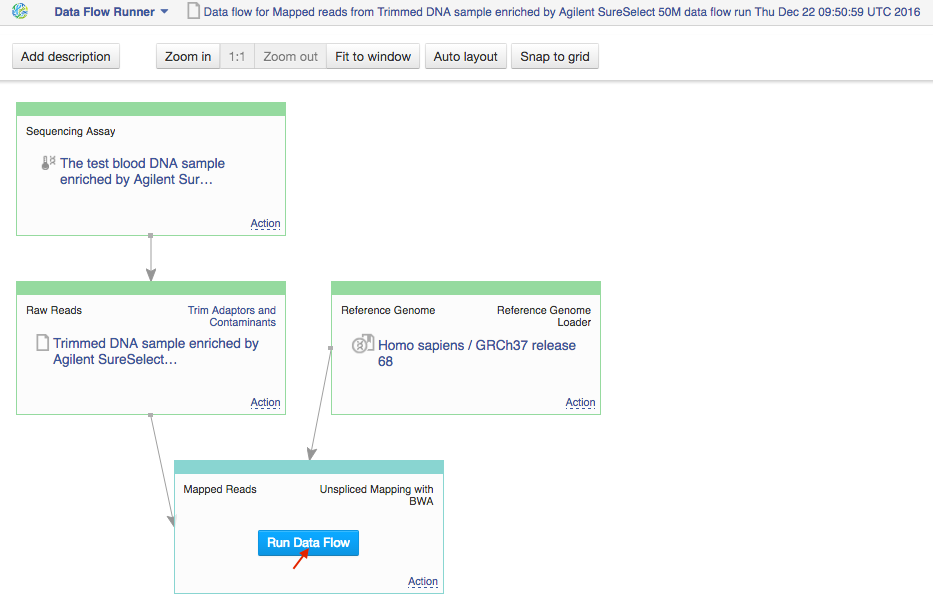

Choose **Start initialization now** option if you'd like to run the
computations immediately or **Delay initialization till later**.

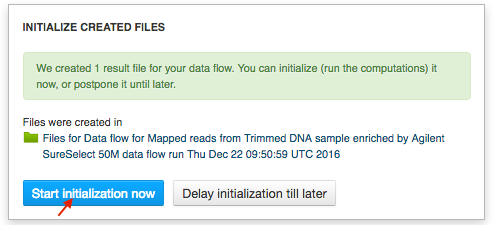

This data flow, along with all your results (after computations are finished)
will be stored in the "Created files" folder.

3. Using **File Initializer** application.

Select the created uninitialized files (from data flow or File Manager), right
click on them, go to "Manage" and choose the "File Initializer" app.

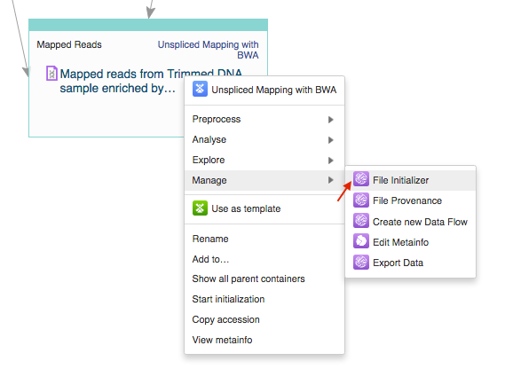

File Initializer reports the status of the files and allows you to initialize
those that need to be by clicking on their respective "Go!" buttons, or
"Initialize all" to do them all at once. Files do not need to be produced by
the same apps to be initialized together.

.. image:: images/file_initializer.png

4. Using **Start initialization** button in File Provenance.

Alternatively, you can click on the name of the last created file, go to Manage
and choose File Provenance application. The app displays the pipeline and also
allows you to run the computation using "Start initialization" button. You will
learn more about this application later in this section.

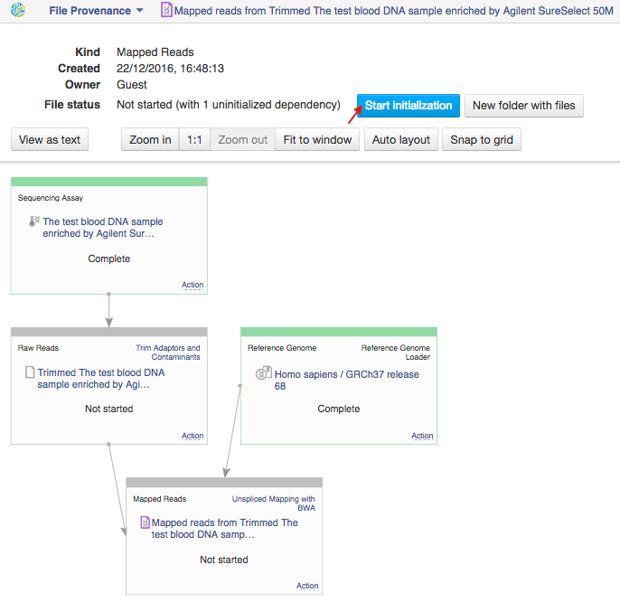

You can track the progress of this task in Task Manager. Doing this will begin
initialization of all the files (including intermediate files) you have
created whilst building this pipeline.

Task Manager
------------

In the top-right corner of any page on Genestack, you can see a link called Tasks.
It will take you to the Task Manager, an application which allows you to track the
progress of your computations.

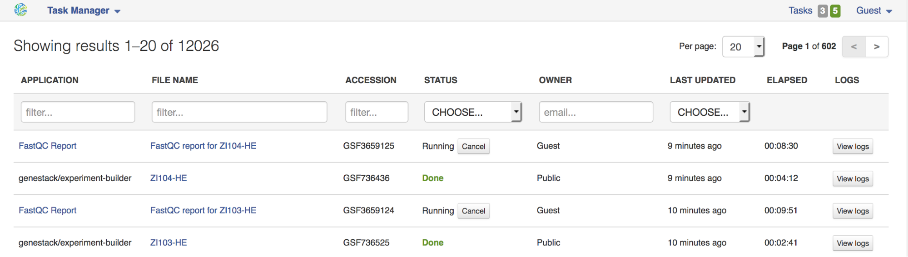

All your tasks can be sorted and filtered by file name, accession,
status, owner, last update and elapsed time. You can also view logs
produced for each computation (error and output log). Error logs
tell you why your task has failed. Output logs contain information about
the exact details of what Genestack does with your files during the
computation process, what specific tools and parameters are used, and so
on.

If the computations finished successfully, error logs will be empty, but
the logs can provide you with some basic statistics about the output
data.

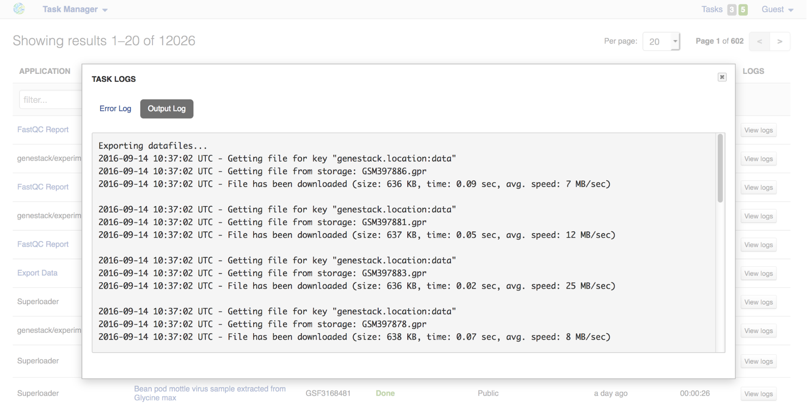

If you change your mind about a computation after it has started,
 remember that you can kill tasks whenever you want by clicking the
**Cancel** button, next to the task status.

Statuses in Task Manager help you keep track of your tasks. Let’s look
what each status means:

-  *Starting* - the computation process has started to run
-  *Done* - the task has finished successfully
-  *Failed* - the computation has failed. To find out why, click on "View logs"
-  *Queued* - the task is waiting for dependencies to complete
   initialization
-  *Running* - your task is in progress
-  *Blocked by dependency failure* - the computation cannot be completed
   because a task on which this one depends has failed
-  *Killed* - the task has been canceled by the user

Data Export
-----------

Genestack provides secure data storage, and **Export Data** application
allows to safely download both assays and analysis results together with attached metadata
to a local machine.
Select those files you are going to export, right-click on them
and select **Export Data** app.
On the app page you will see the status of your files, and if some of them are not
initialized you will be suggested to initialize them prior to export.

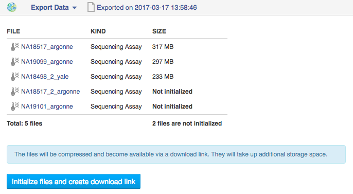

If you change you mind, you can stop exporting process by click on **Cancel** button.

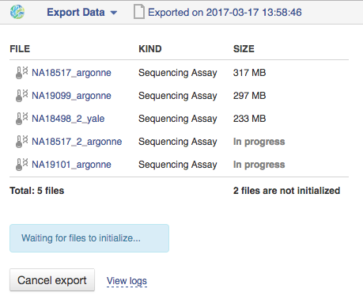

The app creates an **Export File** that contains a special link to download
the selected assays, that is accessible until the corresponding Export File is deleted.

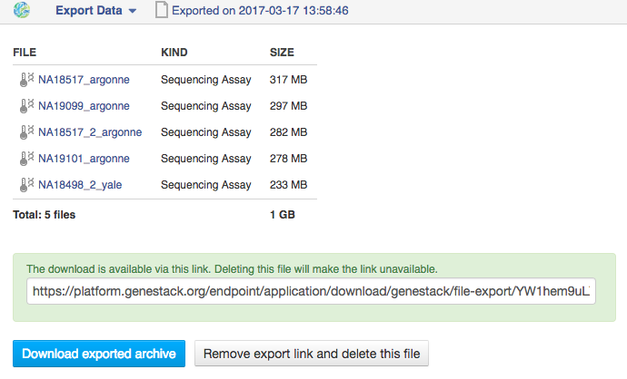

**Sharing the link** enables your collaborator to download data even if they do not have
a Genestack account. All the Export files are stored in the “Exports” folder.